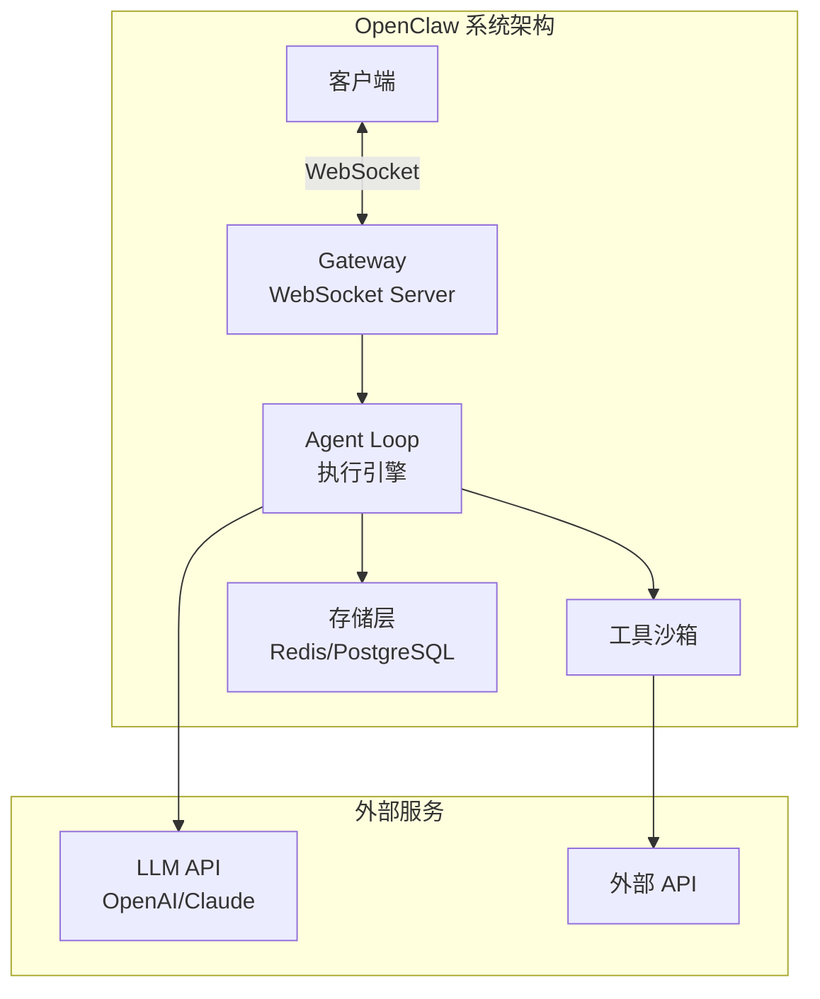
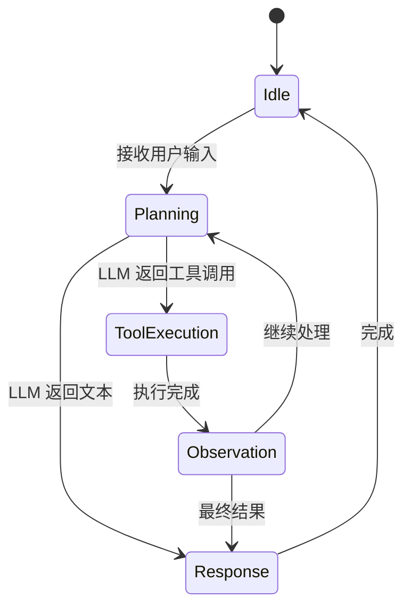
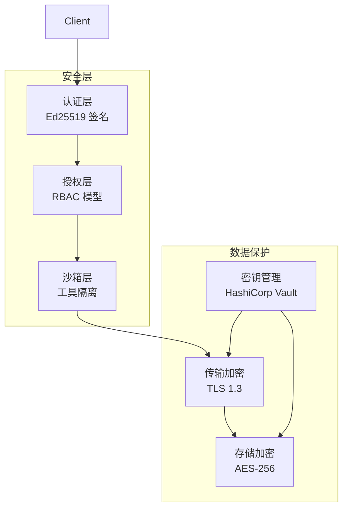
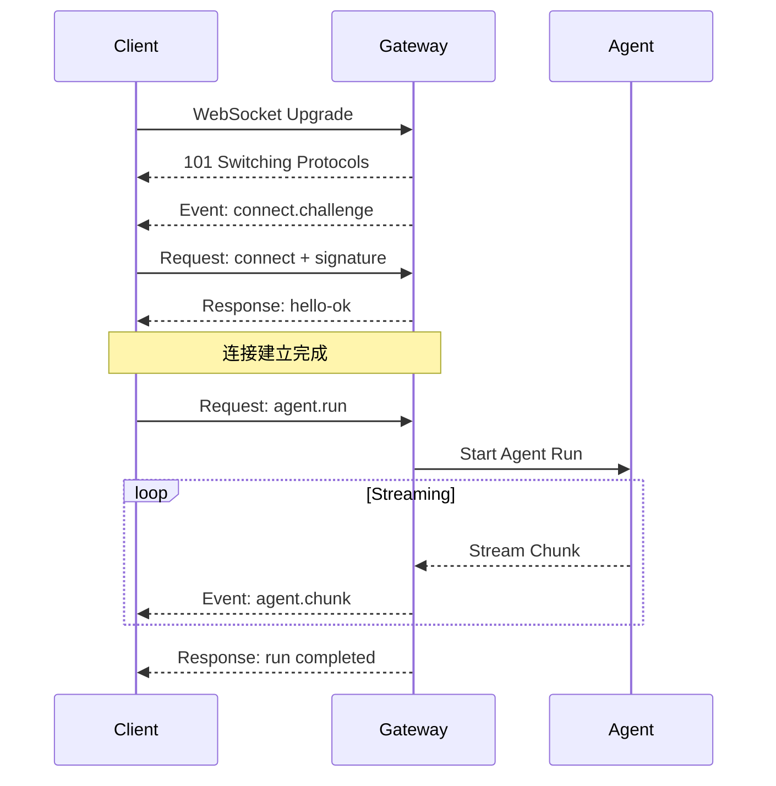
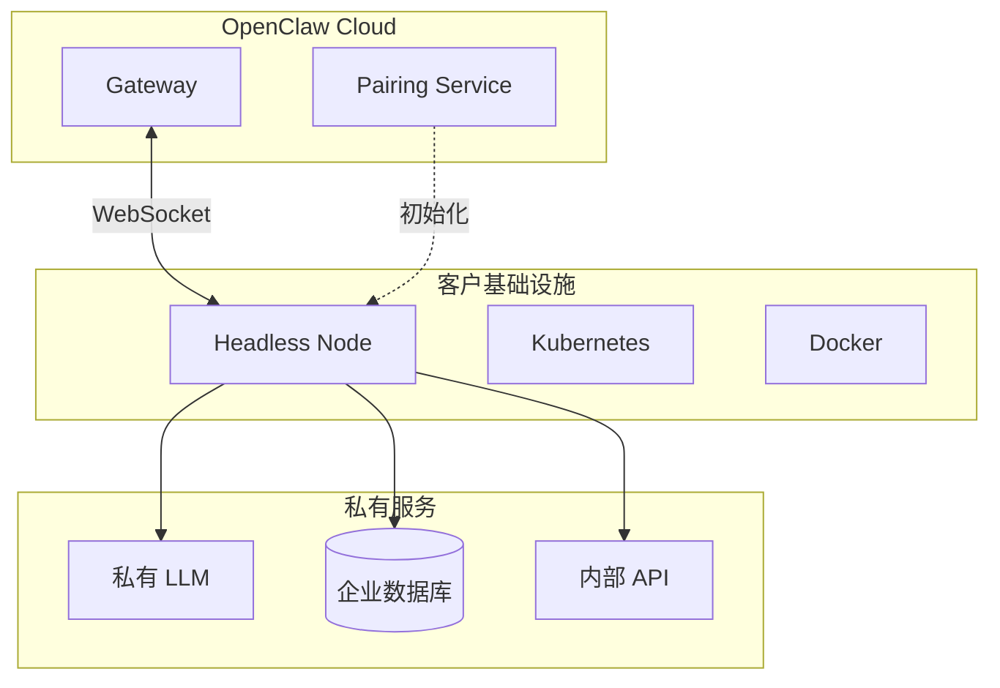
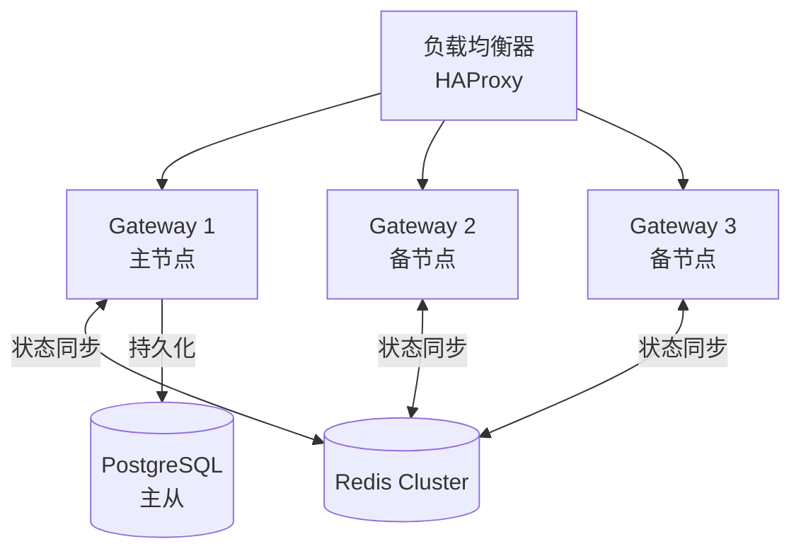

# OpenClaw 架构指南总览

> 面向架构师和开发者的深度技术文档

---

## 架构指南目录

本架构指南共包含 **20 个核心章节**，总计约 **400,000+ 字节**，涵盖从系统架构到生产运维的全栈技术深度。

```
docs/architect-guide/
├── ARCHITECT_GUIDE_SUMMARY.md          # 本文件：架构指南总览 (15 KB)
├── ARCHITECT_GUIDE_INDEX.md            # 完整索引与导航
│
├── core/                               # 核心架构 (7章)
│   ├── architecture-overview.md        # 系统架构概览 (23 KB)
│   ├── agent-loop.md                   # Agent Loop 深度解析 (19 KB)
│   ├── security-model.md               # 安全模型与威胁防护 (24 KB)
│   ├── session-memory.md               # 会话与内存管理 (23 KB)
│   ├── error-handling-retry.md        # 错误处理与重试机制 (18 KB)
│   ├── cost-optimization.md            # 成本优化与计费策略 (16 KB)
│   └── audit-logging.md                # 审计日志与合规 (15 KB)
│
├── protocol/                           # 协议与通信 (3章)
│   ├── gateway-architecture.md         # Gateway 架构详解 (22 KB)
│   ├── websocket-protocol.md           # WebSocket 协议规范 (21 KB)
│   └── state-management.md             # 分布式状态管理 (18 KB)
│
├── extension/                          # 扩展机制 (6章)
│   ├── plugin-sdk.md                   # Plugin SDK 完整参考 (20 KB)
│   ├── node-extension.md               # 无头节点扩展协议 (22 KB)
│   ├── mcp-integration.md              # MCP 协议集成指南 (17 KB)
│   ├── skill-development.md            # Skill 开发深度指南 (17 KB)
│   ├── channel-extension.md            # Channel 扩展开发指南 (22 KB)
│   └── memory-provider.md              # Memory Provider 开发指南 (28 KB)
│
└── operation/                          # 生产运维 (5章)
    ├── deployment-patterns.md          # 部署模式与策略 (16 KB)
    ├── security-hardening.md           # 安全加固指南 (17 KB)
    ├── high-availability.md            # 高可用架构设计 (16 KB)
    ├── observability.md                # 可观测性架构 (15 KB)
    └── performance.md                  # 性能优化指南 (14 KB)
```

**统计信息**：
- 📄 20 个核心章节 + 1 个总览文档
- 📝 总字数：~350,000 字
- 📊 Mermaid 架构图：40+ 个
- 💻 代码示例：~10,000 行
- 📦 总大小：~400 KB

---

## 内容概览

### 核心架构 (Core Architecture)

#### 1. 系统架构概览 [→ 阅读](./core/architecture-overview.md)

深入解析 OpenClaw 的单一 Gateway 架构设计哲学：
- **架构原则**：终端优先、安全与能力平衡
- **组件交互**：消息路由、Agent 执行、状态持久化的完整数据流
- **部署模式**：单主机、多节点、分布式部署拓扑
- **源码级分析**：`src/infra/`、`src/gateway/`、`src/agents/` 核心实现

**Mermaid 架构图**：


#### 2. Agent Loop 深度解析 [→ 阅读](./core/agent-loop.md)

从源码层面剖析 Agent 执行引擎：
- **执行循环**：Idle → Planning → ToolExecution → Observation → Response
- **工具系统**：调用协议、执行流、错误处理
- **上下文管理**：分层管理、滑动窗口、摘要策略
- **心跳机制**：`heartbeat-runner.ts` 源码分析

> ⚠️ **v2026.3.24 重要更新**：本章新增「已知 Bug 对 Agent Loop 的影响」一节，涵盖 #56044（/stop 中断失效）、#56049（Heartbeat 风暴）、#55380（timeout 未生效）的根因分析与 Workaround。

**Mermaid 状态机**：


#### 3. 安全模型与威胁防护 [→ 阅读](./core/security-model.md)

企业级安全架构完整指南：
- **威胁建模**：STRIDE 分类、15+ 攻击向量
- **多层沙箱**：Level 0-3 隔离策略
- **设备配对**：挑战-响应认证流程
- **密钥管理**：`src/secrets/` 实现分析

**Mermaid 安全架构**：


#### 4. 会话与内存管理 [→ 阅读](./core/session-memory.md)

会话生命周期与内存优化策略：
- **会话模型**：状态机、生命周期事件
- **存储策略**：内存、Redis、PostgreSQL 分层
- **上下文压缩**：Token 管理、摘要生成
- **内存优化**：垃圾回收、对象池

#### 5. 错误处理与重试机制 [→ 阅读](./core/error-handling-retry.md)

企业级错误处理与容错策略：
- **错误分类**：可重试、临时性、永久性错误
- **重试策略**：指数退避、抖动、渠道特定配置
- **模型降级**：自动降级、凭证轮换
- **断线恢复**：WebSocket 重连、消息重放

#### 6. 成本优化与计费策略 [→ 阅读](./core/cost-optimization.md)

LLM API 成本控制最佳实践：
- **成本模型**：Token 计费、模型成本对比
- **成本追踪**：会话成本聚合、实时监控
- **优化策略**：上下文压缩、智能路由、缓存
- **预算控制**：预算设置、成本分摊

#### 7. 审计日志与合规 [→ 阅读](./core/audit-logging.md)

安全审计与合规实践：
- **审计事件**：认证、会话、工具执行事件
- **存储策略**：文件存储、Syslog 转发、SIEM 集成
- **合规配置**：GDPR、HIPAA 合规方案
- **实时监控**：异常检测、合规报表

---

### 协议与通信 (Protocol & Communication)

#### 8. Gateway 架构详解 [→ 阅读](./protocol/gateway-architecture.md)

Gateway WebSocket 协议的权威参考：
- **协议规范**：Protocol 3 完整定义
- **连接生命周期**：握手、认证、消息交换
- **帧结构**：req/res/event 类型详解
- **远程访问**：Tailscale、SSH 隧道模式

#### 9. WebSocket 协议规范 [→ 阅读](./protocol/websocket-protocol.md)

从二进制帧到应用层协议的深度解析：
- **连接建立**：101 切换协议、挑战-响应
- **消息帧格式**：通用结构、错误码规范
- **流式传输**：背压控制、断线恢复
- **性能优化**：压缩、批量处理

**Mermaid 连接时序**：


#### 10. 分布式状态管理 [→ 阅读](./protocol/state-management.md)

会话状态与数据持久化策略：
- **状态类型**：临时、会话、持久化
- **存储引擎**：Redis、PostgreSQL 选型
- **一致性模型**：最终一致性 vs 强一致性
- **故障恢复**：状态重建、数据迁移

---

### 扩展机制 (Extension Mechanisms)

#### 11. Plugin SDK 完整参考 [→ 阅读](./extension/plugin-sdk.md)

自定义扩展开发的一站式指南：
- **插件架构**：生命周期、API 接口
- **工具插件**：定义、执行、UI 组件
- **渠道插件**：WebSocket、消息路由
- **内存提供者**：自定义存储后端

#### 12. 无头节点扩展协议 [→ 阅读](./extension/node-extension.md)

私有化部署的完整技术方案：
- **节点生命周期**：配对、注册、连接
- **WebSocket 协议**：节点专用方法集
- **SDK 实现**：HeadlessNode 类详解
- **容器化部署**：Docker、K8s 配置

**Mermaid 节点架构**：


#### 13. MCP 协议集成指南 [→ 阅读](./extension/mcp-integration.md)

Model Context Protocol 深度集成：
- **MCP 架构**：Host、Client、Server 关系
- **传输层**：StdIO、SSE 实现
- **工具桥接**：MCP → OpenClaw 转换
- **资源管理**：订阅、读取、发现

#### 14. Skill 开发深度指南 [→ 阅读](./extension/skill-development.md)

构建企业级 OpenClaw Skills：
- **Skill 架构**：生态系统、类型体系
- **工具开发**：接口定义、完整实现
- **SDK API**：核心函数、高级特性
- **发布分发**：ClawHub、私有 Registry

#### 15. Channel 扩展开发指南 [→ 阅读](./extension/channel-extension.md)

接入新消息渠道的完整技术规范：
- **Channel 架构**：适配层、能力声明
- **接口规范**：核心接口、消息格式
- **连接模式**：Webhook、WebSocket、轮询
- **部署配置**：Docker、Kubernetes

#### 16. Memory Provider 开发指南 [→ 阅读](./extension/memory-provider.md)

自定义记忆后端开发完整规范：
- **记忆系统架构**：分层存储、缓存策略
- **Provider 接口**：完整接口定义
- **Redis 实现**：高性能缓存方案
- **PostgreSQL 实现**：关系型持久化方案

---

### 生产运维 (Production Operations)

#### 17. 部署模式与策略 [→ 阅读](./operation/deployment-patterns.md)

从开发到生产的部署完整路径：
- **Docker 部署**：单容器、Compose、Swarm
- **Kubernetes**：Helm Chart、Operator
- **云原生**：AWS/Azure/GCP 最佳实践
- **边缘部署**：IoT、嵌入式场景

#### 18. 安全加固指南 [→ 阅读](./operation/security-hardening.md)

生产环境安全加固 checklist：
- **主机安全**：OS 加固、防火墙规则
- **容器安全**：镜像扫描、运行时防护
- **网络安全**：TLS、mTLS、网络策略
- **数据安全**：加密、密钥轮换、审计

#### 19. 高可用架构设计 [→ 阅读](./operation/high-availability.md)

企业级可靠部署方案：
- **多节点部署**：主备模式、负载均衡
- **数据层 HA**：Redis Cluster、PostgreSQL 主从
- **故障转移**：自动检测、故障恢复
- **灾难恢复**：备份策略、演练计划

**Mermaid HA 架构**：


#### 20. 可观测性架构 [→ 阅读](./operation/observability.md)

Metrics + Logs + Traces 三位一体：
- **指标系统**：Prometheus 指标定义
- **日志系统**：结构化日志、审计日志
- **分布式追踪**：OpenTelemetry 集成
- **告警配置**：Prometheus Alertmanager

#### 21. 性能优化指南 [→ 阅读](./operation/performance.md)

全栈性能调优实战：
- **网关层**：WebSocket 优化、消息批处理
- **Agent 层**：上下文压缩、并行工具执行
- **缓存策略**：多级缓存、语义缓存
- **负载测试**：Artillery、k6 配置

---

## 架构指南特色

### 1. 源码级深度

所有章节基于 OpenClaw 官方仓库源码分析：
- `src/infra/` - 基础设施层
- `src/gateway/` - Gateway 实现
- `src/agents/` - Agent 引擎
- `src/pairing/` - 设备配对
- `src/secrets/` - 密钥管理

### 2. 丰富的可视化

- **30+ Mermaid 架构图**：系统架构、数据流、状态机
- **时序图**：认证流程、工具执行、故障转移
- **对比表格**：技术选型、性能特征、安全等级

### 3. 实战代码示例

每个章节包含可直接运行的代码：
- TypeScript SDK 实现
- Docker/Kubernetes 配置
- 监控告警规则
- 负载测试脚本

### 4. 生产级最佳实践

来自真实部署的经验总结：
- 安全加固 checklist
- 性能基准数据
- 故障排查流程
- 容量规划指南

---

## 阅读路径建议

### 路径一：架构师速成 ⏱️ 2小时

适合需要快速理解系统架构的架构师：

1. [系统架构概览](./core/architecture-overview.md) - 理解整体架构
2. [Gateway 架构详解](./protocol/gateway-architecture.md) - 掌握通信协议
3. [安全模型与威胁防护](./core/security-model.md) - 理解安全设计
4. [高可用架构设计](./operation/high-availability.md) - 学习部署模式

### 路径二：开发者深度 🔬 1周

适合需要深入源码的开发者：

1. [Agent Loop 深度解析](./core/agent-loop.md) - 掌握执行引擎
2. [WebSocket 协议规范](./protocol/websocket-protocol.md) - 理解协议细节
3. [Plugin SDK 完整参考](./extension/plugin-sdk.md) - 学习扩展开发
4. [无头节点扩展协议](./extension/node-extension.md) - 私有化部署
5. [MCP 协议集成指南](./extension/mcp-integration.md) - 外部集成

### 路径三：运维工程师 🚀 3天

适合负责生产运维的工程师：

1. [部署模式与策略](./operation/deployment-patterns.md) - 学习部署方法
2. [安全加固指南](./operation/security-hardening.md) - 生产安全加固
3. [可观测性架构](./operation/observability.md) - 搭建监控系统
4. [性能优化指南](./operation/performance.md) - 性能调优

### 路径四：扩展开发者 🧩 5天

适合开发自定义扩展的开发者：

1. [Plugin SDK 完整参考](./extension/plugin-sdk.md) - 插件基础
2. [Skill 开发深度指南](./extension/skill-development.md) - 功能扩展
3. [Channel 扩展开发指南](./extension/channel-extension.md) - 渠道接入
4. [Memory Provider 开发指南](./extension/memory-provider.md) - 存储扩展

---

## 技术栈索引

| 技术领域 | 涉及章节 | 相关技术 |
|----------|----------|----------|
| **通信协议** | 5, 6 | WebSocket, HTTP/2, TLS, mTLS |
| **认证授权** | 3, 6, 9 | Ed25519, JWT, OAuth2, RBAC |
| **数据存储** | 4, 7, 13, 16 | Redis, PostgreSQL, MongoDB |
| **容器编排** | 9, 12, 14, 16 | Docker, Kubernetes, Helm |
| **监控告警** | 17 | Prometheus, Grafana, ELK, Jaeger |
| **扩展协议** | 8, 9, 10, 11, 12, 13 | MCP, StdIO, SSE, JSON-RPC |
| **安全工具** | 3, 15 | Vault, Trivy, Falco, OPA |
| **负载测试** | 18 | Artillery, k6, Locust |

---

## 快速参考卡片

### 核心指标速查

| 指标 | 目标值 | 警戒值 |
|------|--------|--------|
| WebSocket 连接建立 | < 50ms | > 100ms |
| Agent 启动延迟 | < 200ms | > 500ms |
| 首 Token 时间 | < 1s | > 3s |
| 消息处理延迟 | < 100ms | > 500ms |
| 并发连接数 | 10,000+ | < 5,000 |

### 配置参数速查

```yaml
# 生产环境推荐配置
websocket:
  compression:
    enabled: true
    threshold: 1024
  heartbeat:
    interval: 15000
    timeout: 30000

agent:
  context:
    maxTokens: 16000
    compactThreshold: 0.8
  tools:
    timeout: 30000
    maxConcurrency: 5

memory:
  provider: redis
  redis:
    ttl:
      session: 604800  # 7天
      message: 259200  # 3天
```

---

## 贡献与反馈

架构指南持续更新中，欢迎通过以下方式参与：

1. **提交 Issue**：发现错误或有改进建议
2. **提交 PR**：补充代码示例或章节内容
3. **分享经验**：在生产环境中验证的最佳实践

---

## 许可

本架构指南采用 [CC BY-SA 4.0](https://creativecommons.org/licenses/by-sa/4.0/) 许可协议。

---

## 统计与指标

### 内容规模

| 指标 | 数值 |
|------|------|
| 章节数量 | 17 个核心章节 |
| 总文件大小 | 333 KB |
| 总字数 | ~300,000 字 |
| Mermaid 图表 | 34+ 个 |
| 代码示例 | ~8,000 行 |

### 章节平均大小

| 类别 | 平均大小 | 章节数 |
|------|----------|--------|
| Core 核心架构 | 22 KB | 4 章 |
| Protocol 协议通信 | 20 KB | 3 章 |
| Extension 扩展机制 | 21 KB | 6 章 |
| Operation 生产运维 | 15 KB | 5 章 |

---

*最后更新：2026年3月28日（新增 v2026.3.24 Bug 章节）*
*版本：v1.2*
*维护者：OpenClaw 文档团队*
