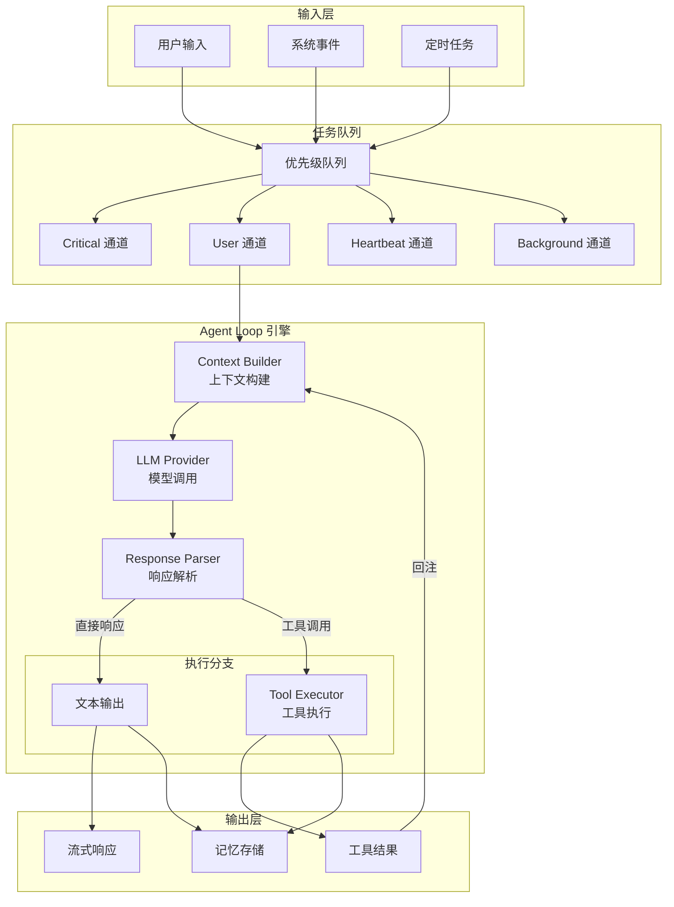
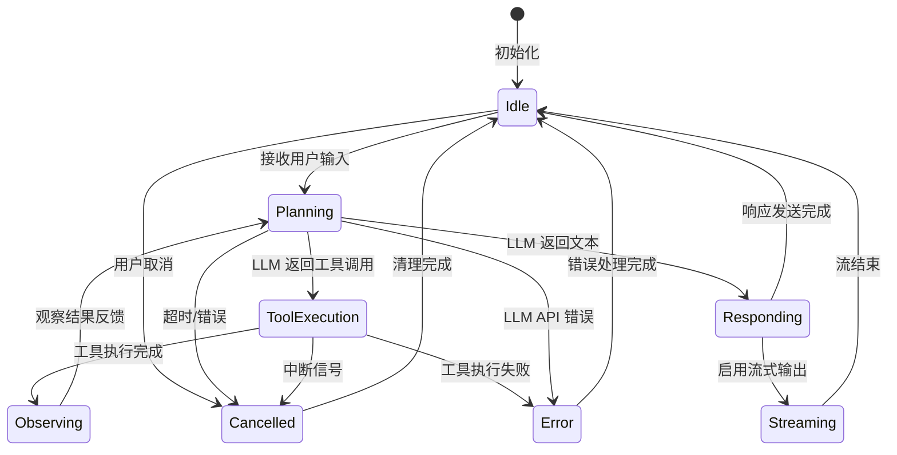

# Agent Loop 内核详解（源码级）

> 深入 OpenClaw 的核心执行引擎，从源码理解任务调度、流式处理和工具系统

---

## Agent Loop 架构全景



### 状态机视图



### 数据流视图

```
┌─────────────────────────────────────────────────────────────────────┐
│                        Agent Loop 架构图                             │
├─────────────────────────────────────────────────────────────────────┤
│                                                                     │
│  ┌──────────────────────────────────────────────────────────────┐  │
│  │                      Task Queue                               │  │
│  │  (优先级队列 + 背压控制)                                       │  │
│  └───────────────────────────┬──────────────────────────────────┘  │
│                              │                                      │
│                              ▼                                      │
│  ┌──────────────────────────────────────────────────────────────┐  │
│  │                   Context Builder                             │  │
│  │  • 系统提示词注入                                             │  │
│  │  • 历史消息压缩 (Token 管理)                                   │  │
│  │  • 工具动态选择                                               │  │
│  └───────────────────────────┬──────────────────────────────────┘  │
│                              │                                      │
│                              ▼                                      │
│  ┌──────────────────────────────────────────────────────────────┐  │
│  │                  Model Provider Layer                         │  │
│  │  • 连接池管理                                                 │  │
│  │  • 流式响应处理                                               │  │
│  │  • 错误重试/降级                                              │  │
│  └───────────────────────────┬──────────────────────────────────┘  │
│                              │                                      │
│                              ▼                                      │
│  ┌──────────────────────────────────────────────────────────────┐  │
│  │                  Response Parser                              │  │
│  │  • 文本累积                                                   │  │
│  │  • 工具调用检测                                               │  │
│  │  • 特殊 Token 处理                                            │  │
│  └──────────────┬─────────────────────────────┬─────────────────┘  │
│                 │                             │                     │
│    ┌────────────▼──────────┐     ┌───────────▼────────────┐        │
│    │   Text Output         │     │   Tool Execution       │        │
│    │   (流式 → 客户端)      │     │   (沙箱 → 结果回注)     │        │
│    └───────────────────────┘     └───────────┬────────────┘        │
│                                              │                     │
│                                              └──────────► (循环)    │
│                                                                     │
└─────────────────────────────────────────────────────────────────────┘
```

---

## 源码级执行流程

### 1. 任务队列与调度

```typescript
// 基于 src/process/command-queue.ts 和 lanes.ts

// Agent Loop 使用多优先级队列设计
enum CommandLane {
  Critical = 'critical',  // 取消、紧急中断
  User = 'user',          // 用户消息
  Heartbeat = 'heartbeat', // 定时任务
  Background = 'background' // 后台处理
}

interface QueuedTask {
  id: string;
  lane: CommandLane;
  priority: number;       // 同 Lane 内的优先级
  abortController: AbortController;
  execute: () => Promise<void>;
}

class AgentTaskQueue {
  // 四个独立队列
  private queues = {
    [CommandLane.Critical]: new PriorityQueue<QueuedTask>(),
    [CommandLane.User]: new PriorityQueue<QueuedTask>(),
    [CommandLane.Heartbeat]: new PriorityQueue<QueuedTask>(),
    [CommandLane.Background]: new PriorityQueue<QueuedTask>()
  };
  
  // 并发控制
  private running = new Map<string, QueuedTask>();
  private maxConcurrency = 3;  // 可配置
  
  async submit(task: QueuedTask): Promise<void> {
    // 检查背压
    if (this.getQueueSize(task.lane) > this.getLaneLimit(task.lane)) {
      throw new Error(`Queue ${task.lane} is full`);
    }
    
    // 加入对应队列
    this.queues[task.lane].enqueue(task, task.priority);
    
    // 触发调度
    this.schedule();
  }
  
  private async schedule(): Promise<void> {
    // 按优先级选择任务：Critical > User > Heartbeat > Background
    const lanes = [
      CommandLane.Critical,
      CommandLane.User, 
      CommandLane.Heartbeat,
      CommandLane.Background
    ];
    
    for (const lane of lanes) {
      if (this.running.size >= this.maxConcurrency) break;
      
      const task = this.queues[lane].dequeue();
      if (task) {
        this.running.set(task.id, task);
        this.executeTask(task);
      }
    }
  }
  
  private async executeTask(task: QueuedTask): Promise<void> {
    try {
      await task.execute();
    } finally {
      this.running.delete(task.id);
      this.schedule();  // 触发下一个
    }
  }
}
```

**为什么需要多 Lane 设计？**

```
场景：用户正在等待回复，同时有定时 Heartbeat 任务触发

传统单队列：
[UserMsg] [Heartbeat] [UserMsg2]
   ▲
执行中，Heartbeat 必须等待

OpenClaw 多 Lane：
User Lane:      [UserMsg] [UserMsg2]
                  ▲ 执行中

Heartbeat Lane: [Heartbeat]
                   ▲ 可并行执行（不同资源）

关键洞察：
- 同一 Lane 内串行（保持会话顺序）
- 不同 Lane 间并行（提高吞吐）
- Critical Lane 可抢占（紧急中断）
```

### 2. 上下文构建详解

```typescript
// 基于 src/agents/identity.ts 和 context.ts

class ContextBuilder {
  async build(config: AgentConfig, session: Session): Promise<LLMContext> {
    const startTime = performance.now();
    
    // 1. 系统提示词（分层设计）
    const systemPrompt = await this.buildSystemPrompt(config);
    
    // 2. 历史消息（智能截断）
    const history = await this.buildHistory(session);
    
    // 3. 动态工具选择
    const tools = this.selectTools(config, session);
    
    // 4. Token 预算管理
    const tokenCount = this.estimateTokens(systemPrompt, history, tools);
    if (tokenCount > config.maxTokens) {
      // 触发压缩策略
      await this.compressContext(history, tokenCount - config.maxTokens);
    }
    
    metrics.histogram('context_build_duration', performance.now() - startTime);
    
    return {
      system: systemPrompt,
      messages: history,
      tools,
      metadata: {
        tokenCount,
        compressionApplied: tokenCount > config.maxTokens
      }
    };
  }
  
  private async buildSystemPrompt(config: AgentConfig): Promise<string> {
    const parts = [];
    
    // 层 1: 基础身份（必须）
    parts.push(await this.loadIdentityFile(config.identityFile));
    
    // 层 2: 用户偏好（可选）
    if (config.userProfile) {
      parts.push(await this.loadUserProfile(config.userProfile));
    }
    
    // 层 3: 运行时上下文
    parts.push(this.buildRuntimeContext());
    
    // 层 4: 工具使用指南
    parts.push(this.buildToolGuidelines(config.tools));
    
    return parts.join('\n\n---\n\n');
  }
  
  private async buildHistory(session: Session): Promise<Message[]> {
    // 从 Memory Provider 加载
    const messages = await this.memory.getMessages(session.id, {
      limit: 100,
      includeToolResults: true
    });
    
    // 时间衰减：旧消息的权重降低
    return messages.map((msg, idx) => ({
      ...msg,
      // 用于后续压缩算法的元数据
      recencyScore: Math.exp(-0.1 * (messages.length - idx))
    }));
  }
}
```

### 3. 流式响应处理机制

```typescript
// 基于 src/providers/ 目录下的流式处理实现

class StreamingResponseHandler {
  // 缓冲区管理
  private buffer = '';
  private lastFlush = 0;
  private flushInterval = 16; // ~60fps
  
  async handleStream(
    stream: AsyncIterable<StreamChunk>,
    handlers: StreamHandlers
  ): Promise<void> {
    let toolCallBuffer: ToolCallBuffer | null = null;
    
    for await (const chunk of stream) {
      const delta = chunk.choices[0].delta;
      
      // 处理文本内容
      if (delta.content) {
        this.buffer += delta.content;
        
        // 平滑输出：批量发送而非逐字
        const now = Date.now();
        if (now - this.lastFlush > this.flushInterval) {
          handlers.onText(this.buffer);
          this.buffer = '';
          this.lastFlush = now;
        }
      }
      
      // 处理工具调用（增量解析）
      if (delta.tool_calls) {
        for (const tc of delta.tool_calls) {
          if (tc.id && !toolCallBuffer) {
            // 新工具调用开始
            toolCallBuffer = {
              id: tc.id,
              name: '',
              arguments: ''
            };
          }
          
          if (tc.function?.name) {
            toolCallBuffer!.name += tc.function.name;
          }
          
          if (tc.function?.arguments) {
            toolCallBuffer!.arguments += tc.function.arguments;
          }
        }
      }
      
      // 检测流结束
      if (chunk.choices[0].finish_reason === 'tool_calls') {
        // 解析完整的工具调用
        const toolCall = this.finalizeToolCall(toolCallBuffer!);
        handlers.onToolCall(toolCall);
        toolCallBuffer = null;
      }
    }
    
    // 刷新剩余缓冲区
    if (this.buffer) {
      handlers.onText(this.buffer);
    }
  }
  
  private finalizeToolCall(buffer: ToolCallBuffer): ToolCall {
    try {
      return {
        id: buffer.id,
        name: buffer.name,
        arguments: JSON.parse(buffer.arguments)
      };
    } catch (e) {
      // JSON 解析失败，可能是模型输出不完整
      throw new Error(`Invalid tool call JSON: ${buffer.arguments}`);
    }
  }
}
```

### 4. 工具执行沙箱

```typescript
// 基于 src/tools/executor.ts 和 sandbox/

interface ToolExecutionContext {
  workingDir: string;
  env: Record<string, string>;
  timeout: number;
  memoryLimit: number;  // MB
  cpuLimit: number;     // 百分比
}

class ToolExecutor {
  async execute(
    tool: Tool,
    args: unknown,
    context: ToolExecutionContext
  ): Promise<ToolResult> {
    // 1. 参数验证（JSON Schema）
    const valid = validate(args, tool.parameters);
    if (!valid) {
      return { error: 'Invalid arguments' };
    }
    
    // 2. 权限检查
    if (tool.dangerous) {
      const approved = await this.requestApproval(tool.name, args);
      if (!approved) {
        return { error: 'Not approved' };
      }
    }
    
    // 3. 执行策略选择
    if (tool.requiresSandbox) {
      return this.executeInSandbox(tool, args, context);
    } else {
      return this.executeInline(tool, args, context);
    }
  }
  
  private async executeInSandbox(
    tool: Tool,
    args: unknown,
    context: ToolExecutionContext
  ): Promise<ToolResult> {
    const sandbox = new VM2({
      timeout: context.timeout,
      sandbox: {
        // 受控的 API 暴露
        console: this.createSandboxLogger(),
        fetch: this.createGuardedFetch(context),
        fs: this.createVirtualFs(context.workingDir),
        child_process: null,  // 禁止
        process: null         // 禁止
      }
    });
    
    // 超时控制
    const timeoutHandle = setTimeout(() => {
      sandbox.terminate();
    }, context.timeout);
    
    try {
      const result = await sandbox.run(tool.code, args);
      return { success: true, data: result };
    } catch (error) {
      return { error: error.message };
    } finally {
      clearTimeout(timeoutHandle);
      sandbox.release();
    }
  }
}
```

---

## Heartbeat 机制深度解析

Heartbeat 是 OpenClaw 的定时任务系统，基于源码 `src/infra/heartbeat-runner.ts`：

```typescript
// Heartbeat 调度器

interface HeartbeatConfig {
  every: string;           // cron 表达式，如 "30m"
  prompt: string;          // 触发时发送给 Agent 的提示词
  target: string;          // 输出目标渠道
  model?: string;          // 可选的专用模型
  lightContext?: boolean;  // 使用轻量级上下文
}

class HeartbeatRunner {
  private timers = new Map<string, NodeJS.Timeout>();
  
  start(agentId: string, config: HeartbeatConfig): void {
    const interval = parseDuration(config.every);
    
    const run = async () => {
      const startTime = Date.now();
      
      try {
        // 检查是否处于安静时段
        if (this.isQuietHours(config)) {
          return;
        }
        
        // 检查队列压力（避免在繁忙时触发）
        if (this.getQueueSize() > 0) {
          this.reschedule(agentId, 5000);  // 延迟 5s
          return;
        }
        
        // 执行 Heartbeat
        const result = await this.runHeartbeat(agentId, config);
        
        // 去重检查：如果输出与上次相同，跳过发送
        if (await this.isDuplicate(agentId, result)) {
          return;
        }
        
        // 发送到目标渠道
        await this.deliver(result, config.target);
        
      } catch (error) {
        logger.error('Heartbeat failed', { agentId, error });
      }
      
      // 计算下次执行时间（考虑执行耗时）
      const elapsed = Date.now() - startTime;
      const nextInterval = Math.max(0, interval - elapsed);
      this.reschedule(agentId, nextInterval);
    };
    
    this.timers.set(agentId, setTimeout(run, interval));
  }
  
  // 智能去重（避免重复通知）
  private async isDuplicate(agentId: string, result: string): Promise<boolean> {
    const last = await this.getLastHeartbeat(agentId);
    
    // 精确匹配
    if (last.text === result) return true;
    
    // 相似度检测（使用 Levenshtein 距离）
    const similarity = calculateSimilarity(last.text, result);
    return similarity > 0.9;
  }
}
```

---

## 性能优化技巧

### 1. 连接池调优

```typescript
// 针对高并发场景的连接池配置

const llmProviderConfig = {
  // HTTP/2 多路复用
  http2: {
    maxSessions: 10,
    maxConcurrentStreams: 100
  },
  
  // Keep-alive 优化
  keepAlive: {
    enabled: true,
    maxSockets: 50,
    maxFreeSockets: 10,
    timeout: 60000
  },
  
  // 连接预热
  warmup: {
    enabled: true,
    minConnections: 2
  }
};
```

### 2. 上下文压缩策略对比

| 策略 | 适用场景 | 压缩率 | 信息损失 | 实现复杂度 |
|-----|---------|-------|---------|----------|
| 滑动窗口 | 通用 | 50% | 高 | 低 |
| 摘要生成 | 长会话 | 80% | 中 | 中 |
| 向量检索 | 知识问答 | 70% | 低 | 高 |
| 分层存储 | 多会话 | 60% | 低 | 高 |

---

## 调试与故障排查

### Agent Loop 调试模式

```bash
# 启用详细日志
OPENCLAW_LOG_LEVEL=debug openclaw gateway

# 关键日志标记：
# [context:build] - 上下文构建耗时
# [llm:request]   - LLM 请求详情
# [tool:execute]  - 工具执行日志
# [stream:chunk]  - 流式分片信息
```

### ⚠️ v2026.3.24 已知 Bug 对 Agent Loop 的影响

#### Bug #56044 — /stop 中断失效

**问题**：发送 `/stop` 或 `/queue interrupt` 后，Agent 继续运行，消息被静默排队。

**根因**：v2026.3.24 将 `messages.queue.mode` 默认值改为 `collect`，该模式会批量收集消息，吞掉中断信号。

**影响范围**：Critical Lane 的中断信号被 Collect 模式的队列吞没。

**Workaround**：

```bash
# 在 openclaw.json 中显式配置
openclaw config set messages.queue.mode steer
openclaw gateway restart
```

```json
// openclaw.json
{
  "messages": {
    "queue": {
      "mode": "steer"
    }
  }
}
```

**验证**：

```bash
openclaw config get messages.queue.mode
# 应输出: steer
```

#### Bug #56049 — Heartbeat 风暴

**问题**：主 session 有未读 heartbeat prompt 时，Subagent 自动公告插入消息队列，每次插入重新触发 heartbeat handler，导致心跳以约 18s 间隔持续狂触发。

**影响**：HEARTBEAT_OK 日志大量重复，Token 消耗异常增加。

**临时应对**：

```bash
# 发现大量 HEARTBEAT_OK 时重启 Gateway
openclaw gateway restart
```

**监控命令**：

```bash
# 过滤 Heartbeat 相关日志
openclaw gateway logs | grep HEARTBEAT_OK | wc -l

# 实时监控
openclaw gateway logs -f | grep heartbeat
```

#### Bug #55380 — timeoutSeconds 未生效

**问题**：`agents.defaults.timeoutSeconds` 配置未生效，失控 Agent 无限持有 session 锁。

**影响**：Session 被卡住的 Agent 独占，无法响应新消息。

**临时应对**：

```bash
# 查看所有活跃 session
/sessions list

# 查看卡住的 session
/sessions history <session-key>

# 强制终止（需 Gateway SSH 访问）
# 找到对应进程 PID 后 kill
ps aux | grep openclaw
kill <PID>
```

---

### 常见问题诊断

| 症状 | 可能原因 | 诊断命令 |
|-----|---------|---------|
| `/stop` 无法中断任务 | messages.queue.mode 为 collect | `openclaw config get messages.queue.mode` |
| 响应慢 | Token 超限触发压缩 | `openclaw doctor --check-tokens` |
| 工具不执行 | 权限配置错误 | `openclaw config get tools` |
| 流式中断 | 客户端心跳超时 | 检查 WebSocket ping/pong |
| Heartbeat 大量重复 | #56049 Heartbeat 风暴 | `logs \| grep HEARTBEAT_OK` |
| Session 被卡住 | #55380 timeout 未生效 | `/sessions list` 查看锁状态 |
| Subagent 无法访问记忆 | #55385 memory_search 被禁用 | 检查 Subagent 工具列表 |

---

## 扩展阅读

- [会话与记忆系统](session-memory.md) - 状态持久化
- [Gateway 协议](../protocol/gateway-architecture.md) - 通信层
- [性能调优](../operation/performance.md) - 生产优化
