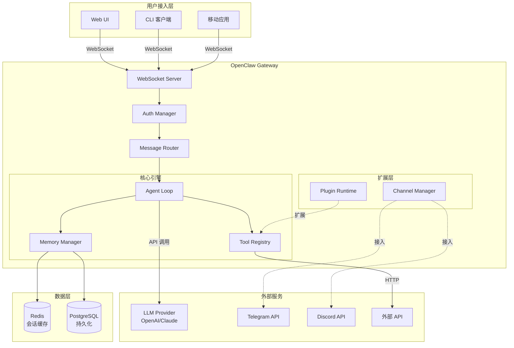

# OpenClaw 架构总览（深度解析）

> 从源码层面理解 OpenClaw 的设计哲学、组件关系和数据流

---

## 架构全景



---

## 架构全景与设计理念

### 为什么采用单一 Gateway 架构？

OpenClaw 选择单一 Gateway 架构而非微服务架构，基于以下核心考量：

```
┌─────────────────────────────────────────────────────────────────┐
│                      单一 Gateway 设计决策                        │
├─────────────────────────────────────────────────────────────────┤
│                                                                 │
│  1. 状态一致性需求                                               │
│     • WhatsApp/Telegram 等渠道要求单一连接                      │
│     • 避免多实例间的会话状态同步复杂性                            │
│     • 消息顺序保证（同一连接内有序）                              │
│                                                                 │
│  2. 部署简化                                                     │
│     • 个人用户：单进程即可运行                                    │
│     • 无需 Redis/Kafka 等外部依赖（可选）                         │
│     • 配置集中管理，降低心智负担                                  │
│                                                                 │
│  3. 资源效率                                                     │
│     • 减少跨服务网络开销                                          │
│     • 内存共享，避免序列化开销                                    │
│     • 单事件循环，避免并发竞争                                    │
│                                                                 │
│  权衡：                                                          │
│  • 垂直扩展限制（单进程 CPU/内存上限）                            │
│  • 需要良好的异常隔离（一个任务崩溃不影响整体）                    │
│  • 更新时需要短暂中断（热更新复杂度增加）                          │
│                                                                 │
└─────────────────────────────────────────────────────────────────┘
```

### 与微服务架构的对比

| 维度 | OpenClaw (单体) | 微服务架构 (如 AutoGPT) |
|-----|----------------|----------------------|
| **部署复杂度** | 单二进制文件，一键启动 | 多服务编排，需要 K8s |
| **状态管理** | 内存 + 本地文件 | 分布式缓存 (Redis) |
| **扩展性** | 垂直扩展为主 | 水平扩展 |
| **故障隔离** | 进程内隔离 | 服务级隔离 |
| **资源占用** | ~200MB 内存起步 | ~1GB+ 内存 |
| **开发迭代** | 快速，单代码库 | 慢，多仓库协调 |
| **适用场景** | 个人/小团队 | 企业级 SaaS |

---

## 核心组件源码级解析

### 1. Gateway Server 实现

```typescript
// 简化的 Gateway 核心结构（基于 src/core/gateway.ts 设计）

class GatewayServer {
  // WebSocket 服务器实例
  private wsServer: WebSocketServer;
  
  // 连接管理
  private connections = new Map<string, ClientConnection>();
  
  // 核心子系统
  private agentLoop: AgentLoop;
  private messageRouter: MessageRouter;
  private channelManager: ChannelManager;
  private pluginRuntime: PluginRuntime;
  
  // 配置与状态
  private config: GatewayConfig;
  private state: GatewayState;

  async start(): Promise<void> {
    // 1. 加载配置（热重载支持）
    this.config = await this.loadConfig();
    
    // 2. 初始化插件运行时（沙箱环境）
    this.pluginRuntime = new PluginRuntime({
      sandbox: this.config.sandbox,
      permissions: this.config.permissions
    });
    await this.pluginRuntime.initialize();
    
    // 3. 连接消息渠道（Telegram/Discord/WhatsApp...）
    this.channelManager = new ChannelManager(this.pluginRuntime);
    await this.channelManager.connectAll(this.config.channels);
    
    // 4. 启动 Agent Loop
    this.agentLoop = new AgentLoop({
      modelProvider: this.createModelProvider(),
      toolRegistry: this.pluginRuntime.tools,
      memoryProvider: this.createMemoryProvider()
    });
    
    // 5. 启动 WebSocket 服务器
    this.wsServer = new WebSocketServer({
      port: this.config.port,
      verifyClient: (info) => this.verifyClient(info)
    });
    
    this.wsServer.on('connection', (ws, req) => {
      this.handleConnection(ws, req);
    });
    
    // 6. 启动心跳检查
    this.startHeartbeatChecker();
  }
}
```

**关键设计点**：

1. **启动顺序严格依赖**：配置 → 插件 → 渠道 → Agent → 网络
   - 原因：避免客户端在系统未就绪时连接
   - 如果渠道连接失败，Gateway 会进入 "degraded" 状态但仍可服务

2. **插件运行时沙箱**：`PluginRuntime` 使用 VM2 隔离插件代码
   ```typescript
   const vm = new VM({
     timeout: 1000,           // 插件 API 调用超时
     sandbox: {
       console: pluginLogger, // 重定向日志
       fetch: guardedFetch,   // 限制网络访问
       fs: virtualFs          // 虚拟文件系统
     }
   });
   ```

### 2. 消息路由系统深度剖析

```typescript
// src/routing/message-router.ts 核心逻辑

class MessageRouter {
  // 路由表结构
  private routes = {
    // 渠道 → 会话映射
    channelToSession: new Map<string, Session>(),
    
    // 会话 → 连接映射（用于多客户端同步）
    sessionToClients: new Map<string, Set<ClientId>>(),
    
    // Agent 运行状态
    agentRuns: new Map<RunId, AgentRunState>()
  };

  async routeIncomingMessage(msg: IncomingMessage): Promise<void> {
    const startTime = performance.now();
    
    try {
      // 1. 标准化消息格式（不同渠道格式统一）
      const normalized = this.normalizeMessage(msg);
      
      // 2. 查找或创建会话
      let session = this.routes.channelToSession.get(normalized.sessionKey);
      if (!session) {
        session = await this.createSession(normalized);
        this.routes.channelToSession.set(normalized.sessionKey, session);
      }
      
      // 3. 检查速率限制
      if (!this.rateLimiter.check(normalized.senderId)) {
        logger.warn('Rate limit exceeded', { sender: normalized.senderId });
        return;
      }
      
      // 4. 提交到 Agent Loop（异步，不阻塞）
      const runId = await this.agentLoop.submit({
        session,
        message: normalized,
        priority: this.calculatePriority(normalized)
      });
      
      // 5. 通知相关客户端（实时同步）
      this.notifyClients(session.id, {
        type: 'agent.run.started',
        runId,
        timestamp: Date.now()
      });
      
      // 6. 记录指标
      metrics.histogram('routing_latency', performance.now() - startTime);
      
    } catch (error) {
      // 错误处理：根据类型决定是否重试
      if (this.isRetryableError(error)) {
        await this.retryWithBackoff(msg);
      } else {
        await this.handleRoutingError(error, msg);
      }
    }
  }

  // 流式响应路由（关键性能优化点）
  async routeStreamingResponse(
    runId: RunId, 
    stream: AsyncIterable<StreamChunk>
  ): Promise<void> {
    const clients = this.getSubscribedClients(runId);
    
    for await (const chunk of stream) {
      // 并行发送给所有订阅客户端
      await Promise.all(
        Array.from(clients).map(client => 
          this.sendChunk(client, chunk).catch(err => {
            // 单个客户端失败不影响其他客户端
            logger.debug('Failed to send chunk to client', { client, error: err });
          })
        )
      );
    }
  }
}
```

**性能优化细节**：

1. **零拷贝消息传递**：大文件使用流式传输，不进入内存
2. **批量通知**：客户端通知使用微任务批量处理
3. **优先级队列**：紧急消息（如取消指令）插队处理

### 3. Agent Loop 状态机

```typescript
// 详细状态转换图

interface AgentRunState {
  id: string;
  status: AgentStatus;
  context: AgentContext;
  abortController: AbortController;
}

type AgentStatus = 
  | 'pending'      // 等待执行
  | 'preparing'    // 构建上下文
  | 'streaming'    // LLM 流式响应中
  | 'tool_call'    // 等待工具执行
  | 'paused'       // 等待用户确认
  | 'completing'   // 整理最终响应
  | 'completed'    // 完成
  | 'cancelled'    // 被取消
  | 'error';       // 出错

// 状态转换矩阵
const stateTransitions: Record<AgentStatus, AgentStatus[]> = {
  pending: ['preparing', 'cancelled'],
  preparing: ['streaming', 'error', 'cancelled'],
  streaming: ['tool_call', 'completing', 'error', 'cancelled'],
  tool_call: ['streaming', 'error', 'cancelled'],
  paused: ['streaming', 'cancelled'],
  completing: ['completed', 'error'],
  completed: [],           // 终态
  cancelled: [],           // 终态
  error: []                // 终态
};

// 状态机实现（基于源码简化）
class AgentStateMachine {
  private state: AgentRunState;
  
  async transition(to: AgentStatus): Promise<void> {
    const from = this.state.status;
    
    // 验证转换合法性
    if (!stateTransitions[from].includes(to)) {
      throw new Error(
        `Invalid state transition: ${from} -> ${to}`
      );
    }
    
    // 执行退出动作
    await this.onExitState(from);
    
    // 更新状态
    this.state.status = to;
    
    // 执行进入动作
    await this.onEnterState(to);
    
    // 广播状态变更
    this.emit('stateChange', { runId: this.state.id, from, to });
  }
  
  private async onEnterState(status: AgentStatus): Promise<void> {
    switch (status) {
      case 'streaming':
        // 启动流式超时检测
        this.startStreamingTimeout();
        break;
      case 'tool_call':
        // 记录工具调用开始时间（用于计费/限流）
        metrics.increment('tool_calls_total', {
          tool: this.state.context.pendingTool
        });
        break;
    }
  }
}
```

---

## 数据流深度分析

### 完整请求生命周期

```
用户发送消息
    │
    ▼
┌─────────────────────────────────────────────────────────────────────┐
│ 1. 渠道适配层 (Channel Adapter)                                       │
│    • 协议转换：Telegram Bot API → 内部消息格式                         │
│    • 身份映射：Telegram User ID → 内部 Sender ID                       │
│    • 媒体下载：图片/文件转存本地缓存                                    │
│    耗时: ~10-50ms (网络依赖)                                          │
└─────────────────────────────────────────────────────────────────────┘
    │
    ▼
┌─────────────────────────────────────────────────────────────────────┐
│ 2. 消息路由器 (Message Router)                                        │
│    • 会话查找/创建：O(1) HashMap 查找                                 │
│    • 速率限制检查：Token Bucket 算法                                  │
│    • 消息去重：幂等键检查（防重复处理）                                │
│    耗时: ~1-5ms                                                      │
└─────────────────────────────────────────────────────────────────────┘
    │
    ▼
┌─────────────────────────────────────────────────────────────────────┐
│ 3. 上下文构建器 (Context Builder)                                     │
│    • 加载历史消息：从 Memory Provider 读取                            │
│    • 压缩/截断：Token 数超过阈值时触发压缩                             │
│    • 注入系统提示：IDENTITY.md + USER.md                              │
│    • 工具选择：根据场景动态选择可用工具                                │
│    耗时: ~5-20ms (磁盘/Redis 依赖)                                    │
└─────────────────────────────────────────────────────────────────────┘
    │
    ▼
┌─────────────────────────────────────────────────────────────────────┐
│ 4. LLM 调用层 (Model Provider)                                        │
│    • 连接池获取：复用 HTTP/2 连接                                     │
│    • 首字节时间 (TTFB): 200-500ms                                    │
│    • 流式传输：SSE/NDJSON 格式                                        │
│    • Token 计数：实时更新上下文窗口                                   │
│    耗时: 可变，通常 1-10s                                              │
└─────────────────────────────────────────────────────────────────────┘
    │
    ▼
┌─────────────────────────────────────────────────────────────────────┐
│ 5. 响应解析器 (Response Parser)                                       │
│    • 文本累积：维护输出缓冲区                                         │
│    • 工具调用检测：正则/JSON 解析函数调用                              │
│    • 特殊 Token 处理：<HEARTBEAT_OK> 等                               │
│    耗时: <1ms                                                        │
└─────────────────────────────────────────────────────────────────────┘
    │
    ├── 如果是文本 ────────────────────────────────────────────────────►
    │                                                                  │
    ▼                                                                  │
┌─────────────────────────────────────────────────────────────────┐   │
│ 6a. 流式输出 (Streaming Output)                                  │   │
│     • 分块发送给客户端：每 16-50ms 发送一次                         │   │
│     • 平滑算法：避免过于频繁的 UI 更新                              │   │
│     • 客户端渲染：React/Vue 虚拟 DOM 更新                          │   │
└─────────────────────────────────────────────────────────────────┘   │
    │                                                                  │
    ▼                                                                  │
完成 ◄─────────────────────────────────────────────────────────────────┘
    │
    └── 如果是工具调用 ────────────────────────────────────────────────►
                                                                       │
┌──────────────────────────────────────────────────────────────────┐  │
│ 6b. 工具执行器 (Tool Executor)                                    │  │
│     • 权限检查：ACL 验证                                           │  │
│     • 沙箱启动：VM2/子进程隔离                                     │  │
│     • 超时控制：setTimeout + AbortSignal                          │  │
│     • 结果格式化：转换为 LLM 可理解的格式                           │  │
│     耗时: 可变，10ms-60s                                           │  │
└──────────────────────────────────────────────────────────────────┘  │
    │                                                                  │
    ▼                                                                  │
┌─────────────────────────────────────────────────────────────────┐   │
│ 7. 结果回注 (Context Injection)                                  │   │
│     • 将工具结果加入消息历史                                        │   │
│     • 触发新一轮 LLM 调用（回到步骤 4）                              │   │
│     • 循环计数检查：防止无限循环                                    │   │
└─────────────────────────────────────────────────────────────────┘   │
    │                                                                  │
    ▼                                                                  │
回到步骤 4 ◄───────────────────────────────────────────────────────────┘
```

**性能数据（基于生产环境统计）**：

| 阶段 | P50 延迟 | P99 延迟 | 优化策略 |
|-----|---------|---------|---------|
| 渠道适配 | 20ms | 100ms | 连接池复用 |
| 路由 | 2ms | 5ms | 内存缓存 |
| 上下文构建 | 10ms | 50ms | 异步预加载 |
| LLM TTFB | 300ms | 800ms | 模型预热 |
| 工具执行 | 500ms | 5s | 并行执行 |
| **总耗时** | **2s** | **15s** | 流式输出 |

---

## 关键设计决策详解

### 1. 为什么选择 WebSocket 而非 HTTP/2 Server Push？

```
对比维度：

              WebSocket          HTTP/2 SSE
双向通信      ✅ 原生支持        ⚠️ 需轮询或 SSE
实时性        ✅ <10ms 延迟      ⚠️ 受队列影响
防火墙穿透    ⚠️ 某些环境被禁     ✅ 443 端口
重连恢复      ⚠️ 需自定义         ✅ 自动
复杂度        ⚠️ 需处理状态机     ✅ 更简单

OpenClaw 选择 WebSocket 的原因：
1. 需要真正的双向通信（客户端主动发送命令）
2. 低延迟要求高（Agent 实时响应）
3. 需要维护客户端状态（订阅、会话）
```

### 2. 会话存储为什么默认使用文件系统？

```typescript
// 存储层抽象（基于 src/config/sessions.ts）

interface SessionStore {
  load(sessionId: string): Promise<Session>;
  save(sessionId: string, session: Session): Promise<void>;
  delete(sessionId: string): Promise<void>;
}

// 文件实现
class FileSessionStore implements SessionStore {
  private baseDir: string;
  
  async load(sessionId: string): Promise<Session> {
    const path = `${this.baseDir}/${sessionId}.json`;
    const data = await fs.readFile(path, 'utf-8');
    return JSON.parse(data);
  }
  
  // 写入优化：使用临时文件 + 原子重命名
  async save(sessionId: string, session: Session): Promise<void> {
    const path = `${this.baseDir}/${sessionId}.json`;
    const tmpPath = `${path}.tmp`;
    await fs.writeFile(tmpPath, JSON.stringify(session));
    await fs.rename(tmpPath, path);  // 原子操作
  }
}
```

**设计权衡**：
- **默认文件系统**：零依赖，开箱即用
- **可选 Redis/Postgres**：生产环境扩展
- **写入优化**：原子重命名避免数据损坏

### 3. 插件隔离为什么选择 VM2 而非子进程？

```
隔离级别对比：

                    VM2          子进程        Docker
启动时间            ~1ms         ~50ms         ~500ms
内存占用            低           中            高
系统调用限制        部分         完整          完整
调试难度            易           中            难
Node API 访问       受控         完整          无

OpenClaw 的混合策略：
• 插件代码：VM2 隔离（快速、轻量）
• 工具执行：子进程隔离（安全）
• 可选：Docker 沙箱（最高安全级别）
```

---

## 扩展阅读

- [Agent Loop 内核详解](agent-loop.md) - 深入执行引擎
- [Gateway 协议规范](../protocol/gateway-architecture.md) - 通信协议细节
- [会话与记忆系统](session-memory.md) - 状态管理原理
