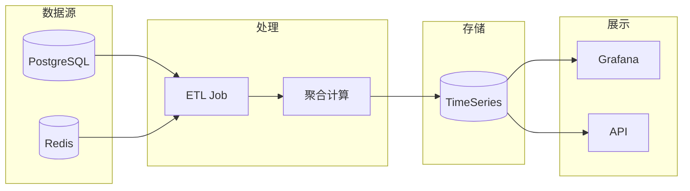

# 成本优化与计费策略

> OpenClaw LLM API 成本控制与优化最佳实践

---

## 概述

OpenClaw 提供了完善的成本控制机制，帮助用户在享受 AI 能力的同时有效控制支出。本文档深入解析成本追踪、预算控制、优化策略和计费模型。

★ Insight ─────────────────────────────────────
• Token 成本是 AI 应用的主要成本来源，上下文压缩和智能路由是成本优化的关键
• 分层计费模型（输入/输出/缓存）允许更精细的成本控制
• 成本可视化是成本优化的第一步，实时监控帮助发现异常消费
─────────────────────────────────────────────────

---

## 成本模型

### 1. Token 计费

```typescript
// src/agents/usage.ts
interface TokenUsage {
  input: number;       // 输入 token 数
  output: number;      // 输出 token 数

  // 缓存计费 (部分模型支持)
  cacheRead?: number;  // 缓存读取 token
  cacheWrite?: number; // 缓存写入 token
}

interface CostConfig {
  // 各类型 token 的单位成本 (美元/token)
  inputCost: number;       // $0.01/1K tokens
  outputCost: number;      // $0.03/1K tokens
  cacheReadCost: number;   // $0.001/1K tokens
  cacheWriteCost: number;  // $0.01/1K tokens
}

function calculateCost(usage: TokenUsage, config: CostConfig): number {
  const inputTotal = usage.input * config.inputCost;
  const outputTotal = usage.output * config.outputCost;
  const cacheReadTotal = (usage.cacheRead || 0) * (config.cacheReadCost || 0);
  const cacheWriteTotal = (usage.cacheWrite || 0) * (config.cacheWriteCost || 0);

  return inputTotal + outputTotal + cacheReadTotal + cacheWriteTotal;
}
```

### 2. 模型成本对比

| 模型 | 输入 ($/1M) | 输出 ($/1M) | 缓存读取 | 上下文 |
|------|-------------|-------------|----------|--------|
| GPT-4 | $15.00 | $60.00 | - | 128K |
| GPT-3.5 Turbo | $0.50 | $1.50 | - | 16K |
| Claude 3 Opus | $15.00 | $75.00 | $1.50 | 200K |
| Claude 3 Sonnet | $3.00 | $15.00 | $0.30 | 200K |
| Claude 3 Haiku | $0.25 | $1.25 | $0.04 | 200K |

---

## 成本追踪

### 1. 会话成本聚合

```typescript
// src/infra/session-cost-usage.ts
interface SessionCostSummary {
  sessionId: string;

  // Token 统计
  inputTokens: number;
  outputTokens: number;
  totalTokens: number;

  // 成本统计 (美元)
  inputCost: number;
  outputCost: number;
  cacheReadCost: number;
  cacheWriteCost: number;
  totalCost: number;

  // 元数据
  model: string;
  startTime: Date;
  endTime: Date;
  messageCount: number;
}

class SessionCostTracker {
  async calculateSessionCost(sessionId: string): Promise<SessionCostSummary> {
    // 从消息历史中聚合使用量
    const messages = await this.db.query(`
      SELECT role, tokens, usage
      FROM messages
      WHERE session_id = $1
    `, [sessionId]);

    let inputTokens = 0;
    let outputTokens = 0;
    let totalCost = 0;

    for (const msg of messages) {
      const usage = msg.usage as TokenUsage;
      const model = this.resolveModel(msg.model);

      if (msg.role === 'user') {
        inputTokens += usage.input;
      } else if (msg.role === 'assistant') {
        outputTokens += usage.output;
      }

      totalCost += calculateCost(usage, getCostConfig(model));
    }

    return {
      sessionId,
      inputTokens,
      outputTokens,
      totalTokens: inputTokens + outputTokens,
      totalCost,
      // ...
    };
  }
}
```

### 2. 实时成本监控

```typescript
// src/agents/usage-reporting.ts
class UsageReporter {
  async reportUsage(usage: TokenUsage, model: string): Promise<void> {
    const cost = calculateCost(usage, getCostConfig(model));

    // 发送到监控系统
    await this.metrics.increment('llm.usage.input', usage.input);
    await this.metrics.increment('llm.usage.output', usage.output);
    await this.metrics.increment('llm.cost.total', cost);

    // 检查预算
    await this.checkBudget(cost);
  }

  private async checkBudget(additionalCost: number): Promise<void> {
    const currentSpend = await this.getCurrentSpend();
    const budget = await this.getBudget();

    if (currentSpend + additionalCost > budget) {
      // 触发告警或限制
      await this.notifyBudgetExceeded(currentSpend, budget);
    }
  }
}
```

---

## 成本优化策略

### 1. 上下文压缩

```typescript
// src/agents/pi-extensions/context-pruning.ts
interface CompressionConfig {
  maxTokens: number;           // 最大 token 数
  preserveRecent: number;      // 保留最近 N 条消息
  summarizeOlder: boolean;    // 是否对旧消息摘要
  summaryModel?: string;      // 摘要使用的模型
}

class ContextCompressor {
  compress(messages: Message[], config: CompressionConfig): Message[] {
    const currentTokens = this.countTokens(messages);

    // 未超限，无需压缩
    if (currentTokens <= config.maxTokens) {
      return messages;
    }

    // 保留系统消息
    const system = messages.filter(m => m.role === 'system');

    // 保留最近的消息
    const recent = messages
      .filter(m => m.role !== 'system')
      .slice(-config.preserveRecent);

    // 压缩旧消息
    const older = messages
      .filter(m => m.role !== 'system')
      .slice(0, -config.preserveRecent);

    const summary = config.summarizeOlder
      ? this.summarize(older)
      : [];

    return [...system, ...summary, ...recent];
  }

  private summarize(messages: Message[]): Message[] {
    // 使用更小的模型进行摘要
    // 保留关键信息：用户意图、工具调用、关键决策
    return [{
      role: 'system',
      content: `[Previous conversation summarized: ${messages.length} messages]`
    }];
  }
}
```

### 2. 模型智能路由

```typescript
// src/agents/model-fallback.ts
interface ModelRouterConfig {
  // 简单任务路由
  simpleTasks: {
    models: string[];
    maxTokens: number;     // 阈值
    triggers: string[];   // 触发关键词
  };

  // 复杂任务路由
  complexTasks: {
    models: string[];
  };
}

class ModelRouter {
  selectModel(task: Task, config: ModelRouterConfig): string {
    // 简单任务使用小模型
    if (task.complexity === 'simple') {
      const matchingModel = this.findMatchingModel(
        task,
        config.simpleTasks
      );
      if (matchingModel) {
        return matchingModel;
      }
    }

    // 复杂任务使用大模型
    return config.complexTasks.models[0];
  }

  private findMatchingModel(task: Task, options: {
    models: string[];
    maxTokens: number;
    triggers: string[];
  }): string | null {
    // 检查是否匹配触发条件
    const matchesTrigger = options.triggers.some(
      t => task.prompt.toLowerCase().includes(t.toLowerCase())
    );

    if (!matchesTrigger) {
      return null;
    }

    // 返回最便宜的模型
    return options.models[0];
  }
}
```

### 3. 缓存策略

```typescript
// src/agents/cache-manager.ts
interface CacheConfig {
  enabled: boolean;
  ttl: number;           // 缓存时间 (秒)
  similarityThreshold: number;  // 相似度阈值
}

class SemanticCache {
  async get(prompt: string): Promise<CachedResponse | null> {
    // 计算 prompt 的 embedding
    const embedding = await this.embed(prompt);

    // 查找相似缓存
    const cached = await this.redis.zrange(
      `cache:${this.model}`,
      0,
      -1,
      'WITHSCORES'
    );

    for (const [key, score] of cached) {
      if (score > this.config.similarityThreshold) {
        const cachedPrompt = await this.redis.get(`cache:prompt:${key}`);
        if (this.isSimilar(prompt, cachedPrompt)) {
          const response = await this.redis.get(`cache:response:${key}`);
          return JSON.parse(response);
        }
      }
    }

    return null;
  }

  async set(prompt: string, response: Response): Promise<void> {
    // 存储缓存
    const key = this.generateKey(prompt);
    await this.redis.set(`cache:response:${key}`, JSON.stringify(response));
    await this.redis.expire(`cache:response:${key}`, this.config.ttl);
  }
}
```

---

## 预算控制

### 1. 预算设置

```typescript
// src/config/budget.ts
interface Budget {
  total: number;           // 总预算 (美元)
  period: 'daily' | 'weekly' | 'monthly';
  alerts: number[];        // 告警阈值百分比 [50, 80, 90]
  actions: BudgetAction[]; // 超出预算时的动作
}

enum BudgetAction {
  WARN = 'warn',           // 警告
  THROTTLE = 'throttle',   // 限流
  BLOCK = 'block',         // 阻止
}

class BudgetManager {
  async checkBudget(userId: string): Promise<BudgetCheckResult> {
    const budget = await this.getBudget(userId);
    const spent = await this.getSpent(userId);
    const percentage = (spent / budget.total) * 100;

    return {
      remaining: budget.total - spent,
      percentage,
      shouldAlert: budget.alerts.some(t => percentage >= t),
      action: this.determineAction(percentage, budget),
    };
  }

  private determineAction(
    percentage: number,
    budget: Budget
  ): BudgetAction | null {
    if (percentage >= 100) {
      return budget.actions.includes(BudgetAction.BLOCK)
        ? BudgetAction.BLOCK
        : BudgetAction.THROTTLE;
    }
    if (percentage >= 90) {
      return BudgetAction.WARN;
    }
    return null;
  }
}
```

### 2. 成本分摊

```typescript
// 团队/项目成本分摊
interface CostAllocation {
  projectId: string;
  userId: string;
  share: number;  // 0-1, 分摊比例
}

class CostAllocator {
  allocate(cost: number, allocations: CostAllocation[]): Map<string, number> {
    const result = new Map<string, number>();

    for (const allocation of allocations) {
      const share = cost * allocation.share;
      result.set(allocation.userId, share);
    }

    return result;
  }
}
```

---

## 可视化与报表

### 1. 成本仪表板



### 2. 关键指标

| 指标 | 描述 | 告警阈值 |
|------|------|----------|
| `cost.total.today` | 今日总成本 | > $100 |
| `cost.total.month` | 月度总成本 | 接近预算 |
| `cost.per_session` | 每会话平均成本 | > $1 |
| `cost.per_message` | 每消息平均成本 | > $0.1 |
| `cache.hit_rate` | 缓存命中率 | < 20% |
| `model.usage_distribution` | 模型使用分布 | - |

---

## 配置参考

```yaml
# config/cost.yaml
cost:
  # 预算设置
  budget:
    enabled: true
    total: 1000  # 美元
    period: monthly
    alerts: [50, 80, 90]
    actions:
      - warn
      - throttle

  # 优化设置
  optimization:
    # 上下文压缩
    compression:
      enabled: true
      maxTokens: 100000
      preserveRecent: 20
      summarizeOlder: true

    # 模型路由
    routing:
      enabled: true
      simpleTasks:
        models:
          - claude-3-haiku
        maxTokens: 2000
        triggers:
          - hello
          - hi
          - help
      complexTasks:
        models:
          - gpt-4
          - claude-3-opus

    # 缓存
    cache:
      enabled: true
      ttl: 3600  # 1小时
      similarityThreshold: 0.95

  # 模型成本配置
  models:
    gpt-4:
      input: 0.015
      output: 0.06
    "claude-3-opus":
      input: 0.015
      output: 0.075
      cacheRead: 0.0015
    "claude-3-sonnet":
      input: 0.003
      output: 0.015
```

---

## 成本优化最佳实践

1. **选择合适的模型**
   - 简单任务使用小模型 (Haiku, 3.5 Turbo)
   - 复杂推理使用大模型 (GPT-4, Opus)

2. **启用上下文压缩**
   - 定期压缩长会话的上下文
   - 使用摘要代替完整历史

3. **利用缓存**
   - 相同/相似 prompt 使用缓存
   - 设置合理的 TTL

4. **设置预算告警**
   - 50% 首次告警
   - 80% 再次告警
   - 90% 限制使用

5. **监控模型使用分布**
   - 优化前：分析哪些任务使用了更贵的模型
   - 优化后：验证成本下降效果

---

*最后更新：2024年1月*
