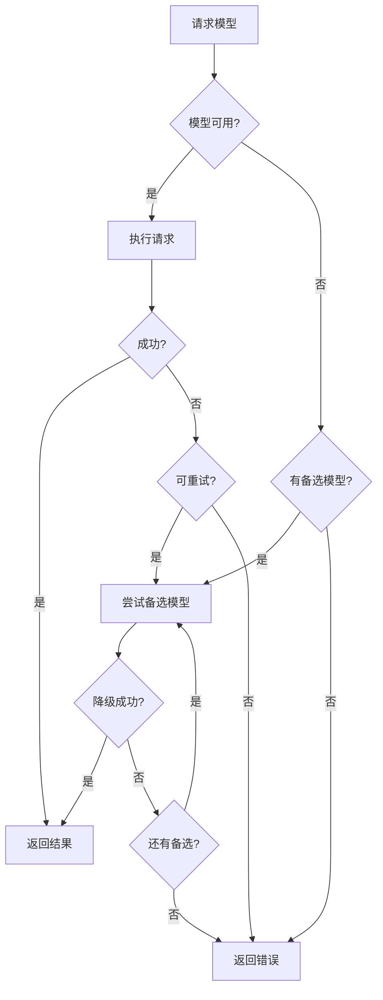

# 错误处理与重试机制

> OpenClaw 错误处理策略与重试机制深度解析

---

## 概述

OpenClaw 实现了完善的错误处理与重试机制，确保系统在面对网络波动、服务不可用等临时性问题时的鲁棒性。本文档深入解析错误分类、重试策略、指数退避算法和降级机制。

★ Insight ─────────────────────────────────────
• 重试策略需要平衡用户体验和系统负载，过于激进的重试会导致级联故障
• 指数退避 + 抖动是工业界的最佳实践，避免雷鸣羊群效应
• 错误分类决定了处理方式，可重试 vs 不可重试错误需要明确区分
─────────────────────────────────────────────────

---

## 错误分类体系

### 1. 错误类型层次

```typescript
// src/agents/failover-error.ts
enum ErrorType {
  // 可重试错误
  RETRYABLE = 'RETRYABLE',

  // 临时性错误，可短延迟后重试
  TEMPORARY = 'TEMPORARY',

  // 认证错误，需要重新认证
  AUTH_ERROR = 'AUTH_ERROR',

  // 配额错误，需要等待或升级
  QUOTA_ERROR = 'QUOTA_ERROR',

  // 永久性错误，无需重试
  PERMANENT = 'PERMANENT',
}

interface FailoverError {
  type: ErrorType;
  message: string;
  retryable: boolean;
  retryAfterMs?: number;
  fallbackModel?: string;
}
```

### 2. 错误码映射

| 错误类型 | HTTP 状态码 | 是否重试 | 处理策略 |
|----------|-------------|----------|----------|
| 网络超时 | 408, 504 | ✅ | 指数退避重试 |
| 限流 | 429 | ✅ | 使用 retry_after |
| 服务器错误 | 500-599 | ✅ | 指数退避重试 |
| 认证失败 | 401, 403 | ❌ | 刷新凭证 |
| 配额不足 | 402 | ❌ | 提示用户 |
| 客户端错误 | 400 | ❌ | 返回错误信息 |

---

## 重试策略实现

### 1. 核心重试配置

```typescript
// src/infra/retry.ts
interface RetryConfig {
  attempts: number;           // 最大重试次数
  minDelayMs: number;        // 最小延迟
  maxDelayMs: number;        // 最大延迟
  jitter: number;            // 抖动系数 (0-1)
  backoffMultiplier: number; // 退避乘数
  shouldRetry?: (err: unknown) => boolean;
  retryAfterMs?: (err: unknown) => number | undefined;
}

const DEFAULT_RETRY_CONFIG: RetryConfig = {
  attempts: 3,
  minDelayMs: 500,
  maxDelayMs: 30_000,
  jitter: 0.1,
  backoffMultiplier: 2,
};
```

### 2. 指数退避算法

```typescript
// src/infra/backoff.ts
class ExponentialBackoff {
  constructor(
    private readonly initialDelay: number = 1000,
    private readonly maxDelay: number = 30000,
    private readonly multiplier: number = 2,
    private readonly jitter: number = 0.1
  ) {}

  /**
   * 计算下一次延迟
   * 公式: min(maxDelay, initialDelay * (multiplier ^ attempt)) * (1 + random * jitter)
   */
  calculateDelay(attempt: number): number {
    // 基础延迟
    const baseDelay = Math.min(
      this.maxDelay,
      this.initialDelay * Math.pow(this.multiplier, attempt)
    );

    // 添加抖动，避免雷鸣羊群效应
    const jitterRange = baseDelay * this.jitter;
    const randomJitter = (Math.random() * 2 - 1) * jitterRange;

    return Math.floor(baseDelay + randomJitter);
  }
}

// 使用示例
const backoff = new ExponentialBackoff(1000, 30000, 2, 0.1);

for (let attempt = 0; attempt < 5; attempt++) {
  const delay = backoff.calculateDelay(attempt);
  console.log(`Attempt ${attempt}: ${delay}ms`);
  // 输出示例:
  // Attempt 0: ~1000ms (1000 ± 100)
  // Attempt 1: ~2000ms (2000 ± 200)
  // Attempt 2: ~4000ms (4000 ± 400)
  // Attempt 3: ~8000ms (8000 ± 800)
  // Attempt 4: ~16000ms (16000 ± 1600)
}
```

### 3. 重试执行器

```typescript
// src/infra/retry.ts
async function retryAsync<T>(
  fn: () => Promise<T>,
  config: RetryConfig
): Promise<T> {
  let lastError: unknown;

  for (let attempt = 0; attempt < config.attempts; attempt++) {
    try {
      return await fn();
    } catch (error) {
      lastError = error;

      // 判断是否应该重试
      if (config.shouldRetry && !config.shouldRetry(error)) {
        throw error;
      }

      // 判断是否还有重试机会
      if (attempt < config.attempts - 1) {
        // 计算延迟
        let delay = config.minDelayMs * Math.pow(config.backoffMultiplier, attempt);

        // 如果有 server 返回的 retry_after，优先使用
        if (config.retryAfterMs) {
          const serverDelay = config.retryAfterMs(error);
          if (serverDelay !== undefined) {
            delay = Math.min(serverDelay, config.maxDelayMs);
          }
        }

        // 添加抖动
        delay = delay * (1 + (Math.random() * 2 - 1) * config.jitter);
        delay = Math.min(delay, config.maxDelayMs);

        console.log(`Retry attempt ${attempt + 1} after ${delay}ms`);
        await sleep(delay);
      }
    }
  }

  throw lastError;
}
```

---

## 渠道特定重试策略

### 1. Discord 重试策略

```typescript
// src/infra/retry-policy.ts
export const DISCORD_RETRY_DEFAULTS = {
  attempts: 3,
  minDelayMs: 500,
  maxDelayMs: 30_000,
  jitter: 0.1,
};

function createDiscordRetryRunner(params: {
  retry?: RetryConfig;
}): RetryRunner {
  return <T>(fn: () => Promise<T>, label?: string) =>
    retryAsync(fn, {
      ...DISCORD_RETRY_DEFAULTS,
      ...params.retry,
      // Discord 限流错误
      shouldRetry: (err) => err instanceof RateLimitError,
      retryAfterMs: (err) =>
        err instanceof RateLimitError ? err.retryAfter * 1000 : undefined,
    });
}
```

### 2. Telegram 重试策略

```typescript
// src/infra/retry-policy.ts
export const TELEGRAM_RETRY_DEFAULTS = {
  attempts: 3,
  minDelayMs: 400,
  maxDelayMs: 30_000,
  jitter: 0.1,
};

// Telegram 特定的可重试错误模式
const TELEGRAM_RETRY_RE = /429|timeout|connect|reset|closed|unavailable|temporarily/i;

function resolveTelegramShouldRetry(params: {
  shouldRetry?: (err: unknown) => boolean;
}): (err: unknown) => boolean {
  if (!params.shouldRetry) {
    return (err: unknown) => TELEGRAM_RETRY_RE.test(formatErrorMessage(err));
  }
  return (err: unknown) =>
    params.shouldRetry?.(err) || TELEGRAM_RETRY_RE.test(formatErrorMessage(err));
}
```

---

## 模型降级机制

### 1. 降级策略



### 2. 模型降级实现

```typescript
// src/agents/model-fallback.ts
interface ModelFallbackConfig {
  primaryModel: string;
  fallbackModels: string[];
  retryAttempts: number;
  probeBeforeSwitch: boolean;
}

class ModelFallbackManager {
  private readonly models: Map<string, ModelClient> = new Map();
  private readonly fallbackOrder: Map<string, string[]> = new Map();

  async executeWithFallback<T>(
    config: ModelFallbackConfig,
    fn: (model: string) => Promise<T>
  ): Promise<T> {
    const models = [config.primaryModel, ...config.fallbackModels];

    let lastError: unknown;

    for (const model of models) {
      try {
        // 探测模型可用性
        if (config.probeBeforeSwitch && !config.primaryModel) {
          const available = await this.probeModel(model);
          if (!available) {
            continue;
          }
        }

        return await fn(model);
      } catch (error) {
        lastError = error;

        // 检查是否是可降级的错误
        if (!this.isFallbackError(error)) {
          throw error;
        }

        console.warn(`Model ${model} failed, trying fallback...`);
      }
    }

    throw lastError;
  }

  private isFallbackError(error: unknown): boolean {
    const message = formatErrorMessage(error);
    return /rate|limit|quota|timeout|unavailable/i.test(message);
  }
}
```

### 3. 认证凭证轮换

```typescript
// src/agents/api-key-rotation.ts
class APIKeyRotation {
  private readonly keys: string[];
  private currentIndex = 0;
  private readonly failedAttempts: Map<string, number> = new Map();

  constructor(keys: string[]) {
    this.keys = keys;
  }

  async executeWithRotation<T>(
    fn: (key: string) => Promise<T>
  ): Promise<T> {
    const startIndex = this.currentIndex;
    let attempts = 0;

    while (attempts < this.keys.length) {
      const key = this.keys[this.currentIndex];
      this.currentIndex = (this.currentIndex + 1) % this.keys.length;

      try {
        return await fn(key);
      } catch (error) {
        this.failedAttempts.set(key, (this.failedAttempts.get(key) || 0) + 1);

        // 连续失败 3 次则跳过该 key
        if ((this.failedAttempts.get(key) || 0) >= 3) {
          console.warn(`Key ${key.substring(0, 8)}... failing, skipping`);
          continue;
        }

        // 限流错误，稍后重试
        if (error instanceof RateLimitError) {
          await sleep(error.retryAfter * 1000);
        }
      }

      attempts++;
    }

    throw new Error('All API keys failed');
  }
}
```

---

## 工具执行重试

### 1. 工具超时与重试

```typescript
// src/agents/tools/tool-runtime.ts
interface ToolExecutionConfig {
  timeout: number;           // 执行超时
  maxRetries: number;       // 最大重试次数
  retryDelay: number;       // 重试延迟
}

class ToolExecutor {
  async executeWithRetry<T>(
    tool: Tool,
    params: ToolParams,
    config: ToolExecutionConfig
  ): Promise<T> {
    let lastError: unknown;

    for (let attempt = 0; attempt <= config.maxRetries; attempt++) {
      try {
        return await this.executeWithTimeout(tool, params, config.timeout);
      } catch (error) {
        lastError = error;

        // 超时错误可以重试
        if (!(error instanceof ToolTimeoutError)) {
          throw error;
        }

        if (attempt < config.maxRetries) {
          console.warn(`Tool ${tool.name} timeout, retry ${attempt + 1}`);
          await sleep(config.retryDelay * attempt);
        }
      }
    }

    throw lastError;
  }
}
```

### 2. 幂等性保证

```typescript
// 工具执行的幂等键
interface ToolCall {
  id: string;
  name: string;
  params: Record<string, unknown>;
  idempotencyKey?: string;  // 幂等键
}

class IdempotentToolExecutor {
  private readonly results = new Map<string, ToolResult>();

  async execute(call: ToolCall): Promise<ToolResult> {
    // 检查是否已执行
    if (call.idempotencyKey && this.results.has(call.idempotencyKey)) {
      console.log(`Reusing cached result for ${call.name}`);
      return this.results.get(call.idempotencyKey)!;
    }

    const result = await this.executeTool(call);

    // 缓存结果
    if (call.idempotencyKey) {
      this.results.set(call.idempotencyKey, result);
    }

    return result;
  }
}
```

---

## 断线与恢复

### 1. WebSocket 重连

```typescript
// src/gateway/reconnect-gating.ts
interface ReconnectionConfig {
  maxAttempts: number;
  initialDelay: number;
  maxDelay: number;
  backoffMultiplier: number;
}

class WebSocketReconnector {
  private attempts = 0;

  async connect(url: string, config: ReconnectionConfig): Promise<WebSocket> {
    while (this.attempts < config.maxAttempts) {
      try {
        const ws = await this.establishConnection(url);
        this.attempts = 0;  // 重置计数
        return ws;
      } catch (error) {
        this.attempts++;

        if (this.attempts >= config.maxAttempts) {
          throw new Error('Max reconnection attempts reached');
        }

        const delay = this.calculateDelay(config);
        console.log(`Reconnecting in ${delay}ms (attempt ${this.attempts})`);
        await sleep(delay);
      }
    }

    throw new Error('Failed to reconnect');
  }

  private calculateDelay(config: ReconnectionConfig): number {
    const delay = Math.min(
      config.initialDelay * Math.pow(config.backoffMultiplier, this.attempts),
      config.maxDelay
    );
    return delay * (0.5 + Math.random());  // 50% 抖动
  }
}
```

### 2. 消息重放

```typescript
// 断线后的消息重放
interface MessageReplay {
  sessionId: string;
  lastMessageId: string;
  pendingMessages: Message[];
}

class MessageReplayManager {
  async replayMissing(sessionId: string, lastSeenId: string): Promise<Message[]> {
    // 从数据库获取遗漏的消息
    const messages = await this.db.query(`
      SELECT * FROM messages
      WHERE session_id = $1 AND id > $2
      ORDER BY created_at ASC
    `, [sessionId, lastSeenId]);

    return messages;
  }
}
```

---

## 监控与告警

### 1. 重试指标

| 指标 | 描述 | 告警阈值 |
|------|------|----------|
| `retry.total` | 总重试次数 | > 100/min |
| `retry.success` | 重试后成功次数 | - |
| `retry.exhausted` | 重试耗尽次数 | > 10/min |
| `retry.latency` | 重试延迟分布 | p99 > 5s |
| `failover.count` | 降级发生次数 | > 50/day |
| `failover.model_switch` | 模型切换次数 | - |

### 2. 日志规范

```typescript
// 重试时的结构化日志
log.warn('retry_attempt', {
  attempt: 1,
  maxAttempts: 3,
  delayMs: 1000,
  errorType: 'RateLimitError',
  retryAfter: 30,
  service: 'discord',
  messageId: 'msg_123',
});
```

---

## 配置参考

```yaml
# config/retry.yaml
retry:
  # 默认配置
  default:
    attempts: 3
    minDelayMs: 500
    maxDelayMs: 30000
    jitter: 0.1
    backoffMultiplier: 2

  # 渠道特定配置
  discord:
    attempts: 3
    minDelayMs: 500
    maxDelayMs: 30000

  telegram:
    attempts: 3
    minDelayMs: 400
    maxDelayMs: 30000

  # 模型降级
  modelFallback:
    enabled: true
    probeBeforeSwitch: true
    fallbackModels:
      - gpt-4
      - gpt-3.5-turbo
      - claude-3-haiku
```

---

*最后更新：2024年1月*
