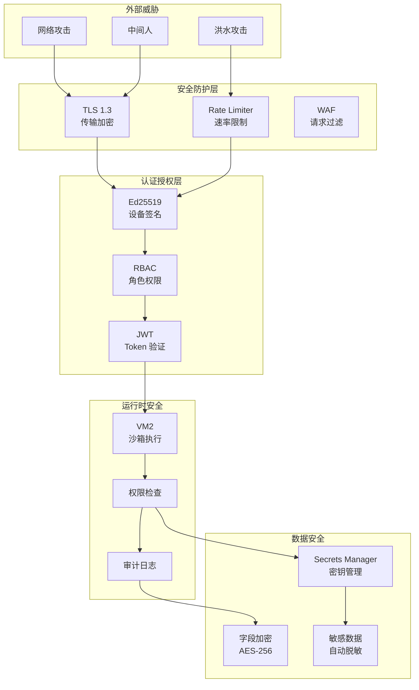
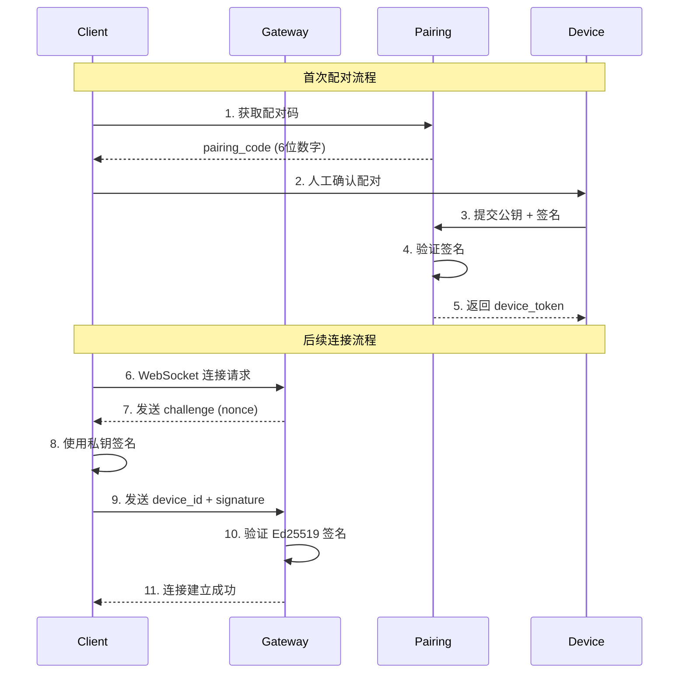
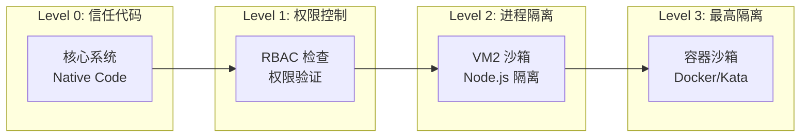

# OpenClaw 安全模型（深度解析）

> 从威胁模型到实现细节，全面理解 OpenClaw 的安全架构

---

## 安全架构全景



### 认证流程时序图



### 沙箱层级模型



---

## 威胁模型分析

### STRIDE 分析

```
┌─────────────────────────────────────────────────────────────────────┐
│                     OpenClaw STRIDE 威胁分析                         │
├─────────────────────────────────────────────────────────────────────┤
│                                                                     │
│  威胁类型        具体风险                    缓解措施                │
│  ─────────────────────────────────────────────────────────────      │
│                                                                     │
│  S - 欺骗        攻击者冒充合法用户          设备签名 + Token 认证    │
│                                                                     │
│  T - 篡改        修改传输中的消息            WebSocket TLS           │
│                  篡改配置文件                文件权限 + 签名验证      │
│                                                                     │
│  R - 抵赖        否认执行了危险操作          审计日志                 │
│                                                                     │
│  I - 信息泄露    敏感信息泄露给 LLM          Secrets 引用系统         │
│                  日志泄露 API Key            自动脱敏                 │
│                                                                     │
│  D - 拒绝服务    消息洪水攻击                速率限制 + 队列背压      │
│                  资源耗尽（大文件）           大小限制 + 流式处理      │
│                                                                     │
│  E - 权限提升    工具调用越权                权限检查 + 沙箱          │
│                  插件恶意代码                VM2 隔离                │
│                                                                     │
└─────────────────────────────────────────────────────────────────────┘
```

### 攻击面分析

```
┌─────────────────────────────────────────────────────────────────────┐
│                        攻击面全景图                                  │
├─────────────────────────────────────────────────────────────────────┤
│                                                                     │
│   外部攻击面                                                        │
│   ├── 网络层                                                       │
│   │   ├── WebSocket 端口 (18789)                                   │
│   │   ├── HTTP API (如果启用)                                       │
│   │   └── 渠道 Webhook (Telegram/Discord 等回调)                     │
│   │                                                                │
│   ├── 数据层                                                       │
│   │   ├── 配置文件 (~/.openclaw/)                                   │
│   │   ├── 会话存储 (本地文件/Redis)                                  │
│   │   └── 日志文件                                                 │
│   │                                                                │
│   └── 第三方依赖                                                   │
│       ├── LLM API 密钥                                             │
│       └── 渠道 API 密钥                                            │
│                                                                    │
│   内部攻击面                                                        │
│   ├── 插件系统（用户安装的插件）                                     │
│   ├── 工具执行（AI 生成的命令）                                     │
│   └── 文件系统访问（工作目录）                                       │
│                                                                    │
└─────────────────────────────────────────────────────────────────────┘
```

---

## 认证与授权体系

### 多层级认证架构

```typescript
// 认证层级（基于 src/security/ 实现）

interface AuthenticationLayers {
  // Layer 1: 传输层安全
  transport: {
    tls: boolean;           // TLS 1.3
    certificatePinning: boolean;  // 证书固定
  };
  
  // Layer 2: 设备身份
  device: {
    challengeResponse: boolean;   // 挑战-响应
    signatureAlgorithm: 'Ed25519' | 'ECDSA';
    keyStorage: 'secure-enclave' | 'file';  // 安全存储
  };
  
  // Layer 3: 应用认证
  application: {
    gatewayToken: string;    // 长期凭证
    deviceToken: string;     // 设备凭证
    sessionToken?: string;   // 短期凭证（可选）
  };
  
  // Layer 4: 操作授权
  authorization: {
    role: 'operator' | 'node' | 'readonly';
    scopes: string[];        // 细粒度权限
    resourceACL: ResourceACL; // 资源访问控制
  };
}

// 认证流程
type AuthFlow = 
  | 'challenge-response'     // 首次配对
  | 'token-based'            // 后续连接
  | 'certificate-based';     // 企业环境
```

### 权限模型（RBAC + ABAC）

```typescript
// 基于角色的访问控制（RBAC）
interface Role {
  name: string;
  permissions: Permission[];
}

const Roles: Record<string, Role> = {
  operator: {
    name: 'operator',
    permissions: [
      'agent:*',           // 所有 Agent 操作
      'config:read',
      'config:write',
      'system:status'
    ]
  },
  
  node: {
    name: 'node',
    permissions: [
      'node:invoke',       // 只能被调用
      'node:register'
    ]
  },
  
  readonly: {
    name: 'readonly',
    permissions: [
      'system:status',
      'history:read'
    ]
  }
};

// 基于属性的访问控制（ABAC）- 动态权限
interface ABACPolicy {
  // 示例：工作时间限制
  timeBased: {
    allowedHours: [9, 18];  // 仅 9-18 点允许危险操作
    timezone: 'Asia/Shanghai';
  };
  
  // 示例：网络位置
  locationBased: {
    allowedIPs: ['10.0.0.0/8', '127.0.0.1'];
    requireVPN: boolean;
  };
  
  // 示例：资源配额
  quotaBased: {
    maxTokensPerDay: number;
    maxToolCallsPerHour: number;
  };
}
```

---

## 沙箱与隔离机制

### 多层沙箱架构

```
┌─────────────────────────────────────────────────────────────────────┐
│                      OpenClaw 沙箱层级                               │
├─────────────────────────────────────────────────────────────────────┤
│                                                                     │
│  Level 3: 进程级沙箱 (最高安全)                                      │
│  ├── 使用场景: 执行用户上传的任意代码                                 │
│  ├── 实现: Docker / Firecracker MicroVM                            │
│  ├── 启动时间: ~100ms                                              │
│  └── 资源开销: 高                                                  │
│                                                                    │
│  Level 2: VM2 虚拟机 (默认)                                         │
│  ├── 使用场景: 插件代码、Skill 逻辑                                 │
│  ├── 实现: VM2 (Node.js 虚拟机)                                     │
│  ├── 限制: CPU/内存/网络/文件系统                                   │
│  ├── 启动时间: ~1ms                                                │
│  └── 资源开销: 低                                                  │
│                                                                    │
│  Level 1: 权限检查 (基础)                                           │
│  ├── 使用场景: 所有工具调用                                         │
│  ├── 实现: ACL + 白名单                                             │
│  └── 性能开销: 可忽略                                               │
│                                                                    │
│  Level 0: 无隔离 (仅限内置可信代码)                                  │
│  └── 使用场景: Gateway 核心逻辑                                     │
│                                                                    │
└─────────────────────────────────────────────────────────────────────┘
```

### VM2 沙箱详解

```typescript
// 基于 src/infra/openclaw-exec-env.ts 实现

class VM2Sandbox {
  private vm: VM;
  
  constructor(config: SandboxConfig) {
    this.vm = new VM({
      // 执行限制
      timeout: config.timeout || 5000,      // 5 秒超时
      cpuQuota: config.cpuQuota || 100,     // CPU 限制
      
      // 内存限制
      sandbox: {
        // 受控的 console
        console: this.createProxyConsole(),
        
        // 受控的网络访问
        fetch: this.createGuardedFetch(config.allowedHosts),
        
        // 虚拟文件系统
        fs: this.createVirtualFs(config.allowedPaths),
        
        // 禁止危险 API
        child_process: undefined,
        process: undefined,
        require: this.createSafeRequire(config.allowedModules)
      },
      
      // 编译选项
      compiler: 'javascript',
      eval: false,  // 禁用 eval
      wasm: false   // 禁用 WebAssembly
    });
  }
  
  // 受控的网络请求
  private createGuardedFetch(allowedHosts: string[]): typeof fetch {
    return async (url, options) => {
      const parsed = new URL(url.toString());
      
      // 检查域名白名单
      if (!allowedHosts.some(host => parsed.hostname.endsWith(host))) {
        throw new Error(`Host ${parsed.hostname} not allowed`);
      }
      
      // 限制请求大小
      if (options?.body) {
        const size = JSON.stringify(options.body).length;
        if (size > 10 * 1024 * 1024) {  // 10MB
          throw new Error('Request body too large');
        }
      }
      
      // 添加请求标识（用于审计）
      const headers = {
        ...options?.headers,
        'X-OpenClaw-Source': 'sandbox'
      };
      
      return fetch(url, { ...options, headers });
    };
  }
  
  // 虚拟文件系统
  private createVirtualFs(allowedPaths: string[]): typeof fs {
    return new Proxy(fs, {
      get(target, prop) {
        if (['readFile', 'writeFile', 'readdir'].includes(prop as string)) {
          return async (path: string, ...args: any[]) => {
            // 路径验证
            const resolved = await fs.realpath(path);
            const allowed = allowedPaths.some(p => resolved.startsWith(p));
            
            if (!allowed) {
              throw new Error(`Access denied: ${path}`);
            }
            
            // 记录文件操作（审计）
            audit.log({ action: 'fs', method: prop, path });
            
            return (target as any)[prop](resolved, ...args);
          };
        }
        
        // 禁止危险操作
        if (['chmod', 'chown', 'symlink', 'unlink'].includes(prop as string)) {
          throw new Error(`Operation ${String(prop)} not allowed in sandbox`);
        }
        
        return target[prop as keyof typeof fs];
      }
    });
  }
}
```

### 工具调用安全链

```typescript
// 工具执行的安全检查链（基于 src/tools/ 实现）

class ToolSecurityChain {
  async execute(tool: Tool, args: unknown, context: Context): Promise<unknown> {
    // 1. 工具存在性检查
    if (!this.toolRegistry.has(tool.name)) {
      throw new Error(`Unknown tool: ${tool.name}`);
    }
    
    // 2. 参数 Schema 验证
    const valid = this.ajv.validate(tool.parameters, args);
    if (!valid) {
      throw new Error(`Invalid parameters: ${this.ajv.errorsText()}`);
    }
    
    // 3. 语义检查（防止注入）
    if (tool.name === 'exec') {
      const cmd = (args as any).command;
      if (this.detectDangerousCommand(cmd)) {
        throw new Error('Dangerous command detected');
      }
    }
    
    // 4. 权限检查
    if (tool.dangerous) {
      const allowed = await this.checkPermission(context.user, tool);
      if (!allowed) {
        throw new Error('Permission denied');
      }
    }
    
    // 5. 速率限制
    if (!this.rateLimiter.check(context.user, tool.name)) {
      throw new Error('Rate limit exceeded');
    }
    
    // 6. 资源配额检查
    if (!this.quotaManager.check(context.user, tool)) {
      throw new Error('Quota exceeded');
    }
    
    // 7. 执行并记录
    const startTime = Date.now();
    try {
      const result = await this.runInSandbox(tool, args);
      
      audit.log({
        user: context.user,
        tool: tool.name,
        args: this.sanitizeArgs(args),  // 脱敏
        duration: Date.now() - startTime,
        success: true
      });
      
      return result;
    } catch (error) {
      audit.log({
        user: context.user,
        tool: tool.name,
        error: error.message,
        success: false
      });
      throw error;
    }
  }
  
  private detectDangerousCommand(cmd: string): boolean {
    const dangerous = [
      /rm\s+-rf\s+\//,           // 删除根目录
      /curl.*\|.*sh/,            // 管道执行远程脚本
      /wget.*-O-.*\|/,           // 同上
      />\s*\/dev\/null.*&/,      // 后台静默运行
      /mkfs/,                    // 格式化
      /dd\s+if=/                // 磁盘操作
    ];
    
    return dangerous.some(pattern => pattern.test(cmd));
  }
}
```

---

## Secrets 管理

### Secrets 引用系统

```typescript
// 基于 src/secrets/ 实现

// 配置中使用引用而非明文
const config = {
  model: {
    apiKey: '${secrets.OPENAI_API_KEY}'  // 引用，非明文
  },
  channels: {
    telegram: {
      token: '${secrets.TELEGRAM_BOT_TOKEN}'
    }
  }
};

// Secrets 解析器
class SecretsResolver {
  private providers: SecretsProvider[];
  
  async resolve(value: string): Promise<string> {
    // 匹配 ${secrets.NAME} 或 ${env.NAME} 等
    const pattern = /\$\{(\w+)\.([^}]+)\}/g;
    
    return value.replace(pattern, async (match, provider, key) => {
      const p = this.providers.find(p => p.name === provider);
      if (!p) {
        throw new Error(`Unknown secrets provider: ${provider}`);
      }
      
      const secret = await p.get(key);
      
      // 审计日志（记录访问，不记录值）
      audit.log({
        action: 'secret_access',
        provider,
        key,
        timestamp: Date.now()
      });
      
      return secret;
    });
  }
}

// 支持的 Secrets Provider
interface SecretsProvider {
  name: string;
  get(key: string): Promise<string>;
}

// 环境变量
class EnvProvider implements SecretsProvider {
  name = 'env';
  get(key: string) {
    const value = process.env[key];
    if (!value) throw new Error(`Env var ${key} not set`);
    return Promise.resolve(value);
  }
}

// macOS Keychain
class KeychainProvider implements SecretsProvider {
  name = 'keychain';
  async get(key: string) {
    return execAsync(`security find-generic-password -s "${key}" -w`);
  }
}

// 文件（加密）
class FileProvider implements SecretsProvider {
  name = 'file';
  async get(key: string) {
    const encrypted = await fs.readFile(`~/.openclaw/secrets/${key}`, 'utf8');
    return this.decrypt(encrypted);
  }
}
```

---

## 审计与合规

### 审计日志规范

```typescript
// 审计事件结构
interface AuditEvent {
  // 时间戳（毫秒精度）
  timestamp: number;
  
  // 事件类型
  type: 'auth' | 'access' | 'action' | 'system';
  
  // 主体
  subject: {
    userId?: string;
    deviceId: string;
    ip: string;
    role: string;
  };
  
  // 动作
  action: string;
  
  // 对象
  object: {
    type: string;
    id: string;
  };
  
  // 结果
  outcome: 'success' | 'failure';
  error?: string;
  
  // 上下文
  context: {
    sessionId?: string;
    requestId?: string;
    userAgent?: string;
  };
  
  // 风险评分（自动计算）
  riskScore?: number;
}

// 示例事件
const exampleEvents: AuditEvent[] = [
  {
    timestamp: 1737264000000,
    type: 'auth',
    subject: { deviceId: 'dev_abc', ip: '127.0.0.1', role: 'operator' },
    action: 'connect',
    object: { type: 'gateway', id: 'gateway_001' },
    outcome: 'success',
    context: { sessionId: 'sess_xyz' },
    riskScore: 0
  },
  {
    timestamp: 1737264001000,
    type: 'action',
    subject: { userId: 'user_123', deviceId: 'dev_abc', ip: '127.0.0.1', role: 'operator' },
    action: 'tool.exec',
    object: { type: 'tool', id: 'file.write' },
    outcome: 'success',
    context: { sessionId: 'sess_xyz', requestId: 'req_456' },
    riskScore: 0.3  // 文件写入操作有风险
  }
];
```

### 实时风险检测

```typescript
class RealtimeRiskDetector {
  private rules: RiskRule[] = [
    // 规则 1: 异常时间访问
    {
      name: 'off-hours-access',
      condition: (event) => {
        const hour = new Date(event.timestamp).getHours();
        return hour < 9 || hour > 18;
      },
      severity: 'low',
      action: 'log'
    },
    
    // 规则 2: 高频率工具调用
    {
      name: 'high-frequency-tools',
      condition: (event, history) => {
        const recent = history.filter(e => 
          e.timestamp > Date.now() - 60000 &&
          e.action === 'tool.exec'
        );
        return recent.length > 50;  // 1 分钟内超过 50 次
      },
      severity: 'high',
      action: 'alert'
    },
    
    // 规则 3: 敏感文件访问
    {
      name: 'sensitive-file-access',
      condition: (event) => {
        const sensitive = ['.ssh', '.aws', '.kube'];
        return sensitive.some(path => 
          event.object.id.includes(path)
        );
      },
      severity: 'critical',
      action: 'block'
    }
  ];
  
  async process(event: AuditEvent): Promise<void> {
    for (const rule of this.rules) {
      if (rule.condition(event, this.history)) {
        await this.handleRisk(event, rule);
      }
    }
  }
}
```

---

## 生产环境加固清单

### 网络层

```bash
# 1. 绑定本地地址（禁止公网直接访问）
openclaw config set gateway.bind 127.0.0.1

# 2. 启用 TLS（如果必须通过公网）
openclaw config set gateway.tls.enabled true
cp cert.pem ~/.openclaw/
cp key.pem ~/.openclaw/

# 3. 防火墙规则
sudo ufw default deny incoming
sudo ufw allow from 127.0.0.1 to any port 18789
sudo ufw allow from 100.64.0.0/10 to any port 18789  # Tailscale
```

### 认证层

```bash
# 1. 设置强密码
export GATEWAY_TOKEN=$(openssl rand -base64 48)

# 2. 禁用新设备自动配对
openclaw config set pairing.autoApprove false

# 3. 定期轮换 Token
# 添加到 crontab，每月轮换
0 0 1 * * openclaw token rotate
```

### 应用层

```json
{
  "sandbox": {
    "enabled": true,
    "level": "strict",
    "allowedPaths": ["/home/openclaw/data"],
    "deniedPaths": ["/etc", "/root", "/var"]
  },
  "tools": {
    "exec": {
      "enabled": false  // 生产环境禁用命令执行
    },
    "write": {
      "requireApproval": true
    }
  },
  "audit": {
    "enabled": true,
    "level": "detailed",
    "output": "/var/log/openclaw/audit.log",
    "forward": "syslog"
  }
}
```

---

## 安全事件响应

### 事件分类与响应

| 级别 | 示例 | 响应时间 | 自动动作 |
|-----|-----|---------|---------|
| P0 - 严重 | RCE 漏洞利用 | 立即 | 隔离 Gateway |
| P1 - 高 | 异常大量 API 调用 | 5 分钟 | 限流 + 告警 |
| P2 - 中 | 非工作时间访问 | 30 分钟 | 记录日志 |
| P3 - 低 | 配置警告 | 24 小时 | 通知 |

### 应急响应流程

```
1. 检测
   ├── 监控告警触发
   ├── 用户报告
   └── 审计日志分析

2. 遏制
   ├── 隔离受影响组件
   ├── 禁用可疑账户
   └── 启用只读模式

3. 调查
   ├── 收集日志
   ├── 分析攻击路径
   └── 评估影响范围

4. 恢复
   ├── 应用补丁
   ├── 轮换凭证
   └── 验证系统完整性

5. 复盘
   ├── 更新检测规则
   ├── 加固配置
   └── 更新应急预案
```
