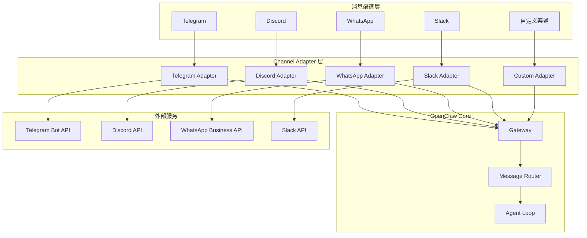
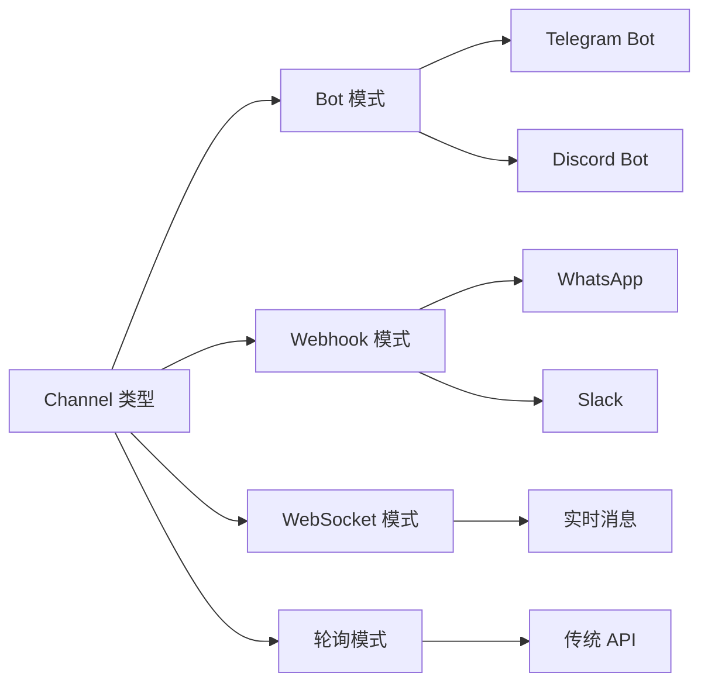

# Channel 扩展开发指南

> 为 OpenClaw 接入新消息渠道的完整技术规范

---

## Channel 架构概览



---

## Channel 核心概念

### 什么是 Channel

Channel 是 OpenClaw 与外部消息平台的适配层，负责：

| 职责 | 说明 |
|------|------|
| **消息接收** | 将平台消息转换为 OpenClaw 标准格式 |
| **消息发送** | 将 OpenClaw 响应发送到目标平台 |
| **事件处理** | 处理平台特有事件（加入群组、 reactions 等） |
| **状态同步** | 维护连接状态、用户信息等 |

### Channel 类型



---

## Channel 接口规范

### 核心接口定义

```typescript
// Channel 接口定义

interface Channel {
  // 元数据
  readonly id: string;              // 唯一标识，如 'telegram'
  readonly name: string;            // 显示名称
  readonly version: string;         // 版本
  
  // 能力声明
  readonly capabilities: ChannelCapabilities;
  
  // 生命周期
  initialize(config: ChannelConfig): Promise<void>;
  connect(): Promise<void>;
  disconnect(): Promise<void>;
  destroy(): Promise<void>;
  
  // 消息处理
  onMessage(handler: MessageHandler): void;
  onEvent(handler: EventHandler): void;
  sendMessage(message: OutgoingMessage): Promise<void>;
  
  // 状态查询
  getStatus(): ChannelStatus;
  getUserInfo(userId: string): Promise<UserInfo>;
  getChatInfo(chatId: string): Promise<ChatInfo>;
}

// 能力声明
interface ChannelCapabilities {
  // 消息类型
  text: boolean;                    // 纯文本
  markdown: boolean;                // Markdown 格式
  html: boolean;                    // HTML 格式
  media: {
    image: boolean;                 // 图片
    video: boolean;                 // 视频
    audio: boolean;                 // 音频
    document: boolean;              // 文档
    sticker: boolean;               // 贴纸
  };
  
  // 交互特性
  buttons: boolean;                 // 内联按钮
  keyboards: boolean;               // 自定义键盘
  reactions: boolean;               // 表情反应
  threads: boolean;                 // 话题/线程
  mentions: boolean;                // @提及
  
  // 群组功能
  groups: boolean;                  // 群组支持
  channels: boolean;                // 频道支持
  
  // 高级功能
  voice: boolean;                   // 语音通话
  liveLocation: boolean;            // 实时位置
  polls: boolean;                   // 投票
}

// 配置接口
interface ChannelConfig {
  // 认证信息
  credentials: {
    token?: string;                 // API Token
    apiKey?: string;                // API Key
    apiSecret?: string;             // API Secret
    webhookSecret?: string;         // Webhook 验证密钥
  };
  
  // 连接配置
  connection: {
    webhookUrl?: string;            // Webhook URL
    websocketUrl?: string;          // WebSocket URL
    pollingInterval?: number;       // 轮询间隔（毫秒）
    timeout?: number;               // 超时时间
  };
  
  // 功能开关
  features: {
    autoMarkRead?: boolean;         // 自动标记已读
    typingIndicator?: boolean;      // 输入指示器
    replyQuote?: boolean;           // 引用回复
  };
}

// 消息处理器
interface MessageHandler {
  (message: IncomingMessage): Promise<void> | void;
}

// 事件处理器
interface EventHandler {
  (event: ChannelEvent): Promise<void> | void;
}
```

### 消息格式

```typescript
// 入站消息
interface IncomingMessage {
  // 基础信息
  id: string;                       // 消息 ID
  timestamp: number;                // 时间戳
  
  // 来源
  channel: string;                  // 渠道 ID
  chat: {
    id: string;                     // 聊天 ID
    type: 'private' | 'group' | 'channel';
    title?: string;                 // 群组/频道标题
  };
  
  // 发送者
  from: {
    id: string;                     // 用户 ID
    username?: string;
    firstName?: string;
    lastName?: string;
    isBot?: boolean;
  };
  
  // 内容
  type: 'text' | 'image' | 'video' | 'audio' | 'document' | 'location';
  text?: string;                    // 文本内容
  caption?: string;                 // 媒体说明
  
  // 媒体
  media?: {
    fileId: string;
    fileName?: string;
    mimeType?: string;
    fileSize?: number;
    url?: string;                   // 临时下载链接
  };
  
  // 上下文
  replyTo?: string;                 // 回复的消息 ID
  threadId?: string;                // 话题 ID
  
  // 原始数据
  raw: any;                         // 平台原始消息
}

// 出站消息
interface OutgoingMessage {
  // 目标
  chatId: string;
  threadId?: string;
  replyTo?: string;
  
  // 内容
  type: 'text' | 'image' | 'video' | 'document' | 'audio';
  text?: string;
  
  // 媒体
  media?: {
    url?: string;                   // URL
    filePath?: string;              // 本地文件路径
    buffer?: Buffer;                // 文件缓冲区
    fileName?: string;
    mimeType?: string;
  };
  
  // 格式
  parseMode?: 'plain' | 'markdown' | 'html';
  
  // 交互
  buttons?: InlineButton[][];       // 内联按钮
  keyboard?: KeyboardButton[][];    // 自定义键盘
  
  // 选项
  options: {
    silent?: boolean;               // 静默发送
    protected?: boolean;            // 防止转发
    autoDelete?: number;            // 自动删除（秒）
  };
}

// 按钮定义
interface InlineButton {
  text: string;
  action: 
    | { type: 'url'; url: string }
    | { type: 'callback'; data: string }
    | { type: 'switch_inline'; query: string };
}
```

---

## 最小 Channel 实现

### 基础模板

```typescript
// src/index.ts

import { defineChannel } from '@openclaw/sdk';
import { CustomPlatformClient } from './client';

export default defineChannel({
  id: 'custom-platform',
  name: 'Custom Platform',
  version: '1.0.0',
  
  // 能力声明
  capabilities: {
    text: true,
    markdown: true,
    html: false,
    media: {
      image: true,
      video: true,
      audio: false,
      document: true,
      sticker: false
    },
    buttons: true,
    keyboards: false,
    reactions: true,
    threads: false,
    mentions: true,
    groups: true,
    channels: true
  },
  
  // 配置Schema
  config: {
    schema: {
      type: 'object',
      properties: {
        apiKey: { type: 'string', secret: true },
        apiEndpoint: { type: 'string', default: 'https://api.custom.com' },
        webhookSecret: { type: 'string', secret: true }
      },
      required: ['apiKey']
    }
  },
  
  // 生命周期
  async initialize(config) {
    // 创建客户端实例
    const client = new CustomPlatformClient({
      apiKey: config.apiKey,
      endpoint: config.apiEndpoint
    });
    
    // 验证连接
    await client.validate();
    
    return client;
  },
  
  // 连接建立
  async connect(client, emitter) {
    // 方式 1: Webhook
    if (this.config.webhookUrl) {
      await client.setWebhook(this.config.webhookUrl);
    }
    
    // 方式 2: WebSocket
    else if (this.config.websocketUrl) {
      const ws = client.connectWebSocket(this.config.websocketUrl);
      
      ws.on('message', (data) => {
        const message = this.parseMessage(data);
        emitter.emit('message', message);
      });
    }
    
    // 方式 3: 轮询
    else {
      this.startPolling(client, emitter);
    }
  },
  
  // 断开连接
  async disconnect(client) {
    await client.disconnect();
  },
  
  // 发送消息
  async sendMessage(client, message) {
    const payload = this.buildPayload(message);
    await client.sendMessage(message.chatId, payload);
  },
  
  // 消息解析
  parseMessage(raw: any): IncomingMessage {
    return {
      id: raw.message_id,
      timestamp: raw.timestamp * 1000,
      channel: 'custom-platform',
      chat: {
        id: raw.chat.id,
        type: raw.chat.type
      },
      from: {
        id: raw.from.id,
        username: raw.from.username,
        firstName: raw.from.first_name
      },
      type: this.mapMessageType(raw.type),
      text: raw.text,
      media: raw.media ? {
        fileId: raw.media.file_id,
        fileName: raw.media.file_name,
        mimeType: raw.media.mime_type
      } : undefined,
      replyTo: raw.reply_to?.message_id,
      raw
    };
  },
  
  // 构建发送载荷
  buildPayload(message: OutgoingMessage): any {
    const payload: any = {
      chat_id: message.chatId
    };
    
    if (message.text) {
      payload.text = message.text;
      payload.parse_mode = this.mapParseMode(message.parseMode);
    }
    
    if (message.media) {
      payload.media = message.media.fileId || message.media.url;
      payload.caption = message.text;
    }
    
    if (message.buttons) {
      payload.reply_markup = {
        inline_keyboard: message.buttons
      };
    }
    
    return payload;
  },
  
  // 辅助方法
  mapMessageType(type: string): string {
    const mapping: Record<string, string> = {
      'text': 'text',
      'photo': 'image',
      'video': 'video',
      'document': 'document'
    };
    return mapping[type] || 'text';
  },
  
  mapParseMode(mode?: string): string {
    const mapping: Record<string, string> = {
      'plain': '',
      'markdown': 'MarkdownV2',
      'html': 'HTML'
    };
    return mapping[mode || 'plain'];
  }
});
```

### 客户端实现

```typescript
// src/client.ts

import axios, { AxiosInstance } from 'axios';
import EventEmitter from 'events';

interface ClientOptions {
  apiKey: string;
  endpoint: string;
  timeout?: number;
}

export class CustomPlatformClient extends EventEmitter {
  private http: AxiosInstance;
  private ws?: WebSocket;
  private pollingTimer?: NodeJS.Timeout;
  
  constructor(options: ClientOptions) {
    super();
    
    this.http = axios.create({
      baseURL: options.endpoint,
      timeout: options.timeout || 30000,
      headers: {
        'Authorization': `Bearer ${options.apiKey}`,
        'Content-Type': 'application/json'
      }
    });
  }
  
  // 验证连接
  async validate(): Promise<void> {
    const response = await this.http.get('/me');
    if (!response.data.ok) {
      throw new Error('Invalid API key');
    }
  }
  
  // WebSocket 连接
  connectWebSocket(url: string): WebSocket {
    const ws = new WebSocket(url);
    
    ws.on('open', () => {
      this.emit('connected');
    });
    
    ws.on('message', (data) => {
      this.emit('message', JSON.parse(data.toString()));
    });
    
    ws.on('error', (error) => {
      this.emit('error', error);
    });
    
    ws.on('close', () => {
      this.emit('disconnected');
      // 自动重连
      setTimeout(() => this.connectWebSocket(url), 5000);
    });
    
    this.ws = ws;
    return ws;
  }
  
  // 设置 Webhook
  async setWebhook(url: string): Promise<void> {
    await this.http.post('/webhook', { url });
  }
  
  // 开始轮询
  startPolling(emitter: EventEmitter, interval: number = 1000): void {
    let lastUpdateId = 0;
    
    const poll = async () => {
      try {
        const response = await this.http.get('/updates', {
          params: { offset: lastUpdateId + 1 }
        });
        
        for (const update of response.data.result) {
          lastUpdateId = update.update_id;
          emitter.emit('message', update.message);
        }
      } catch (error) {
        this.emit('error', error);
      }
    };
    
    this.pollingTimer = setInterval(poll, interval);
    poll();  // 立即开始
  }
  
  // 停止轮询
  stopPolling(): void {
    if (this.pollingTimer) {
      clearInterval(this.pollingTimer);
    }
  }
  
  // 发送消息
  async sendMessage(chatId: string, payload: any): Promise<any> {
    const response = await this.http.post('/sendMessage', {
      chat_id: chatId,
      ...payload
    });
    return response.data;
  }
  
  // 获取文件
  async getFile(fileId: string): Promise<Buffer> {
    const response = await this.http.get(`/files/${fileId}`, {
      responseType: 'arraybuffer'
    });
    return Buffer.from(response.data);
  }
  
  // 断开连接
  async disconnect(): Promise<void> {
    this.stopPolling();
    this.ws?.close();
  }
}
```

---

## Webhook 处理

### Express 集成示例

```typescript
// src/webhook.ts

import { Router } from 'express';
import crypto from 'crypto';

export function createWebhookRouter(channel: any): Router {
  const router = Router();
  
  // 验证中间件
  router.use((req, res, next) => {
    const signature = req.headers['x-signature'] as string;
    const secret = channel.config.webhookSecret;
    
    if (secret && signature) {
      const expected = crypto
        .createHmac('sha256', secret)
        .update(JSON.stringify(req.body))
        .digest('hex');
      
      if (signature !== expected) {
        return res.status(401).send('Invalid signature');
      }
    }
    
    next();
  });
  
  // 处理消息
  router.post('/webhook', async (req, res) => {
    try {
      const message = channel.parseMessage(req.body);
      await channel.handleMessage(message);
      res.sendStatus(200);
    } catch (error) {
      console.error('Webhook error:', error);
      res.sendStatus(500);
    }
  });
  
  // 健康检查
  router.get('/health', (req, res) => {
    res.json({ status: 'ok', channel: channel.id });
  });
  
  return router;
}
```

---

## 高级特性

### 消息格式化

```typescript
// 富文本消息构建器

class MessageBuilder {
  private parts: string[] = [];
  
  text(text: string): this {
    this.parts.push(this.escape(text));
    return this;
  }
  
  bold(text: string): this {
    this.parts.push(`**${this.escape(text)}**`);
    return this;
  }
  
  italic(text: string): this {
    this.parts.push(`_${this.escape(text)}_`);
    return this;
  }
  
  code(text: string, language?: string): this {
    if (language) {
      this.parts.push(`\`\`\`${language}\n${text}\n\`\`\``);
    } else {
      this.parts.push(`\`${text}\``);
    }
    return this;
  }
  
  link(text: string, url: string): this {
    this.parts.push(`[${text}](${url})`);
    return this;
  }
  
  mention(userId: string, name: string): this {
    this.parts.push(`[@${name}](tg://user?id=${userId})`);
    return this;
  }
  
  newline(count: number = 1): this {
    this.parts.push('\n'.repeat(count));
    return this;
  }
  
  build(): string {
    return this.parts.join('');
  }
  
  private escape(text: string): string {
    // 根据平台转义特殊字符
    return text
      .replace(/\\/g, '\\\\')
      .replace(/\*/g, '\\*')
      .replace(/_/g, '\\_')
      .replace(/\[/g, '\\[');
  }
}

// 使用示例
const message = new MessageBuilder()
  .bold('Hello').text(' ').italic('World')
  .newline(2)
  .code('console.log("test")', 'javascript')
  .build();
```

### 键盘布局

```typescript
// 交互式键盘

interface KeyboardBuilder {
  // 内联按钮（消息下方）
  inline(rows: InlineButtonRow[]): InlineKeyboard;
  
  // 自定义键盘（底部）
  custom(rows: KeyboardButtonRow[], options?: {
    resize?: boolean;
    oneTime?: boolean;
    selective?: boolean;
  }): CustomKeyboard;
  
  // 移除键盘
  remove(): RemoveKeyboard;
}

// 示例：创建投票键盘
function createVoteKeyboard(pollId: string, options: string[]) {
  return {
    inline_keyboard: options.map((option, index) => [{
      text: option,
      callback_data: JSON.stringify({
        action: 'vote',
        pollId,
        option: index
      })
    }])
  };
}

// 处理回调
async handleCallback(callback: CallbackQuery) {
  const data = JSON.parse(callback.data);
  
  switch (data.action) {
    case 'vote':
      await this.recordVote(data.pollId, callback.from.id, data.option);
      await this.acknowledgeCallback(callback.id, '投票成功！');
      break;
  }
}
```

---

## 测试与调试

### 单元测试

```typescript
// tests/channel.test.ts

import { describe, it, expect, vi, beforeEach } from 'vitest';
import { createTestChannel } from '@openclaw/testing';
import customChannel from '../src/index';

describe('Custom Channel', () => {
  let channel: any;
  let client: any;
  
  beforeEach(async () => {
    channel = createTestChannel(customChannel, {
      apiKey: 'test-key',
      apiEndpoint: 'https://test.api.com'
    });
    
    client = await channel.initialize();
  });
  
  it('should parse text message', () => {
    const raw = {
      message_id: '123',
      timestamp: 1234567890,
      chat: { id: '456', type: 'private' },
      from: { id: '789', username: 'testuser' },
      type: 'text',
      text: 'Hello'
    };
    
    const message = channel.parseMessage(raw);
    
    expect(message.id).toBe('123');
    expect(message.text).toBe('Hello');
    expect(message.from.username).toBe('testuser');
  });
  
  it('should send message', async () => {
    const sendSpy = vi.spyOn(client, 'sendMessage').mockResolvedValue({});
    
    await channel.sendMessage({
      chatId: '456',
      type: 'text',
      text: 'Hello'
    });
    
    expect(sendSpy).toHaveBeenCalledWith('456', expect.any(Object));
  });
});
```

### 调试工具

```bash
# 本地启动 Channel 测试服务器
openclaw channel dev ./my-channel

# 发送测试消息
openclaw channel test --channel my-channel --message "Hello"

# 查看 Webhook 日志
openclaw channel logs --channel my-channel --follow

# 验证配置
openclaw channel validate ./my-channel
```

---

## 部署配置

### Docker 部署

```yaml
# docker-compose.yml

version: '3.8'

services:
  gateway:
    image: openclaw/gateway:latest
    environment:
      - CHANNEL_CUSTOM_API_KEY=${CUSTOM_API_KEY}
      - CHANNEL_CUSTOM_WEBHOOK_SECRET=${WEBHOOK_SECRET}
    ports:
      - "8080:8080"
    volumes:
      - ./channels:/app/channels:ro
  
  channel-custom:
    build: ./channels/custom
    environment:
      - GATEWAY_URL=http://gateway:8080
      - API_KEY=${CUSTOM_API_KEY}
```

### Kubernetes 部署

```yaml
# k8s-deployment.yaml

apiVersion: apps/v1
kind: Deployment
metadata:
  name: custom-channel
spec:
  replicas: 2
  selector:
    matchLabels:
      app: custom-channel
  template:
    metadata:
      labels:
        app: custom-channel
    spec:
      containers:
        - name: channel
          image: my-registry/custom-channel:latest
          env:
            - name: API_KEY
              valueFrom:
                secretKeyRef:
                  name: channel-secrets
                  key: api-key
          resources:
            limits:
              memory: "512Mi"
              cpu: "500m"
---
apiVersion: v1
kind: Service
metadata:
  name: custom-channel
spec:
  selector:
    app: custom-channel
  ports:
    - port: 80
      targetPort: 8080
  type: ClusterIP
```

---

## 最佳实践

### 1. 错误处理

```typescript
async sendMessage(message: OutgoingMessage): Promise<void> {
  const maxRetries = 3;
  let lastError: Error;
  
  for (let i = 0; i < maxRetries; i++) {
    try {
      await this.client.sendMessage(message);
      return;
    } catch (error) {
      lastError = error;
      
      // 可重试错误
      if (error.code === 'RATE_LIMITED') {
        await sleep(error.retryAfter * 1000);
        continue;
      }
      
      // 不可重试错误
      if (error.code === 'CHAT_NOT_FOUND') {
        throw new ChannelError('Chat not found', { recoverable: false });
      }
      
      // 其他错误等待后重试
      await sleep(Math.pow(2, i) * 1000);
    }
  }
  
  throw new ChannelError(`Failed after ${maxRetries} retries`, {
    cause: lastError
  });
}
```

### 2. 消息队列

```typescript
// 使用队列处理消息发送

import { Queue } from 'bull';

class MessageQueue {
  private queue: Queue;
  
  constructor() {
    this.queue = new Queue('messages', {
      redis: { host: 'localhost', port: 6379 }
    });
    
    // 处理任务
    this.queue.process(async (job) => {
      const { channel, message } = job.data;
      await channel.sendMessage(message);
    });
  }
  
  async enqueue(channel: string, message: OutgoingMessage): Promise<void> {
    await this.queue.add({ channel, message }, {
      attempts: 3,
      backoff: 'exponential',
      delay: 0
    });
  }
}
```

### 3. 监控指标

```typescript
// 添加监控

import { Counter, Histogram } from 'prom-client';

const metrics = {
  messagesReceived: new Counter({
    name: 'channel_messages_received_total',
    help: 'Total messages received',
    labelNames: ['channel', 'type']
  }),
  
  messagesSent: new Counter({
    name: 'channel_messages_sent_total',
    help: 'Total messages sent',
    labelNames: ['channel', 'status']
  }),
  
  messageLatency: new Histogram({
    name: 'channel_message_latency_seconds',
    help: 'Message processing latency',
    labelNames: ['channel'],
    buckets: [0.01, 0.05, 0.1, 0.5, 1, 5]
  })
};
```
