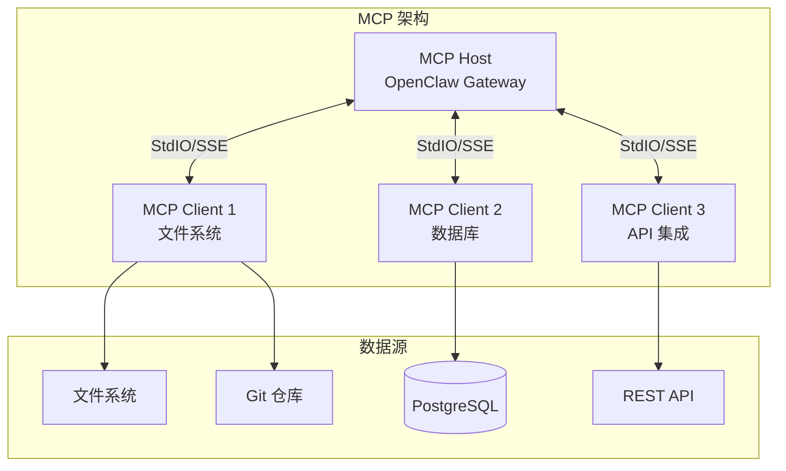
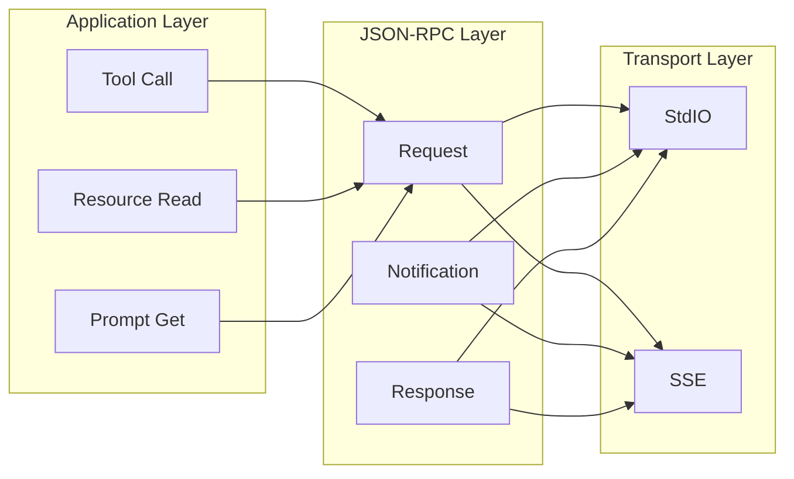
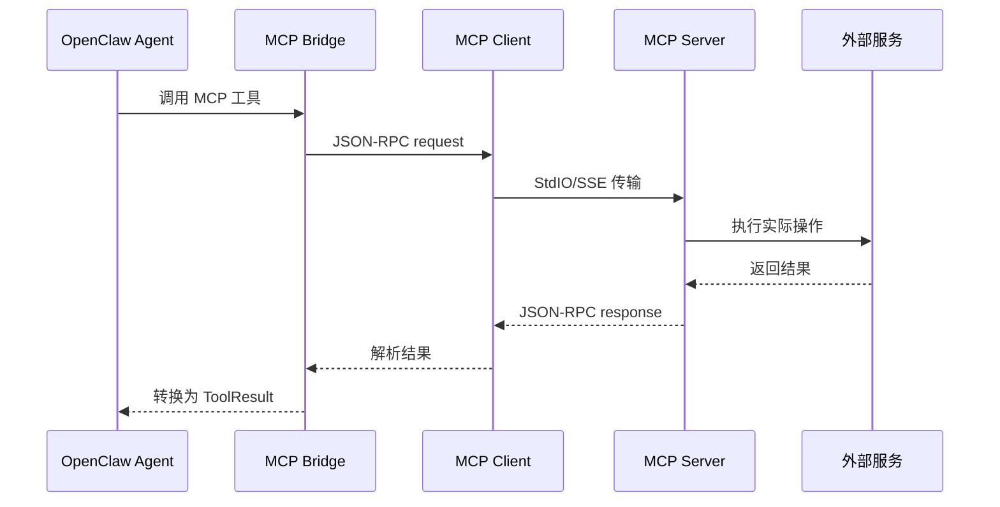
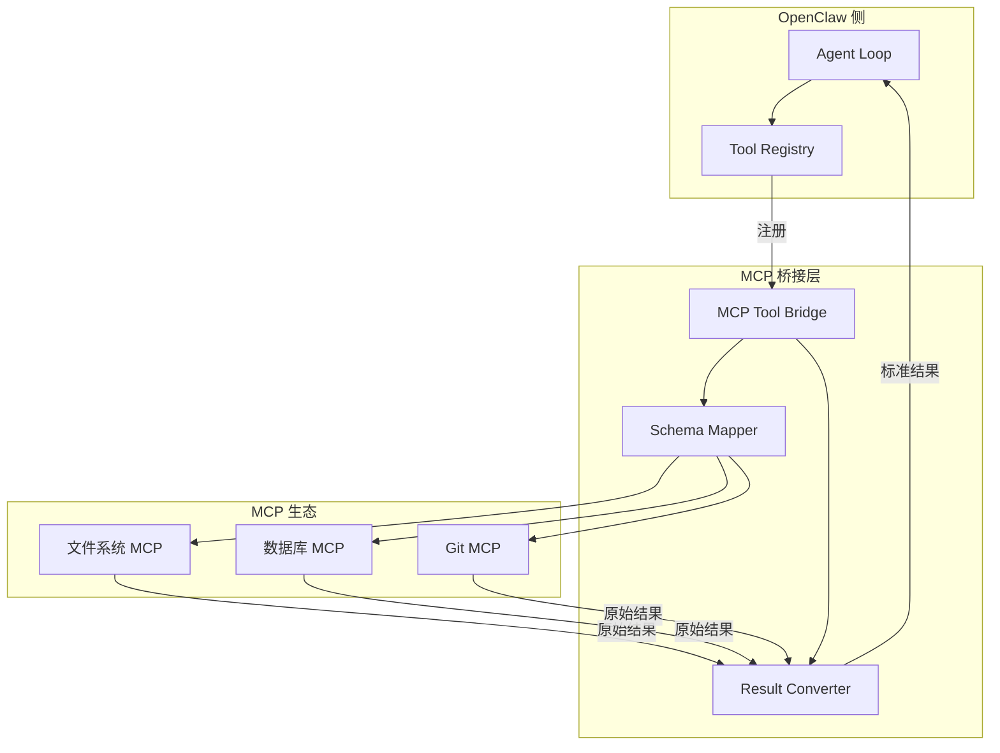

# MCP 协议集成指南

> OpenClaw 与 Model Context Protocol 的深度集成

---

## MCP 概述

Model Context Protocol (MCP) 是 Anthropic 提出的开放标准，旨在标准化 LLM 应用与外部数据源的集成方式。



### MCP 核心概念

| 概念 | 描述 | OpenClaw 对应 |
|------|------|---------------|
| **Host** | 发起 MCP 连接的应用程序 | Gateway / Agent Loop |
| **Client** | 与 Server 通信的客户端 | Channel / Tool Bridge |
| **Server** | 提供上下文能力的进程 | 外部 MCP Server |
| **Tool** | Server 暴露的功能 | OpenClaw Tool |
| **Resource** | Server 管理的可读数据 | 文件/数据库记录 |
| **Prompt** | 预定义的模板 | Agent 模板 |

### MCP 协议栈



### 工具调用流程



### 工具桥接架构



---

## MCP 传输层

### StdIO 传输

```typescript
// StdIO 传输实现

import { spawn, ChildProcess } from 'child_process';
import { JSONRPCClient, JSONRPCServer } from 'json-rpc-2.0';

class StdIOTransport {
  private process: ChildProcess;
  private client: JSONRPCClient;
  private server: JSONRPCServer;
  
  constructor(command: string, args: string[] = []) {
    // 启动 MCP Server 进程
    this.process = spawn(command, args, {
      stdio: ['pipe', 'pipe', 'pipe']
    });
    
    this.setupRPC();
  }
  
  private setupRPC(): void {
    // 解析来自 Server 的消息
    let buffer = '';
    this.process.stdout!.on('data', (data) => {
      buffer += data.toString();
      
      // MCP 使用换行符分隔 JSON-RPC 消息
      const lines = buffer.split('\n');
      buffer = lines.pop() || '';  // 保留不完整的行
      
      for (const line of lines) {
        if (line.trim()) {
          this.handleMessage(JSON.parse(line));
        }
      }
    });
    
    // 初始化 MCP 会话
    this.client = new JSONRPCClient((request) => {
      this.process.stdin!.write(JSON.stringify(request) + '\n');
    });
  }
  
  async initialize(): Promise<InitializeResult> {
    return this.client.request('initialize', {
      protocolVersion: '2024-11-05',
      capabilities: {
        tools: { listChanged: true },
        resources: { listChanged: true, subscribe: true }
      },
      clientInfo: {
        name: 'openclaw-mcp-client',
        version: '1.0.0'
      }
    });
  }
  
  close(): void {
    this.process.kill();
  }
}
```

### SSE 传输

```typescript
// Server-Sent Events 传输（HTTP 模式）

import { EventSource } from 'eventsource';
import fetch from 'node-fetch';

class SSETransport {
  private endpoint: string;
  private messageEndpoint: string;
  private eventSource: EventSource;
  private sessionId: string;
  
  constructor(url: string) {
    this.endpoint = url;
  }
  
  async connect(): Promise<void> {
    // 1. 创建 SSE 会话
    const res = await fetch(`${this.endpoint}/sse`);
    
    // 2. 从 SSE 流中获取 endpoint 事件
    this.eventSource = new EventSource(`${this.endpoint}/sse`);
    
    return new Promise((resolve, reject) => {
      this.eventSource.addEventListener('endpoint', (e) => {
        const data = JSON.parse(e.data);
        this.messageEndpoint = data.uri;
        this.sessionId = data.sessionId;
        resolve();
      });
      
      this.eventSource.addEventListener('message', (e) => {
        this.handleMessage(JSON.parse(e.data));
      });
      
      this.eventSource.onerror = reject;
    });
  }
  
  async send(message: JSONRPCMessage): Promise<void> {
    await fetch(this.messageEndpoint, {
      method: 'POST',
      headers: { 'Content-Type': 'application/json' },
      body: JSON.stringify(message)
    });
  }
}
```

---

## MCP Server 集成

### 文件系统 MCP Server

```typescript
// 集成文件系统 MCP Server

import { Client } from '@anthropic-ai/mcp-sdk';

class FileSystemMCPIntegration {
  private client: Client;
  
  async connect(): Promise<void> {
    // 使用官方文件系统 MCP Server
    this.client = new Client({
      transport: new StdIOTransport('npx', [
        '-y', '@anthropic-ai/mcp-filesystem-server',
        '/allowed/path/1',
        '/allowed/path/2'
      ])
    });
    
    await this.client.connect();
  }
  
  async listTools(): Promise<Tool[]> {
    const result = await this.client.request('tools/list', {});
    return result.tools;
  }
  
  async readFile(path: string): Promise<string> {
    const result = await this.client.request('tools/call', {
      name: 'read_file',
      arguments: { path }
    });
    return result.content[0].text;
  }
  
  async listDirectory(path: string): Promise<string[]> {
    const result = await this.client.request('tools/call', {
      name: 'list_directory',
      arguments: { path }
    });
    return result.content[0].text.split('\n');
  }
  
  async searchFiles(query: string): Promise<any[]> {
    const result = await this.client.request('tools/call', {
      name: 'search_files',
      arguments: { path: '/', pattern: query }
    });
    return result.content;
  }
}
```

### PostgreSQL MCP Server

```typescript
// 集成 PostgreSQL MCP Server

class PostgresMCPIntegration {
  private client: Client;
  private connectionString: string;
  
  constructor(connectionString: string) {
    this.connectionString = connectionString;
  }
  
  async connect(): Promise<void> {
    this.client = new Client({
      transport: new StdIOTransport('npx', [
        '-y', '@anthropic-ai/mcp-postgres-server',
        this.connectionString
      ])
    });
    
    await this.client.connect();
  }
  
  async query(sql: string): Promise<any[]> {
    const result = await this.client.request('tools/call', {
      name: 'query',
      arguments: { sql }
    });
    return JSON.parse(result.content[0].text);
  }
  
  async getSchema(): Promise<string> {
    const result = await this.client.request('resources/read', {
      uri: 'postgres://schema'
    });
    return result.contents[0].text;
  }
}
```

---

## 工具桥接

### MCP 到 OpenClaw 工具转换

```typescript
// MCP Tool 桥接器

class MCPToolBridge {
  private client: Client;
  private toolRegistry: ToolRegistry;
  
  constructor(client: Client, registry: ToolRegistry) {
    this.client = client;
    this.toolRegistry = registry;
  }
  
  // 将 MCP Tool 注册为 OpenClaw Tool
  async registerMCPTools(): Promise<void> {
    const response = await this.client.request('tools/list', {});
    
    for (const mcpTool of response.tools) {
      const openclawTool = this.convertMCPTool(mcpTool);
      this.toolRegistry.register(openclawTool);
    }
  }
  
  private convertMCPTool(mcpTool: MCPTool): OpenClawTool {
    return {
      name: `mcp_${mcpTool.name}`,
      description: mcpTool.description,
      parameters: this.convertSchema(mcpTool.inputSchema),
      
      execute: async (params: any, context: ToolContext) => {
        // 调用 MCP Server
        const result = await this.client.request('tools/call', {
          name: mcpTool.name,
          arguments: params
        });
        
        // 转换 MCP 结果为 OpenClaw 格式
        return this.convertResult(result);
      }
    };
  }
  
  private convertSchema(mcpSchema: JSONSchema): ParameterSchema {
    // MCP 使用 JSON Schema，直接复用
    return {
      type: 'object',
      properties: mcpSchema.properties || {},
      required: mcpSchema.required || []
    };
  }
  
  private convertResult(mcpResult: any): ToolResult {
    // MCP 结果格式:
    // { content: [{ type: 'text', text: '...' }] }
    const texts: string[] = [];
    const images: string[] = [];
    
    for (const item of mcpResult.content) {
      switch (item.type) {
        case 'text':
          texts.push(item.text);
          break;
        case 'image':
          images.push(item.data);  // base64
          break;
        case 'resource':
          // 资源引用，需要额外处理
          texts.push(`[Resource: ${item.resource.uri}]`);
          break;
      }
    }
    
    return {
      output: texts.join('\n'),
      images: images.length > 0 ? images : undefined
    };
  }
}
```

### 动态工具发现

```typescript
// 动态 MCP Server 管理

class MCPManager extends EventEmitter {
  private servers: Map<string, MCPConnection> = new Map();
  private toolBridge: MCPToolBridge;
  
  async addServer(config: MCPServerConfig): Promise<void> {
    let transport: MCPTransport;
    
    switch (config.type) {
      case 'stdio':
        transport = new StdIOTransport(config.command, config.args);
        break;
      case 'sse':
        transport = new SSETransport(config.url);
        break;
      default:
        throw new Error(`Unknown transport type: ${config.type}`);
    }
    
    const client = new Client({ transport });
    await client.connect();
    
    // 初始化
    const initResult = await client.request('initialize', {
      protocolVersion: '2024-11-05',
      capabilities: {},
      clientInfo: { name: 'openclaw', version: '1.0.0' }
    });
    
    // 发送 initialized 通知
    await client.notify('initialized', {});
    
    // 注册工具
    await this.toolBridge.registerMCPTools(client);
    
    // 监听工具变更
    client.onNotification('tools/list_changed', async () => {
      await this.toolBridge.registerMCPTools(client);
      this.emit('toolsChanged', { serverId: config.id });
    });
    
    this.servers.set(config.id, { client, config });
  }
  
  async removeServer(id: string): Promise<void> {
    const server = this.servers.get(id);
    if (server) {
      await server.client.close();
      this.servers.delete(id);
    }
  }
  
  getAllTools(): OpenClawTool[] {
    return this.toolBridge.getAllTools();
  }
}
```

---

## 资源管理

### MCP 资源订阅

```typescript
// MCP 资源管理

class MCPResourceManager {
  private client: Client;
  private subscriptions: Map<string, ResourceCallback> = new Map();
  
  async readResource(uri: string): Promise<ResourceContent> {
    const result = await this.client.request('resources/read', { uri });
    return result.contents[0];
  }
  
  async listResources(): Promise<Resource[]> {
    const result = await this.client.request('resources/list', {});
    return result.resources;
  }
  
  async subscribe(uri: string, callback: ResourceCallback): Promise<void> {
    await this.client.request('resources/subscribe', { uri });
    this.subscriptions.set(uri, callback);
    
    // 监听资源更新通知
    this.client.onNotification('resources/updated', (params) => {
      if (params.uri === uri) {
        callback(params);
      }
    });
  }
  
  async unsubscribe(uri: string): Promise<void> {
    await this.client.request('resources/unsubscribe', { uri });
    this.subscriptions.delete(uri);
  }
}
```

---

## Prompt 模板

### MCP Prompt 集成

```typescript
// MCP Prompt 管理

class MCPPromptManager {
  private client: Client;
  
  async listPrompts(): Promise<Prompt[]> {
    const result = await this.client.request('prompts/list', {});
    return result.prompts;
  }
  
  async getPrompt(name: string, args?: Record<string, string>): Promise<string> {
    const result = await this.client.request('prompts/get', {
      name,
      arguments: args
    });
    
    // 组合多个消息为单个提示词
    return result.messages
      .map(m => {
        if (m.content.type === 'text') {
          return m.content.text;
        }
        return '';
      })
      .join('\n');
  }
  
  // 将 MCP Prompt 注册为 OpenClaw 模板
  async registerPromptsAsTemplates(): Promise<void> {
    const prompts = await this.listPrompts();
    
    for (const prompt of prompts) {
      const template: AgentTemplate = {
        id: `mcp_${prompt.name}`,
        name: prompt.description || prompt.name,
        description: prompt.description,
        
        // 动态获取提示词
        buildSystemPrompt: async (context: Context) => {
          // 提取参数
          const args: Record<string, string> = {};
          for (const arg of prompt.arguments || []) {
            args[arg.name] = context.variables[arg.name] || '';
          }
          
          return this.getPrompt(prompt.name, args);
        }
      };
      
      this.templateRegistry.register(template);
    }
  }
}
```

---

## 完整集成示例

```typescript
// OpenClaw + MCP 完整集成

class OpenClawMCPIntegration {
  private mcpManager: MCPManager;
  private agent: AgentLoop;
  
  async initialize(): Promise<void> {
    // 1. 初始化 MCP 管理器
    this.mcpManager = new MCPManager();
    
    // 2. 添加文件系统 MCP Server
    await this.mcpManager.addServer({
      id: 'filesystem',
      type: 'stdio',
      command: 'npx',
      args: ['-y', '@anthropic-ai/mcp-filesystem-server', process.cwd()]
    });
    
    // 3. 添加数据库 MCP Server
    await this.mcpManager.addServer({
      id: 'postgres',
      type: 'stdio',
      command: 'npx',
      args: ['-y', '@anthropic-ai/mcp-postgres-server', process.env.DATABASE_URL]
    });
    
    // 4. 初始化 Agent（包含 MCP 工具）
    this.agent = new AgentLoop({
      tools: [
        ...this.mcpManager.getAllTools(),
        // 其他原生工具...
      ]
    });
  }
  
  async processRequest(userInput: string): Promise<string> {
    // Agent 现在可以使用所有 MCP 工具
    return this.agent.run(userInput);
  }
}

// 使用示例
const integration = new OpenClawMCPIntegration();
await integration.initialize();

// 用户查询可以同时访问文件系统和数据库
const result = await integration.processRequest(
  '分析项目中的主要代码文件，并查询数据库中最近的提交记录'
);
```

---

## 故障排除

### 常见问题

```markdown
## MCP 集成故障排除

### 1. 连接失败
**症状**: MCP Server 无法启动或连接超时
**排查**:
- 检查命令路径是否正确
- 验证 Node.js 版本 >= 18
- 查看进程 stderr 输出

### 2. 工具调用失败
**症状**: 工具调用返回错误
**排查**:
- 检查参数是否符合 JSON Schema
- 验证 MCP Server 是否支持该工具
- 查看 MCP 日志

### 3. 资源访问失败
**症状**: 无法读取或订阅资源
**排查**:
- 确认资源 URI 格式正确
- 检查资源访问权限
- 验证资源是否支持订阅

### 调试模式
```bash
# 启用 MCP 调试日志
DEBUG=mcp* npx @anthropic-ai/mcp-filesystem-server /path

# 手动测试 MCP Server
echo '{"jsonrpc":"2.0","id":1,"method":"initialize","params":{"protocolVersion":"2024-11-05","capabilities":{},"clientInfo":{"name":"test","version":"1.0"}}}' | npx @anthropic-ai/mcp-filesystem-server /path
```
