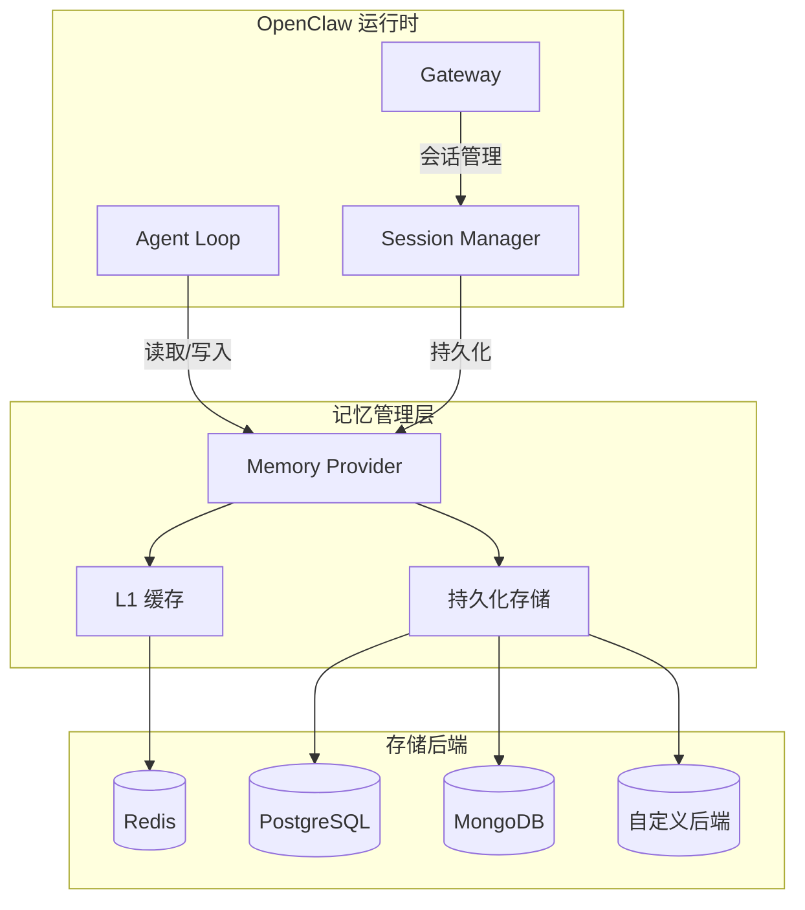
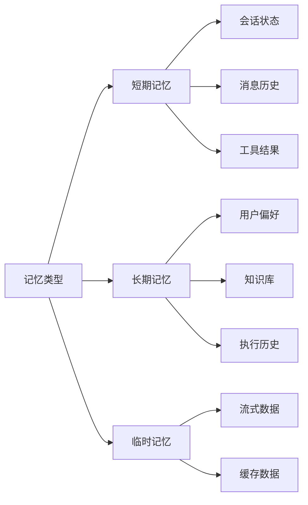

# Memory Provider 开发指南

> 自定义记忆后端开发完整规范

---

## 记忆系统架构



---

## 记忆系统概述

### 什么是 Memory Provider

Memory Provider 是 OpenClaw 的记忆抽象层，负责：

| 职责 | 说明 |
|------|------|
| **会话存储** | 保存和检索会话状态 |
| **消息历史** | 存储和查询对话历史 |
| **上下文管理** | 管理 Agent 上下文窗口 |
| **数据压缩** | 自动压缩和归档旧数据 |

### 记忆类型



---

## Provider 接口规范

### 核心接口

```typescript
// Memory Provider 接口定义

interface MemoryProvider {
  // Provider 元数据
  readonly id: string;
  readonly name: string;
  readonly version: string;
  readonly capabilities: MemoryCapabilities;
  
  // 生命周期
  initialize(config: ProviderConfig): Promise<ProviderInstance>;
  shutdown(instance: ProviderInstance): Promise<void>;
  healthCheck(instance: ProviderInstance): Promise<HealthStatus>;
  
  // 会话操作
  createSession(instance: ProviderInstance, data: SessionData): Promise<Session>;
  getSession(instance: ProviderInstance, id: string): Promise<Session | null>;
  updateSession(instance: ProviderInstance, id: string, data: Partial<SessionData>): Promise<void>;
  deleteSession(instance: ProviderInstance, id: string): Promise<void>;
  listSessions(instance: ProviderInstance, options: ListOptions): Promise<Session[]>;
  
  // 消息操作
  appendMessage(instance: ProviderInstance, sessionId: string, message: Message): Promise<void>;
  getMessages(instance: ProviderInstance, sessionId: string, options: QueryOptions): Promise<Message[]>;
  deleteMessages(instance: ProviderInstance, sessionId: string, before: Date): Promise<number>;
  
  // 上下文管理
  getContext(instance: ProviderInstance, sessionId: string, maxTokens: number): Promise<Context>;
  compactContext(instance: ProviderInstance, sessionId: string): Promise<void>;
  
  // 批量操作
  batchWrite(instance: ProviderInstance, operations: WriteOperation[]): Promise<void>;
}

// 能力声明
interface MemoryCapabilities {
  persistence: boolean;             // 是否支持持久化
  transactions: boolean;            // 是否支持事务
  ttl: boolean;                     // 是否支持过期时间
  search: boolean;                  // 是否支持全文搜索
  aggregation: boolean;             // 是否支持聚合查询
  streaming: boolean;               // 是否支持流式读取
  maxMessageSize: number;           // 单条消息最大大小
  maxSessionSize: number;           // 单个会话最大大小
}

// Provider 配置
interface ProviderConfig {
  // 连接配置
  connection: {
    url?: string;
    host?: string;
    port?: number;
    database?: string;
    username?: string;
    password?: string;
    ssl?: boolean | object;
  };
  
  // 连接池
  pool?: {
    min: number;
    max: number;
    idleTimeoutMs?: number;
    connectionTimeoutMs?: number;
  };
  
  // 性能配置
  performance?: {
    cacheEnabled?: boolean;
    cacheTtl?: number;
    compressionEnabled?: boolean;
    batchSize?: number;
  };
  
  // 过期策略
  ttl?: {
    sessionDefault: number;         // 会话默认过期时间（秒）
    messageDefault: number;         // 消息默认过期时间（秒）
    compactAfter: number;           // 多久后压缩（消息数）
  };
}

// 会话数据结构
interface SessionData {
  id: string;                       // 会话 ID
  userId: string;                   // 用户 ID
  agentId: string;                  // Agent ID
  channelId?: string;               // 渠道 ID
  
  metadata?: {
    title?: string;                 // 会话标题
    tags?: string[];                // 标签
    customData?: Record<string, any>;
  };
  
  config?: {
    maxMessages?: number;           // 最大消息数
    maxTokens?: number;             // 最大 Token 数
    contextWindow?: number;         // 上下文窗口大小
  };
  
  createdAt: Date;
  updatedAt: Date;
  expiresAt?: Date;
}

interface Session extends SessionData {
  messageCount: number;
  totalTokens: number;
  lastMessageAt?: Date;
}

// 消息结构
interface Message {
  id: string;
  sessionId: string;
  
  role: 'system' | 'user' | 'assistant' | 'tool';
  content: string;
  
  // 工具相关
  toolCalls?: ToolCall[];
  toolCallId?: string;
  
  // 元数据
  metadata?: {
    model?: string;
    tokens?: number;
    latency?: number;
    source?: string;
  };
  
  timestamp: Date;
  ttl?: number;
}

// 查询选项
interface QueryOptions {
  limit?: number;
  offset?: number;
  before?: Date;
  after?: Date;
  order?: 'asc' | 'desc';
  
  // 过滤
  filter?: {
    roles?: string[];
    hasToolCalls?: boolean;
    minTokens?: number;
  };
}

interface ListOptions {
  userId?: string;
  agentId?: string;
  channelId?: string;
  status?: 'active' | 'archived';
  
  limit?: number;
  offset?: number;
  orderBy?: 'createdAt' | 'updatedAt' | 'lastMessageAt';
  order?: 'asc' | 'desc';
}
```

---

## Redis Provider 实现

### 完整实现示例

```typescript
// src/providers/redis.ts

import { defineMemoryProvider } from '@openclaw/sdk';
import Redis, { Redis as RedisClient } from 'ioredis';
import { compress, decompress } from '../utils/compression';

interface RedisProviderInstance {
  client: RedisClient;
  config: ProviderConfig;
}

export default defineMemoryProvider({
  id: 'redis',
  name: 'Redis Memory Provider',
  version: '1.0.0',
  
  capabilities: {
    persistence: true,
    transactions: true,
    ttl: true,
    search: false,
    aggregation: false,
    streaming: false,
    maxMessageSize: 512 * 1024,     // 512KB
    maxSessionSize: 10 * 1024 * 1024 // 10MB
  },
  
  // 初始化
  async initialize(config: ProviderConfig): Promise<RedisProviderInstance> {
    const client = new Redis({
      host: config.connection.host || 'localhost',
      port: config.connection.port || 6379,
      password: config.connection.password,
      db: config.connection.database ? parseInt(config.connection.database) : 0,
      
      // 连接池
      lazyConnect: true,
      maxRetriesPerRequest: 3,
      
      // 重连策略
      retryStrategy: (times) => {
        if (times > 10) return null;
        return Math.min(times * 100, 3000);
      }
    });
    
    await client.connect();
    
    // 验证连接
    await client.ping();
    
    return { client, config };
  },
  
  // 关闭
  async shutdown(instance: RedisProviderInstance): Promise<void> {
    await instance.client.quit();
  },
  
  // 健康检查
  async healthCheck(instance: RedisProviderInstance): Promise<HealthStatus> {
    try {
      const start = Date.now();
      await instance.client.ping();
      const latency = Date.now() - start;
      
      const info = await instance.client.info('memory');
      const usedMemory = parseInt(info.match(/used_memory:(\d+)/)?.[1] || '0');
      
      return {
        status: latency < 100 ? 'healthy' : 'degraded',
        latency,
        metrics: { usedMemory }
      };
    } catch (error) {
      return {
        status: 'unhealthy',
        error: error.message
      };
    }
  },
  
  // 会话操作
  async createSession(
    instance: RedisProviderInstance,
    data: SessionData
  ): Promise<Session> {
    const session: Session = {
      ...data,
      messageCount: 0,
      totalTokens: 0
    };
    
    const key = this.sessionKey(data.id);
    const ttl = instance.config.ttl?.sessionDefault || 7 * 24 * 3600;
    
    // 存储会话元数据
    await instance.client.setex(
      key,
      ttl,
      JSON.stringify(session)
    );
    
    // 添加到用户索引
    await instance.client.sadd(
      this.userSessionsKey(data.userId),
      data.id
    );
    
    // 创建消息列表
    await instance.client.expire(this.messagesKey(data.id), ttl);
    
    return session;
  },
  
  async getSession(
    instance: RedisProviderInstance,
    id: string
  ): Promise<Session | null> {
    const key = this.sessionKey(id);
    const data = await instance.client.get(key);
    
    if (!data) return null;
    
    return JSON.parse(data);
  },
  
  async updateSession(
    instance: RedisProviderInstance,
    id: string,
    data: Partial<SessionData>
  ): Promise<void> {
    const key = this.sessionKey(id);
    const existing = await this.getSession(instance, id);
    
    if (!existing) {
      throw new Error(`Session not found: ${id}`);
    }
    
    const updated = {
      ...existing,
      ...data,
      updatedAt: new Date()
    };
    
    const ttl = await instance.client.ttl(key);
    await instance.client.setex(key, ttl > 0 ? ttl : 3600, JSON.stringify(updated));
  },
  
  async deleteSession(
    instance: RedisProviderInstance,
    id: string
  ): Promise<void> {
    const session = await this.getSession(instance, id);
    
    if (session) {
      // 删除会话元数据
      await instance.client.del(this.sessionKey(id));
      
      // 删除所有消息
      await instance.client.del(this.messagesKey(id));
      
      // 从用户索引中移除
      await instance.client.srem(
        this.userSessionsKey(session.userId),
        id
      );
    }
  },
  
  async listSessions(
    instance: RedisProviderInstance,
    options: ListOptions
  ): Promise<Session[]> {
    let sessionIds: string[] = [];
    
    if (options.userId) {
      sessionIds = await instance.client.smembers(
        this.userSessionsKey(options.userId)
      );
    } else {
      // 扫描所有会话
      const pattern = this.sessionKey('*');
      let cursor = '0';
      
      do {
        const result = await instance.client.scan(
          cursor,
          'MATCH',
          pattern,
          'COUNT',
          100
        );
        cursor = result[0];
        
        for (const key of result[1]) {
          const id = key.replace('session:', '');
          sessionIds.push(id);
        }
      } while (cursor !== '0');
    }
    
    // 获取会话详情
    const sessions: Session[] = [];
    for (const id of sessionIds.slice(options.offset || 0, options.limit || 100)) {
      const session = await this.getSession(instance, id);
      if (session) sessions.push(session);
    }
    
    // 排序
    const orderBy = options.orderBy || 'updatedAt';
    const order = options.order || 'desc';
    
    sessions.sort((a, b) => {
      const aVal = new Date(a[orderBy] || 0).getTime();
      const bVal = new Date(b[orderBy] || 0).getTime();
      return order === 'desc' ? bVal - aVal : aVal - bVal;
    });
    
    return sessions;
  },
  
  // 消息操作
  async appendMessage(
    instance: RedisProviderInstance,
    sessionId: string,
    message: Message
  ): Promise<void> {
    const messagesKey = this.messagesKey(sessionId);
    const sessionKey = this.sessionKey(sessionId);
    
    // 压缩消息内容
    const compressionEnabled = instance.config.performance?.compressionEnabled;
    let content = message.content;
    
    if (compressionEnabled && content.length > 1024) {
      content = await compress(content);
      message.metadata = { ...message.metadata, compressed: true };
    }
    
    const messageData = JSON.stringify({
      ...message,
      content
    });
    
    // 使用 Pipeline 批量操作
    const pipeline = instance.client.pipeline();
    
    // 添加消息到列表
    pipeline.rpush(messagesKey, messageData);
    
    // 更新会话统计
    pipeline.hincrby(sessionKey, 'messageCount', 1);
    if (message.metadata?.tokens) {
      pipeline.hincrby(sessionKey, 'totalTokens', message.metadata.tokens);
    }
    
    // 更新最后消息时间
    pipeline.hset(sessionKey, 'lastMessageAt', new Date().toISOString());
    
    await pipeline.exec();
    
    // 检查是否需要压缩
    const messageCount = await instance.client.llen(messagesKey);
    const compactThreshold = instance.config.ttl?.compactAfter || 1000;
    
    if (messageCount > compactThreshold) {
      await this.compactContext(instance, sessionId);
    }
  },
  
  async getMessages(
    instance: RedisProviderInstance,
    sessionId: string,
    options: QueryOptions
  ): Promise<Message[]> {
    const messagesKey = this.messagesKey(sessionId);
    const limit = options.limit || 100;
    
    let start: number;
    let end: number;
    
    if (options.order === 'asc') {
      start = options.offset || 0;
      end = start + limit - 1;
    } else {
      end = -1;
      start = -(limit + (options.offset || 0));
    }
    
    const rawMessages = await instance.client.lrange(
      messagesKey,
      start,
      end
    );
    
    const messages: Message[] = [];
    
    for (const raw of rawMessages) {
      const message: Message = JSON.parse(raw);
      
      // 解压
      if (message.metadata?.compressed) {
        message.content = await decompress(message.content);
      }
      
      messages.push(message);
    }
    
    // 过滤
    if (options.filter) {
      return messages.filter(m => {
        if (options.filter?.roles && !options.filter.roles.includes(m.role)) {
          return false;
        }
        if (options.filter?.hasToolCalls && !m.toolCalls) {
          return false;
        }
        return true;
      });
    }
    
    return options.order === 'asc' ? messages : messages.reverse();
  },
  
  async deleteMessages(
    instance: RedisProviderInstance,
    sessionId: string,
    before: Date
  ): Promise<number> {
    const messagesKey = this.messagesKey(sessionId);
    const messages = await this.getMessages(instance, sessionId, {
      limit: 10000,
      order: 'asc'
    });
    
    let deleted = 0;
    
    for (const message of messages) {
      if (new Date(message.timestamp) < before) {
        // 使用 LREM 删除特定消息
        await instance.client.lrem(
          messagesKey,
          0,
          JSON.stringify(message)
        );
        deleted++;
      }
    }
    
    return deleted;
  },
  
  // 上下文管理
  async getContext(
    instance: RedisProviderInstance,
    sessionId: string,
    maxTokens: number
  ): Promise<Context> {
    // 获取最近的消息
    const messages = await this.getMessages(instance, sessionId, {
      limit: 100,
      order: 'desc'
    });
    
    // 按 Token 限制筛选
    const contextMessages: Message[] = [];
    let totalTokens = 0;
    
    // 系统消息优先
    const systemMessages = messages.filter(m => m.role === 'system');
    for (const msg of systemMessages.reverse()) {
      const tokens = msg.metadata?.tokens || estimateTokens(msg.content);
      if (totalTokens + tokens <= maxTokens) {
        contextMessages.unshift(msg);
        totalTokens += tokens;
      }
    }
    
    // 添加对话消息
    const chatMessages = messages.filter(m => m.role !== 'system');
    for (const msg of chatMessages.reverse()) {
      const tokens = msg.metadata?.tokens || estimateTokens(msg.content);
      if (totalTokens + tokens <= maxTokens) {
        contextMessages.push(msg);
        totalTokens += tokens;
      } else {
        break;
      }
    }
    
    return {
      messages: contextMessages,
      totalTokens,
      truncated: messages.length > contextMessages.length
    };
  },
  
  async compactContext(
    instance: RedisProviderInstance,
    sessionId: string
  ): Promise<void> {
    const messages = await this.getMessages(instance, sessionId, {
      limit: 10000,
      order: 'asc'
    });
    
    if (messages.length < 100) return;
    
    // 保留最近 50 条和最早的系统消息
    const systemMessages = messages.filter(m => m.role === 'system');
    const recentMessages = messages.slice(-50);
    
    // 中间的消息生成摘要
    const middleMessages = messages.slice(
      systemMessages.length,
      messages.length - 50
    );
    
    const summary = await this.generateSummary(middleMessages);
    
    const compactedMessages = [
      ...systemMessages,
      {
        id: `summary-${Date.now()}`,
        sessionId,
        role: 'system',
        content: `[Earlier conversation summary]: ${summary}`,
        timestamp: new Date()
      },
      ...recentMessages
    ];
    
    // 替换消息列表
    const messagesKey = this.messagesKey(sessionId);
    await instance.client.del(messagesKey);
    
    const pipeline = instance.client.pipeline();
    for (const msg of compactedMessages) {
      pipeline.rpush(messagesKey, JSON.stringify(msg));
    }
    await pipeline.exec();
  },
  
  // 批量操作
  async batchWrite(
    instance: RedisProviderInstance,
    operations: WriteOperation[]
  ): Promise<void> {
    const pipeline = instance.client.pipeline();
    
    for (const op of operations) {
      switch (op.type) {
        case 'createSession':
          pipeline.setex(
            this.sessionKey(op.data.id),
            3600,
            JSON.stringify(op.data)
          );
          break;
        case 'appendMessage':
          pipeline.rpush(
            this.messagesKey(op.sessionId),
            JSON.stringify(op.message)
          );
          break;
        case 'updateSession':
          // 需要读取后更新
          break;
      }
    }
    
    await pipeline.exec();
  },
  
  // 辅助方法
  sessionKey(id: string): string {
    return `session:${id}`;
  },
  
  messagesKey(sessionId: string): string {
    return `messages:${sessionId}`;
  },
  
  userSessionsKey(userId: string): string {
    return `user:${userId}:sessions`;
  },
  
  async generateSummary(messages: Message[]): Promise<string> {
    // 简化实现：提取关键信息
    const topics = new Set<string>();
    const actions: string[] = [];
    
    for (const msg of messages) {
      if (msg.role === 'user') {
        // 提取关键词
        const words = msg.content.split(' ').slice(0, 5);
        topics.add(words.join(' '));
      } else if (msg.role === 'assistant' && msg.toolCalls) {
        actions.push(...msg.toolCalls.map(t => t.name));
      }
    }
    
    return [
      `Topics discussed: ${Array.from(topics).slice(0, 3).join(', ')}`,
      `Actions taken: ${actions.slice(0, 5).join(', ')}`
    ].join('; ');
  }
});

// Token 估算
function estimateTokens(text: string): number {
  // 简化估算：平均每个 token 4 个字符
  return Math.ceil(text.length / 4);
}
```

---

## PostgreSQL Provider 实现

### 关系型存储方案

```typescript
// src/providers/postgresql.ts

import { defineMemoryProvider } from '@openclaw/sdk';
import { Pool, PoolClient } from 'pg';

export default defineMemoryProvider({
  id: 'postgresql',
  name: 'PostgreSQL Memory Provider',
  version: '1.0.0',
  
  capabilities: {
    persistence: true,
    transactions: true,
    ttl: true,
    search: true,           // 支持全文搜索
    aggregation: true,      // 支持聚合查询
    streaming: true,
    maxMessageSize: 10 * 1024 * 1024,  // 10MB
    maxSessionSize: 100 * 1024 * 1024  // 100MB
  },
  
  async initialize(config) {
    const pool = new Pool({
      host: config.connection.host,
      port: config.connection.port,
      database: config.connection.database,
      user: config.connection.username,
      password: config.connection.password,
      ssl: config.connection.ssl,
      
      min: config.pool?.min || 2,
      max: config.pool?.max || 10,
      idleTimeoutMillis: config.pool?.idleTimeoutMs || 30000,
      connectionTimeoutMillis: config.pool?.connectionTimeoutMs || 5000
    });
    
    // 初始化表结构
    await this.migrate(pool);
    
    return { pool, config };
  },
  
  async migrate(pool: Pool): Promise<void> {
    const client = await pool.connect();
    
    try {
      await client.query(`
        CREATE TABLE IF NOT EXISTS sessions (
          id UUID PRIMARY KEY,
          user_id VARCHAR(255) NOT NULL,
          agent_id VARCHAR(255) NOT NULL,
          channel_id VARCHAR(255),
          title TEXT,
          tags TEXT[],
          custom_data JSONB,
          config JSONB,
          message_count INTEGER DEFAULT 0,
          total_tokens INTEGER DEFAULT 0,
          created_at TIMESTAMP WITH TIME ZONE DEFAULT NOW(),
          updated_at TIMESTAMP WITH TIME ZONE DEFAULT NOW(),
          last_message_at TIMESTAMP WITH TIME ZONE,
          expires_at TIMESTAMP WITH TIME ZONE,
          archived BOOLEAN DEFAULT FALSE
        );
        
        CREATE INDEX IF NOT EXISTS idx_sessions_user ON sessions(user_id);
        CREATE INDEX IF NOT EXISTS idx_sessions_updated ON sessions(updated_at DESC);
        CREATE INDEX IF NOT EXISTS idx_sessions_expires ON sessions(expires_at);
        
        CREATE TABLE IF NOT EXISTS messages (
          id UUID PRIMARY KEY,
          session_id UUID REFERENCES sessions(id) ON DELETE CASCADE,
          role VARCHAR(20) NOT NULL,
          content TEXT NOT NULL,
          tool_calls JSONB,
          tool_call_id VARCHAR(255),
          metadata JSONB,
          created_at TIMESTAMP WITH TIME ZONE DEFAULT NOW(),
          expires_at TIMESTAMP WITH TIME ZONE
        );
        
        CREATE INDEX IF NOT EXISTS idx_messages_session ON messages(session_id, created_at DESC);
        CREATE INDEX IF NOT EXISTS idx_messages_role ON messages(session_id, role);
        
        -- 全文搜索
        ALTER TABLE messages 
        ADD COLUMN IF NOT EXISTS search_vector tsvector 
        GENERATED ALWAYS AS (to_tsvector('english', content)) STORED;
        
        CREATE INDEX IF NOT EXISTS idx_messages_search ON messages USING GIN(search_vector);
      `);
    } finally {
      client.release();
    }
  },
  
  async createSession(instance, data) {
    const { pool } = instance;
    
    const result = await pool.query(
      `INSERT INTO sessions 
       (id, user_id, agent_id, channel_id, title, tags, custom_data, config, expires_at)
       VALUES ($1, $2, $3, $4, $5, $6, $7, $8, $9)
       RETURNING *`,
      [
        data.id,
        data.userId,
        data.agentId,
        data.channelId,
        data.metadata?.title,
        data.metadata?.tags,
        JSON.stringify(data.metadata?.customData),
        JSON.stringify(data.config),
        data.expiresAt
      ]
    );
    
    return this.rowToSession(result.rows[0]);
  },
  
  async getMessages(instance, sessionId, options) {
    const { pool } = instance;
    
    const limit = options.limit || 100;
    const offset = options.offset || 0;
    
    let query = `
      SELECT * FROM messages 
      WHERE session_id = $1
    `;
    const params: any[] = [sessionId];
    
    // 过滤
    if (options.filter?.roles?.length) {
      query += ` AND role = ANY($${params.length + 1})`;
      params.push(options.filter.roles);
    }
    
    if (options.after) {
      query += ` AND created_at > $${params.length + 1}`;
      params.push(options.after);
    }
    
    // 排序
    query += ` ORDER BY created_at ${options.order === 'asc' ? 'ASC' : 'DESC'}`;
    query += ` LIMIT $${params.length + 1} OFFSET $${params.length + 2}`;
    params.push(limit, offset);
    
    const result = await pool.query(query, params);
    
    return result.rows.map(row => this.rowToMessage(row));
  },
  
  // 全文搜索
  async searchMessages(
    instance: any,
    sessionId: string,
    query: string,
    options: QueryOptions
  ): Promise<Message[]> {
    const { pool } = instance;
    
    const result = await pool.query(
      `SELECT * FROM messages 
       WHERE session_id = $1 
       AND search_vector @@ plainto_tsquery('english', $2)
       ORDER BY created_at DESC
       LIMIT $3 OFFSET $4`,
      [sessionId, query, options.limit || 10, options.offset || 0]
    );
    
    return result.rows.map(row => this.rowToMessage(row));
  },
  
  // 辅助方法
  rowToSession(row: any): Session {
    return {
      id: row.id,
      userId: row.user_id,
      agentId: row.agent_id,
      channelId: row.channel_id,
      metadata: {
        title: row.title,
        tags: row.tags,
        customData: row.custom_data
      },
      config: row.config,
      messageCount: row.message_count,
      totalTokens: row.total_tokens,
      createdAt: row.created_at,
      updatedAt: row.updated_at,
      lastMessageAt: row.last_message_at,
      expiresAt: row.expires_at
    };
  },
  
  rowToMessage(row: any): Message {
    return {
      id: row.id,
      sessionId: row.session_id,
      role: row.role,
      content: row.content,
      toolCalls: row.tool_calls,
      toolCallId: row.tool_call_id,
      metadata: row.metadata,
      timestamp: row.created_at
    };
  }
});
```

---

## 性能优化

### 缓存层

```typescript
// 多级缓存实现

import NodeCache from 'node-cache';

class TieredCache {
  private l1: NodeCache;  // 内存缓存
  private l2: Redis;      // 分布式缓存
  
  constructor() {
    this.l1 = new NodeCache({ stdTTL: 60 });
  }
  
  async get<T>(key: string): Promise<T | null> {
    // L1 缓存
    const l1Value = this.l1.get<T>(key);
    if (l1Value) return l1Value;
    
    // L2 缓存
    const l2Value = await this.l2.get(key);
    if (l2Value) {
      const parsed = JSON.parse(l2Value);
      this.l1.set(key, parsed);
      return parsed;
    }
    
    return null;
  }
  
  async set<T>(key: string, value: T, ttl?: number): Promise<void> {
    this.l1.set(key, value, ttl);
    await this.l2.setex(key, ttl || 300, JSON.stringify(value));
  }
  
  invalidate(key: string): void {
    this.l1.del(key);
    this.l2.del(key);
  }
}
```

### 批量写入

```typescript
// 批量写入优化

class BatchWriter {
  private buffer: WriteOperation[] = [];
  private maxSize = 100;
  private flushInterval = 100; // ms
  private timer: NodeJS.Timeout | null = null;
  
  add(operation: WriteOperation): void {
    this.buffer.push(operation);
    
    if (this.buffer.length >= this.maxSize) {
      this.flush();
    } else if (!this.timer) {
      this.timer = setTimeout(() => this.flush(), this.flushInterval);
    }
  }
  
  async flush(): Promise<void> {
    if (this.timer) {
      clearTimeout(this.timer);
      this.timer = null;
    }
    
    if (this.buffer.length === 0) return;
    
    const batch = this.buffer.splice(0, this.buffer.length);
    await this.provider.batchWrite(batch);
  }
}
```

---

## 部署配置

```yaml
# memory-config.yml

memory:
  provider: redis  # 或 postgresql
  
  redis:
    connection:
      host: ${REDIS_HOST}
      port: ${REDIS_PORT}
      password: ${REDIS_PASSWORD}
    
    pool:
      min: 5
      max: 20
    
    performance:
      cacheEnabled: true
      compressionEnabled: true
      batchSize: 100
    
    ttl:
      sessionDefault: 604800  # 7天
      messageDefault: 259200  # 3天
      compactAfter: 1000
  
  postgresql:
    connection:
      host: ${PG_HOST}
      port: ${PG_PORT}
      database: openclaw
      username: ${PG_USER}
      password: ${PG_PASSWORD}
      ssl: true
    
    pool:
      min: 2
      max: 10
```
