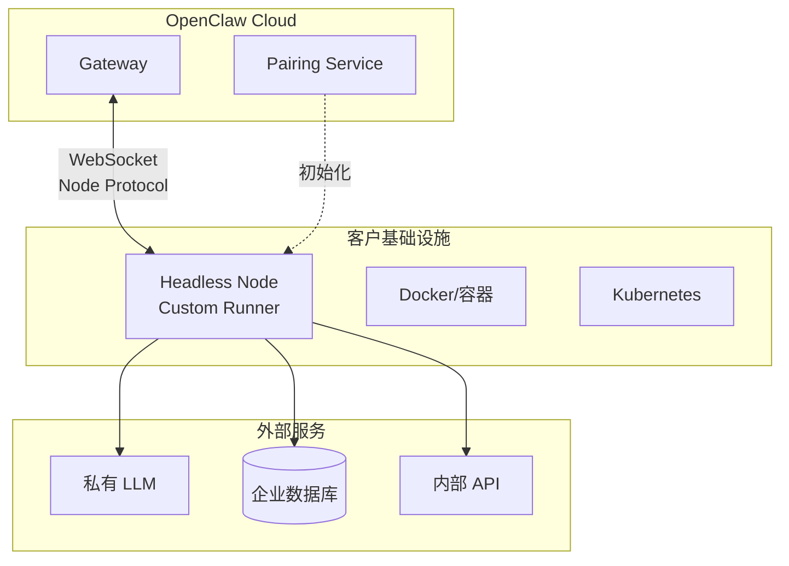
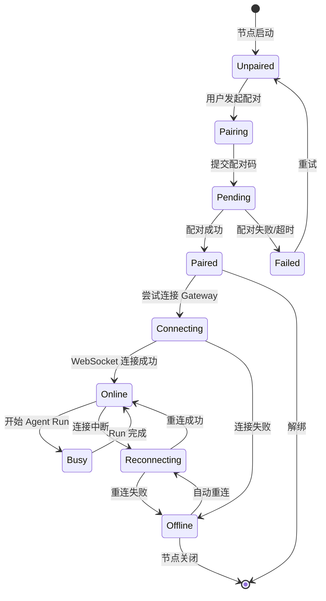
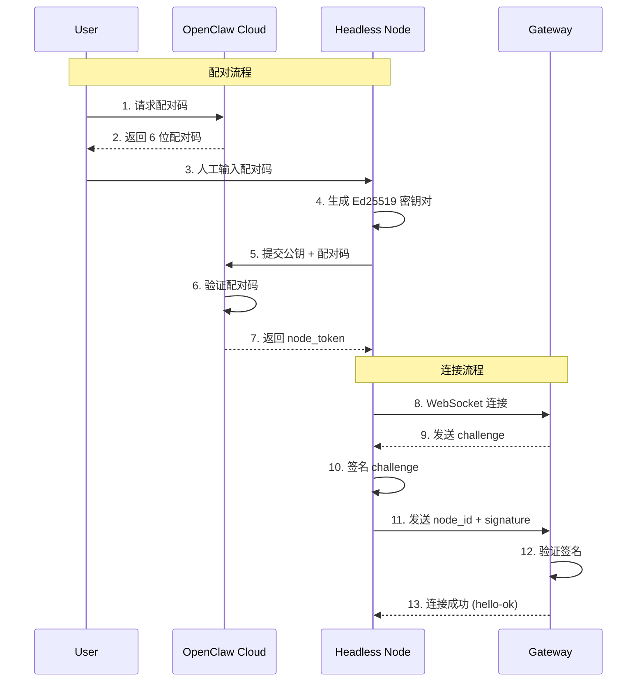

# 无头节点扩展协议

> 实现自定义 Agent 执行节点的完整技术指南

---

## 架构概览

无头节点（Headless Node）允许开发者将 OpenClaw Agent 运行能力扩展到自定义基础设施，实现：
- **私有化部署**：在企业内网运行 Agent
- **自定义硬件**：使用 GPU 集群或专用计算资源
- **合规要求**：满足数据驻留和审计需求



---

## 节点生命周期

### 节点状态机



### 配对时序图



### 1. 节点配对

```typescript
// 节点配对流程

interface NodePairing {
  // Step 1: 获取配对码
  initiate: {
    method: 'POST';
    url: '/api/v1/nodes/pairing';
    headers: {
      'Authorization': 'Bearer USER_TOKEN';
    };
    response: {
      pairingCode: string;      // 6 位数字，如 "123456"
      expiresAt: number;        // 过期时间戳
      pairingUrl: string;       // 配对页面 URL
    };
  };
  
  // Step 2: 节点端确认配对
  confirm: {
    method: 'POST';
    url: '/api/v1/nodes/pairing/confirm';
    body: {
      pairingCode: string;
      nodeInfo: {
        name: string;           // 节点名称
        description?: string;
        capabilities: string[]; // 能力列表
        runtime: {
          type: 'docker' | 'kubernetes' | 'baremetal';
          version: string;
          resources: {
            cpu: number;
            memory: number;
            gpu?: number;
          };
        };
      };
    };
    response: {
      nodeId: string;
      nodeToken: string;        // 长期令牌（保存好！）
      gatewayUrl: string;       // Gateway WebSocket URL
    };
  };
  
  // Step 3: 连接到 Gateway
  connect: {
    protocol: 'WebSocket';
    url: 'wss://gateway.openclaw.ai/ws';
    auth: {
      type: 'node';
      token: string;            // nodeToken
      nodeId: string;
    };
  };
}
```

### 2. 节点注册

```typescript
// 节点注册信息

interface NodeRegistration {
  // 节点元数据
  metadata: {
    id: string;
    name: string;
    version: string;
    createdAt: number;
    lastSeenAt: number;
    status: 'online' | 'offline' | 'error';
  };
  
  // 能力声明
  capabilities: {
    // 支持的模型
    models: Array<{
      provider: string;
      model: string;
      contextWindow: number;
      features: string[];
    }>;
    
    // 支持的工具
    tools: Array<{
      name: string;
      version: string;
      parameters: JSONSchema;
    }>;
    
    // 环境特性
    environment: {
      sandbox: boolean;         // 是否支持沙箱
      network: boolean;         // 是否允许网络访问
      filesystem: boolean;      // 是否允许文件系统访问
      maxExecutionTime: number; // 最大执行时间（秒）
      maxMemory: number;        // 最大内存（MB）
    };
  };
  
  // 资源统计
  resources: {
    cpu: {
      cores: number;
      usage: number;
    };
    memory: {
      total: number;
      used: number;
    };
    storage: {
      total: number;
      used: number;
    };
  };
}
```

---

## WebSocket 节点协议

### 连接建立

```typescript
// 节点连接认证

interface NodeConnection {
  // 握手
  handshake: {
    type: 'req';
    method: 'connect';
    params: {
      mode: 'node';
      client: {
        id: string;           // nodeId
        version: string;      // 节点软件版本
        platform: string;
      };
      auth: {
        nodeToken: string;    // 配对时获取的令牌
      };
      capabilities: {
        protocols: number[];  // 支持的协议版本 [3]
        features: string[];   // 支持的特性
      };
    };
  };
  
  // 连接响应
  response: {
    type: 'res';
    ok: true;
    payload: {
      protocol: 3;
      sessionId: string;
      config: {
        heartbeatInterval: number;  // 心跳间隔（毫秒）
        maxConcurrentRuns: number;  // 最大并发任务
      };
    };
  };
}
```

### 节点方法

```typescript
// 节点支持的方法

interface NodeMethods {
  // 健康检查
  health: {
    request: {
      method: 'health';
    };
    response: {
      status: 'healthy' | 'degraded' | 'unhealthy';
      uptime: number;
      resources: {
        cpu: number;      // CPU 使用率
        memory: number;   // 内存使用率
        storage: number;  // 存储使用率
      };
    };
  };
  
  // 更新能力声明
  updateCapabilities: {
    request: {
      method: 'node.updateCapabilities';
      params: {
        models?: ModelInfo[];
        tools?: ToolInfo[];
        environment?: EnvironmentInfo;
      };
    };
  };
  
  // 更新资源统计
  updateResources: {
    request: {
      method: 'node.updateResources';
      params: {
        resources: ResourceStats;
      };
    };
  };
  
  // 启动 Agent 运行
  runAgent: {
    // Gateway → Node（请求执行任务）
    request: {
      type: 'req';
      method: 'agent.run';
      params: {
        runId: string;
        sessionId: string;
        prompt: string;
        config: {
          model: string;
          temperature: number;
          tools: string[];
          systemPrompt?: string;
        };
        context: {
          messages: Message[];
          files?: FileRef[];
        };
      };
    };
    
    // Node → Gateway（流式响应）
    events: Array<{
      type: 'event';
      event: 'agent.chunk';
      payload: StreamChunk;
    } | {
      type: 'res';
      ok: boolean;
      payload: RunResult;
    }>;
  };
  
  // 取消运行
  cancelRun: {
    request: {
      method: 'agent.cancel';
      params: {
        runId: string;
      };
    };
  };
}
```

---

## 节点 SDK 实现

### 基础节点类

```typescript
// 无头节点 SDK

import { WebSocket } from 'ws';
import { EventEmitter } from 'events';

interface NodeConfig {
  nodeId: string;
  nodeToken: string;
  gatewayUrl: string;
  capabilities: NodeCapabilities;
}

class HeadlessNode extends EventEmitter {
  private ws: WebSocket | null = null;
  private config: NodeConfig;
  private runningAgents: Map<string, AgentRunner> = new Map();
  private heartbeatInterval: NodeJS.Timeout | null = null;
  
  constructor(config: NodeConfig) {
    super();
    this.config = config;
  }
  
  async connect(): Promise<void> {
    return new Promise((resolve, reject) => {
      this.ws = new WebSocket(this.config.gatewayUrl, {
        headers: {
          'X-Node-ID': this.config.nodeId
        }
      });
      
      this.ws.on('open', () => {
        this.send({
          type: 'req',
          id: this.generateId(),
          method: 'connect',
          params: {
            mode: 'node',
            client: {
              id: this.config.nodeId,
              version: '1.0.0',
              platform: process.platform
            },
            auth: {
              nodeToken: this.config.nodeToken
            },
            capabilities: this.config.capabilities
          }
        });
      });
      
      this.ws.on('message', (data) => {
        this.handleMessage(JSON.parse(data.toString()));
      });
      
      this.ws.on('error', reject);
      this.ws.on('close', () => this.reconnect());
      
      this.once('connected', resolve);
    });
  }
  
  private handleMessage(msg: any): void {
    switch (msg.type) {
      case 'res':
        if (msg.payload?.type === 'hello-ok') {
          this.startHeartbeat(msg.payload.config.heartbeatInterval);
          this.emit('connected');
        }
        break;
        
      case 'req':
        this.handleRequest(msg);
        break;
        
      case 'event':
        this.handleEvent(msg);
        break;
    }
  }
  
  private async handleRequest(req: any): Promise<void> {
    switch (req.method) {
      case 'agent.run':
        await this.handleAgentRun(req);
        break;
        
      case 'agent.cancel':
        await this.handleAgentCancel(req);
        break;
        
      case 'health':
        this.send({
          type: 'res',
          id: req.id,
          ok: true,
          payload: await this.getHealthStatus()
        });
        break;
    }
  }
  
  private async handleAgentRun(req: any): Promise<void> {
    const { runId, prompt, config, context } = req.params;
    
    // 创建 Agent 运行器
    const runner = new AgentRunner({
      runId,
      config,
      onChunk: (chunk) => {
        this.send({
          type: 'event',
          event: 'agent.chunk',
          payload: { runId, ...chunk }
        });
      },
      onComplete: (result) => {
        this.send({
          type: 'res',
          id: req.id,
          ok: true,
          payload: result
        });
        this.runningAgents.delete(runId);
      }
    });
    
    this.runningAgents.set(runId, runner);
    
    // 启动运行
    try {
      await runner.start(prompt, context);
    } catch (error) {
      this.send({
        type: 'res',
        id: req.id,
        ok: false,
        error: {
          code: 'AGENT_ERROR',
          message: error.message
        }
      });
    }
  }
  
  private startHeartbeat(interval: number): void {
    this.heartbeatInterval = setInterval(() => {
      this.send({
        type: 'req',
        id: this.generateId(),
        method: 'heartbeat',
        params: {
          resources: this.getResourceStats()
        }
      });
    }, interval);
  }
  
  private send(data: any): void {
    if (this.ws?.readyState === WebSocket.OPEN) {
      this.ws.send(JSON.stringify(data));
    }
  }
  
  private generateId(): string {
    return `req-${Date.now()}-${Math.random().toString(36).substr(2, 9)}`;
  }
  
  async disconnect(): Promise<void> {
    if (this.heartbeatInterval) {
      clearInterval(this.heartbeatInterval);
    }
    
    // 取消所有运行中的任务
    for (const runner of this.runningAgents.values()) {
      await runner.cancel();
    }
    
    this.ws?.close();
  }
}
```

### Agent 运行器

```typescript
// 自定义 Agent 运行器

import { OpenAI } from 'openai';
import { ToolRegistry } from './tools';

interface AgentRunnerConfig {
  runId: string;
  config: {
    model: string;
    temperature: number;
    tools: string[];
    systemPrompt?: string;
  };
  onChunk: (chunk: StreamChunk) => void;
  onComplete: (result: RunResult) => void;
}

class AgentRunner {
  private config: AgentRunnerConfig;
  private openai: OpenAI;
  private toolRegistry: ToolRegistry;
  private cancelled = false;
  private messages: Message[] = [];
  
  constructor(config: AgentRunnerConfig) {
    this.config = config;
    this.openai = new OpenAI({
      baseURL: process.env.OPENAI_BASE_URL,
      apiKey: process.env.OPENAI_API_KEY
    });
    this.toolRegistry = new ToolRegistry();
  }
  
  async start(prompt: string, context: any): Promise<void> {
    // 初始化消息历史
    this.messages = [
      ...(context.messages || []),
      { role: 'user', content: prompt }
    ];
    
    // Agent Loop
    while (!this.cancelled) {
      // 1. 获取可用工具
      const tools = await this.toolRegistry.getTools(
        this.config.config.tools
      );
      
      // 2. 调用 LLM
      const response = await this.openai.chat.completions.create({
        model: this.config.config.model,
        messages: this.messages,
        tools: tools.map(t => t.definition),
        temperature: this.config.config.temperature,
        stream: true
      });
      
      let assistantMessage = '';
      const toolCalls: ToolCall[] = [];
      
      // 3. 处理流式响应
      for await (const chunk of response) {
        if (this.cancelled) break;
        
        const delta = chunk.choices[0]?.delta;
        
        // 文本内容
        if (delta?.content) {
          assistantMessage += delta.content;
          this.config.onChunk({
            type: 'text',
            content: delta.content
          });
        }
        
        // 工具调用
        if (delta?.tool_calls) {
          for (const tc of delta.tool_calls) {
            if (tc.function?.name) {
              toolCalls.push({
                id: tc.id,
                name: tc.function.name,
                arguments: tc.function.arguments
              });
            }
          }
        }
      }
      
      // 4. 保存助手消息
      this.messages.push({
        role: 'assistant',
        content: assistantMessage,
        tool_calls: toolCalls.length > 0 ? toolCalls : undefined
      });
      
      // 5. 执行工具
      if (toolCalls.length > 0) {
        for (const tc of toolCalls) {
          if (this.cancelled) break;
          
          this.config.onChunk({
            type: 'tool_call',
            toolCall: tc
          });
          
          const result = await this.toolRegistry.execute(tc);
          
          this.config.onChunk({
            type: 'tool_result',
            toolResult: {
              toolCallId: tc.id,
              output: result
            }
          });
          
          this.messages.push({
            role: 'tool',
            tool_call_id: tc.id,
            content: result
          });
        }
        
        // 继续循环，让 LLM 处理工具结果
        continue;
      }
      
      // 6. 完成
      break;
    }
    
    if (!this.cancelled) {
      this.config.onComplete({
        status: 'success',
        messages: this.messages
      });
    }
  }
  
  async cancel(): Promise<void> {
    this.cancelled = true;
  }
}
```

---

## 容器化部署

### Docker 镜像

```dockerfile
# Dockerfile for Headless Node

FROM node:20-alpine

# 安装系统依赖
RUN apk add --no-cache \
    python3 \
    py3-pip \
    docker-cli \
    curl

# 创建工作目录
WORKDIR /app

# 复制依赖文件
COPY package*.json ./
RUN npm ci --only=production

# 复制应用代码
COPY dist/ ./dist/
COPY tools/ ./tools/

# 创建非 root 用户
RUN addgroup -g 1001 -S openclaw && \
    adduser -S nodeuser -u 1001

# 设置权限
RUN chown -R nodeuser:openclaw /app
USER nodeuser

# 健康检查
HEALTHCHECK --interval=30s --timeout=3s --start-period=5s --retries=3 \
    CMD node dist/healthcheck.js || exit 1

# 暴露端口
EXPOSE 8080

# 启动命令
CMD ["node", "dist/node.js"]
```

### Kubernetes 部署

```yaml
# k8s-deployment.yaml

apiVersion: apps/v1
kind: Deployment
metadata:
  name: openclaw-node
  namespace: openclaw
spec:
  replicas: 3
  selector:
    matchLabels:
      app: openclaw-node
  template:
    metadata:
      labels:
        app: openclaw-node
    spec:
      containers:
        - name: node
          image: your-registry/openclaw-node:latest
          ports:
            - containerPort: 8080
              name: http
          env:
            - name: NODE_ID
              valueFrom:
                fieldRef:
                  fieldPath: metadata.name
            - name: NODE_TOKEN
              valueFrom:
                secretKeyRef:
                  name: openclaw-node-secrets
                  key: node-token
            - name: GATEWAY_URL
              value: "wss://gateway.openclaw.ai/ws"
            - name: OPENAI_API_KEY
              valueFrom:
                secretKeyRef:
                  name: openclaw-node-secrets
                  key: openai-api-key
          resources:
            requests:
              memory: "2Gi"
              cpu: "1000m"
            limits:
              memory: "8Gi"
              cpu: "4000m"
          livenessProbe:
            httpGet:
              path: /health
              port: 8080
            initialDelaySeconds: 10
            periodSeconds: 30
          readinessProbe:
            httpGet:
              path: /ready
              port: 8080
            initialDelaySeconds: 5
            periodSeconds: 10
      affinity:
        podAntiAffinity:
          preferredDuringSchedulingIgnoredDuringExecution:
            - weight: 100
              podAffinityTerm:
                labelSelector:
                  matchExpressions:
                    - key: app
                      operator: In
                      values:
                        - openclaw-node
                topologyKey: kubernetes.io/hostname

---
apiVersion: v1
kind: Service
metadata:
  name: openclaw-node
  namespace: openclaw
spec:
  selector:
    app: openclaw-node
  ports:
    - port: 8080
      targetPort: 8080
  type: ClusterIP

---
apiVersion: autoscaling/v2
kind: HorizontalPodAutoscaler
metadata:
  name: openclaw-node-hpa
  namespace: openclaw
spec:
  scaleTargetRef:
    apiVersion: apps/v1
    kind: Deployment
    name: openclaw-node
  minReplicas: 2
  maxReplicas: 10
  metrics:
    - type: Resource
      resource:
        name: cpu
        target:
          type: Utilization
          averageUtilization: 70
    - type: Resource
      resource:
        name: memory
        target:
          type: Utilization
          averageUtilization: 80
```

---

## 安全最佳实践

### 网络隔离

```yaml
# NetworkPolicy for OpenClaw Node

apiVersion: networking.k8s.io/v1
kind: NetworkPolicy
metadata:
  name: openclaw-node-policy
  namespace: openclaw
spec:
  podSelector:
    matchLabels:
      app: openclaw-node
  policyTypes:
    - Ingress
    - Egress
  ingress:
    # 只允许来自同一 namespace 的流量
    - from:
        - namespaceSelector:
            matchLabels:
              name: openclaw
      ports:
        - protocol: TCP
          port: 8080
  egress:
    # 允许访问 Gateway
    - to:
        - ipBlock:
            cidr: GATEWAY_IP/32
      ports:
        - protocol: TCP
          port: 443
    # 允许访问 LLM API
    - to:
        - ipBlock:
            cidr: LLM_API_IP/32
      ports:
        - protocol: TCP
          port: 443
    # 允许 DNS
    - to:
        - namespaceSelector: {}
          podSelector:
            matchLabels:
              k8s-app: kube-dns
      ports:
        - protocol: UDP
          port: 53
```

### 密钥管理

```typescript
// 安全地加载密钥

import { VaultClient } from '@hashicorp/vault-client';

class SecureConfig {
  private vault: VaultClient;
  private cache: Map<string, string> = new Map();
  
  async loadSecrets(): Promise<void> {
    // 从 Vault 加载密钥
    const secrets = await this.vault.read('secret/openclaw-node');
    
    this.cache.set('nodeToken', secrets.data.node_token);
    this.cache.set('openaiApiKey', secrets.data.openai_api_key);
    
    // 定期轮换
    setInterval(() => this.rotateSecrets(), 24 * 60 * 60 * 1000);
  }
  
  get(key: string): string {
    const value = this.cache.get(key);
    if (!value) {
      throw new Error(`Secret ${key} not found`);
    }
    return value;
  }
  
  private async rotateSecrets(): Promise<void> {
    // 重新加载密钥（支持动态轮换）
    await this.loadSecrets();
  }
}

// 使用
const config = new SecureConfig();
await config.loadSecrets();

const nodeToken = config.get('nodeToken');
```

---

## 监控与可观测性

```typescript
// 节点指标收集

import { Counter, Histogram, Gauge, register } from 'prom-client';

const metrics = {
  // 请求计数
  requestsTotal: new Counter({
    name: 'openclaw_node_requests_total',
    help: 'Total number of requests processed',
    labelNames: ['method', 'status']
  }),
  
  // 请求延迟
  requestDuration: new Histogram({
    name: 'openclaw_node_request_duration_seconds',
    help: 'Request duration in seconds',
    labelNames: ['method'],
    buckets: [0.1, 0.5, 1, 2, 5, 10, 30]
  }),
  
  // 活跃运行数
  activeRuns: new Gauge({
    name: 'openclaw_node_active_runs',
    help: 'Number of currently running agents'
  }),
  
  // 资源使用
  resourceUsage: new Gauge({
    name: 'openclaw_node_resource_usage',
    help: 'Resource usage percentage',
    labelNames: ['resource']  // cpu, memory, storage
  }),
  
  // LLM 调用
  llmCalls: new Counter({
    name: 'openclaw_node_llm_calls_total',
    help: 'Total LLM API calls',
    labelNames: ['model', 'status']
  }),
  
  // LLM Token 使用
  llmTokens: new Counter({
    name: 'openclaw_node_llm_tokens_total',
    help: 'Total tokens used',
    labelNames: ['model', 'type']  // type: prompt, completion
  })
};

// 暴露指标端点
import express from 'express';
const app = express();

app.get('/metrics', async (req, res) => {
  res.set('Content-Type', register.contentType);
  res.end(await register.metrics());
});

app.listen(9090);
```

```yaml
# Prometheus 监控配置

apiVersion: v1
kind: ServiceMonitor
metadata:
  name: openclaw-node-metrics
  namespace: monitoring
spec:
  selector:
    matchLabels:
      app: openclaw-node
  endpoints:
    - port: metrics
      interval: 15s
      path: /metrics
```
