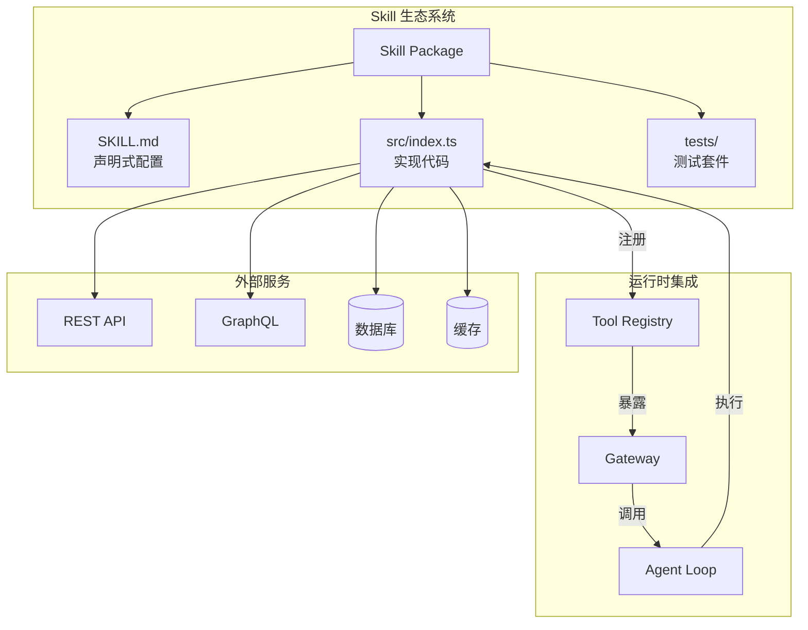
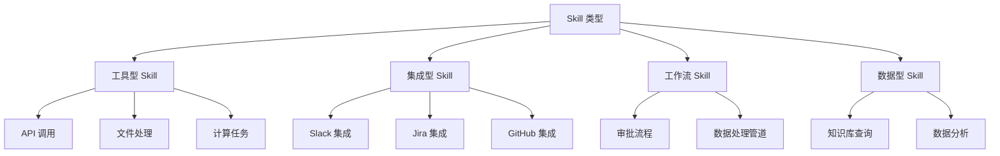

# Skill 开发深度指南

> 构建企业级 OpenClaw Skills 的完整技术规范

---

## Skill 架构概览



---

## Skill 核心概念

### 什么是 Skill

Skill 是 OpenClaw 的可插拔功能单元，封装了特定领域的能力：

| 维度 | 描述 |
|------|------|
| **功能** | 封装 API 调用、数据处理、业务逻辑 |
| **粒度** | 从简单工具到复杂工作流 |
| **复用** | 一次开发，多处使用 |
| **隔离** | 沙箱执行，安全可控 |

### Skill 类型体系



---

## Skill 项目结构

### 标准目录布局

```
my-skill/
├── SKILL.md                    # Skill 元数据与文档
├── package.json                # npm 配置
├── tsconfig.json               # TypeScript 配置
├── src/
│   ├── index.ts               # 入口文件
│   ├── tools/                 # 工具实现
│   │   ├── search.ts
│   │   └── create.ts
│   ├── lib/                   # 内部库
│   │   ├── api-client.ts
│   │   └── utils.ts
│   └── types.ts               # 类型定义
├── tests/
│   ├── unit/                  # 单元测试
│   └── integration/           # 集成测试
├── fixtures/                  # 测试数据
└── docs/                      # 补充文档
```

### SKILL.md 规范

```yaml
---
# 基础信息
id: github-skill                    # 唯一标识
name: GitHub Integration            # 显示名称
version: 1.2.0                      # 语义化版本
author: OpenClaw Team               # 作者
license: MIT                        # 许可证

# 分类与标签
category: dev-tools                 # 分类
tags: [git, github, version-control] # 标签

# 能力声明
capabilities:
  tools: 5                          # 工具数量
  streaming: true                   # 支持流式输出
  auth: oauth2                      # 认证方式

# 依赖
requires:
  openclaw: ">=1.0.0"
  node: ">=18.0.0"

# 配置Schema
config:
  schema:
    type: object
    properties:
      token:
        type: string
        description: GitHub Personal Access Token
        secret: true
      org:
        type: string
        description: Default organization
    required: [token]
---

# GitHub Skill

集成 GitHub API，支持仓库管理、Issue 跟踪、PR 审查等功能。

## 功能特性

- 🔍 搜索仓库、代码、Issue
- 📋 创建和管理 Issue
- 🔀 处理 Pull Request
- 👥 管理协作者

## 使用示例

```
查找 openclaw 项目中关于 authentication 的 issue
```

## 工具列表

| 工具 | 描述 |
|------|------|
| `search_repos` | 搜索仓库 |
| `get_issue` | 获取 Issue 详情 |
| `create_pr` | 创建 Pull Request |

## 配置说明

1. 在 GitHub 创建 Personal Access Token
2. 配置权限：repo, read:org
3. 在 OpenClaw 设置中添加 token

## 隐私声明

本 Skill 仅访问您明确授权的数据，不会存储您的代码内容。
```

---

## 工具开发详解

### 工具定义接口

```typescript
// 工具定义接口

interface ToolDefinition {
  // 基本信息
  name: string;                    // 工具唯一名称
  description: string;             // 功能描述（供 LLM 理解）
  
  // 参数定义（JSON Schema）
  parameters: {
    type: 'object';
    properties: Record<string, ParameterSchema>;
    required?: string[];
  };
  
  // 执行函数
  execute: (args: any, context: ToolContext) => Promise<ToolResult>;
  
  // 可选配置
  config?: {
    streaming?: boolean;           // 是否支持流式输出
    timeout?: number;              // 超时时间（毫秒）
    retry?: RetryConfig;           // 重试配置
    cache?: CacheConfig;           // 缓存配置
  };
}

interface ParameterSchema {
  type: 'string' | 'number' | 'boolean' | 'array' | 'object';
  description: string;
  enum?: any[];                    // 枚举值
  default?: any;                   // 默认值
  
  // 对象类型嵌套
  properties?: Record<string, ParameterSchema>;
  
  // 数组类型
  items?: ParameterSchema;
}

interface ToolContext {
  // 运行时上下文
  skill: {
    id: string;
    config: Record<string, any>;  // Skill 配置
  };
  
  // 用户上下文
  user: {
    id: string;
    preferences: Record<string, any>;
  };
  
  // 会话上下文
  session: {
    id: string;
    messages: Message[];
  };
  
  // 工具接口
  tools: {
    call: (name: string, args: any) => Promise<any>;
  };
  
  // 存储接口
  storage: {
    get: (key: string) => Promise<any>;
    set: (key: string, value: any) => Promise<void>;
  };
  
  // 日志接口
  logger: {
    debug: (msg: string, meta?: any) => void;
    info: (msg: string, meta?: any) => void;
    warn: (msg: string, meta?: any) => void;
    error: (msg: string, meta?: any) => void;
  };
}

interface ToolResult {
  // 文本输出
  content?: string;
  
  // 结构化数据
  data?: any;
  
  // 错误信息
  error?: {
    code: string;
    message: string;
    details?: any;
  };
  
  // 后续操作
  followUp?: {
    suggestions: string[];        // 建议的后续操作
  };
}
```

### 完整工具实现示例

```typescript
// src/tools/search-repos.ts

import { defineTool } from '@openclaw/sdk';
import { GitHubClient } from '../lib/github-client';

export default defineTool({
  name: 'search_repos',
  
  description: `
    在 GitHub 上搜索仓库。
    支持按语言、星数、更新时间等条件筛选。
    返回最相关的仓库列表。
  `,
  
  parameters: {
    type: 'object',
    properties: {
      query: {
        type: 'string',
        description: '搜索关键词'
      },
      language: {
        type: 'string',
        description: '编程语言筛选，如 typescript、python',
        default: null
      },
      minStars: {
        type: 'number',
        description: '最小星数',
        default: 0
      },
      sort: {
        type: 'string',
        enum: ['stars', 'updated', 'forks'],
        description: '排序方式',
        default: 'stars'
      },
      limit: {
        type: 'number',
        description: '返回结果数量',
        default: 10,
        maximum: 100
      }
    },
    required: ['query']
  },
  
  config: {
    timeout: 10000,
    retry: {
      maxAttempts: 3,
      backoff: 'exponential'
    },
    cache: {
      ttl: 300,  // 5分钟缓存
      keyGenerator: (args) => `github:search:${JSON.stringify(args)}`
    }
  },
  
  async execute(args, context) {
    const { skill, logger } = context;
    
    // 初始化客户端
    const github = new GitHubClient(skill.config.token);
    
    logger.debug('Searching repos', { query: args.query });
    
    try {
      // 构建查询
      const q = [
        args.query,
        args.language && `language:${args.language}`,
        args.minStars > 0 && `stars:>=${args.minStars}`
      ].filter(Boolean).join(' ');
      
      // 执行搜索
      const results = await github.search.repos({
        q,
        sort: args.sort,
        per_page: args.limit
      });
      
      // 格式化输出
      const repos = results.data.items.map(repo => ({
        name: repo.full_name,
        description: repo.description,
        stars: repo.stargazers_count,
        language: repo.language,
        updated: repo.updated_at,
        url: repo.html_url
      }));
      
      logger.info('Search completed', { 
        query: args.query, 
        results: repos.length 
      });
      
      return {
        content: formatRepoList(repos),
        data: { repos, total: results.data.total_count }
      };
      
    } catch (error) {
      logger.error('Search failed', { error: error.message });
      
      return {
        error: {
          code: 'GITHUB_API_ERROR',
          message: `GitHub API 调用失败: ${error.message}`,
          details: error.response?.data
        }
      };
    }
  }
});

// 格式化输出
function formatRepoList(repos: any[]): string {
  if (repos.length === 0) {
    return '未找到匹配的仓库。';
  }
  
  const lines = repos.map((repo, i) => {
    return `${i + 1}. **${repo.name}** ⭐ ${repo.stars}
   ${repo.description || '无描述'}
   [查看](${repo.url})`;
  });
  
  return lines.join('\n\n');
}
```

---

## Skill SDK API

### 核心函数

```typescript
// Skill 入口定义

import { 
  defineSkill, 
  defineTool, 
  defineHook,
  useConfig,
  useLogger,
  useStorage 
} from '@openclaw/sdk';

// 定义 Skill
export default defineSkill({
  // Skill 元数据
  meta: {
    id: 'my-skill',
    version: '1.0.0',
    name: 'My Skill'
  },
  
  // 配置Schema
  config: {
    schema: {
      type: 'object',
      properties: {
        apiKey: { type: 'string', secret: true },
        endpoint: { type: 'string', default: 'https://api.example.com' }
      },
      required: ['apiKey']
    },
    
    // 配置验证
    validate(config) {
      if (!config.apiKey.startsWith('sk_')) {
        throw new Error('Invalid API key format');
      }
      return true;
    }
  },
  
  // 生命周期钩子
  hooks: {
    // 初始化
    async onInit(context) {
      const logger = useLogger();
      logger.info('Skill initializing...');
      
      // 初始化资源
      context.set('client', new ApiClient(context.config));
    },
    
    // 每次调用前
    async onBeforeCall(context, toolName, args) {
      const logger = useLogger();
      logger.debug(`Calling ${toolName}`, args);
      
      // 限流检查
      await checkRateLimit(context.user.id);
    },
    
    // 每次调用后
    async onAfterCall(context, toolName, result) {
      // 记录使用统计
      await recordUsage(context.user.id, toolName);
    },
    
    // 关闭
    async onShutdown(context) {
      const client = context.get('client');
      await client?.close();
    }
  },
  
  // 工具注册
  tools: [
    tool1,
    tool2,
    // ...
  ]
});
```

---

## 高级特性

### 流式输出

```typescript
// 流式工具实现

export default defineTool({
  name: 'stream_data',
  description: '流式获取数据',
  
  config: {
    streaming: true  // 启用流式
  },
  
  async execute(args, context) {
    const { stream } = context;  // 获取流接口
    
    // 发送数据块
    for (const chunk of dataChunks) {
      await stream.write({
        type: 'data',
        content: chunk
      });
    }
    
    // 发送完成标记
    await stream.end({
      summary: '处理完成'
    });
    
    return { content: '' };  // 流式返回空内容
  }
});
```

### 工具组合

```typescript
// 在一个工具中调用其他工具

export default defineTool({
  name: 'complex_task',
  
  async execute(args, context) {
    const { tools } = context;
    
    // 步骤 1: 搜索
    const searchResult = await tools.call('search_repos', {
      query: args.topic
    });
    
    // 步骤 2: 分析
    const analysisResult = await tools.call('analyze_code', {
      repos: searchResult.data.repos
    });
    
    // 步骤 3: 生成报告
    return {
      content: generateReport(analysisResult)
    };
  }
});
```

---

## 测试策略

### 单元测试

```typescript
// tests/unit/search-repos.test.ts

import { describe, it, expect, vi } from 'vitest';
import { createToolContext } from '@openclaw/testing';
import searchRepos from '../../src/tools/search-repos';

describe('search_repos', () => {
  it('should search repositories', async () => {
    const context = createToolContext({
      config: { token: 'test-token' }
    });
    
    const result = await searchRepos.execute({
      query: 'openclaw',
      language: 'typescript'
    }, context);
    
    expect(result.error).toBeUndefined();
    expect(result.data).toBeDefined();
  });
  
  it('should handle API errors', async () => {
    const context = createToolContext({
      config: { token: 'invalid' }
    });
    
    const result = await searchRepos.execute({
      query: 'test'
    }, context);
    
    expect(result.error).toBeDefined();
    expect(result.error.code).toBe('GITHUB_API_ERROR');
  });
});
```

### 集成测试

```typescript
// tests/integration/skill.test.ts

import { describe, it, expect } from 'vitest';
import { loadSkill } from '@openclaw/testing';

describe('GitHub Skill Integration', () => {
  const skill = loadSkill('./', {
    config: { token: process.env.GITHUB_TOKEN }
  });
  
  it('should perform end-to-end workflow', async () => {
    // 搜索仓库
    const searchResult = await skill.call('search_repos', {
      query: 'openclaw'
    });
    expect(searchResult.data.repos.length).toBeGreaterThan(0);
    
    // 获取 Issue
    const repo = searchResult.data.repos[0];
    const issuesResult = await skill.call('list_issues', {
      owner: repo.owner,
      repo: repo.name
    });
    expect(issuesResult.data).toBeDefined();
  });
});
```

---

## 发布与分发

### ClawHub 发布流程

```bash
# 1. 构建
npm run build

# 2. 测试
npm run test

# 3. 打包
openclaw skill pack

# 4. 验证
openclaw skill validate ./my-skill.claw

# 5. 发布
openclaw skill publish ./my-skill.claw

# 6. 版本更新
openclaw skill publish ./my-skill.claw --bump minor
```

### 私有 Registry

```json
// .openclawrc
{
  "registries": [
    {
      "name": "clawhub",
      "url": "https://clawhub.ai/api/v1"
    },
    {
      "name": "company-internal",
      "url": "https://registry.company.com",
      "auth": {
        "type": "token",
        "token": "${INTERNAL_REGISTRY_TOKEN}"
      }
    }
  ]
}
```

---

## 最佳实践

### 1. 错误处理

```typescript
// 良好的错误处理

async execute(args, context) {
  try {
    const result = await api.call(args);
    return { data: result };
  } catch (error) {
    // 分类错误
    if (error.code === 'RATE_LIMITED') {
      return {
        error: {
          code: 'RATE_LIMITED',
          message: 'API 速率限制，请稍后重试',
          retryable: true,
          retryAfter: error.retryAfter
        }
      };
    }
    
    if (error.code === 'AUTH_FAILED') {
      return {
        error: {
          code: 'AUTH_FAILED',
          message: '认证失败，请检查 API 密钥配置',
          action: '请运行 /config 更新密钥'
        }
      };
    }
    
    // 未知错误
    context.logger.error('Unexpected error', error);
    return {
      error: {
        code: 'INTERNAL_ERROR',
        message: '发生未知错误，请联系管理员'
      }
    };
  }
}
```

### 2. 性能优化

```typescript
// 使用缓存

import { useCache } from '@openclaw/sdk';

async execute(args, context) {
  const cache = useCache();
  
  const cacheKey = `github:repo:${args.owner}:${args.repo}`;
  
  // 尝试读取缓存
  const cached = await cache.get(cacheKey);
  if (cached) {
    return { data: cached, cached: true };
  }
  
  // 调用 API
  const result = await api.getRepo(args);
  
  // 写入缓存
  await cache.set(cacheKey, result, { ttl: 300 });
  
  return { data: result };
}
```

### 3. 安全实践

```typescript
// 输入验证

import { z } from 'zod';

const paramsSchema = z.object({
  url: z.string().url(),
  method: z.enum(['GET', 'POST', 'PUT', 'DELETE']),
  timeout: z.number().max(30000).default(5000)
});

async execute(args, context) {
  // 严格验证输入
  const params = paramsSchema.parse(args);
  
  // 验证 URL 白名单
  if (!isAllowedUrl(params.url)) {
    throw new Error('URL not in allowlist');
  }
  
  // ...
}
```

---

## 故障排除

### 常见问题

| 问题 | 原因 | 解决方案 |
|------|------|----------|
| 工具未注册 | 导出格式错误 | 检查 `export default defineTool` |
| 参数验证失败 | Schema 不匹配 | 检查 JSON Schema |
| 调用超时 | 网络或逻辑问题 | 增加 timeout 配置 |
| 权限不足 | 配置错误 | 检查 Skill 配置 |
| 内存泄漏 | 资源未释放 | 实现 onShutdown 钩子 |

### 调试技巧

```bash
# 启用调试日志
DEBUG=openclaw:skill* openclaw dev

# 本地测试 Skill
openclaw skill test ./my-skill --interactive

# 性能分析
openclaw skill profile ./my-skill --tool search_repos
```
