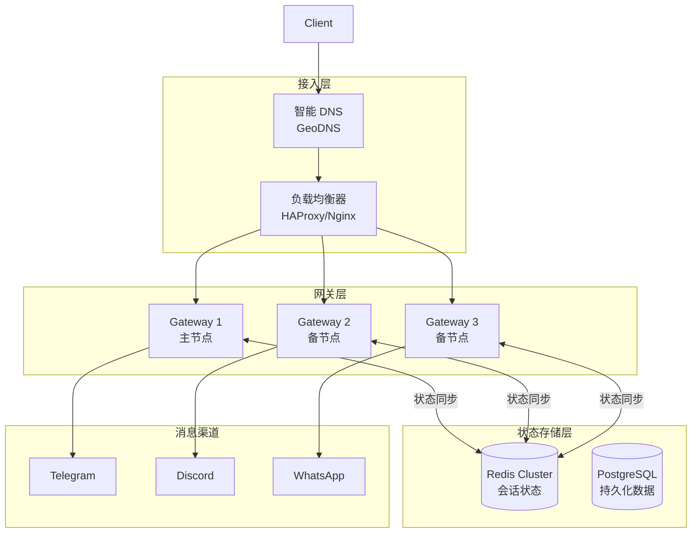

# 高可用架构设计与实现

> 构建企业级可靠的 OpenClaw 部署方案

---

## 高可用架构概览



---

## 多节点部署架构

### 主备模式（Active-Standby）

```yaml
# Docker Compose 高可用部署

version: '3.8'

services:
  # HAProxy 负载均衡
  haproxy:
    image: haproxy:2.8
    volumes:
      - ./haproxy.cfg:/usr/local/etc/haproxy/haproxy.cfg:ro
    ports:
      - "80:80"
      - "443:443"
      - "8404:8404"  # 统计页面
    networks:
      - openclaw
    depends_on:
      - gateway-primary
      - gateway-standby
  
  # 主 Gateway
  gateway-primary:
    image: openclaw/gateway:latest
    environment:
      - NODE_ID=gateway-primary
      - NODE_ROLE=primary
      - REDIS_URL=redis://redis:6379
      - DB_URL=postgresql://postgres:5432/openclaw
      - GATEWAY_TOKEN=${GATEWAY_TOKEN}
    volumes:
      - gateway-primary-data:/data
    networks:
      - openclaw
    healthcheck:
      test: ["CMD", "openclaw", "health"]
      interval: 10s
      timeout: 5s
      retries: 3
    deploy:
      resources:
        limits:
          cpus: '2'
          memory: 4G
  
  # 备 Gateway
  gateway-standby:
    image: openclaw/gateway:latest
    environment:
      - NODE_ID=gateway-standby
      - NODE_ROLE=standby
      - REDIS_URL=redis://redis:6379
      - DB_URL=postgresql://postgres:5432/openclaw
      - GATEWAY_TOKEN=${GATEWAY_TOKEN}
    volumes:
      - gateway-standby-data:/data
    networks:
      - openclaw
    healthcheck:
      test: ["CMD", "openclaw", "health"]
      interval: 10s
      timeout: 5s
      retries: 3
  
  # Redis Cluster
  redis:
    image: redis:7-alpine
    command: redis-server --appendonly yes --maxmemory 2gb --maxmemory-policy allkeys-lru
    volumes:
      - redis-data:/data
    networks:
      - openclaw
  
  # PostgreSQL
  postgres:
    image: postgres:15-alpine
    environment:
      - POSTGRES_DB=openclaw
      - POSTGRES_USER=openclaw
      - POSTGRES_PASSWORD=${DB_PASSWORD}
    volumes:
      - postgres-data:/var/lib/postgresql/data
    networks:
      - openclaw

volumes:
  gateway-primary-data:
  gateway-standby-data:
  redis-data:
  postgres-data:

networks:
  openclaw:
    driver: bridge
```

### HAProxy 配置

```cfg
# haproxy.cfg

global
    log stdout local0
    maxconn 4096
    daemon

defaults
    mode http
    timeout connect 5s
    timeout client 30s
    timeout server 30s
    option httpchk GET /health

# 前端配置
frontend openclaw_frontend
    bind *:80
    bind *:443 ssl crt /etc/ssl/certs/openclaw.pem
    
    # 强制 HTTPS
    redirect scheme https if !{ ssl_fc }
    
    # WebSocket 支持
    acl is_websocket hdr(Upgrade) -i websocket
    acl is_connection_upgrade hdr_beg(Connection) -i upgrade
    
    use_backend openclaw_ws_backend if is_websocket is_connection_upgrade
    default_backend openclaw_http_backend

# HTTP 后端（API 调用）
backend openclaw_http_backend
    balance roundrobin
    option httpchk GET /health
    
    server gateway-primary gateway-primary:18789 check inter 10s rise 2 fall 3
    server gateway-standby gateway-standby:18789 check inter 10s rise 2 fall 3 backup

# WebSocket 后端（长连接）
backend openclaw_ws_backend
    balance source  # 基于源 IP 的会话保持
    option httpchk GET /health
    
    server gateway-primary gateway-primary:18789 check inter 10s rise 2 fall 3
    server gateway-standby gateway-standby:18789 check inter 10s rise 2 fall 3 backup

# 统计页面
frontend stats
    bind *:8404
    stats enable
    stats uri /stats
    stats refresh 10s
    stats admin if TRUE
```

---

## 数据层高可用

### Redis Cluster 配置

```yaml
# Redis Cluster 6 节点配置（3 主 3 从）

version: '3.8'

services:
  redis-node-0:
    image: redis:7-alpine
    command: >
      redis-server
      --port 6379
      --cluster-enabled yes
      --cluster-config-file nodes.conf
      --cluster-node-timeout 5000
      --appendonly yes
      --maxmemory 1gb
      --maxmemory-policy allkeys-lru
    volumes:
      - redis-node-0:/data
    networks:
      - redis-cluster
  
  redis-node-1:
    image: redis:7-alpine
    command: >
      redis-server
      --port 6379
      --cluster-enabled yes
      --cluster-config-file nodes.conf
      --cluster-node-timeout 5000
      --appendonly yes
      --maxmemory 1gb
      --maxmemory-policy allkeys-lru
    volumes:
      - redis-node-1:/data
    networks:
      - redis-cluster
  
  redis-node-2:
    image: redis:7-alpine
    command: >
      redis-server
      --port 6379
      --cluster-enabled yes
      --cluster-config-file nodes.conf
      --cluster-node-timeout 5000
      --appendonly yes
      --maxmemory 1gb
      --maxmemory-policy allkeys-lru
    volumes:
      - redis-node-2:/data
    networks:
      - redis-cluster
  
  # 初始化集群
  redis-cluster-init:
    image: redis:7-alpine
    command: >
      sh -c "sleep 5 &&
      redis-cli --cluster create
      redis-node-0:6379
      redis-node-1:6379
      redis-node-2:6379
      --cluster-replicas 0
      --cluster-yes"
    depends_on:
      - redis-node-0
      - redis-node-1
      - redis-node-2
    networks:
      - redis-cluster

volumes:
  redis-node-0:
  redis-node-1:
  redis-node-2:

networks:
  redis-cluster:
    driver: bridge
```

### PostgreSQL 主从复制

```yaml
# PostgreSQL 主从架构

version: '3.8'

services:
  postgres-primary:
    image: bitnami/postgresql-repmgr:15
    environment:
      - POSTGRESQL_POSTGRES_PASSWORD=adminpassword
      - POSTGRESQL_USERNAME=openclaw
      - POSTGRESQL_PASSWORD=${DB_PASSWORD}
      - POSTGRESQL_DATABASE=openclaw
      - REPMGR_PASSWORD=repmgrpassword
      - REPMGR_PRIMARY_HOST=postgres-primary
      - REPMGR_PRIMARY_PORT=5432
      - REPMGR_PARTNER_NODES=postgres-primary:5432,postgres-standby:5432
      - REPMGR_NODE_NAME=postgres-primary
      - REPMGR_NODE_NETWORK_NAME=postgres-primary
      - REPMGR_PORT_NUMBER=5432
      - REPMGR_CONNECT_TIMEOUT=5
      - REPMGR_RECONNECT_ATTEMPTS=3
      - REPMGR_RECONNECT_INTERVAL=5
    volumes:
      - postgres-primary:/bitnami/postgresql
    networks:
      - postgres-ha
  
  postgres-standby:
    image: bitnami/postgresql-repmgr:15
    environment:
      - POSTGRESQL_POSTGRES_PASSWORD=adminpassword
      - POSTGRESQL_USERNAME=openclaw
      - POSTGRESQL_PASSWORD=${DB_PASSWORD}
      - POSTGRESQL_DATABASE=openclaw
      - REPMGR_PASSWORD=repmgrpassword
      - REPMGR_PRIMARY_HOST=postgres-primary
      - REPMGR_PRIMARY_PORT=5432
      - REPMGR_PARTNER_NODES=postgres-primary:5432,postgres-standby:5432
      - REPMGR_NODE_NAME=postgres-standby
      - REPMGR_NODE_NETWORK_NAME=postgres-standby
      - REPMGR_PORT_NUMBER=5432
      - REPMGR_CONNECT_TIMEOUT=5
      - REPMGR_RECONNECT_ATTEMPTS=3
      - REPMGR_RECONNECT_INTERVAL=5
    volumes:
      - postgres-standby:/bitnami/postgresql
    networks:
      - postgres-ha
    depends_on:
      - postgres-primary
  
  # Pgpool-II 连接池和负载均衡
  pgpool:
    image: bitnami/pgpool:4
    environment:
      - PGPOOL_BACKEND_NODES=0:postgres-primary:5432,1:postgres-standby:5432
      - PGPOOL_SR_CHECK_USER=openclaw
      - PGPOOL_SR_CHECK_PASSWORD=${DB_PASSWORD}
      - PGPOOL_ENABLE_LOAD_BALANCING=yes
      - PGPOOL_POSTGRES_USERNAME=openclaw
      - PGPOOL_POSTGRES_PASSWORD=${DB_PASSWORD}
      - PGPOOL_ADMIN_USERNAME=admin
      - PGPOOL_ADMIN_PASSWORD=adminpassword
    ports:
      - "5432:5432"
    networks:
      - postgres-ha
    depends_on:
      - postgres-primary
      - postgres-standby

volumes:
  postgres-primary:
  postgres-standby:

networks:
  postgres-ha:
    driver: bridge
```

---

## 故障转移机制

### 自动故障检测

```typescript
// 健康检查与故障检测

interface HealthCheck {
  endpoint: string;
  interval: number;
  timeout: number;
  healthyThreshold: number;
  unhealthyThreshold: number;
}

class FaultDetector {
  private nodes: Map<string, NodeState>;
  private healthChecks: Map<string, HealthCheck>;
  
  constructor() {
    this.nodes = new Map();
    this.healthChecks = new Map();
  }
  
  async startMonitoring(nodeId: string, config: HealthCheck): Promise<void> {
    this.healthChecks.set(nodeId, config);
    
    setInterval(async () => {
      await this.checkHealth(nodeId);
    }, config.interval);
  }
  
  private async checkHealth(nodeId: string): Promise<void> {
    const config = this.healthChecks.get(nodeId)!;
    const state = this.nodes.get(nodeId) || {
      healthy: true,
      consecutiveFailures: 0,
      consecutiveSuccesses: 0
    };
    
    try {
      const response = await fetch(config.endpoint, {
        signal: AbortSignal.timeout(config.timeout)
      });
      
      if (response.ok) {
        state.consecutiveSuccesses++;
        state.consecutiveFailures = 0;
        
        if (!state.healthy && state.consecutiveSuccesses >= config.healthyThreshold) {
          await this.markHealthy(nodeId);
        }
      } else {
        throw new Error(`HTTP ${response.status}`);
      }
    } catch (error) {
      state.consecutiveFailures++;
      state.consecutiveSuccesses = 0;
      
      if (state.healthy && state.consecutiveFailures >= config.unhealthyThreshold) {
        await this.markUnhealthy(nodeId);
      }
    }
    
    this.nodes.set(nodeId, state);
  }
  
  private async markUnhealthy(nodeId: string): Promise<void> {
    const state = this.nodes.get(nodeId)!;
    state.healthy = false;
    
    // 触发故障转移
    await this.triggerFailover(nodeId);
    
    // 告警
    await this.sendAlert({
      type: 'node_unhealthy',
      nodeId,
      timestamp: Date.now()
    });
  }
}
```

### 故障转移流程

```typescript
// 故障转移控制器

class FailoverController {
  private currentPrimary: string;
  private standbyNodes: string[];
  private isFailingOver = false;
  
  async triggerFailover(failedNode: string): Promise<void> {
    if (this.isFailingOver) {
      throw new Error('Failover already in progress');
    }
    
    if (failedNode !== this.currentPrimary) {
      return;  // 不是主节点故障
    }
    
    this.isFailingOver = true;
    
    try {
      // 1. 选择新的主节点
      const newPrimary = await this.selectNewPrimary();
      
      // 2. 提升备节点为主节点
      await this.promoteToPrimary(newPrimary);
      
      // 3. 更新负载均衡器配置
      await this.updateLoadBalancer(newPrimary);
      
      // 4. 通知所有客户端
      await this.notifyClients(failedNode, newPrimary);
      
      // 5. 尝试恢复故障节点
      await this.attemptRecovery(failedNode);
      
    } finally {
      this.isFailingOver = false;
    }
  }
  
  private async selectNewPrimary(): Promise<string> {
    // 选择最健康的备节点
    const healthScores = await Promise.all(
      this.standbyNodes.map(async node => ({
        node,
        score: await this.calculateHealthScore(node)
      }))
    );
    
    healthScores.sort((a, b) => b.score - a.score);
    return healthScores[0].node;
  }
  
  private async promoteToPrimary(nodeId: string): Promise<void> {
    // 调用节点 API 提升为主节点
    await fetch(`http://${nodeId}:18789/admin/promote`, {
      method: 'POST',
      headers: { 'Authorization': `Bearer ${ADMIN_TOKEN}` }
    });
    
    this.currentPrimary = nodeId;
    this.standbyNodes = this.standbyNodes.filter(n => n !== nodeId);
    this.standbyNodes.push(this.currentPrimary);  // 原主节点恢复后成为备节点
  }
}
```

---

## 备份与恢复

### 备份策略

```yaml
# 备份配置文件

backup:
  # 会话数据备份
  sessions:
    schedule: "0 */6 * * *"  # 每6小时
    retention: 7d
    storage:
      - type: s3
        bucket: openclaw-backups
        region: us-east-1
      - type: local
        path: /backup/sessions
  
  # 配置备份
  config:
    schedule: "0 0 * * *"    # 每天
    retention: 30d
    encrypt: true
  
  # 审计日志归档
  audit:
    schedule: "0 0 * * 0"    # 每周
    retention: 1y
    compress: true
```

```typescript
// 备份管理器

class BackupManager {
  async createBackup(type: BackupType): Promise<Backup> {
    const timestamp = new Date().toISOString();
    const id = `backup-${type}-${timestamp}`;
    
    const backup: Backup = {
      id,
      type,
      timestamp,
      status: 'in_progress'
    };
    
    try {
      switch (type) {
        case 'sessions':
          await this.backupSessions(id);
          break;
        case 'config':
          await this.backupConfig(id);
          break;
        case 'full':
          await this.backupFull(id);
          break;
      }
      
      backup.status = 'completed';
      backup.size = await this.getBackupSize(id);
      
    } catch (error) {
      backup.status = 'failed';
      backup.error = error.message;
    }
    
    await this.recordBackup(backup);
    return backup;
  }
  
  private async backupSessions(backupId: string): Promise<void> {
    // 1. 创建一致性快照
    await redis.bgSave();
    
    // 2. 导出数据
    const dumpFile = `/tmp/${backupId}.rdb`;
    await fs.copyFile('/data/redis/dump.rdb', dumpFile);
    
    // 3. 上传到 S3
    await s3.upload({
      Bucket: 'openclaw-backups',
      Key: `sessions/${backupId}.rdb`,
      Body: fs.createReadStream(dumpFile)
    });
    
    // 4. 清理临时文件
    await fs.unlink(dumpFile);
  }
  
  async restore(backupId: string, target: RestoreTarget): Promise<void> {
    // 1. 下载备份
    const backupFile = `/tmp/restore-${backupId}`;
    await s3.download({
      Bucket: 'openclaw-backups',
      Key: `${target}/${backupId}`,
      output: backupFile
    });
    
    // 2. 验证备份完整性
    const valid = await this.verifyBackup(backupFile);
    if (!valid) {
      throw new Error('Backup verification failed');
    }
    
    // 3. 停止相关服务
    await this.stopService(target);
    
    // 4. 恢复数据
    await this.restoreData(target, backupFile);
    
    // 5. 启动服务
    await this.startService(target);
    
    // 6. 验证恢复
    await this.verifyRestore(target);
  }
}
```

---

## 灾难恢复演练

### 演练场景

```markdown
## 灾难恢复演练计划

### 场景 1: 单节点故障
**目标**: 验证主节点故障时的自动故障转移
**步骤**:
1. 模拟主节点宕机 (docker stop gateway-primary)
2. 观察故障检测时间 (< 30s)
3. 验证备节点提升为主节点
4. 验证客户端重新连接
5. 恢复故障节点并加入集群

**预期结果**:
- RTO < 60s
- 无数据丢失
- 客户端无感知

### 场景 2: 数据中心故障
**目标**: 验证跨可用区故障转移
**步骤**:
1. 模拟整个可用区网络隔离
2. 触发跨区故障转移
3. 验证 DNS 切换
4. 验证数据一致性

**预期结果**:
- RTO < 5min
- RPO < 1min

### 场景 3: 数据损坏恢复
**目标**: 验证从备份恢复
**步骤**:
1. 故意损坏部分数据
2. 检测数据不一致
3. 从最新备份恢复
4. 验证数据完整性

**预期结果**:
- 数据可恢复
- 丢失数据 < 6小时
```

---

## 高可用检查清单

```markdown
## 生产高可用检查清单

### 架构设计
- [ ] 至少 2 个 Gateway 节点
- [ ] 会话存储使用 Redis Cluster
- [ ] 持久化数据使用 PostgreSQL 主从
- [ ] 负载均衡器配置健康检查
- [ ] 配置了自动故障转移

### 数据保护
- [ ] 会话数据定时备份
- [ ] 配置定期备份
- [ ] 备份存储在异地
- [ ] 备份加密
- [ ] 定期测试恢复流程

### 监控告警
- [ ] 节点健康监控
- [ ] 故障转移告警
- [ ] 数据同步延迟监控
- [ ] 备份失败告警
- [ ] 灾难恢复演练计划

### 文档
- [ ] 故障转移流程文档
- [ ] 恢复操作手册
- [ ] 联系人列表
- [ ] 升级维护窗口计划
```
