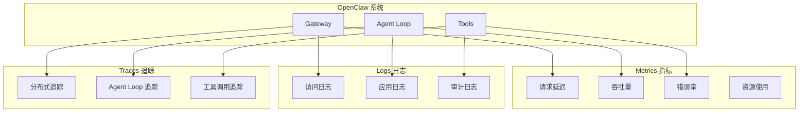

# 可观测性架构与实践

> 构建全面的 OpenClaw 监控和日志系统

---

## 可观测性三大支柱



---

## 指标收集 (Metrics)

### 核心指标定义

```typescript
// 指标定义

import { Counter, Histogram, Gauge, register } from 'prom-client';

// 1. Gateway 指标
export const gatewayMetrics = {
  // 连接数
  connections: new Gauge({
    name: 'openclaw_gateway_connections',
    help: 'Number of active WebSocket connections',
    labelNames: ['status']  // connected, authenticated
  }),
  
  // 请求处理
  requests: new Counter({
    name: 'openclaw_gateway_requests_total',
    help: 'Total number of requests processed',
    labelNames: ['method', 'status']
  }),
  
  requestDuration: new Histogram({
    name: 'openclaw_gateway_request_duration_seconds',
    help: 'Request duration in seconds',
    labelNames: ['method'],
    buckets: [0.01, 0.05, 0.1, 0.5, 1, 2, 5, 10]
  }),
  
  // 消息处理
  messages: new Counter({
    name: 'openclaw_gateway_messages_total',
    help: 'Total WebSocket messages processed',
    labelNames: ['direction', 'type']  // in/out, req/res/event
  }),
  
  // 队列深度
  queueDepth: new Gauge({
    name: 'openclaw_gateway_queue_depth',
    help: 'Current queue depth',
    labelNames: ['queue']  // incoming, processing
  })
};

// 2. Agent 指标
export const agentMetrics = {
  // Agent 运行
  runsStarted: new Counter({
    name: 'openclaw_agent_runs_started_total',
    help: 'Total agent runs started',
    labelNames: ['agent_id']
  }),
  
  runsCompleted: new Counter({
    name: 'openclaw_agent_runs_completed_total',
    help: 'Total agent runs completed',
    labelNames: ['agent_id', 'status']  // success, error, cancelled
  }),
  
  runDuration: new Histogram({
    name: 'openclaw_agent_run_duration_seconds',
    help: 'Agent run duration in seconds',
    labelNames: ['agent_id'],
    buckets: [1, 5, 10, 30, 60, 120, 300, 600]
  }),
  
  // LLM 调用
  llmCalls: new Counter({
    name: 'openclaw_llm_calls_total',
    help: 'Total LLM API calls',
    labelNames: ['provider', 'model', 'status']
  }),
  
  llmLatency: new Histogram({
    name: 'openclaw_llm_latency_seconds',
    help: 'LLM API latency in seconds',
    labelNames: ['provider', 'model'],
    buckets: [0.5, 1, 2, 5, 10, 30, 60]
  }),
  
  tokensUsed: new Counter({
    name: 'openclaw_tokens_used_total',
    help: 'Total tokens used',
    labelNames: ['provider', 'model', 'type']  // prompt, completion
  }),
  
  // 工具调用
  toolCalls: new Counter({
    name: 'openclaw_tool_calls_total',
    help: 'Total tool calls',
    labelNames: ['tool_name', 'status']
  }),
  
  toolDuration: new Histogram({
    name: 'openclaw_tool_duration_seconds',
    help: 'Tool execution duration',
    labelNames: ['tool_name'],
    buckets: [0.1, 0.5, 1, 2, 5, 10, 30]
  }),
  
  // Token 用量
  contextTokens: new Gauge({
    name: 'openclaw_context_tokens',
    help: 'Current context token count',
    labelNames: ['run_id']
  })
};

// 3. 系统指标
export const systemMetrics = {
  memoryUsage: new Gauge({
    name: 'openclaw_memory_bytes',
    help: 'Memory usage in bytes',
    labelNames: ['type']  // heap_used, heap_total, external
  }),
  
  cpuUsage: new Gauge({
    name: 'openclaw_cpu_usage_percent',
    help: 'CPU usage percentage'
  }),
  
  eventLoopLag: new Histogram({
    name: 'openclaw_event_loop_lag_seconds',
    help: 'Event loop lag in seconds',
    buckets: [0.001, 0.005, 0.01, 0.05, 0.1, 0.5, 1]
  })
};
```

### 指标收集中间件

```typescript
// Express/Fastify 指标中间件

import { NextFunction, Request, Response } from 'express';

export function metricsMiddleware(
  req: Request,
  res: Response,
  next: NextFunction
): void {
  const start = process.hrtime.bigint();
  
  res.on('finish', () => {
    const duration = Number(process.hrtime.bigint() - start) / 1e9;
    const method = req.method;
    const status = res.statusCode.toString();
    
    gatewayMetrics.requests.inc({ method, status });
    gatewayMetrics.requestDuration.observe({ method }, duration);
  });
  
  next();
}

// WebSocket 消息指标
export function wsMetricsMiddleware(
  ws: WebSocket,
  message: any,
  next: () => void
): void {
  const type = message.type || 'unknown';
  gatewayMetrics.messages.inc({ direction: 'in', type });
  
  next();
  
  gatewayMetrics.messages.inc({ direction: 'out', type: 'response' });
}
```

---

## 日志系统 (Logs)

### 结构化日志

```typescript
// 日志配置

import winston from 'winston';

const logger = winston.createLogger({
  level: process.env.LOG_LEVEL || 'info',
  format: winston.format.combine(
    winston.format.timestamp(),
    winston.format.errors({ stack: true }),
    winston.format.json()
  ),
  defaultMeta: {
    service: 'openclaw-gateway',
    version: process.env.VERSION,
    instance: process.env.INSTANCE_ID
  },
  transports: [
    // 控制台输出（开发环境）
    new winston.transports.Console({
      format: process.env.NODE_ENV === 'development'
        ? winston.format.combine(
            winston.format.colorize(),
            winston.format.simple()
          )
        : winston.format.json()
    }),
    
    // 文件输出
    new winston.transports.File({
      filename: 'logs/error.log',
      level: 'error'
    }),
    
    new winston.transports.File({
      filename: 'logs/combined.log'
    })
  ]
});

// 上下文日志
export function createContextLogger(context: LogContext) {
  return logger.child({
    traceId: context.traceId,
    userId: context.userId,
    sessionId: context.sessionId
  });
}
```

### 审计日志

```typescript
// 审计日志

interface AuditEvent {
  timestamp: string;
  eventType: string;
  severity: 'info' | 'warning' | 'critical';
  actor: {
    userId?: string;
    deviceId?: string;
    ip?: string;
  };
  resource: {
    type: string;
    id: string;
  };
  action: {
    type: string;
    details: Record<string, unknown>;
  };
  result: 'success' | 'failure';
  reason?: string;
}

class AuditLogger {
  private logger: winston.Logger;
  
  constructor() {
    this.logger = winston.createLogger({
      level: 'info',
      format: winston.format.json(),
      transports: [
        new winston.transports.File({
          filename: 'logs/audit.log',
          maxsize: 5242880,  // 5MB
          maxFiles: 10
        })
      ]
    });
  }
  
  log(event: AuditEvent): void {
    this.logger.info('audit', event);
  }
  
  // 安全相关事件
  security(event: Omit<AuditEvent, 'severity'>): void {
    this.log({ ...event, severity: 'critical' });
  }
  
  // Agent 执行事件
  agentRun(params: {
    userId: string;
    agentId: string;
    runId: string;
    promptLength: number;
    model: string;
  }): void {
    this.log({
      timestamp: new Date().toISOString(),
      eventType: 'agent.run',
      severity: 'info',
      actor: { userId: params.userId },
      resource: { type: 'agent', id: params.agentId },
      action: {
        type: 'execute',
        details: {
          runId: params.runId,
          promptLength: params.promptLength,
          model: params.model
        }
      },
      result: 'success'
    });
  }
  
  // 认证事件
  auth(params: {
    userId: string;
    deviceId: string;
    success: boolean;
    failureReason?: string;
  }): void {
    this.log({
      timestamp: new Date().toISOString(),
      eventType: 'auth.attempt',
      severity: params.success ? 'info' : 'warning',
      actor: { userId: params.userId, deviceId: params.deviceId },
      resource: { type: 'session', id: params.deviceId },
      action: { type: 'authenticate', details: {} },
      result: params.success ? 'success' : 'failure',
      reason: params.failureReason
    });
  }
}
```

---

## 分布式追踪 (Tracing)

### OpenTelemetry 集成

```typescript
// OpenTelemetry 配置

import { NodeSDK } from '@opentelemetry/sdk-node';
import { OTLPTraceExporter } from '@opentelemetry/exporter-trace-otlp-http';
import { Resource } from '@opentelemetry/resources';
import { SemanticResourceAttributes } from '@opentelemetry/semantic-conventions';
import { BatchSpanProcessor } from '@opentelemetry/sdk-trace-node';

// 初始化 SDK
const sdk = new NodeSDK({
  resource: new Resource({
    [SemanticResourceAttributes.SERVICE_NAME]: 'openclaw-gateway',
    [SemanticResourceAttributes.SERVICE_VERSION]: process.env.VERSION,
  }),
  spanProcessor: new BatchSpanProcessor(
    new OTLPTraceExporter({
      url: process.env.OTEL_EXPORTER_OTLP_ENDPOINT
    })
  )
});

sdk.start();

// 追踪器
import { trace } from '@opentelemetry/api';
const tracer = trace.getTracer('openclaw');
```

### 请求追踪

```typescript
// 请求追踪中间件

export function tracingMiddleware(
  req: Request,
  res: Response,
  next: NextFunction
): void {
  const traceId = req.headers['x-trace-id'] || generateTraceId();
  const span = tracer.startSpan('http_request', {
    attributes: {
      'http.method': req.method,
      'http.url': req.url,
      'http.user_agent': req.headers['user-agent'],
      'trace.id': traceId
    }
  });
  
  // 将 span 附加到请求上下文
  req.context = { span, traceId };
  
  res.on('finish', () => {
    span.setAttribute('http.status_code', res.statusCode);
    span.end();
  });
  
  next();
}

// Agent Loop 追踪
export async function traceAgentRun(
  runId: string,
  fn: () => Promise<void>
): Promise<void> {
  return tracer.startActiveSpan('agent_run', async (span) => {
    span.setAttribute('run.id', runId);
    
    try {
      await fn();
      span.setStatus({ code: SpanStatusCode.OK });
    } catch (error) {
      span.recordException(error);
      span.setStatus({
        code: SpanStatusCode.ERROR,
        message: error.message
      });
      throw error;
    } finally {
      span.end();
    }
  });
}
```

---

## 告警配置

### Prometheus 告警规则

```yaml
# alerting-rules.yml

groups:
  - name: openclaw
    rules:
      # 高错误率告警
      - alert: HighErrorRate
        expr: |
          (
            sum(rate(openclaw_gateway_requests_total{status=~"5.."}[5m]))
            /
            sum(rate(openclaw_gateway_requests_total[5m]))
          ) > 0.05
        for: 5m
        labels:
          severity: critical
        annotations:
          summary: "High error rate detected"
          description: "Error rate is {{ $value | humanizePercentage }}"
      
      # LLM 延迟告警
      - alert: HighLLMLatency
        expr: |
          histogram_quantile(0.95, 
            sum(rate(openclaw_llm_latency_seconds_bucket[5m])) by (le, model)
          ) > 30
        for: 5m
        labels:
          severity: warning
        annotations:
          summary: "High LLM latency for {{ $labels.model }}"
          description: "P95 latency is {{ $value }}s"
      
      # 队列堆积告警
      - alert: QueueBacklog
        expr: openclaw_gateway_queue_depth > 1000
        for: 2m
        labels:
          severity: warning
        annotations:
          summary: "Queue backlog detected"
      
      # 内存使用告警
      - alert: HighMemoryUsage
        expr: |
          openclaw_memory_bytes{type="heap_used"}
          /
          openclaw_memory_bytes{type="heap_total"} > 0.9
        for: 5m
        labels:
          severity: critical
        annotations:
          summary: "High memory usage"

  - name: security
    rules:
      # 异常认证尝试
      - alert: SuspiciousAuthAttempts
        expr: |
          sum(rate(audit_log_events_total{
            event_type="auth.attempt",
            result="failure"
          }[5m])) by (device_id) > 10
        for: 5m
        labels:
          severity: critical
        annotations:
          summary: "Suspicious authentication activity"
```

---

## 监控仪表盘

### Grafana 仪表盘 JSON

```json
{
  "dashboard": {
    "title": "OpenClaw Gateway",
    "panels": [
      {
        "title": "Request Rate",
        "type": "graph",
        "targets": [{
          "expr": "sum(rate(openclaw_gateway_requests_total[5m])) by (method)",
          "legendFormat": "{{ method }}"
        }]
      },
      {
        "title": "Error Rate",
        "type": "stat",
        "targets": [{
          "expr": "sum(rate(openclaw_gateway_requests_total{status=~\"5..\"}[5m])) / sum(rate(openclaw_gateway_requests_total[5m]))",
          "format": "percent"
        }],
        "fieldConfig": {
          "thresholds": [
            { "color": "green", "value": 0 },
            { "color": "yellow", "value": 0.01 },
            { "color": "red", "value": 0.05 }
          ]
        }
      },
      {
        "title": "LLM Latency",
        "type": "heatmap",
        "targets": [{
          "expr": "sum(rate(openclaw_llm_latency_seconds_bucket[5m])) by (le)"
        }]
      },
      {
        "title": "Active Agent Runs",
        "type": "gauge",
        "targets": [{
          "expr": "openclaw_agent_runs_active"
        }]
      },
      {
        "title": "Token Usage",
        "type": "timeseries",
        "targets": [
          {
            "expr": "sum(rate(openclaw_tokens_used_total{type=\"prompt\"}[5m]))",
            "legendFormat": "Prompt"
          },
          {
            "expr": "sum(rate(openclaw_tokens_used_total{type=\"completion\"}[5m]))",
            "legendFormat": "Completion"
          }
        ]
      }
    ]
  }
}
```

---

## 日志聚合

### ELK Stack 配置

```yaml
# filebeat.yml

filebeat.inputs:
  - type: log
    enabled: true
    paths:
      - /var/log/openclaw/*.log
    fields:
      service: openclaw
    multiline.pattern: '^\d{4}-\d{2}-\d{2}'
    multiline.negate: true
    multiline.match: after
    
processors:
  - decode_json_fields:
      fields: ["message"]
      target: ""
      overwrite_keys: true
      
  - add_host_metadata:
      when.not.contains.tags: forwarded
      
  - add_cloud_metadata: ~
  
output.elasticsearch:
  hosts: ["elasticsearch:9200"]
  index: "openclaw-%{+yyyy.MM.dd}"
```

```yaml
# logstash.conf

input {
  beats {
    port => 5044
  }
}

filter {
  if [fields][service] == "openclaw" {
    # 解析日志级别
    if [level] {
      mutate {
        add_field => { "log_level" => "%{level}" }
      }
    }
    
    # 提取 trace ID
    if [traceId] {
      mutate {
        add_field => { "trace_id" => "%{traceId}" }
      }
    }
    
    # 地理 IP 解析
    if [actor][ip] {
      geoip {
        source => "[actor][ip]"
        target => "geoip"
      }
    }
  }
}

output {
  elasticsearch {
    hosts => ["elasticsearch:9200"]
    index => "openclaw-%{+YYYY.MM.dd}"
  }
}
```
