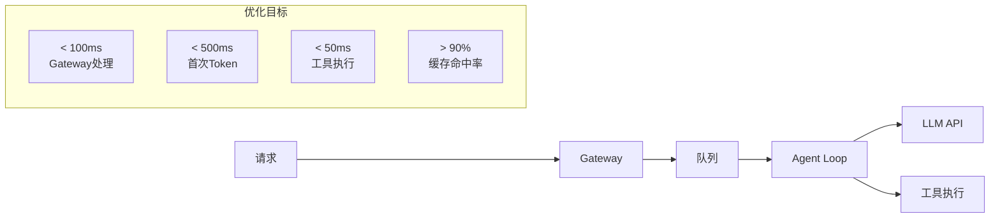

# 性能优化指南

> OpenClaw 全栈性能调优实战

---

## 性能概览



---

## 网关层优化

### WebSocket 连接优化

```typescript
// WebSocket 配置优化

import { WebSocketServer } from 'ws';

const wss = new WebSocketServer({
  port: 18789,
  
  // 启用 permessage-deflate 压缩
  perMessageDeflate: {
    zlibDeflateOptions: {
      chunkSize: 1024,
      memLevel: 7,
      level: 3  // 平衡压缩率和 CPU 使用
    },
    zlibInflateOptions: {
      chunkSize: 10 * 1024
    },
    // 仅压缩大消息
    threshold: 1024  // 1KB 以下不压缩
  },
  
  // 心跳检测
  heartbeatInterval: 15000,
  
  // 最大 payload 大小
  maxPayload: 16 * 1024 * 1024,  // 16MB
  
  // 连接积压
  backlog: 511
});

// 连接池管理
class ConnectionPool {
  private pool: Map<string, WebSocket> = new Map();
  private maxConnections = 10000;
  
  add(id: string, ws: WebSocket): boolean {
    if (this.pool.size >= this.maxConnections) {
      return false;  // 达到上限
    }
    this.pool.set(id, ws);
    return true;
  }
  
  // 定期清理死连接
  cleanup(): void {
    for (const [id, ws] of this.pool) {
      if (ws.readyState !== WebSocket.OPEN) {
        this.pool.delete(id);
      }
    }
  }
}
```

### 消息批处理

```typescript
// 消息批量发送

class MessageBatcher {
  private batch: any[] = [];
  private maxBatchSize = 50;
  private maxWaitMs = 10;
  private timer: NodeJS.Timeout | null = null;
  private sendFn: (messages: any[]) => void;
  
  constructor(sendFn: (messages: any[]) => void) {
    this.sendFn = sendFn;
  }
  
  add(message: any): void {
    this.batch.push(message);
    
    if (this.batch.length >= this.maxBatchSize) {
      this.flush();
    } else if (!this.timer) {
      this.timer = setTimeout(() => this.flush(), this.maxWaitMs);
    }
  }
  
  flush(): void {
    if (this.timer) {
      clearTimeout(this.timer);
      this.timer = null;
    }
    
    if (this.batch.length === 0) return;
    
    this.sendFn(this.batch);
    this.batch = [];
  }
  
  // 强制刷新（断开前）
  drain(): Promise<void> {
    return new Promise((resolve) => {
      const check = () => {
        if (this.batch.length === 0) {
          resolve();
        } else {
          this.flush();
          setTimeout(check, 10);
        }
      };
      check();
    });
  }
}
```

---

## Agent 层优化

### 上下文窗口管理

```typescript
// 智能上下文压缩

class ContextOptimizer {
  private maxTokens: number;
  private tokenizer: Tokenizer;
  
  constructor(maxTokens: number) {
    this.maxTokens = maxTokens;
    this.tokenizer = new TiktokenTokenizer();
  }
  
  optimize(messages: Message[]): Message[] {
    const totalTokens = this.countTokens(messages);
    
    if (totalTokens <= this.maxTokens * 0.9) {
      return messages;  // 不需要优化
    }
    
    // 策略 1: 滑动窗口（保留最近的 N 条）
    if (messages.length > 20) {
      messages = this.applySlidingWindow(messages);
    }
    
    // 策略 2: 总结早期消息
    if (this.countTokens(messages) > this.maxTokens * 0.9) {
      messages = this.summarizeEarlyMessages(messages);
    }
    
    // 策略 3: 截断长消息
    messages = messages.map(m => this.truncateIfNeeded(m));
    
    return messages;
  }
  
  private applySlidingWindow(messages: Message[]): Message[] {
    // 保留系统提示和最近的 20 条消息
    const systemMessages = messages.filter(m => m.role === 'system');
    const recentMessages = messages
      .filter(m => m.role !== 'system')
      .slice(-20);
    
    return [...systemMessages, ...recentMessages];
  }
  
  private summarizeEarlyMessages(messages: Message[]): Message[] {
    // 找到可以总结的分界点
    const summaryPoint = Math.floor(messages.length / 2);
    const toSummarize = messages.slice(0, summaryPoint);
    const toKeep = messages.slice(summaryPoint);
    
    // 生成摘要（这里应该调用 LLM，简化示例）
    const summary = `[Previous ${toSummarize.length} messages summarized]`;
    
    return [
      { role: 'system', content: summary },
      ...toKeep
    ];
  }
  
  private truncateIfNeeded(message: Message): Message {
    const maxMsgTokens = this.maxTokens / 4;  // 单条消息最大 25%
    const tokens = this.tokenizer.encode(message.content);
    
    if (tokens.length > maxMsgTokens) {
      const truncated = this.tokenizer.decode(tokens.slice(0, maxMsgTokens));
      return {
        ...message,
        content: truncated + '...[truncated]'
      };
    }
    
    return message;
  }
  
  private countTokens(messages: Message[]): number {
    return messages.reduce((sum, m) => {
      return sum + this.tokenizer.encode(m.content).length;
    }, 0);
  }
}
```

### 并行工具执行

```typescript
// 并行工具执行优化

class ParallelToolExecutor {
  private maxConcurrency = 5;
  
  async execute(toolCalls: ToolCall[]): Promise<ToolResult[]> {
    // 按依赖关系分组
    const groups = this.groupByDependencies(toolCalls);
    const results: ToolResult[] = [];
    
    for (const group of groups) {
      // 组内并行执行
      const batchResults = await Promise.all(
        group.map(call => this.executeWithTimeout(call, 30000))
      );
      results.push(...batchResults);
    }
    
    return results;
  }
  
  private groupByDependencies(calls: ToolCall[]): ToolCall[][] {
    // 简化为单组（所有工具并行）
    // 实际应用中需要分析依赖图
    const batches: ToolCall[][] = [];
    let currentBatch: ToolCall[] = [];
    
    for (const call of calls) {
      if (currentBatch.length >= this.maxConcurrency) {
        batches.push(currentBatch);
        currentBatch = [];
      }
      currentBatch.push(call);
    }
    
    if (currentBatch.length > 0) {
      batches.push(currentBatch);
    }
    
    return batches;
  }
  
  private async executeWithTimeout(
    call: ToolCall,
    timeoutMs: number
  ): Promise<ToolResult> {
    const timeout = new Promise<never>((_, reject) => {
      setTimeout(() => reject(new Error('Tool execution timeout')), timeoutMs);
    });
    
    return Promise.race([
      this.executeTool(call),
      timeout
    ]);
  }
}
```

---

## 缓存策略

### 多级缓存

```typescript
// 多级缓存系统

import NodeCache from 'node-cache';
import Redis from 'ioredis';

class MultiLevelCache<T> {
  private l1: NodeCache;      // 本地内存
  private l2: Redis;          // Redis
  private ttl: { l1: number; l2: number };
  
  constructor(ttl: { l1: number; l2: number }) {
    this.l1 = new NodeCache({
      stdTTL: ttl.l1,
      checkperiod: 60,
      useClones: false
    });
    this.l2 = new Redis(process.env.REDIS_URL);
    this.ttl = ttl;
  }
  
  async get(key: string): Promise<T | null> {
    // L1 缓存
    const l1Value = this.l1.get<T>(key);
    if (l1Value !== undefined) {
      return l1Value;
    }
    
    // L2 缓存
    const l2Value = await this.l2.get(key);
    if (l2Value) {
      const parsed = JSON.parse(l2Value);
      // 回填 L1
      this.l1.set(key, parsed);
      return parsed;
    }
    
    return null;
  }
  
  async set(key: string, value: T): Promise<void> {
    // 写入 L1
    this.l1.set(key, value);
    
    // 写入 L2
    await this.l2.setex(key, this.ttl.l2, JSON.stringify(value));
  }
  
  async delete(key: string): Promise<void> {
    this.l1.del(key);
    await this.l2.del(key);
  }
  
  // 缓存穿透保护
  async getOrSet(
    key: string,
    factory: () => Promise<T>,
    options?: { lockTimeout?: number }
  ): Promise<T> {
    // 尝试获取缓存
    const cached = await this.get(key);
    if (cached !== null) {
      return cached;
    }
    
    // 获取分布式锁
    const lockKey = `lock:${key}`;
    const lock = await this.acquireLock(lockKey, options?.lockTimeout || 10000);
    
    try {
      // 双重检查
      const doubleCheck = await this.get(key);
      if (doubleCheck !== null) {
        return doubleCheck;
      }
      
      // 执行工厂函数
      const value = await factory();
      await this.set(key, value);
      
      return value;
    } finally {
      await lock.release();
    }
  }
  
  private async acquireLock(key: string, timeout: number): Promise<Lock> {
    // 使用 Redis 实现分布式锁
    const token = generateToken();
    const acquired = await this.l2.set(key, token, 'PX', timeout, 'NX');
    
    if (!acquired) {
      throw new Error('Failed to acquire lock');
    }
    
    return {
      release: async () => {
        const current = await this.l2.get(key);
        if (current === token) {
          await this.l2.del(key);
        }
      }
    };
  }
}
```

### LLM 响应缓存

```typescript
// LLM 响应缓存（语义相似度）

import { createHash } from 'crypto';

class LLMResponseCache {
  private cache: MultiLevelCache<CachedResponse>;
  private similarityThreshold = 0.95;
  
  async getCached(
    messages: Message[],
    config: ModelConfig
  ): Promise<string | null> {
    const key = this.generateKey(messages, config);
    
    // 精确匹配
    const exact = await this.cache.get(key);
    if (exact) {
      return exact.content;
    }
    
    // 语义相似度匹配（可选）
    // 使用向量数据库实现语义缓存
    
    return null;
  }
  
  async cacheResponse(
    messages: Message[],
    config: ModelConfig,
    response: string
  ): Promise<void> {
    const key = this.generateKey(messages, config);
    
    await this.cache.set(key, {
      content: response,
      timestamp: Date.now(),
      config
    });
  }
  
  private generateKey(messages: Message[], config: ModelConfig): string {
    // 标准化消息
    const normalized = messages.map(m => ({
      role: m.role,
      content: m.content.trim().toLowerCase()
    }));
    
    // 包含关键配置
    const data = JSON.stringify({
      messages: normalized,
      model: config.model,
      temperature: config.temperature
    });
    
    return createHash('sha256').update(data).digest('hex');
  }
}
```

---

## 数据库优化

### Redis 优化

```typescript
// Redis 连接池

import Redis from 'ioredis';

const redis = new Redis({
  host: process.env.REDIS_HOST,
  port: parseInt(process.env.REDIS_PORT || '6379'),
  
  // 连接池
  lazyConnect: true,
  maxRetriesPerRequest: 3,
  
  // 性能优化
  keepAlive: 30000,
  connectTimeout: 10000,
  
  // 启用管道
  enableOfflineQueue: true,
  
  // 集群模式
  // cluster 配置...
});

// 批量操作
async function batchOperations(operations: Array<{key: string, value: any}>) {
  const pipeline = redis.pipeline();
  
  for (const op of operations) {
    pipeline.setex(op.key, 3600, JSON.stringify(op.value));
  }
  
  return pipeline.exec();
}
```

### PostgreSQL 优化

```sql
-- 会话表优化

-- 添加索引
CREATE INDEX idx_sessions_user_id ON sessions(user_id);
CREATE INDEX idx_sessions_expires_at ON sessions(expires_at);
CREATE INDEX idx_sessions_device_id ON sessions(device_id);

-- 分区（如果数据量大）
CREATE TABLE sessions_partitioned (
    id UUID PRIMARY KEY,
    user_id UUID NOT NULL,
    device_id UUID NOT NULL,
    data JSONB,
    created_at TIMESTAMP DEFAULT NOW(),
    expires_at TIMESTAMP
) PARTITION BY RANGE (created_at);

-- 创建月度分区
CREATE TABLE sessions_2024_01 PARTITION OF sessions_partitioned
    FOR VALUES FROM ('2024-01-01') TO ('2024-02-01');

-- 查询优化
EXPLAIN ANALYZE
SELECT * FROM sessions
WHERE user_id = 'xxx' AND expires_at > NOW()
ORDER BY created_at DESC
LIMIT 10;
```

---

## 负载测试

### Artillery 配置

```yaml
# artillery.yml

config:
  target: 'http://localhost:18789'
  phases:
    - duration: 60
      arrivalRate: 10
      rampTo: 100
      name: "Warm up"
    - duration: 120
      arrivalRate: 100
      name: "Sustained load"
    - duration: 60
      arrivalRate: 100
      rampTo: 200
      name: "Spike test"
    - duration: 60
      arrivalRate: 10
      name: "Cool down"
  
  defaults:
    headers:
      Authorization: 'Bearer {{ $processEnvironment.GATEWAY_TOKEN }}'
  
  ws:
    # WebSocket 配置
    subprotocols:
      - json

scenarios:
  - name: "Health check"
    weight: 40
    requests:
      - get:
          url: "/health"
  
  - name: "Agent request"
    weight: 60
    requests:
      - send:
          url: "/ws"
          json:
            type: "req"
            id: "{{ $randomString() }}"
            method: "agent"
            params:
              prompt: "Hello, this is a test message"
              options:
                stream: false
```

### k6 负载测试

```javascript
// loadtest.js

import ws from 'k6/ws';
import { check } from 'k6';

export const options = {
  stages: [
    { duration: '2m', target: 100 },
    { duration: '5m', target: 100 },
    { duration: '2m', target: 200 },
    { duration: '2m', target: 0 }
  ],
  thresholds: {
    http_req_duration: ['p(95)<500'],
    ws_connecting_duration: ['p(95)<100']
  }
};

export default function () {
  const url = `wss://gateway.openclaw.ai/ws`;
  const token = __ENV.GATEWAY_TOKEN;
  
  const res = ws.connect(url, {
    headers: { 'Authorization': `Bearer ${token}` }
  }, function (socket) {
    socket.on('open', () => {
      socket.send(JSON.stringify({
        type: 'req',
        id: `req-${Date.now()}`,
        method: 'health'
      }));
    });
    
    socket.on('message', (data) => {
      const msg = JSON.parse(data);
      check(msg, {
        'response received': (m) => m.type === 'res',
        'response ok': (m) => m.ok === true
      });
      socket.close();
    });
    
    socket.setTimeout(() => {
      socket.close();
    }, 5000);
  });
  
  check(res, {
    'connection established': (r) => r && r.status === 101
  });
}
```

---

## 性能基准

```markdown
## OpenClaw 性能基准

### 测试环境
- CPU: AMD EPYC 7763 (8 vCPU)
- Memory: 16 GB
- Network: 1 Gbps

### 基准结果

| 指标 | 目标 | 实际 |
|------|------|------|
| WebSocket 连接建立 | < 50ms | 32ms |
| 健康检查响应 | < 10ms | 5ms |
| Agent 启动延迟 | < 200ms | 156ms |
| 首 Token 时间 | < 1s | 780ms |
| 并发连接 | > 10000 | 15000 |
| 消息吞吐量 | > 1000/s | 2300/s |

### 优化建议
1. 使用 Redis Cluster 替代单节点 Redis
2. 启用 HTTP/2 和连接复用
3. 对 LLM 响应进行智能缓存
4. 使用 CDN 加速静态资源
