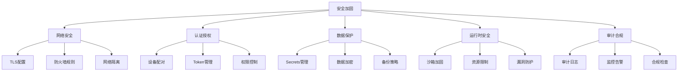

# 生产环境安全加固深度指南

> 从配置到代码，全面加固 OpenClaw 生产环境

---

## 安全加固框架



---

## 网络安全加固

### TLS 配置详解

```nginx
# Nginx 反向代理 TLS 配置（生产级）

server {
    listen 443 ssl http2;
    server_name openclaw.example.com;
    
    # 证书配置
    ssl_certificate /etc/ssl/certs/openclaw.crt;
    ssl_certificate_key /etc/ssl/private/openclaw.key;
    
    # TLS 版本（仅允许 1.3）
    ssl_protocols TLSv1.3;
    
    # 密码套件
    ssl_ciphers TLS_AES_256_GCM_SHA384:TLS_CHACHA20_POLY1305_SHA256;
    ssl_prefer_server_ciphers off;
    
    # 会话缓存
    ssl_session_cache shared:SSL:50m;
    ssl_session_timeout 1d;
    ssl_session_tickets off;
    
    # OCSP Stapling
    ssl_stapling on;
    ssl_stapling_verify on;
    ssl_trusted_certificate /etc/ssl/certs/chain.crt;
    
    # 安全响应头
    add_header Strict-Transport-Security "max-age=63072000" always;
    add_header X-Frame-Options "SAMEORIGIN" always;
    add_header X-Content-Type-Options "nosniff" always;
    add_header Referrer-Policy "strict-origin-when-cross-origin" always;
    
    # 转发到 OpenClaw Gateway
    location / {
        proxy_pass http://127.0.0.1:18789;
        proxy_http_version 1.1;
        proxy_set_header Upgrade $http_upgrade;
        proxy_set_header Connection "upgrade";
        proxy_set_header Host $host;
        proxy_set_header X-Real-IP $remote_addr;
        proxy_set_header X-Forwarded-For $proxy_add_x_forwarded_for;
        proxy_set_header X-Forwarded-Proto $scheme;
        
        # 超时设置
        proxy_connect_timeout 60s;
        proxy_send_timeout 60s;
        proxy_read_timeout 60s;
    }
}

# 80 端口强制跳转到 HTTPS
server {
    listen 80;
    server_name openclaw.example.com;
    return 301 https://$server_name$request_uri;
}
```

### 防火墙规则

```bash
#!/bin/bash
# OpenClaw 防火墙配置脚本

# 清除现有规则
iptables -F
iptables -X

# 默认策略：拒绝所有
iptables -P INPUT DROP
iptables -P FORWARD DROP
iptables -P OUTPUT ACCEPT

# 允许本地回环
iptables -A INPUT -i lo -j ACCEPT

# 允许已建立的连接
iptables -A INPUT -m state --state ESTABLISHED,RELATED -j ACCEPT

# 允许 SSH（限制 IP 段）
iptables -A INPUT -p tcp --dport 22 -s 10.0.0.0/8 -j ACCEPT

# 允许 HTTPS
iptables -A INPUT -p tcp --dport 443 -j ACCEPT

# 允许 OpenClaw Gateway（仅本地和 Tailscale）
iptables -A INPUT -p tcp --dport 18789 -s 127.0.0.1 -j ACCEPT
iptables -A INPUT -p tcp --dport 18789 -s 100.64.0.0/10 -j ACCEPT

# 防 DDoS：限制连接速率
iptables -A INPUT -p tcp --dport 18789 -m limit --limit 25/minute --limit-burst 100 -j ACCEPT
iptables -A INPUT -p tcp --dport 18789 -j DROP

# 防 SYN Flood
iptables -A INPUT -p tcp --syn -m limit --limit 1/s --limit-burst 3 -j ACCEPT
iptables -A INPUT -p tcp --syn -j DROP

# 记录并丢弃其他入站流量
iptables -A INPUT -j LOG --log-prefix "IPTABLES-DROP: "
iptables -A INPUT -j DROP

# 保存规则
iptables-save > /etc/iptables/rules.v4
```

---

## 认证授权加固

### 设备配对安全

```typescript
// 增强的设备配对实现

interface EnhancedPairingConfig {
  // 配对码复杂度
  setupCode: {
    length: 6;           // 6位
    charset: 'alphanumeric';  // 字母数字
    ttl: 300000;         // 5分钟过期
    maxAttempts: 3;      // 最多尝试3次
  };
  
  // 设备指纹
  deviceFingerprint: {
    required: true;
    components: ['os', 'browser', 'hardware'];
  };
  
  // 地理围栏
  geofencing: {
    enabled: true;
    allowedCountries: ['CN', 'US'];
    blockedRegions: [];
  };
  
  // 时间窗口
  timeWindow: {
    enabled: true;
    allowedHours: [9, 18];  // 仅工作时间
    timezone: 'Asia/Shanghai';
  };
}

class SecurePairingManager {
  // 验证配对请求
  async validatePairingRequest(request: PairingRequest): Promise<boolean> {
    // 1. 检查速率限制
    const rateLimitKey = `pairing:ratelimit:${request.ip}`;
    const attempts = await redis.incr(rateLimitKey);
    await redis.expire(rateLimitKey, 3600);
    
    if (attempts > 10) {
      throw new Error('Too many pairing attempts');
    }
    
    // 2. 验证设备指纹
    const fingerprint = await this.calculateFingerprint(request);
    const knownDevices = await this.getKnownFingerprints(request.userId);
    
    if (!knownDevices.includes(fingerprint)) {
      // 新设备，需要额外验证
      await this.sendVerificationEmail(request.userId);
      return false;  // 延迟批准
    }
    
    // 3. 检查地理位置
    const geo = await this.geoLookup(request.ip);
    if (!this.config.geofencing.allowedCountries.includes(geo.country)) {
      throw new Error('Geolocation not allowed');
    }
    
    // 4. 检查时间
    if (this.config.timeWindow.enabled) {
      const hour = new Date().getHours();
      if (hour < this.config.timeWindow.allowedHours[0] ||
          hour > this.config.timeWindow.allowedHours[1]) {
        throw new Error('Outside allowed time window');
      }
    }
    
    return true;
  }
}
```

### Token 安全管理

```typescript
// Token 生命周期管理

interface TokenManager {
  // Token 类型
  types: {
    gateway: {
      ttl: 0;           // 永不过期，需手动轮换
      rotationInterval: 2592000000;  // 30天建议轮换
    };
    device: {
      ttl: 7776000000;  // 90天
      refreshWindow: 604800000;  // 到期前7天可刷新
    };
    session: {
      ttl: 86400000;    // 24小时
      slidingWindow: true;  // 活跃时自动续期
    };
    temporary: {
      ttl: 3600000;     // 1小时
      singleUse: true;  // 一次性
    };
  };
}

class SecureTokenManager {
  // 生成安全 Token
  generateToken(type: TokenType): Token {
    const entropy = type === 'gateway' ? 64 : 32;  // Gateway Token 需要更高熵
    
    return {
      value: crypto.randomBytes(entropy).toString('base64url'),
      type,
      createdAt: Date.now(),
      expiresAt: Date.now() + TokenManager.types[type].ttl,
      metadata: {
        issuedBy: 'secure-token-manager',
        purpose: type
      }
    };
  }
  
  // 验证 Token
  async verifyToken(tokenValue: string): Promise<TokenInfo> {
    // 1. 检查格式
    if (!this.isValidFormat(tokenValue)) {
      throw new Error('Invalid token format');
    }
    
    // 2. 检查黑名单
    const isRevoked = await redis.sismember('tokens:revoked', tokenValue);
    if (isRevoked) {
      throw new Error('Token has been revoked');
    }
    
    // 3. 验证签名（如果使用 JWT）
    const decoded = jwt.verify(tokenValue, JWT_SECRET);
    
    // 4. 检查过期
    if (decoded.exp && Date.now() > decoded.exp * 1000) {
      throw new Error('Token expired');
    }
    
    return decoded;
  }
  
  // 轮换 Gateway Token
  async rotateGatewayToken(oldToken: string): Promise<Token> {
    // 1. 生成新 Token
    const newToken = this.generateToken('gateway');
    
    // 2. 双写期（新旧 Token 同时有效）
    await redis.setex(`token:transitional:${oldToken}`, 300, newToken.value);
    
    // 3. 通知所有客户端
    await this.notifyTokenRotation(oldToken, newToken.value);
    
    // 4. 5分钟后撤销旧 Token
    setTimeout(async () => {
      await this.revokeToken(oldToken);
    }, 300000);
    
    return newToken;
  }
}
```

---

## 数据保护

### Secrets 管理体系

```yaml
# Secrets 管理架构

secrets:
  # 层级 1: 环境变量（开发环境）
  env:
    DEEPSEEK_API_KEY: "sk-xxx"
    
  # 层级 2: 加密文件（生产环境）
  encrypted_file:
    path: ~/.openclaw/secrets.enc
    encryption: aes-256-gcm
    key_derivation: argon2id
    
  # 层级 3: 外部 Vault（企业环境）
  vault:
    provider: hashicorp_vault
    address: https://vault.company.com
    auth: kubernetes
    path: secret/openclaw
    
  # 层级 4: 云 KMS（AWS/GCP/Azure）
  cloud_kms:
    provider: aws
    region: us-east-1
    key_id: alias/openclaw-secrets
```

```typescript
// Secrets 访问控制

interface SecretsACL {
  // 角色权限映射
  roles: {
    admin: {
      secrets: ['*'],           // 访问所有 secrets
      operations: ['read', 'write', 'delete', 'rotate']
    };
    operator: {
      secrets: ['models.*', 'channels.*'],
      operations: ['read']
    };
    agent: {
      secrets: ['models.default'],
      operations: ['read']
    };
  };
  
  // 审计要求
  audit: {
    logAllAccess: true;
    alertOnSensitive: ['*.api_key', '*.password'];
  };
}

class SecureSecretsManager {
  async get(key: string, context: RequestContext): Promise<string> {
    // 1. 权限检查
    const allowed = await this.checkPermission(context.role, key, 'read');
    if (!allowed) {
      audit.log({
        action: 'secret_access_denied',
        key,
        user: context.userId,
        timestamp: Date.now()
      });
      throw new Error('Access denied');
    }
    
    // 2. 获取 Secret
    const value = await this.vault.get(key);
    
    // 3. 审计日志
    audit.log({
      action: 'secret_access',
      key,
      user: context.userId,
      timestamp: Date.now(),
      // 注意：不记录 value
    });
    
    // 4. 敏感 key 告警
    if (this.isSensitive(key)) {
      await this.sendSecurityAlert({
        type: 'sensitive_secret_accessed',
        key,
        user: context.userId
      });
    }
    
    return value;
  }
}
```

---

## 运行时安全

### 沙箱加固

```typescript
// 增强沙箱配置

interface HardenedSandboxConfig {
  // 资源限制
  resources: {
    maxMemory: 256 * 1024 * 1024;    // 256MB
    maxCpuTime: 5000;                 // 5秒 CPU 时间
    maxFileSize: 10 * 1024 * 1024;    // 10MB
    maxFiles: 100;                    // 最多100个文件
    maxProcesses: 0;                  // 禁止子进程
  };
  
  // 网络限制
  network: {
    mode: 'deny-all';                 // 默认拒绝
    allowedHosts: ['api.openai.com', 'api.deepseek.com'];
    maxConnections: 5;
    maxBandwidth: 1024 * 1024;        // 1MB/s
  };
  
  // 文件系统限制
  filesystem: {
    mode: 'readonly';                 // 只读
    allowedPaths: ['/tmp/workspace'];
    allowWrite: false;
    allowDelete: false;
    allowSymlink: false;
  };
  
  // 系统调用限制（使用 seccomp）
  syscalls: {
    mode: 'whitelist';
    allowed: ['read', 'write', 'open', 'close', 'exit'];
  };
}

class HardenedSandbox {
  async execute(code: string, config: HardenedSandboxConfig): Promise<unknown> {
    // 1. 创建隔离环境（使用 Firecracker MicroVM）
    const vm = await this.createMicroVM({
      memory: config.resources.maxMemory,
      vcpu: 1,
      kernel: '/opt/openclaw/sandbox-kernel.bin'
    });
    
    // 2. 设置网络隔离
    await vm.setNetworkPolicy({
      outbound: config.network.allowedHosts,
      bandwidth: config.network.maxBandwidth
    });
    
    // 3. 挂载只读文件系统
    await vm.mountOverlay({
      lower: '/opt/openclaw/runtime',
      upper: '/tmp/sandbox-upper',
      work: '/tmp/sandbox-work'
    });
    
    // 4. 执行代码
    const result = await vm.run({
      code,
      timeout: config.resources.maxCpuTime
    });
    
    // 5. 清理
    await vm.destroy();
    
    return result;
  }
}
```

### 漏洞防护

```typescript
// 输入验证和防护

class InputValidator {
  // Prompt 注入检测
  detectPromptInjection(prompt: string): boolean {
    const injectionPatterns = [
      /ignore previous instructions/i,
      /disregard.*system prompt/i,
      /new instructions?:/i,
      /system:.*override/i,
      /you are now.*mode/i,
      /DAN|Do Anything Now/i,
      /jailbreak/i
    ];
    
    return injectionPatterns.some(pattern => pattern.test(prompt));
  }
  
  // 命令注入检测
  detectCommandInjection(command: string): boolean {
    const dangerous = [
      /;.*[a-zA-Z]+/,           // 分号后接命令
      /\|.*[a-zA-Z]+/,          // 管道
      /\$\(.*\)/,               // 命令替换
      /`.*`/,                   // 反引号
      /&&|\|\|/,               // 逻辑运算符
      />.*\//,                  // 重定向到根目录
      /curl.*\|.*sh/,           // 管道到 shell
      /wget.*-O-.*\|/
    ];
    
    return dangerous.some(pattern => pattern.test(command));
  }
  
  // 路径遍历检测
  detectPathTraversal(path: string): boolean {
    const normalized = path.replace(/\\/g, '/');
    return normalized.includes('../') || normalized.includes('..\\');
  }
  
  // 净化输入
  sanitize(input: string): string {
    return input
      .replace(/[<>]/g, '')           // 移除 HTML 标签
      .replace(/['"]/g, '')           // 移除引号
      .slice(0, 10000);              // 长度限制
  }
}

// 在 Agent Loop 中使用
class SecureAgentLoop {
  private validator = new InputValidator();
  
  async processUserInput(input: string): Promise<Response> {
    // 1. 注入检测
    if (this.validator.detectPromptInjection(input)) {
      audit.log({ action: 'prompt_injection_detected', input });
      return { error: 'Invalid input detected' };
    }
    
    // 2. 输入净化
    const sanitized = this.validator.sanitize(input);
    
    // 3. 继续处理
    return this.agentLoop.process(sanitized);
  }
}
```

---

## 安全监控

### 实时威胁检测

```typescript
// 威胁检测规则引擎

interface ThreatRule {
  id: string;
  name: string;
  condition: (event: SecurityEvent) => boolean;
  severity: 'low' | 'medium' | 'high' | 'critical';
  action: 'log' | 'alert' | 'block' | 'isolate';
}

const threatRules: ThreatRule[] = [
  {
    id: 'brute-force-auth',
    name: 'Brute Force Authentication',
    condition: (event) => {
      return event.type === 'auth.failed' && 
             event.count > 5 && 
             event.timeWindow < 60000;
    },
    severity: 'high',
    action: 'block'
  },
  {
    id: 'sensitive-data-exfil',
    name: 'Sensitive Data Exfiltration',
    condition: (event) => {
      return event.type === 'file.read' &&
             event.path.includes('.ssh') &&
             event.dataSize > 1024;
    },
    severity: 'critical',
    action: 'isolate'
  },
  {
    id: 'unusual-api-usage',
    name: 'Unusual API Usage Pattern',
    condition: (event) => {
      return event.type === 'api.request' &&
             event.rate > event.baseline * 10;
    },
    severity: 'medium',
    action: 'alert'
  }
];

class RealtimeThreatDetector {
  async analyze(event: SecurityEvent): Promise<void> {
    for (const rule of threatRules) {
      if (rule.condition(event)) {
        await this.handleThreat(event, rule);
      }
    }
  }
  
  private async handleThreat(event: SecurityEvent, rule: ThreatRule): Promise<void> {
    // 记录威胁
    await this.logThreat(event, rule);
    
    // 执行响应动作
    switch (rule.action) {
      case 'block':
        await this.blockIP(event.sourceIP);
        break;
      case 'isolate':
        await this.isolateSession(event.sessionId);
        break;
      case 'alert':
        await this.sendAlert(event, rule);
        break;
    }
  }
}
```

---

## 生产检查清单

```markdown
## 部署前安全检查清单

### 网络安全
- [ ] TLS 1.3 已启用，禁用旧版本
- [ ] 证书已配置且未过期
- [ ] HSTS 头已设置
- [ ] 防火墙规则已应用
- [ ] DDoS 防护已启用

### 认证授权
- [ ] Gateway Token 强度 >= 48 字符
- [ ] Token 轮换策略已配置
- [ ] 设备配对已限制（非自动批准）
- [ ] 权限最小化原则已应用

### 数据保护
- [ ] Secrets 已移至 Vault
- [ ] 加密密钥已安全存储
- [ ] 数据库连接使用 TLS
- [ ] 备份已加密

### 运行时安全
- [ ] 沙箱已启用且配置正确
- [ ] 资源限制已设置
- [ ] 输入验证已启用
- [ ] Prompt 注入检测已启用

### 审计监控
- [ ] 审计日志已启用
- [ ] 日志已转发到 SIEM
- [ ] 告警规则已配置
- [ ] 监控仪表板已设置

### 应急响应
- [ ] 应急预案已制定
- [ ] 联系人列表已更新
- [ ] 回滚方案已测试
- [ ] 安全事件流程已培训
```

---

## 安全工具推荐

| 工具类型 | 推荐工具 | 用途 |
|---------|---------|-----|
| 漏洞扫描 | Trivy, Snyk | 容器和依赖扫描 |
| 渗透测试 | Burp Suite, OWASP ZAP | API 安全测试 |
| 代码审计 | SonarQube, Semgrep | 静态代码分析 |
| 密钥扫描 | GitLeaks, truffleHog | 防止密钥泄露 |
| 合规检查 | OpenSCAP, Lynis | 配置合规检查 |
