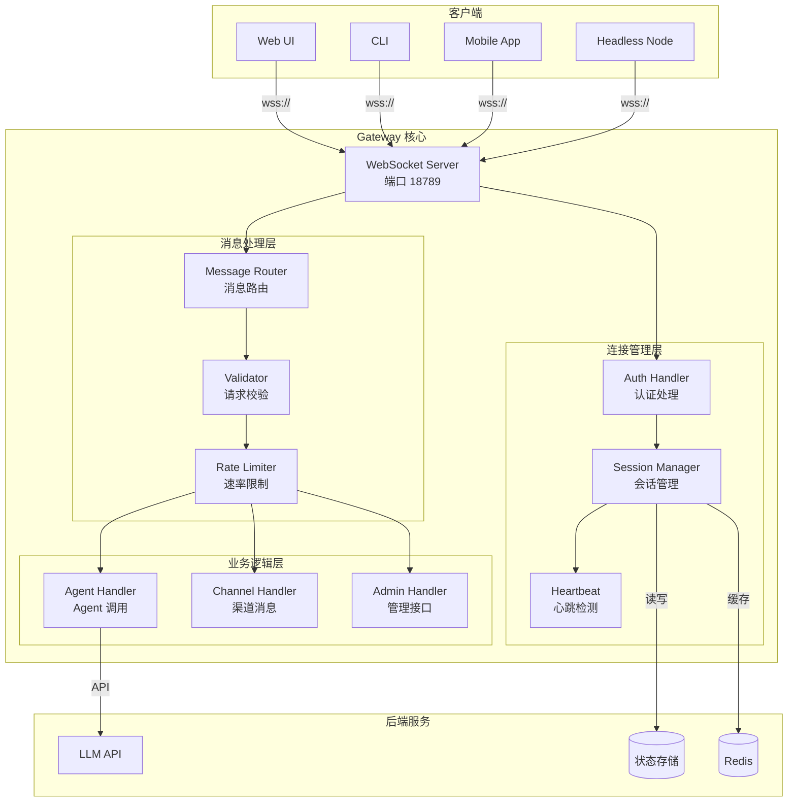
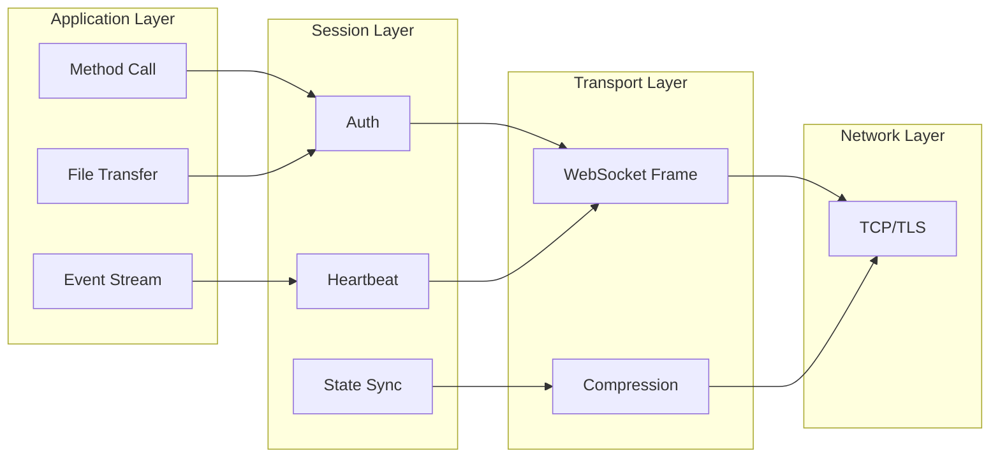
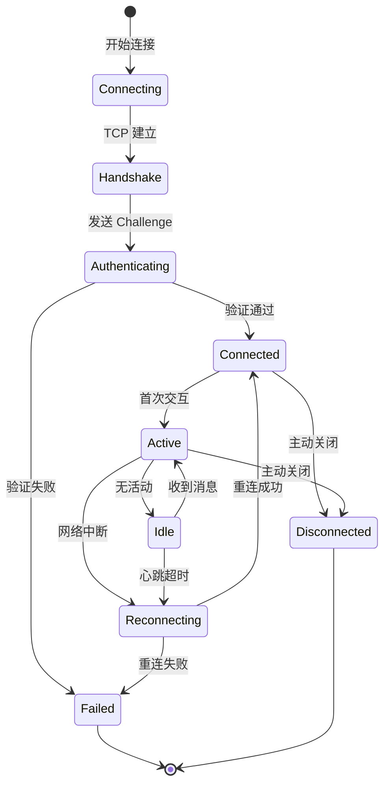

# Gateway 架构与协议详解

> 深度解析 OpenClaw Gateway 的协议设计、安全机制与扩展点

---

## Gateway 架构全景



### 协议分层模型



### 连接状态机



---

## 协议设计哲学

### 为什么选择 WebSocket + JSON？

```
┌─────────────────────────────────────────────────────────────────────┐
│                    协议选型对比分析                                   │
├─────────────────────────────────────────────────────────────────────┤
│                                                                     │
│  候选方案                    优点              缺点                  │
│  ─────────────────────────────────────────────────────────────      │
│  HTTP REST                   简单、缓存友好     实时性差、轮询开销    │
│  HTTP/2 SSE                  单向流、标准      服务端推送弱           │
│  gRPC                        高性能、强类型     浏览器支持差、代理难  │
│  WebSocket                   双向实时、低延迟   需处理重连、状态管理  │
│                                                                     │
│  OpenClaw 选择 WebSocket 的原因：                                    │
│  1. 真正的双向通信（客户端主动发送命令）                              │
│  2. 低延迟要求高（AI 实时响应）                                       │
│  3. 需要维护客户端状态（订阅、会话关联）                              │
│  4. 流式响应支持（逐字输出体验）                                      │
│                                                                     │
│  为什么选择 JSON 而非 Protobuf？                                     │
│  - 调试友好（可读性强）                                               │
│  - Web 生态原生支持                                                   │
│  - 性能损失在现代硬件上可接受                                         │
│  - 协议版本兼容性易处理                                               │
│                                                                     │
└─────────────────────────────────────────────────────────────────────┘
```

---

## 协议分层架构

```
┌─────────────────────────────────────────────────────────────────────┐
│                        Gateway 协议栈                                │
├─────────────────────────────────────────────────────────────────────┤
│                                                                     │
│  Layer 4: Application                                               │
│  ├── 方法调用 (method invocation)                                    │
│  ├── 事件订阅 (event subscription)                                   │
│  └── 流式传输 (streaming)                                            │
│                                                                     │
│  Layer 3: Session                                                   │
│  ├── 设备配对 (device pairing)                                       │
│  ├── Token 认证 (token auth)                                         │
│  └── 心跳保活 (heartbeat)                                            │
│                                                                     │
│  Layer 2: Transport                                                 │
│  ├── WebSocket 帧                                                   │
│  ├── 压缩 (permessage-deflate)                                       │
│  └── 分片重组                                                        │
│                                                                     │
│  Layer 1: Network                                                   │
│  └── TCP/TLS                                                        │
│                                                                     │
└─────────────────────────────────────────────────────────────────────┘
```

---

## 连接生命周期详解

### 1. 握手阶段（基于源码 src/pairing/）

```typescript
// 完整的连接握手流程（简化自源码）

interface HandshakeFlow {
  // Step 1: WebSocket Upgrade
  // Client ─────WebSocket Upgrade─────> Gateway
  // Gateway ─────101 Switching───────> Client
  
  // Step 2: Challenge-Response（防重放攻击）
  // Gateway ─────{type: 'event', event: 'connect.challenge', 
  //               payload: {nonce, ts}}─────> Client
  
  // Step 3: Connect Request
  interface ConnectRequest {
    type: 'req';
    id: string;
    method: 'connect';
    params: {
      // 协议版本协商
      minProtocol: 3;
      maxProtocol: 3;
      
      // 客户端身份
      client: {
        id: string;        // 如 'cli', 'macos-app'
        version: string;   // 语义化版本
        platform: string;  // 'macos', 'ios', 'web'
        mode: 'operator' | 'node' | 'readonly';
      };
      
      // 权限声明
      role: string;
      scopes: string[];    // 如 ['operator.read', 'operator.write']
      
      // Node 特有
      caps?: string[];     // 能力列表
      commands?: string[]; // 支持的命令
      
      // 认证
      auth: {
        token?: string;        // Gateway Token（首次）
        deviceToken?: string;  // 设备令牌（后续）
      };
      
      // 设备指纹（用于配对）
      device: {
        id: string;
        publicKey: string;
        signature: string;     // 签名 nonce
        signedAt: number;      // 签名时间戳
        nonce: string;         // 服务端颁发的 challenge
      };
    };
  }
  
  // Step 4: Connect Response
  interface ConnectResponse {
    type: 'res';
    id: string;  // 对应请求 id
    ok: boolean;
    payload: {
      type: 'hello-ok';
      protocol: 3;
      policy: {
        tickIntervalMs: 15000;  // 心跳间隔
      };
      auth?: {
        deviceToken: string;    // 新设备返回 Token
        role: string;
        scopes: string[];
      };
    };
  }
}
```

### 2. 签名算法详解

```typescript
// 设备认证签名（基于 src/pairing/pairing-challenge.ts）

class DeviceAuthentication {
  // 签名载荷格式（防止跨平台重放）
  buildPayload(params: {
    deviceId: string;
    platform: string;
    nonce: string;
    timestamp: number;
  }): string {
    // 格式: deviceId:platform:nonce:timestamp
    return `${params.deviceId}:${params.platform}:${params.nonce}:${params.timestamp}`;
  }
  
  // 签名验证
  verifySignature(
    publicKey: string,
    payload: string,
    signature: string
  ): boolean {
    // 使用 Ed25519 或 ECDSA
    return crypto.verify(publicKey, payload, signature);
  }
  
  // 时间窗口验证（防重放）
  verifyTimestamp(signedAt: number): boolean {
    const now = Date.now();
    const maxAge = 5 * 60 * 1000; // 5 分钟
    return Math.abs(now - signedAt) < maxAge;
  }
}

// 为什么需要 platform 绑定？
// 防止攻击者将一个平台的配对凭证用于另一个平台
// 例如：iOS 的凭证不能在 Android 上使用
```

### 3. 心跳机制

```typescript
// 双向心跳设计

interface HeartbeatProtocol {
  // Gateway → Client (Tick)
  // 每 15 秒发送一次
  interface TickEvent {
    type: 'event';
    event: 'tick';
    payload: {
      timestamp: number;
      connections: number;  // 当前连接数
      queueSize: number;    // 待处理任务数
    };
  }
  
  // Client → Gateway (可选 Pong)
  // 客户端收到 Tick 后应在 5 秒内响应
  interface PongResponse {
    type: 'req';
    method: 'pong';
    params: {
      receivedAt: number;   // 收到 Tick 的时间
      clientTimestamp: number;
    };
  }
}

// 心跳超时处理
class HeartbeatMonitor {
  private lastPong = Date.now();
  private timeout = 30000; // 30 秒
  
  check(): void {
    if (Date.now() - this.lastPong > this.timeout) {
      // 超时，关闭连接
      this.closeConnection('heartbeat_timeout');
    }
  }
}
```

---

## 消息格式规范

### 请求帧（Client → Gateway）

```typescript
interface RequestFrame {
  type: 'req';
  id: string;              // 唯一请求 ID（UUID v4）
  method: string;          // 方法名
  params?: unknown;        // 参数（方法特定）
  idempotencyKey?: string; // 幂等键（用于重试）
  meta?: {
    traceId?: string;      // 分布式追踪
    clientTimestamp?: number;
  };
}

// 方法列表
const GatewayMethods = {
  // 系统方法
  'health': '健康检查',
  'status': '获取 Gateway 状态',
  'config.get': '获取配置',
  'config.set': '设置配置',
  
  // Agent 方法
  'agent': '启动 Agent 任务',
  'agent.cancel': '取消 Agent 任务',
  'agent.status': '获取 Agent 状态',
  
  // 消息方法
  'send': '发送消息',
  'history': '获取历史记录',
  
  // Node 方法（仅 Node 客户端）
  'node.invoke': '调用 Node 命令',
  'node.register': '注册 Node 能力'
} as const;
```

### 响应帧（Gateway → Client）

```typescript
interface ResponseFrame {
  type: 'res';
  id: string;              // 对应请求 ID
  ok: boolean;             // 是否成功
  payload?: unknown;       // 成功数据
  error?: {                // 错误信息
    code: ErrorCode;
    message: string;
    details?: unknown;
    retryable?: boolean;   // 是否可重试
    retryAfter?: number;   // 建议重试时间（秒）
  };
  meta?: {
    serverTimestamp: number;
    processingTime: number; // 处理耗时（毫秒）
  };
}

// 错误码定义
enum ErrorCode {
  // 认证错误
  UNAUTHORIZED = 'UNAUTHORIZED',
  TOKEN_EXPIRED = 'TOKEN_EXPIRED',
  DEVICE_NOT_PAIRED = 'DEVICE_NOT_PAIRED',
  
  // 请求错误
  INVALID_REQUEST = 'INVALID_REQUEST',
  METHOD_NOT_FOUND = 'METHOD_NOT_FOUND',
  INVALID_PARAMS = 'INVALID_PARAMS',
  
  // 限流错误
  RATE_LIMITED = 'RATE_LIMITED',
  QUEUE_FULL = 'QUEUE_FULL',
  
  // 运行时错误
  INTERNAL_ERROR = 'INTERNAL_ERROR',
  SERVICE_UNAVAILABLE = 'SERVICE_UNAVAILABLE',
  TIMEOUT = 'TIMEOUT'
}
```

### 事件帧（Gateway → Client，服务器主动推送）

```typescript
interface EventFrame {
  type: 'event';
  event: string;           // 事件类型
  payload: unknown;        // 事件数据
  seq?: number;            // 序列号（用于断线恢复）
  stateVersion?: number;   // 状态版本（乐观锁）
}

// 核心事件类型
interface GatewayEvents {
  // 系统事件
  'tick': { timestamp: number; connections: number; };
  'shutdown': { reason: string; restart: boolean; };
  'config.update': { key: string; value: unknown; };
  
  // Agent 事件
  'agent.run.started': { runId: string; agentId: string; };
  'agent.run.chunk': { runId: string; content: string; };
  'agent.run.completed': { runId: string; summary: string; };
  'agent.run.cancelled': { runId: string; reason: string; };
  'agent.run.error': { runId: string; error: ErrorInfo; };
  
  // 消息事件
  'chat.message': { message: IncomingMessage; };
  'chat.typing': { channel: string; sender: string; };
  
  // 状态事件
  'presence.update': { channel: string; status: 'online' | 'offline'; };
  'health.change': { component: string; status: 'healthy' | 'degraded' | 'unhealthy'; };
}
```

---

## 流式传输协议

### 场景：Agent 流式响应

```
Client                                  Gateway
  │                                       │
  │ ───── req:agent ───────────────────> │
  │    { prompt: "Hello" }                │
  │                                       │
  │ <──── res:ack ────────────────────── │
  │    { runId: "run_123" }               │
  │                                       │
  │ <──── event:agent.chunk ──────────── │
  │    { runId: "run_123", text: "Hi" }   │
  │                                       │
  │ <──── event:agent.chunk ──────────── │
  │    { runId: "run_123", text: "!" }    │
  │                                       │
  │ <──── event:agent.chunk ──────────── │
  │    { runId: "run_123", text: "How" }  │
  │                                       │
  │            ... 更多分片 ...           │
  │                                       │
  │ <──── res:agent.final ────────────── │
  │    { runId: "run_123", status: "ok" } │
```

### 实现细节

```typescript
// 流式处理中的背压控制

class StreamingController {
  private buffer: string[] = [];
  private clientPressure = 0;  // 客户端压力值
  private paused = false;
  
  // 接收 LLM 流
  onLLMChunk(chunk: string): void {
    if (this.paused) {
      // 客户端压力过大，缓冲
      this.buffer.push(chunk);
      return;
    }
    
    this.sendToClient(chunk);
    this.clientPressure++;
    
    // 压力阈值检查
    if (this.clientPressure > 100) {
      this.pauseStreaming();
    }
  }
  
  // 客户端确认接收
  onClientAck(seq: number): void {
    this.clientPressure--;
    
    if (this.paused && this.clientPressure < 50) {
      this.resumeStreaming();
    }
  }
  
  private pauseStreaming(): void {
    this.paused = true;
    this.llmStream.pause();
  }
  
  private resumeStreaming(): void {
    this.paused = false;
    // 发送缓冲区内容
    while (this.buffer.length > 0 && !this.paused) {
      this.sendToClient(this.buffer.shift()!);
    }
    this.llmStream.resume();
  }
}
```

---

## 安全机制

### 1. Token 体系

```
Token 层级：

┌─────────────────────────────────────────────────────────────────────┐
│  Layer 1: Gateway Token                                             │
│  ├── 用途: 初始连接认证                                              │
│  ├── 存储: 环境变量 OPENCLAW_GATEWAY_TOKEN                           │
│  ├── 强度: 48+ 字符随机字符串                                        │
│  └── 生命周期: 长期有效，可手动轮换                                   │
├─────────────────────────────────────────────────────────────────────┤
│  Layer 2: Device Token                                              │
│  ├── 用途: 设备后续连接（替代 Gateway Token）                        │
│  ├── 生成: Gateway 在配对成功后颁发                                  │
│  ├── 存储: 客户端本地安全存储（Keychain/Keystore）                    │
│  └── 生命周期: 长期有效，设备撤销时失效                               │
├─────────────────────────────────────────────────────────────────────┤
│  Layer 3: Session Token（可选）                                      │
│  ├── 用途: 短期会话认证                                              │
│  ├── 生成: 每次连接时创建                                            │
│  └── 生命周期: 连接期间有效                                          │
└─────────────────────────────────────────────────────────────────────┘
```

### 2. 配对流程（Pairing）

```typescript
// 设备配对状态机

enum PairingState {
  INITIAL = 'initial',
  CHALLENGE_SENT = 'challenge_sent',
  REQUEST_RECEIVED = 'request_received',
  PENDING_APPROVAL = 'pending_approval',
  APPROVED = 'approved',
  REJECTED = 'rejected'
}

class PairingManager {
  // 新设备配对流程
  async handlePairingRequest(request: PairingRequest): Promise<PairingResult> {
    const device = await this.verifyDeviceSignature(request);
    if (!device.valid) {
      return { status: 'rejected', reason: 'invalid_signature' };
    }
    
    // 检查是否本地连接（自动批准）
    if (this.isLocalConnection(request.ip)) {
      return this.approveDevice(device);
    }
    
    // 远程连接：等待管理员批准
    const approval = await this.waitForAdminApproval(device, {
      timeout: 5 * 60 * 1000  // 5 分钟超时
    });
    
    if (approval.approved) {
      return this.approveDevice(device);
    } else {
      return { status: 'rejected', reason: 'admin_denied' };
    }
  }
  
  // 生成 Setup Code（用于同一信任组）
  generateSetupCode(): string {
    // 6 位字母数字，易于输入
    return crypto.randomBytes(3).toString('hex').toUpperCase();
  }
}
```

---

## 扩展点：自定义 Protocol Handler

```typescript
// 扩展 Gateway 协议（示例：添加自定义认证）

class CustomProtocolHandler {
  // 注册自定义方法
  registerMethods(gateway: Gateway): void {
    gateway.registerMethod('custom.auth', async (params, context) => {
      // 自定义认证逻辑
      const { apiKey } = params;
      
      // 验证 API Key
      const valid = await this.verifyApiKey(apiKey);
      if (!valid) {
        return { ok: false, error: { code: 'INVALID_API_KEY' } };
      }
      
      // 颁发临时 Token
      const token = await this.issueToken({ apiKey });
      return { ok: true, payload: { token } };
    });
  }
  
  // 自定义事件
  emitCustomEvent(gateway: Gateway, data: unknown): void {
    gateway.broadcast({
      type: 'event',
      event: 'custom.data',
      payload: data
    });
  }
}
```

---

## 性能基准

### 连接性能

| 指标 | 值 | 测试环境 |
|-----|---|---------|
| 握手耗时 | ~50ms | 本地网络 |
| 内存/连接 | ~100KB | x86_64 |
| 最大并发连接 | 1000+ | 4C8G 服务器 |
| 消息延迟 (P99) | 10ms | 本地网络 |

### 流式性能

| 场景 | 吞吐量 | 延迟 |
|-----|-------|-----|
| 文本流 | 10MB/s | <50ms/ chunk |
| 大文件传输 | 100MB/s | 无缓冲 |

---

## 调试工具

```bash
# 使用 wscat 测试 WebSocket
npm install -g wscat

# 连接 Gateway
wscat -c ws://localhost:18789 \
  -H "Authorization: Bearer YOUR_TOKEN"

# 发送请求
> {"type":"req","id":"1","method":"health"}

# 接收响应
< {"type":"res","id":"1","ok":true,"payload":{"status":"healthy"}}
```
