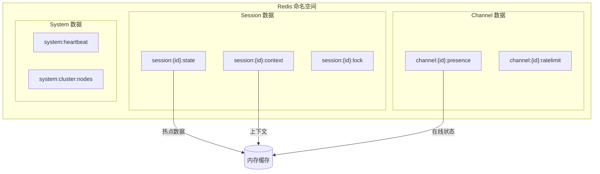
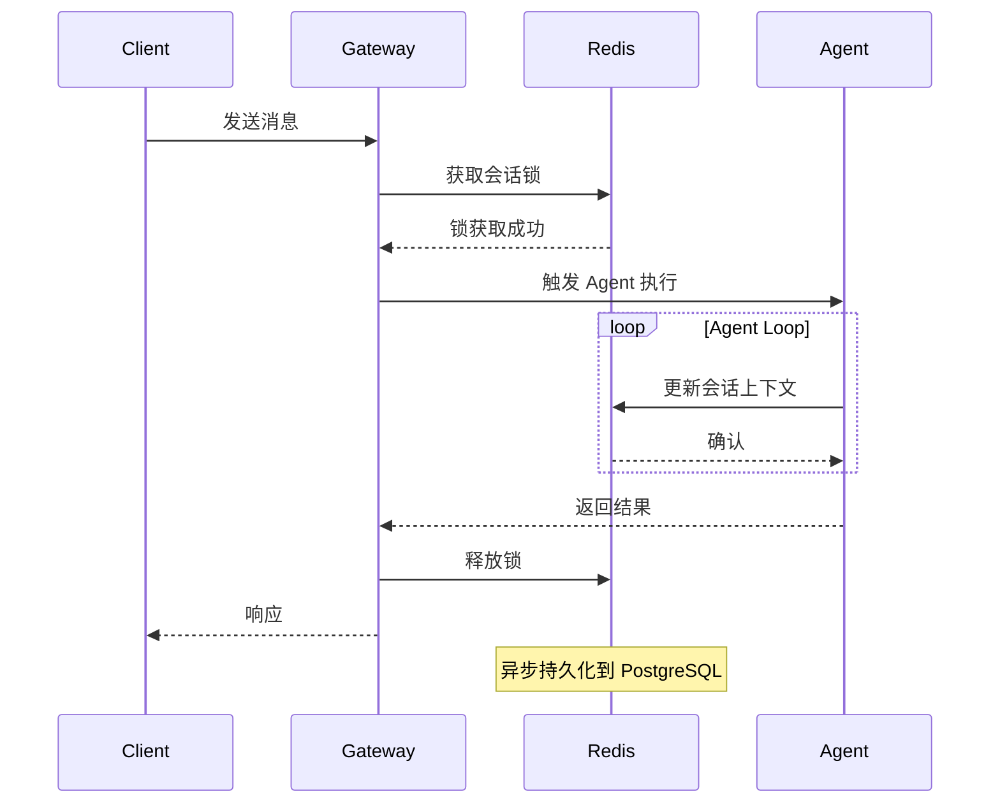
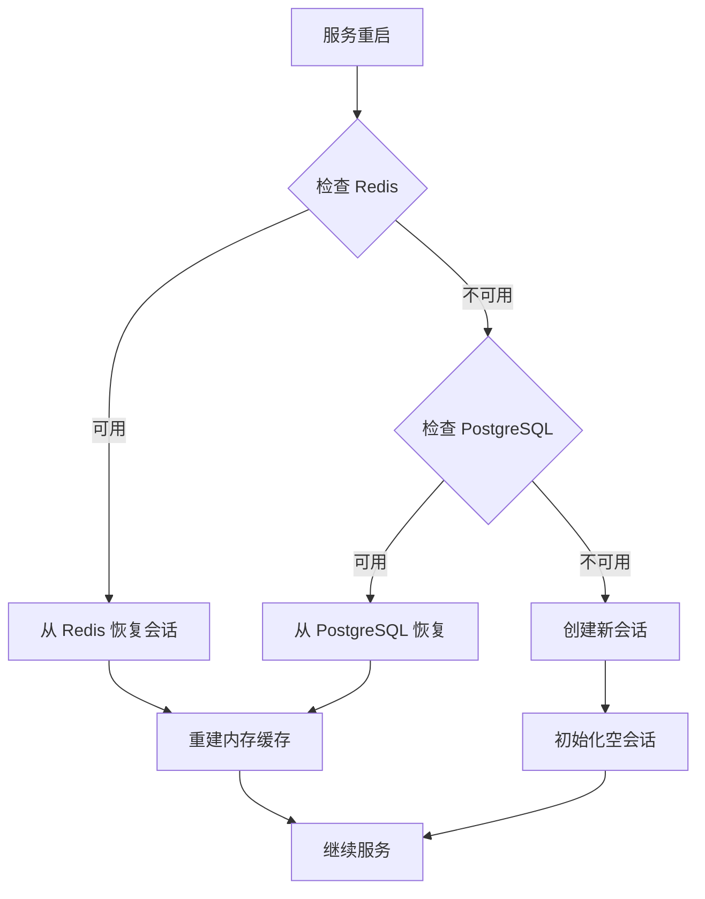

# 分布式状态管理

> OpenClaw 状态管理架构深度解析

---

## 概述

OpenClaw 采用分层状态管理架构，支持从单机到分布式部署的各种场景。本文档深入解析状态类型、存储引擎、一致性模型和故障恢复机制。

★ Insight ─────────────────────────────────────
• 状态分层是分布式系统的核心设计决策，分层不当会导致一致性问题和性能瓶颈
• 会话状态是 OpenClaw 最核心的状态类型，其生命周期直接影响用户体验
• 内存 → Redis → PostgreSQL 的分层策略平衡了性能与持久性需求
─────────────────────────────────────────────────

---

## 状态类型体系

### 1. 临时状态 (Ephemeral State)

**特征**：不需要持久化，系统重启后丢失

```typescript
// src/agents/pi-embedded-runner/run.ts
interface EphemeralState {
  // Agent 执行过程中的临时状态
  currentStep: number;
  pendingToolCalls: Map<string, ToolCall>;
  streamingBuffer: string[];

  // WebSocket 连接状态
  connectionState: 'connecting' | 'connected' | 'disconnected';
  heartbeatLastSeen: number;
}
```

**存储位置**：内存 (`Map<string, SessionRuntimeState>`)

### 2. 会话状态 (Session State)

**特征**：需要跨请求保持，有过期策略

```typescript
// src/sessions/types.ts
interface SessionState {
  // 核心会话数据
  sessionId: string;
  channelId: string;
  createdAt: number;
  updatedAt: number;
  expiresAt: number;

  // 会话上下文
  history: Message[];
  contextTokens: number;

  // 运行时状态
  agentState: AgentRuntimeState;
  userPreferences: UserPreferences;
}
```

**存储位置**：
- 内存：活跃会话
- Redis：热数据 (TTL: 7天)
- PostgreSQL：持久化历史

### 3. 持久化状态 (Persistent State)

**特征**：需要长期保存，不会因过期删除

```typescript
// src/memory/manager.ts
interface PersistentState {
  // 用户数据
  userProfiles: Map<string, UserProfile>;

  // 知识库
  memories: MemoryDocument[];
  embeddings: Float32Array[];

  // 配置
  agentConfigs: AgentConfiguration[];
  channelCredentials: ChannelCredential[];
}
```

**存储位置**：PostgreSQL (主存储) + Redis (缓存)

---

## 存储引擎架构

### 1. Redis 存储策略



**Redis 键设计**：

| 键模式 | 用途 | TTL |
|--------|------|-----|
| `session:{id}:state` | 会话运行时状态 | 7 天 |
| `session:{id}:context` | 压缩后的上下文 | 7 天 |
| `session:{id}:lock` | 分布式锁 | 30 秒 |
| `channel:{id}:presence` | 用户在线状态 | 5 分钟 |
| `system:heartbeat` | 心跳时间戳 | 60 秒 |

### 2. PostgreSQL 表结构

```sql
-- 核心会话表
CREATE TABLE sessions (
    id UUID PRIMARY KEY,
    channel_id VARCHAR(255) NOT NULL,
    user_id VARCHAR(255),
    created_at TIMESTAMP DEFAULT NOW(),
    updated_at TIMESTAMP DEFAULT NOW(),
    expires_at TIMESTAMP,
    state JSONB NOT NULL DEFAULT '{}',
    metadata JSONB DEFAULT '{}'
);

-- 消息历史表
CREATE TABLE messages (
    id UUID PRIMARY KEY,
    session_id UUID REFERENCES sessions(id),
    role VARCHAR(20) NOT NULL,
    content TEXT NOT NULL,
    tokens INTEGER,
    usage JSONB,
    created_at TIMESTAMP DEFAULT NOW()
);

-- 索引优化
CREATE INDEX idx_sessions_channel ON sessions(channel_id);
CREATE INDEX idx_sessions_expires ON sessions(expires_at);
CREATE INDEX idx_messages_session ON messages(session_id, created_at);
```

### 3. 分层存储策略

```typescript
// src/sessions/session-store.ts
class HybridSessionStore {
  private memory = new Map<string, SessionState>();
  private redis: RedisClient;
  private pg: PostgresClient;

  async get(sessionId: string): Promise<SessionState | null> {
    // L1: 内存缓存
    if (this.memory.has(sessionId)) {
      return this.memory.get(sessionId);
    }

    // L2: Redis
    const cached = await this.redis.get(`session:${sessionId}:state`);
    if (cached) {
      this.memory.set(sessionId, cached);
      return cached;
    }

    // L3: PostgreSQL
    const persisted = await this.pg.query(
      'SELECT * FROM sessions WHERE id = $1',
      [sessionId]
    );
    return persisted.rows[0] || null;
  }

  async set(sessionId: string, state: SessionState): Promise<void> {
    // 同步到内存
    this.memory.set(sessionId, state);

    // 异步同步到 Redis (热数据)
    await this.redis.setex(
      `session:${sessionId}:state`,
      7 * 24 * 60 * 60, // 7 天
      state
    );

    // 异步同步到 PostgreSQL (持久化)
    await this.pg.query(
      `INSERT INTO sessions (id, state, updated_at)
       VALUES ($1, $2, NOW())
       ON CONFLICT (id) DO UPDATE SET state = $2`,
      [sessionId, state]
    );
  }
}
```

---

## 一致性模型

### 1. 会话状态一致性



**一致性级别**：最终一致性 (Eventual Consistency)

- 读取：优先从 Redis 返回，Redis 不可用时回退到 PostgreSQL
- 写入：先写 Redis，异步同步到 PostgreSQL
- 冲突解决：基于 `updated_at` 时间戳，保留最新版本

### 2. 分布式锁机制

```typescript
// src/infra/distributed-lock.ts
class DistributedLock {
  async acquire(
    resource: string,
    owner: string,
    ttl: number = 30_000
  ): Promise<boolean> {
    const key = `lock:${resource}`;
    const result = await this.redis.set(
      key,
      owner,
      'NX',  // 仅当键不存在时设置
      'PX',  // 毫秒级 TTL
      ttl
    );
    return result === 'OK';
  }

  async release(resource: string, owner: string): Promise<boolean> {
    const key = `lock:${resource}`;
    // Lua 脚本：确保只有持有锁的进程可以释放
    const script = `
      if redis.call("get", KEYS[1]) == ARGV[1] then
        return redis.call("del", KEYS[1])
      else
        return 0
      end
    `;
    const result = await this.redis.eval(script, 1, key, owner);
    return result === 1;
  }
}
```

---

## 故障恢复机制

### 1. 状态重建流程



### 2. 断线恢复策略

```typescript
// src/gateway/ws-reconnect.ts
interface ReconnectionStrategy {
  // 心跳超时检测
  heartbeatTimeout: number;
  maxMissedHeartbeats: number;

  // 重连退避策略
  initialDelay: number;      // 1s
  maxDelay: number;          // 30s
  backoffMultiplier: number; // 2x

  // 状态恢复
  replayMessages: boolean;
  maxReplayCount: number;
}

const defaultStrategy: ReconnectionStrategy = {
  heartbeatTimeout: 30_000,
  maxMissedHeartbeats: 3,
  initialDelay: 1_000,
  maxDelay: 30_000,
  backoffMultiplier: 2,
  replayMessages: true,
  maxReplayCount: 50,
};
```

### 3. 数据迁移策略

```typescript
// src/infra/migration.ts
interface MigrationPlan {
  version: number;
  timestamp: Date;
  steps: MigrationStep[];
}

const migration_2024_01: MigrationPlan = {
  version: 2024_01,
  timestamp: new Date('2024-01-15'),
  steps: [
    {
      // 添加新的会话元数据字段
      alter: 'sessions',
      add: ['metadata', 'embedding_version'],
      version: 1,
    },
    {
      // 重建索引
      reindex: 'idx_sessions_channel',
      version: 2,
    },
  ],
};
```

---

## 性能优化

### 1. 批量操作

```typescript
// 批量获取会话
async function batchGetSessions(
  sessionIds: string[]
): Promise<Map<string, SessionState>> {
  const pipeline = this.redis.pipeline();

  for (const id of sessionIds) {
    pipeline.get(`session:${id}:state`);
  }

  const results = await pipeline.exec();

  const map = new Map<string, SessionState>();
  results?.forEach(([err, value], index) => {
    if (!err && value) {
      map.set(sessionIds[index], JSON.parse(value as string));
    }
  });

  return map;
}
```

### 2. 上下文压缩

```typescript
// src/agents/pi-extensions/context-pruning.ts
class ContextPruner {
  private readonly maxTokens: number;
  private readonly preserveRecent: number;

  prune(messages: Message[]): Message[] {
    const preserved = messages.slice(-this.preserveRecent);
    const older = messages.slice(0, -this.preserveRecent);

    // 对早期消息进行摘要
    const summary = this.summarize(older);

    return [...summary, ...preserved];
  }

  private summarize(messages: Message[]): Message[] {
    // 保留系统消息和关键决策点
    const system = messages.filter(m => m.role === 'system');
    const decisions = messages.filter(m => m.tool_calls?.length);

    return [...system, ...decisions];
  }
}
```

---

## 配置参考

```yaml
# config.yaml
storage:
  redis:
    host: localhost
    port: 6379
    db: 0
    ttl:
      session: 604800      # 7 天
      presence: 300        # 5 分钟
      heartbeat: 60        # 60 秒

  postgres:
    host: localhost
    port: 5432
    database: openclaw
    pool:
      min: 5
      max: 20

  session:
    maxTokens: 128000
    compressionThreshold: 0.8
    pruneInterval: 3600    # 1 小时
```

---

## 监控指标

| 指标 | 描述 | 告警阈值 |
|------|------|----------|
| `session.store.latency.p50` | 会话存储延迟 P50 | > 10ms |
| `session.store.latency.p99` | 会话存储延迟 P99 | > 100ms |
| `session.cache.hit_rate` | 缓存命中率 | < 80% |
| `session.active_count` | 活跃会话数 | > 10000 |
| `redis.connection.errors` | Redis 连接错误 | > 0 |
| `postgres.connection.errors` | PostgreSQL 连接错误 | > 0 |

---

*最后更新：2024年1月*
