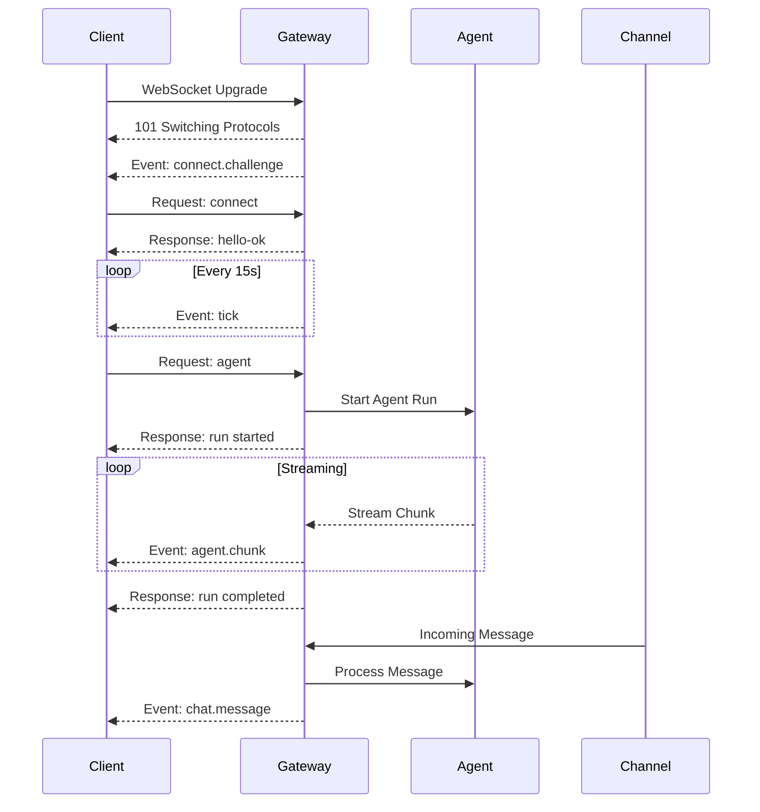
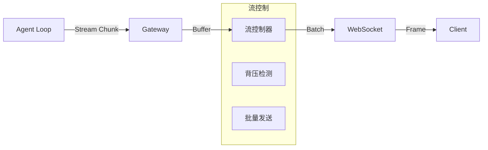

# WebSocket 协议规范详解

> OpenClaw Gateway WebSocket 协议的完整技术规范

---

## 协议架构



---

## 连接生命周期

### 1. WebSocket 握手

```http
# 客户端请求
GET /ws HTTP/1.1
Host: gateway.openclaw.ai
Upgrade: websocket
Connection: Upgrade
Sec-WebSocket-Key: dGhlIHNhbXBsZSBub25jZQ==
Sec-WebSocket-Version: 13
Authorization: Bearer <gateway_token>

# 服务端响应
HTTP/1.1 101 Switching Protocols
Upgrade: websocket
Connection: Upgrade
Sec-WebSocket-Accept: s3pPLMBiTxaQ9kYGzzhZRbK+xOo=
```

### 2. 挑战-响应认证

```typescript
// 连接认证流程（防止重放攻击）

interface ChallengeResponse {
  // Step 1: Gateway 发送挑战
  challenge: {
    type: 'event';
    event: 'connect.challenge';
    payload: {
      nonce: string;        // 随机字符串，如 "abc123xyz"
      ts: number;           // 时间戳，毫秒
      version: '3';         // 协议版本
    };
  };
  
  // Step 2: 客户端计算签名
  signature: {
    algorithm: 'ed25519';   // 签名算法
    payload: string;        // 格式: "client_id:platform:nonce:ts"
    signature: string;      // Base64 编码的签名
  };
  
  // Step 3: 客户端发送连接请求
  connect: {
    type: 'req';
    id: string;             // 请求 ID
    method: 'connect';
    params: {
      minProtocol: 3;
      maxProtocol: 3;
      client: {
        id: string;         // 客户端标识
        version: string;    // 客户端版本
        platform: string;   // 平台: web, ios, android, macos, windows
        mode: 'operator' | 'node' | 'readonly';
      };
      role: string;         // 角色
      scopes: string[];     // 权限范围
      device: {
        id: string;
        publicKey: string;  // Ed25519 公钥
        signature: string;  // 签名
        signedAt: number;   // 签名时间
        nonce: string;      // 挑战 nonce
      };
      auth: {
        token?: string;     // Gateway Token（首次连接）
        deviceToken?: string; // 设备 Token（后续连接）
      };
    };
  };
  
  // Step 4: Gateway 响应
  response: {
    type: 'res';
    id: string;             // 对应请求 ID
    ok: true;
    payload: {
      type: 'hello-ok';
      protocol: 3;
      policy: {
        tickIntervalMs: 15000;  // 心跳间隔
        maxMessageSize: 16777216;  // 16MB
      };
      auth?: {
        deviceToken: string;    // 新设备令牌
        expiresAt: number;      // 过期时间
      };
      server: {
        version: string;
        features: string[];     // 支持的特性
      };
    };
  };
}
```

### 签名算法详解

```typescript
// Ed25519 签名实现

class DeviceSignature {
  // 构建签名载荷
  buildPayload(params: {
    deviceId: string;
    platform: string;
    nonce: string;
    timestamp: number;
  }): string {
    // 严格格式，防止篡改
    return `${params.deviceId}:${params.platform}:${params.nonce}:${params.timestamp}`;
  }
  
  // 签名
  sign(payload: string, privateKey: Buffer): string {
    const signature = ed25519.sign(payload, privateKey);
    return signature.toString('base64');
  }
  
  // 验证
  verify(payload: string, signature: string, publicKey: Buffer): boolean {
    try {
      return ed25519.verify(
        Buffer.from(signature, 'base64'),
        Buffer.from(payload),
        publicKey
      );
    } catch {
      return false;
    }
  }
  
  // 完整验证流程
  async verifyConnectRequest(request: ConnectRequest): Promise<boolean> {
    const { device } = request.params;
    
    // 1. 检查时间戳（防重放）
    const now = Date.now();
    if (Math.abs(now - device.signedAt) > 300000) {  // 5分钟窗口
      throw new Error('Signature expired');
    }
    
    // 2. 构建载荷
    const payload = this.buildPayload({
      deviceId: device.id,
      platform: request.params.client.platform,
      nonce: device.nonce,
      timestamp: device.signedAt
    });
    
    // 3. 验证签名
    const publicKey = Buffer.from(device.publicKey, 'base64');
    const valid = this.verify(payload, device.signature, publicKey);
    
    if (!valid) {
      throw new Error('Invalid signature');
    }
    
    // 4. 验证 challenge
    const expectedNonce = await this.getChallengeNonce(device.id);
    if (device.nonce !== expectedNonce) {
      throw new Error('Invalid nonce');
    }
    
    return true;
  }
}
```

---

## 消息帧格式

### 通用消息结构

```typescript
// 所有消息的基类型
type Message = Request | Response | Event;

// 请求帧（Client → Gateway）
interface Request {
  type: 'req';
  id: string;              // 唯一请求 ID（UUID v4）
  method: string;          // 方法名
  params?: unknown;        // 方法参数
  idempotencyKey?: string; // 幂等键（用于重试）
  meta?: {
    traceId?: string;      // 分布式追踪 ID
    timestamp?: number;    // 客户端时间戳
  };
}

// 响应帧（Gateway → Client）
interface Response {
  type: 'res';
  id: string;              // 对应请求 ID
  ok: boolean;             // 是否成功
  payload?: unknown;       // 成功响应数据
  error?: {                // 错误信息（失败时）
    code: string;          // 错误码
    message: string;       // 错误描述
    details?: unknown;     // 详细错误信息
    retryable?: boolean;   // 是否可重试
    retryAfter?: number;   // 建议重试时间（秒）
  };
  meta?: {
    serverTimestamp: number;
    processingTime: number; // 处理耗时（毫秒）
  };
}

// 事件帧（Gateway → Client，服务器主动推送）
interface Event {
  type: 'event';
  event: string;           // 事件类型
  payload: unknown;        // 事件数据
  seq?: number;            // 序列号（用于断线恢复）
  stateVersion?: number;   // 状态版本号
}
```

### 错误码规范

```typescript
// 错误码定义
enum ErrorCode {
  // 1xx: 认证错误
  UNAUTHORIZED = 'UNAUTHORIZED',              // 未认证
  TOKEN_EXPIRED = 'TOKEN_EXPIRED',            // Token 过期
  TOKEN_INVALID = 'TOKEN_INVALID',            // Token 无效
  DEVICE_NOT_PAIRED = 'DEVICE_NOT_PAIRED',    // 设备未配对
  SIGNATURE_INVALID = 'SIGNATURE_INVALID',    // 签名无效
  CHALLENGE_EXPIRED = 'CHALLENGE_EXPIRED',    // 挑战过期
  
  // 2xx: 请求错误
  INVALID_REQUEST = 'INVALID_REQUEST',        // 请求格式错误
  METHOD_NOT_FOUND = 'METHOD_NOT_FOUND',      // 方法不存在
  INVALID_PARAMS = 'INVALID_PARAMS',          // 参数无效
  SCHEMA_VALIDATION_FAILED = 'SCHEMA_VALIDATION_FAILED', // Schema 校验失败
  
  // 3xx: 资源错误
  RESOURCE_NOT_FOUND = 'RESOURCE_NOT_FOUND',  // 资源不存在
  RESOURCE_CONFLICT = 'RESOURCE_CONFLICT',    // 资源冲突
  RESOURCE_EXHAUSTED = 'RESOURCE_EXHAUSTED',  // 资源耗尽
  
  // 4xx: 限流错误
  RATE_LIMITED = 'RATE_LIMITED',              // 速率限制
  QUEUE_FULL = 'QUEUE_FULL',                  // 队列已满
  CONCURRENCY_LIMIT = 'CONCURRENCY_LIMIT',    // 并发限制
  
  // 5xx: 服务端错误
  INTERNAL_ERROR = 'INTERNAL_ERROR',          // 内部错误
  SERVICE_UNAVAILABLE = 'SERVICE_UNAVAILABLE', // 服务不可用
  TIMEOUT = 'TIMEOUT',                        // 超时
  GATEWAY_OVERLOADED = 'GATEWAY_OVERLOADED'   // Gateway 过载
}

// 错误响应示例
const errorExamples: Record<ErrorCode, Response> = {
  [ErrorCode.UNAUTHORIZED]: {
    type: 'res',
    id: 'req-123',
    ok: false,
    error: {
      code: 'UNAUTHORIZED',
      message: 'Invalid or missing authentication token',
      retryable: false
    }
  },
  
  [ErrorCode.RATE_LIMITED]: {
    type: 'res',
    id: 'req-124',
    ok: false,
    error: {
      code: 'RATE_LIMITED',
      message: 'Too many requests',
      retryable: true,
      retryAfter: 60
    }
  },
  
  [ErrorCode.TIMEOUT]: {
    type: 'res',
    id: 'req-125',
    ok: false,
    error: {
      code: 'TIMEOUT',
      message: 'Request processing timeout',
      retryable: true
    }
  }
};
```

---

## 核心方法详解

### 系统方法

```typescript
// 1. 健康检查
interface HealthRequest extends Request {
  method: 'health';
  params?: {
    detailed?: boolean;  // 是否返回详细信息
  };
}

interface HealthResponse extends Response {
  payload: {
    status: 'healthy' | 'degraded' | 'unhealthy';
    version: string;
    uptime: number;           // 运行时间（秒）
    timestamp: number;
    details?: {
      channels: Record<string, 'connected' | 'disconnected'>;
      memory: {
        used: number;
        total: number;
      };
      queueSize: number;
    };
  };
}

// 2. 获取状态
interface StatusRequest extends Request {
  method: 'status';
}

interface StatusResponse extends Response {
  payload: {
    gateway: {
      version: string;
      connections: number;
      requestsPerSecond: number;
    };
    channels: Array<{
      id: string;
      status: 'connected' | 'disconnected' | 'error';
      error?: string;
    }>;
    agents: Array<{
      id: string;
      status: 'idle' | 'running';
      activeRuns: number;
    }>;
  };
}

// 3. 配置管理
interface ConfigGetRequest extends Request {
  method: 'config.get';
  params: {
    key: string;  // 支持点号路径，如 "agents.defaults.model"
  };
}

interface ConfigSetRequest extends Request {
  method: 'config.set';
  params: {
    key: string;
    value: unknown;
    persist?: boolean;  // 是否持久化到文件
  };
}
```

### Agent 方法

```typescript
// 启动 Agent 任务
interface AgentRequest extends Request {
  method: 'agent';
  params: {
    prompt: string;           // 用户输入
    agentId?: string;         // 指定 Agent ID
    sessionKey?: string;      // 指定会话
    options?: {
      model?: string;         // 覆盖默认模型
      temperature?: number;
      maxTokens?: number;
      tools?: string[];       // 指定可用工具
      stream?: boolean;       // 是否流式输出（默认 true）
    };
  };
}

// Agent 响应（ACK）
interface AgentAckResponse extends Response {
  payload: {
    runId: string;            // 任务运行 ID
    status: 'accepted' | 'queued';
    queuePosition?: number;   // 队列位置
    estimatedWait?: number;   // 预计等待时间（毫秒）
  };
}

// Agent 流式事件
interface AgentChunkEvent extends Event {
  event: 'agent.chunk';
  payload: {
    runId: string;
    type: 'text' | 'tool_call' | 'tool_result';
    content?: string;         // 文本内容
    toolCall?: {              // 工具调用
      id: string;
      name: string;
      arguments: Record<string, unknown>;
    };
    toolResult?: {            // 工具结果
      toolCallId: string;
      output: string;
    };
  };
}

interface AgentCompleteEvent extends Event {
  event: 'agent.complete';
  payload: {
    runId: string;
    status: 'success' | 'error' | 'cancelled';
    summary?: string;         // 执行摘要
    usage?: {
      promptTokens: number;
      completionTokens: number;
      totalTokens: number;
    };
    error?: {
      code: string;
      message: string;
    };
  };
}

// 取消 Agent 任务
interface AgentCancelRequest extends Request {
  method: 'agent.cancel';
  params: {
    runId: string;
  };
}
```

### 消息方法

```typescript
// 发送消息
interface SendRequest extends Request {
  method: 'send';
  params: {
    channel: string;          // 渠道 ID
    to: string;               // 接收者 ID
    content: {
      type: 'text' | 'image' | 'file' | 'voice';
      text?: string;
      mediaUrl?: string;
      fileName?: string;
      mimeType?: string;
    };
    options?: {
      threadId?: string;      // 话题 ID
      replyTo?: string;       // 回复消息 ID
      silent?: boolean;       // 静默发送
    };
  };
}

// 获取历史消息
interface HistoryRequest extends Request {
  method: 'history';
  params: {
    channel: string;
    chatId: string;
    limit?: number;           // 默认 50
    before?: string;          // 游标分页
    since?: number;           // 时间戳过滤
  };
}
```

---

## 流式传输协议

### 流式架构



### 背压控制

```typescript
// 流式响应背压控制

class StreamingController {
  private buffer: StreamChunk[] = [];
  private clientPressure = 0;      // 客户端压力值
  private readonly pressureThreshold = 100;
  private readonly resumeThreshold = 50;
  private flushInterval = 16;      // ~60fps
  private lastFlush = 0;
  private paused = false;
  
  // 接收来自 Agent 的 chunk
  onChunk(chunk: StreamChunk): void {
    if (this.paused) {
      // 缓冲区已满，等待
      this.waitForResume().then(() => this.onChunk(chunk));
      return;
    }
    
    this.buffer.push(chunk);
    this.clientPressure++;
    
    // 检查是否需要立即刷新
    const now = Date.now();
    if (now - this.lastFlush >= this.flushInterval) {
      this.flush();
    }
    
    // 检查背压
    if (this.clientPressure > this.pressureThreshold) {
      this.pause();
    }
  }
  
  // 批量发送给客户端
  private flush(): void {
    if (this.buffer.length === 0) return;
    
    // 合并多个 chunk 为一个帧
    const combined = this.combineChunks(this.buffer);
    this.sendToClient(combined);
    
    this.buffer = [];
    this.lastFlush = Date.now();
  }
  
  // 暂停流
  private pause(): void {
    this.paused = true;
    // 通知 Agent Loop 暂停生成
    this.emit('backpressure', { pressure: this.clientPressure });
  }
  
  // 客户端确认接收后恢复
  onClientAck(processedCount: number): void {
    this.clientPressure -= processedCount;
    
    if (this.paused && this.clientPressure < this.resumeThreshold) {
      this.resume();
    }
  }
  
  private resume(): void {
    this.paused = false;
    this.emit('resume');
  }
  
  // 合并 chunks 优化传输
  private combineChunks(chunks: StreamChunk[]): StreamChunk {
    if (chunks.length === 1) return chunks[0];
    
    // 合并连续的文本 chunks
    const texts: string[] = [];
    for (const chunk of chunks) {
      if (chunk.type === 'text' && chunk.content) {
        texts.push(chunk.content);
      }
    }
    
    return {
      type: 'text',
      content: texts.join(''),
      runId: chunks[0].runId
    };
  }
}
```

### 断线恢复

```typescript
// 断线重连和状态恢复

interface ReconnectionProtocol {
  // 连接断开时
  disconnect: {
    lastSeq: number;          // 最后收到的序列号
    stateVersion: number;     // 最后状态版本
  };
  
  // 重连请求
  reconnect: {
    type: 'req';
    method: 'reconnect';
    params: {
      sessionToken: string;   // 之前的会话令牌
      lastSeq: number;        // 最后收到的序列号
      lastStateVersion: number;
    };
  };
  
  // 恢复响应
  reconnectResponse: {
    type: 'res';
    ok: true;
    payload: {
      missedEvents: Event[];  // 丢失的事件
      currentState: StateSnapshot;  // 当前状态快照
      stateVersion: number;
    };
  };
}

class ConnectionRecovery {
  private eventBuffer: Map<number, Event> = new Map();
  private maxBufferSize = 1000;
  private stateVersion = 0;
  
  // 保存事件到缓冲区
  saveEvent(event: Event): void {
    event.seq = ++this.stateVersion;
    this.eventBuffer.set(event.seq, event);
    
    // 清理旧事件
    if (this.eventBuffer.size > this.maxBufferSize) {
      const oldestKey = Math.min(...this.eventBuffer.keys());
      this.eventBuffer.delete(oldestKey);
    }
  }
  
  // 处理重连请求
  handleReconnect(lastSeq: number): ReconnectResponse {
    const missedEvents: Event[] = [];
    
    // 收集丢失的事件
    for (let seq = lastSeq + 1; seq <= this.stateVersion; seq++) {
      const event = this.eventBuffer.get(seq);
      if (event) {
        missedEvents.push(event);
      }
    }
    
    return {
      type: 'res',
      ok: true,
      payload: {
        missedEvents,
        currentState: this.getStateSnapshot(),
        stateVersion: this.stateVersion
      }
    };
  }
}
```

---

## 性能优化

### 消息压缩

```typescript
// WebSocket 压缩配置

interface CompressionConfig {
  // 启用 permessage-deflate 扩展
  enabled: true;
  
  // 压缩阈值（小于此大小不压缩）
  threshold: 1024;  // 1KB
  
  // 压缩级别
  level: 6;  // 1-9，6是平衡点
  
  // 内存限制
  memLevel: 8;  // 1-9
  
  // 策略
  strategy: 'default' | 'filter' | 'huffman';
}

// 动态压缩决策
class SmartCompression {
  shouldCompress(message: string): boolean {
    // 小消息不压缩（压缩 overhead 不划算）
    if (message.length < 1024) return false;
    
    // 已经是压缩格式的不再压缩
    if (this.isCompressed(message)) return false;
    
    // 可压缩性检测
    const compressibility = this.estimateCompressibility(message);
    return compressibility > 0.3;  // 预计压缩率 > 30%
  }
  
  private estimateCompressibility(text: string): number {
    // 基于熵的简易估算
    const uniqueChars = new Set(text).size;
    const entropy = uniqueChars / text.length;
    return 1 - entropy;  // 熵越低，可压缩性越高
  }
}
```

### 批量处理

```typescript
// 消息批量处理优化

class MessageBatcher {
  private batch: Event[] = [];
  private maxBatchSize = 10;
  private maxWaitMs = 50;
  private timer: NodeJS.Timeout | null = null;
  
  add(event: Event): void {
    this.batch.push(event);
    
    if (this.batch.length >= this.maxBatchSize) {
      this.flush();
    } else if (!this.timer) {
      this.timer = setTimeout(() => this.flush(), this.maxWaitMs);
    }
  }
  
  flush(): void {
    if (this.timer) {
      clearTimeout(this.timer);
      this.timer = null;
    }
    
    if (this.batch.length === 0) return;
    
    // 发送批量消息
    this.sendBatch({
      type: 'event',
      event: 'batch',
      payload: {
        events: this.batch
      }
    });
    
    this.batch = [];
  }
}
```

---

## 调试工具

```bash
# 使用 wscat 测试 WebSocket
npm install -g wscat

# 连接 Gateway
wscat -c wss://gateway.openclaw.ai/ws \
  -H "Authorization: Bearer YOUR_TOKEN" \
  -H "X-Client-Version: 1.0.0"

# 发送请求
> {"type":"req","id":"1","method":"health"}

# 接收响应
< {"type":"res","id":"1","ok":true,"payload":{"status":"healthy"}}

# 发送 Agent 请求
> {"type":"req","id":"2","method":"agent","params":{"prompt":"Hello"}}

# 接收流式响应
< {"type":"event","event":"agent.chunk","payload":{"runId":"run-123","type":"text","content":"Hi"}}
< {"type":"event","event":"agent.chunk","payload":{"runId":"run-123","type":"text","content":" there"}}
< {"type":"res","id":"2","ok":true,"payload":{"runId":"run-123","status":"completed"}}
```

```typescript
// 性能测试脚本

import WebSocket from 'ws';

async function loadTest() {
  const connections: WebSocket[] = [];
  const metrics = {
    connectTime: [] as number[],
    responseTime: [] as number[],
    errors: 0
  };
  
  // 创建 100 个并发连接
  for (let i = 0; i < 100; i++) {
    const start = Date.now();
    
    const ws = new WebSocket('wss://gateway.openclaw.ai/ws', {
      headers: { Authorization: 'Bearer TOKEN' }
    });
    
    await new Promise((resolve, reject) => {
      ws.on('open', () => {
        metrics.connectTime.push(Date.now() - start);
        resolve(null);
      });
      ws.on('error', reject);
    });
    
    connections.push(ws);
  }
  
  // 发送消息并测量响应时间
  const requests = connections.map((ws, i) => {
    return new Promise((resolve) => {
      const start = Date.now();
      
      ws.send(JSON.stringify({
        type: 'req',
        id: `req-${i}`,
        method: 'health'
      }));
      
      ws.once('message', () => {
        metrics.responseTime.push(Date.now() - start);
        resolve(null);
      });
    });
  });
  
  await Promise.all(requests);
  
  // 输出统计
  console.log({
    avgConnectTime: average(metrics.connectTime),
    avgResponseTime: average(metrics.responseTime),
    errors: metrics.errors
  });
  
  // 清理
  connections.forEach(ws => ws.close());
}
```
