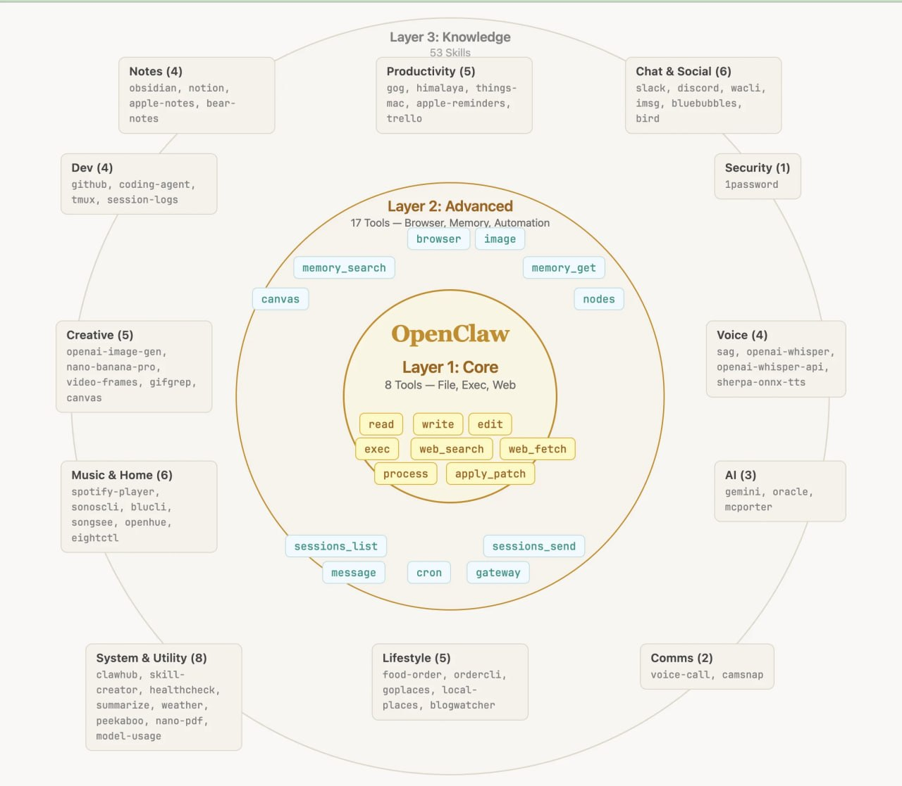

# 5.1 工具系统概述

## 本节目标
- 理解工具系统的三层架构
- 掌握工具的定义和分类
- 了解工具的调用流程

---

## 5.1.1 三层架构：全景概览

OpenClaw 的工具和技能体系采用**三层同心圆**架构，由内向外依次为：

```
┌─────────────────────────────────────────────────────────────────────┐
│                    OpenClaw 工具与技能三层架构                        │
│                                                                     │
│                        ┌─────────────┐                              │
│                        │  🟡 Layer 3 │                              │
│                        │  Knowledge  │  53+ Skills（场景化技能）      │
│                        │  Skills     │  办公 · 开发 · 安全 · 生活    │
│                        │  53+项技能   │                              │
│                        └──────┬──────┘                              │
│                               │                                     │
│                        ┌──────┴──────┐                              │
│                        │  🔵 Layer 2 │                              │
│                        │  Advanced   │  17个进阶工具                 │
│                        │  进阶层      │  浏览器 · 记忆 · 自动化         │
│                        └──────┬──────┘                              │
│                               │                                     │
│                        ┌──────┴──────┐                              │
│                        │  🟠 Layer 1  │                              │
│                        │  Core        │  8个核心工具                   │
│                        │  核心层      │  文件 · 执行 · 基础网络        │
│                        └─────────────┘                              │
│                                                                     │
│   用户 ──► LLM 推理 ──► 工具调度 ──► 执行 ──► 返回结果              │
└─────────────────────────────────────────────────────────────────────┘
```

### 三层职责对比

| 层级 | 名称 | 数量 | 性质 | 代表工具/技能 |
|------|------|------|------|--------------|
| 🟠 Layer 1 | **Core（核心层）** | ~8个 | 原子操作，不可再分 | `read`, `write`, `edit`, `exec` |
| 🔵 Layer 2 | **Advanced（进阶层）** | ~17个 | 复合能力，接口扩展 | `browser`, `memory_*`, `cron` |
| 🟡 Layer 3 | **Knowledge（知识层）** | 53+ | 场景封装，生态集成 | 笔记、技能市场、自定义Skills |

> **设计思想**：从内到外，工具从"通用原子操作"演进为"具体业务场景"，层层递进。LLM 从核心层获取基础能力，逐层向外扩展，最终触达真实应用场景。



**图解说明**：
- 🟠 **Layer 1 Core**（8个工具）：read / write / edit / exec / process / web_search / web_fetch / apply_patch
- 🔵 **Layer 2 Advanced**（17个工具）：browser / image / memory_search / memory_get / canvas / nodes / sessions_list / sessions_send / message / cron / gateway
- 🟡 **Layer 3 Knowledge**（53+ Skills）：12大分类 — Notes / Productivity / Chat & Social / Security / Voice / AI / Comms / Lifestyle / System & Utility / Music & Home / Creative / Dev

---

## 5.1.2 🟠 Layer 1：Core 核心层

### 定位
系统的基础构建块，提供**最小完备**的原子操作能力。这一层的工具足够让 LLM 完成文件操作、程序执行、基础网络访问，是整个工具系统的基石。

### 工具列表

```
📁 文件操作
├── read      ─ 读取文件或目录内容
├── write     ─ 写入文件（新建或覆盖）
├── edit      ─ 对文件进行精确文本替换编辑
└── glob      ─ 按模式搜索文件

💻 程序执行
├── exec      ─ 执行任意 shell 命令
└── process   ─ 管理后台运行进程

🌐 基础网络
├── web_search  ─ 全网搜索（依赖 Tavily API）
└── web_fetch  ─ 抓取单个网页内容
```

### 核心原则

```
┌─────────────────────────────────────────────┐
│         为什么 Core 层只需要 8 个工具？        │
├─────────────────────────────────────────────┤
│                                             │
│  1. 最小完备性                              │
│     └── 足够完成任何操作，不需要更多         │
│                                             │
│  2. 正交设计                                │
│     └── 每个工具职责单一，不重叠            │
│                                             │
│  3. 可组合性                                │
│     └── 复杂操作 = Core 工具的组合          │
│                                             │
│     例：复制文件 = read + write             │
│         批量重命名 = exec + glob           │
│                                             │
└─────────────────────────────────────────────┘
```

### 使用示例

```bash
# 读取配置文件
read path="~/.openclaw/openclaw.json"

# 写入日志
write path="~/logs/app.log" content="2026-04-05 start"

# 精确替换
edit path="~/config.yaml"
  oldText="port: 3000"
  newText="port: 8080"

# 执行命令
exec command="git status"
```

---

## 5.1.3 🔵 Layer 2：Advanced 进阶层

### 定位
核心层向外延伸的接口，提供**浏览器自动化**、**记忆管理**、**自动化调度**等高级能力。这一层的工具大幅扩展了 LLM 与外部世界交互的边界。

### 工具列表

```
🌐 浏览器自动化
├── browser   ─ 控制浏览器（截图/点击/填表/抓取）
└── canvas    ─ 截取 Canvas 内容（AI 生成图像）

🧠 记忆系统
├── memory_search  ─ 语义搜索长期记忆
├── memory_get     ─ 读取记忆片段

🔧 会话与任务管理
├── sessions_list    ─ 列出所有会话
├── sessions_send    ─ 向其他会话发消息
├── sessions_history ─ 获取会话历史
├── sessions_spawn   ─ 派生子 Agent
├── subagents        ─ 管理子 Agent
└── cron             ─ 定时任务调度

📱 设备节点
├── nodes  ─ 管理配对的移动设备节点

⚙️ 系统网关
├── gateway  ─ 重启/配置 Gateway
└── tts      ─ 文字转语音
```

### 与核心层的区别

| 维度 | Core 层 | Advanced 层 |
|------|---------|------------|
| **复杂度** | 原子，单一职责 | 复合，多步骤流程 |
| **调用方式** | 同步，直达 | 异步，状态管理 |
| **外部依赖** | 无 | 浏览器/MQTT/数据库 |
| **典型场景** | 文件读写 | 浏览器自动化、记忆检索 |

---

## 5.1.4 🟡 Layer 3：Knowledge 知识层 / Skills

### 定位
面向真实业务场景的**技能封装**。Skills = 提示词 + 工具组合 + 工作流模板，用户一键启用专家级能力，无需编写复杂提示词。

### 技能分类地图

```
┌─────────────────────────────────────────────────────────────────────┐
│                      53+ Skills 技能分类图                            │
├─────────────────────────────────────────────────────────────────────┤
│                                                                     │
│   📝 办公与协作              💻 开发与创意              🔐 安全与权限   │
│   ├── Notes（笔记）         ├── Dev（代码开发）        ├── 密码管理   │
│   ├── Product（效率工具）    ├── Creative（创意生成）    ├── 安全审计   │
│   └── Chat & Social         └── AI 模型集成            └── 权限配置   │
│                                                                     │
│   🎵 音乐与家居              📞 通讯与语音              🌐 系统工具   │
│   ├── Music & Home          ├── Voice（语音处理）       ├── System    │
│   └── IoT 控制               └── 视频会议集成            └── Utility   │
│                                                                     │
│   🍽️ 生活服务                📊 数据与金融              🤖 AI 能力    │
│   ├── 天气                   ├── 股票分析                ├── 多模型调用  │
│   ├── 订餐                   ├── 数据可视化              └── RAG 检索  │
│   └── 日程安排               └── 量化策略                                 │
│                                                                     │
└─────────────────────────────────────────────────────────────────────┘
```

### Skills vs Tools 对比

```
┌─────────────────────────────────────────────────────────────────┐
│                    Tools vs Skills 核心区别                      │
├─────────────────────────────────────────────────────────────────┤
│                                                                 │
│  工具 (Tools)                    技能 (Skills)                 │
│  ───────────                    ───────────                    │
│  原子操作，不可拆分              能力封装，可组合                 │
│  数量：~25个                    数量：53+（持续增长）            │
│  系统内置，官方维护              社区贡献，ClawHub 分发           │
│  调用快速，无额外开销            加载提示词，有初始化开销          │
│  例：read/write/exec            例：代码审查、PPT 生成、选股     │
│                                                                 │
│  ┌───────────────────────────────────────────────────────────┐  │
│  │  Skills = 专家提示词 + 工具组合 + 工作流模板              │  │
│  │  例：股票七维度分析 Skill                                │  │
│  │    ├── 提示词：分析框架、输出格式                        │  │
│  │    ├── 工具：web_search + 量化因子 + 宏观数据           │  │
│  │    └── 工作流：并行采集 → 整合分析 → 输出报告           │  │
│  └───────────────────────────────────────────────────────────┘  │
│                                                                 │
└─────────────────────────────────────────────────────────────────┘
```

---

## 5.1.5 三层协同工作流

```
用户请求："帮我分析一下苹果公司的投资价值"

══════════════════════════════════════════════════════════════

Layer 3 接收请求（Skills 层）
  └── 识别需要「股票分析」技能，启动对应 Skill

       ▼ 调用

Layer 2 执行支撑（Advanced 层）
  ├── memory_search  ─ 检索历史分析记录
  ├── web_search     ─ 搜索最新新闻和财报数据
  ├── browser        ─ 抓取财报页面
  └── cron           ─ 设置价格监控提醒

       ▼ 组合调用

Layer 1 完成原子操作（Core 层）
  ├── read  ─ 读取本地配置文件
  ├── exec  ─ 执行数据分析脚本
  └── write ─ 将分析报告写入文档

══════════════════════════════════════════════════════════════

返回：结构化投资分析报告
```

---

## 5.1.6 工具定义与元数据

### 工具结构

```json
{
  "name": "read",
  "description": "读取文件或目录内容",
  "parameters": {
    "type": "object",
    "properties": {
      "path": {
        "type": "string",
        "description": "文件或目录路径（绝对或相对路径）"
      },
      "limit": {
        "type": "number",
        "description": "读取行数限制（默认全量）"
      },
      "offset": {
        "type": "number",
        "description": "起始行号（1-based）"
      }
    },
    "required": ["path"]
  }
}
```

### 元数据四要素

```
1. name ─ 工具名称，唯一标识
2. description ─ 供 LLM 理解用途，详细准确
3. parameters ─ 参数定义（类型/描述/必填）
4. examples ─ 使用示例，提高调用准确性
```

---

## 5.1.7 工具调用流程

```
用户: "帮我读取桌面上的 config.json"

══════════════════════════════════════════════════

Step 1: LLM 意图分析
  - 分析用户请求 → 确定需要调用 read 工具
  - 提取参数：path = "~/Desktop/config.json"

Step 2: 参数验证
  - 检查 path 参数是否存在
  - 验证参数类型是否正确

Step 3: 安全检查
  - 权限验证（Profile 配置）
  - 路径安全检查
  - 危险操作拦截（如 rm -rf）

Step 4: 工具执行
  - 调用 read 函数读取文件
  - 处理编码和路径解析

Step 5: 结果处理
  - 格式化输出
  - 添加到上下文
  - 继续推理

══════════════════════════════════════════════════

返回: 文件内容给用户
```

### 错误处理

| 错误类型 | 原因 | 解决方案 |
|---------|------|---------|
| 参数错误 | 缺少必填参数 | 返回提示，重新输入 |
| 执行错误 | 文件不存在/权限不足 | 检查路径和权限 |
| 超时错误 | 执行时间过长 | 增加 timeout 配置 |

---

## 5.1.8 工具配置与权限

### 全局配置

```json
{
  "tools": {
    "enabled": true,
    "auto_approve": false,
    "timeout": 30000,
    "max_retries": 3
  }
}
```

### Profile 权限控制

```json
{
  "profiles": {
    "developer": {
      "tools": {
        "read": { "enabled": true },
        "write": { "enabled": true },
        "exec": {
          "enabled": true,
          "allowed_commands": ["npm", "git", "docker"]
        }
      }
    },
    "readonly": {
      "tools": {
        "read": { "enabled": true },
        "write": { "enabled": false },
        "exec": { "enabled": false }
      }
    }
  }
}
```

---

## 本节小结

1. **三层架构**：Core（8工具）→ Advanced（17工具）→ Knowledge（53+Skills），由内向外层层递进
2. **Core 核心层**：最小完备的原子操作集，文件/执行/基础网络
3. **Advanced 进阶层**：浏览器/记忆/自动化，扩展 LLM 交互边界
4. **Knowledge 知识层**：场景化技能封装，一键启用专家能力
5. **工具 vs Skills**：工具是原子，Skills 是工作流组合

---

## 课后思考

1. 为什么 Core 层设计为 8 个工具而不是更多？
2. Skills 层和 Advanced 层的本质区别是什么？
3. 如果要设计一个"自动生成周报"的 Skill，它需要调用哪些层的工具？
