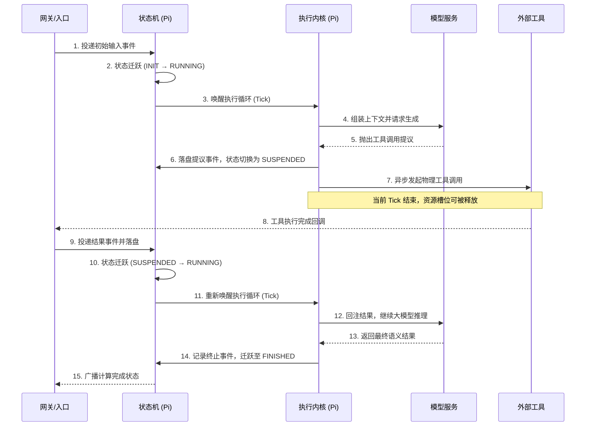

# 13.1 π 运行底座：重构智能体的心智模型

开发者初次接触智能体框架时，最容易犯的错误是把智能体等同于"一个带记忆的死循环大模型调用"。为了支持企业级业务中动辄横跨十几小时、需要多人介入的业务流水线，OpenClaw 使用了基于事件驱动的 **π（pi）** 运行底座。

---

## 13.1.1 引擎与外壳：Pi 与 OpenClaw 的定位

如果说 OpenClaw 是一个连接了各大聊天软件（如 WhatsApp、Telegram 等）、能 24 小时在线处理杂务的"全能管家外壳（Wrapper）"，那么 **Pi 就是真正赋予这个管家"思考、写代码和执行能力"的底层大脑（Engine）**。

### π 框架的核心特性

```
┌─────────────────────────────────────────────────────────────┐
│                    π 框架三大核心特性                        │
├─────────────────────────────────────────────────────────────┤
│                                                             │
│  1. 极简内核与高度可扩展                                    │
│     └── 默认只提供 Read、Write、Edit、Bash 四大底层工具      │
│     └── 插件化架构，通过配置文件动态加载扩展包                │
│                                                             │
│  2. 透明的记忆系统                                         │
│     └── 不依赖黑盒向量数据库                                │
│     └── 通过读取 AGENTS.md、TODO.md 等纯文本文件理解系统     │
│                                                             │
│  3. YOLO 模式（完全自主执行）                               │
│     └── 默认开启 YOLO 模式                                  │
│     └── 执行命令前不要求人工确认                            │
│     └── 实现真正的异步后台挂机自动化                          │
│                                                             │
└─────────────────────────────────────────────────────────────┘
```


### 端到端运行主链路

```
┌─────────────────────────────────────────────────────────────┐
│                OpenClaw 端到端运行主链路                     │
├─────────────────────────────────────────────────────────────┤
│                                                             │
│  用户消息 → 渠道适配器 → Gateway(认证+路由)                 │
│       │                              │                       │
│       ▼                              ▼                       │
│  命令队列(每会话独立泳道) → 会话与工作区准备                 │
│       │                              │                       │
│       ▼                              ▼                       │
│  提示词组装 → 模型推理 ←→ 工具执行                          │
│       │                                                    │
│       ▼                                                    │
│  流式回复 + 回复塑形 → 持久化 (sessions.json + transcript)  │
│                                                             │
└─────────────────────────────────────────────────────────────┘
```


---

## 13.1.2 事件总线：系统唯一的流转图腾

在传统的 MVC 或者微服务 Web 开发里，我们习惯于用 API 接口和函数调用来传递数据。而在 π 框架中，所有对于系统状态的增量改变、对工具的调度期望、甚至模型吐出的字符，都全部化作一个个 **Event（事件）** 丢入中心总线。

### 核心事件类型

| 事件类型 | 说明 |
|----------|------|
| `InputEvent` | 用户发送的消息 |
| `ToolCallRequestedEvent` | 模型决定调用工具 |
| `TimeoutEvent` | 请求耗时超时 |
| `ToolResultEvent` | 工具执行完成 |
| `ApprovalRequestedEvent` | 需要人工审批 |

### 为什么必须用事件驱动？

因为只有数据（事件）是可以被持久化保存的，而运行到一半的线程与函数堆栈是**无法恢复**的。将一切化作事件日志，意味着即使被拔掉电源，备用服务器也可以通过读取"事件日志"恢复出断电前一刻的完整状态。

---

## 13.1.3 状态机：不可篡改的记忆闭环

所有的事件都被抛入总线后，系统必须根据事件决定下一步该干什么。这就引出了 π 框架的第二个支柱：**StateMachine（状态机）**。

### 两层架构

```
┌─────────────────────────────────────────────────────────────┐
│                    状态机两层架构                            │
├─────────────────────────────────────────────────────────────┤
│                                                             │
│  逻辑引擎层面（单体共用）                                    │
│  └── 整个系统共用一套唯一的、极其死板的转换规则              │
│  └── 负责调度所有流转                                       │
│                                                             │
│  物理实例层面（多体独立）                                    │
│  └── 每一个任务都是独立的有向无环图状态集合                  │
│  └── 一万个并发请求 = 一万个相互独立的状态图谱实例           │
│                                                             │
└─────────────────────────────────────────────────────────────┘
```


### 四种主态转移

| 状态 | 说明 | 行为 |
|------|------|------|
| `INIT` | 初始/待办 | 收到事件，只需存储资源 |
| `RUNNING` | 活跃运转 | 正在执行，如向 LLM 请求或组装上下文 |
| `SUSPENDED` | 物理挂起 | 调用耗时工具时，立刻交出 CPU 与内存线程 |
| `FINISHED` | 终态 | 任务完成或触碰预算额度被硬阻断 |

### 状态流转图

```
    ┌──────────┐     投递初始事件     ┌──────────┐
    │   INIT   │ ──────────────────► │ RUNNING  │
    └──────────┘                     └────┬─────┘
                                          │
                              分配资源(Tick)│
                                          ▼
    ┌──────────┐     任务完成      ┌──────────┐
    │ FINISHED │ ◄──────────────── │ RUNNING  │
    └──────────┘                     └────┬─────┘
                                          │
                         发起外部调用(Suspend)│
                                          ▼
                                   ┌──────────┐
                                   │SUSPENDED │
                                   └──────────┘
                                          │
                              结果回调(Resume)│
                                          ▼
```


---

## 13.1.4 执行内核：Tick 心跳机制

如果系统被挂起了，谁来唤醒并具体拉动它走下一步？是靠 **Executor（执行内核）**。

### Tick 工作原理

执行内核就像是游戏引擎循环里的发条。它仅通过一种称为 **Tick（滴答）** 的驱动机制来工作：

```
一次 Tick 的使命：
1. 读取当前最新的图状态（State）
2. 推演出接下来应该执行的具体操作
3. 向 LLM 发起新一轮调用请求，或发出任务终结事件
4. "打卡下班"（将控制权交回底座）
```

### 事件驱动特性

> **Tick 是多久发一次的？**
>
> 初学者常把 Tick 和游戏引擎的固定帧率（如每秒 60 次）混淆。在 π 框架中，Tick **并没有固定的时间频率**，而是完全 **事件驱动（Event-Driven）** 的。
>
> - **触发时机**：只有当总线接收到有效事件（如"收到新用户消息"、"工具执行完成并返回数据"）时，才会唤醒并触发一次 Tick
> - **静默休眠**：如果系统正在等待大模型 API 响应，或等待人类点击审批按钮，系统处于完全静默的"挂起（SUSPENDED）"态，不仅不发 Tick，也不会消耗任何 CPU 空转资源

---

## 13.1.5 典型 Tick 流转周期



---

## 13.1.6 运行时鲁棒性：流式输出与错误恢复

π 框架在演进过程中直面了诸多真实场景下的长尾 Bug：

### 流式 JSON 解析容错

在对接不同提供商时，模型输出的工具调用参数极易出现"有效 JSON 数据与额外截断垃圾字符拼凑"的乱象。引入宽容的流式 JSON 解析策略（如 `parseStreamingJson`），是框架实现低成本、高稳定性收益的典型环节。

### 可恢复错误的回注模型

对于动辄运行数小时的自动化任务，更健壮的设计是将非逻辑性异常分类为"可恢复错误（Recoverable Error）"，转化为一条普通消息实体，重新回注给大语言模型。模型能借此理解当前的异常状态，尝试主动调整重试策略。

---

## 本节小结

1. **引擎与外壳**：Pi 是底层大脑，OpenClaw 是连接各渠道的外壳
2. **事件驱动**：所有状态改变都是事件，可持久化恢复
3. **状态机**：INIT → RUNNING → SUSPENDED → FINISHED
4. **Tick 机制**：事件驱动，非固定频率，资源高效
5. **鲁棒性**：流式 JSON 容错 + 可恢复错误回注

---

## 课后思考

1. 为什么说"事件驱动"是企业级智能体的必要条件？
2. 状态机的 SUSPENDED 状态有什么工程意义？
3. 如何设计可恢复错误的分类标准？
