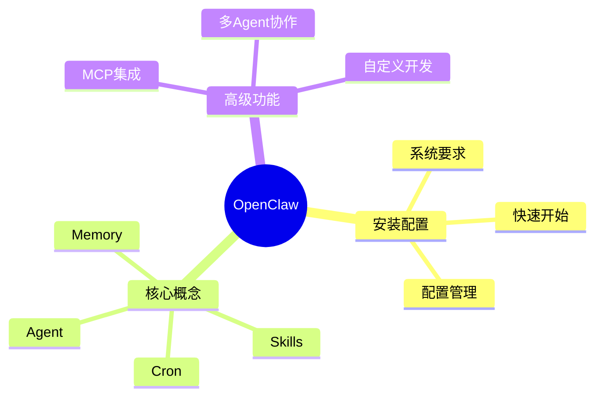

# 可视化工具全景图谱

> 本章全面整理所有可视化相关的框架、CLI工具和 OpenClaw Skills，按图表类型分类整理。

---

## 1. 可视化框架分类总览

### 1.1 按语言分类

| 语言 | 框架数量 | 代表框架 |
|------|-----------|----------|
| **Python** | 30+ | Matplotlib, Plotly, Seaborn, Altair |
| **JavaScript** | 20+ | D3.js, ECharts, Chart.js, Vega |
| **R** | 15+ | ggplot2, Shiny, lattice |
| **Julia** | 5+ | Plots.jl, Makie |
| **命令行** | 10+ | gnuplot, chart-cli, Termgraph |

### 1.2 按图表类型分类

```
可视化工具全景图
├── 2D 图表
│   ├── 统计图表 (Matplotlib, Seaborn, ggplot2)
│   ├── 交互图表 (Plotly, Bokeh, ECharts)
│   ├── 金融图表 (mplfinance, FinPlot)
│   ├── 词云 (wordcloud, pyecharts)
│   └── 地图可视化 (folium, kepler.gl)
│
├── 3D 可视化
│   ├── 科学可视化 (VTK, Mayavi, ParaView)
│   ├── 机器学习 (TensorBoard, Netron)
│   └── 通用3D (Three.js, Babylon.js)
│
├── 关系图
│   ├── 知识图谱 (pyvis, networkx)
│   ├── 流程图 (Mermaid, Graphviz)
│   └── 网络图 (D3-force, Cytoscape.js)
│
├── 图表即代码
│   ├── Mermaid, PlantUML, D2
│   ├── PlotNeuralNet, diagrams
│   └── Excalidraw, Draw.io
│
└── Dashboard
    ├── Streamlit, Gradio, Dash
    ├── Panel,Voilà, Shiny
    └── Streamlit, Gradio, Dash
```

---

## 2. Python 可视化框架

### 2.1 基础图表库

| 框架 | Stars | 特点 | 适用场景 |
|------|-------|------|----------|
| **Matplotlib** | 19k | 功能最全、完全控制 | 任何图表类型 |
| **Seaborn** | 11k | 统计图表、样式美观 | 统计可视化 |
| **Pandas** | 40k | 数据分析内置绘图 | 快速探索 |
| **Altair** | 4k | 声明式、简洁 | 探索性分析 |

```python
# Matplotlib - 最基础
import matplotlib.pyplot as plt
plt.plot(x, y)
plt.savefig('plot.pdf')

# Seaborn - 统计图表
import seaborn as sns
sns.boxplot(x='category', y='value', data=df)

# Pandas - 内置绘图
df.plot(kind='bar', figsize=(10, 6))

# Altair - 声明式
import altair as alt
alt.Chart(df).mark_bar().encode(x='Method', y='Accuracy')
```

---

### 2.2 交互图表库

| 框架 | Stars | 特点 | 适用场景 |
|------|-------|------|----------|
| **Plotly** | 16k | 交互、3D、HTML导出 | 交互仪表盘 |
| **Bokeh** | 18k | Web交互、动态 | Web应用 |
| **PyEcharts** | 5k | ECharts Python封装 | 百度ECharts |
| **Altair** | 4k | 声明式、JSON输出 | 可复现分析 |

```python
# Plotly - 交互图表
import plotly.express as px
fig = px.scatter(df, x='GDP', y='LifeExpectancy', color='continent')
fig.write_html('interactive.html')

# Bokeh - Web交互
from bokeh.plotting import figure, output_file, show
p = figure()
p.line(x, y, legend='Trend')
output_file('bokeh.html')
show(p)
```

---

### 2.3 科学可视化

| 框架 | Stars | 特点 | 适用场景 |
|------|-------|------|----------|
| **Mayavi** | 1.4k | VTK封装、3D科学 |  науч可视化 |
| **PyQtGraph** | 4k | 高速、实时 | 实时数据 |
| **VisPy** | 2k | OpenGL、高性能 | 大数据可视化 |
| **PyVista** | 2k | 3D网格、VTK封装 | 工程可视化 |

```python
# Mayavi - 3D科学可视化
from mayavi import mlab
mlab.points3d(x, y, z, scalar)
mlab.savefig('volume.pdf')

# PyQtGraph - 实时数据
import pyqtgraph as pg
plt = pg.plot()
plt.plot(data, pen='r')
```

---

### 2.4 统计图表

| 框架 | Stars | 特点 | 适用场景 |
|------|-------|------|----------|
| **Seaborn** | 11k | 统计接口、漂亮样式 | 统计分析 |
| **Statsmodels** | 9k | 统计模型、图表 | 回归分析 |
| **Pingouin** | 1k | 统计检验、绘图 | 心理学统计 |
| **GAD** | - | 神经科学数据 | EEG/MEG |

```python
# Seaborn - 统计图表
import seaborn as sns
sns.violinplot(x='Condition', y='Response', data=df)
sns.pairplot(df, hue='Group')

# Statsmodels - 回归图
import statsmodels.api as sm
sm.graphics.plot_regress_exog(model, 'Variable')
```

---

### 2.5 金融图表

| 框架 | Stars | 特点 | 适用场景 |
|------|-------|------|----------|
| **mplfinance** | - | Matplotlib金融 | K线图 |
| **FinPlot** | 1k | 高性能金融 | 实时K线 |
| **Plotly** | 16k | 交互金融 | 技术分析 |
| **Candle** | - | 轻量K线 | 简单K线 |

```python
# mplfinance - K线图
import mplfinance as mpf
mpf.plot(df, type='candle', style='charles')

# FinPlot - 高性能金融
import finplot as fplt
fplt.candlestick_ochl(df[['Open','Close','High','Low']])
fplt.show()
```

---

### 2.6 网络/图可视化

| 框架 | Stars | 特点 | 适用场景 |
|------|-------|------|----------|
| **NetworkX** | 13k | 图算法、网络分析 | 图分析 |
| **PyVis** | - | HTML交互网络 | 交互网络 |
| **igraph** | - | 高性能图 | 大规模图 |
| **graph-tool** | - | C++性能 | 超大规模图 |

```python
# NetworkX - 网络分析
import networkx as nx
G = nx.karate_club_graph()
nx.draw(G, with_labels=True)

# PyVis - 交互网络
from pyvis.network import Network
net = Network()
net.from_nx(G)
net.show('network.html')
```

---

### 2.7 词云

| 框架 | Stars | 特点 | 适用场景 |
|------|-------|------|----------|
| **wordcloud** | 4k | 最流行词云 | 文本可视化 |
| **pyecharts** | 5k | 交互词云 | 百度ECharts |
| **stylecloud** | - | 词云样式 | 品牌词云 |

```python
# wordcloud - 词云
from wordcloud import WordCloud
wc = WordCloud().generate(text)
plt.imshow(wc)
plt.axis('off')

# stylecloud - 品牌词云
import stylecloud
stylecloud.gen_stylecloud(text, icon_name='fab fa-python')
```

---

### 2.8 地图可视化

| 框架 | Stars | 特点 | 适用场景 |
|------|-------|------|----------|
| **folium** | 4k | Leaflet封装 | 交互地图 |
| **keplergl** | 2k | Uber大规模 | 大数据地图 |
| **geopandas** | 2k | Pandas地理 | 地理分析 |
| **pydeck** | 3k | Deck.gl封装 | Web 3D地图 |

```python
# folium - 交互地图
import folium
m = folium.Map(location=[lat, lon], zoom_start=12)
folium.Marker([lat, lon], popup='Location').add_to(m)

# keplergl - 大数据地图
from keplergl import KeplerGl
map = KeplerGl(height=400)
map.add_data(data, name='data')
```

---

## 3. JavaScript 可视化框架

### 3.1 通用图表库

| 框架 | Stars | 特点 | 适用场景 |
|------|-------|------|----------|
| **D3.js** | 110k | 最强大、SVG绑定 | 定制图表 |
| **ECharts** | 60k | 百度、交互强 | 仪表盘 |
| **Chart.js** | 64k | 简单、Canvas | Web图表 |
| **Vega-Lite** | 4k | 声明式 | 分析型图表 |
| **ApexCharts** | 13k | 现代外观 | 现代Web |

```javascript
// ECharts - 百度图表
var chart = echarts.init(document.getElementById('main'));
chart.setOption({
    title: { text: 'ECharts Demo' },
    tooltip: {},
    xAxis: { data: ['A','B','C'] },
    yAxis: {},
    series: [{ type: 'bar', data: [10, 20, 30] }]
});

// Chart.js - 简单图表
new Chart(ctx, {
    type: 'line',
    data: { labels: [], datasets: [] }
});
```

---

### 3.2 关系图

| 框架 | Stars | 特点 | 适用场景 |
|------|-------|------|----------|
| **D3-force** | - | 力导向图 | 网络关系 |
| **Cytoscape.js** | 4k | 图布局 | 生物网络 |
| **vis.js** | 15k | 交互网络 | 实时网络 |
| **Sigma.js** | 5k | WebGL高性能 | 大规模图 |

```javascript
// D3-force - 力导向图
d3.forceSimulation(nodes)
    .force('link', d3.forceLink(links))
    .force('charge', d3.forceManyBody())
    .force('center', d3.forceCenter(width/2, height/2));

// vis.js - 交互网络
var network = new vis.Network(container, data, options);
```

---

### 3.3 3D 可视化

| 框架 | Stars | 特点 | 适用场景 |
|------|-------|------|----------|
| **Three.js** | 95k | 最流行3D | 3D Web |
| **Babylon.js** | 20k | 游戏级3D | 游戏/3D |
| **Deck.gl** | 11k | WebGL大数据 | 大规模可视化 |
| **Cesium** | 10k | 地理3D | 地球/地图 |

```javascript
// Three.js - 3D场景
const scene = new THREE.Scene();
const camera = new THREE.PerspectiveCamera(75, w/h, 0.1, 1000);
const renderer = new THREE.WebGLRenderer();
renderer.render(scene, camera);

// Deck.gl - 大数据3D
import {DeckGL} from '@deck.gl/react';
<DeckGL initialViewState={viewState} layers={[scatterplotLayer]} />
```

---

## 4. CLI 图表工具

### 4.1 命令行图表

| 工具 | 语言 | 特点 | 适用场景 |
|------|------|------|----------|
| **gnuplot** | C | 经典、脚本化 | 科学家 |
| **chart-cli** | Go | ASCII/PNG | 终端/Dashboard |
| **Termgraph** | Python | ASCII图表 | 终端输出 |
| **Spark** | Bash | 迷你图 | 快速预览 |
| **Cli-Chart** | JS | 彩色ASCII | 终端 |

```bash
# chart-cli - 命令行动图表
chart-cli bar --title "Sales" --file data.csv

# Termgraph - ASCII图表
termgraph data.csv --title "Revenue"

# Spark - 迷你图
spark 1 5 3 9 6 2 8

# gnuplot - 脚本图表
gnuplot -e "plot 'data.txt' with lines"
```

---

### 4.2 数据处理CLI

| 工具 | 语言 | 特点 | 适用场景 |
|------|------|------|----------|
| **csvkit** | Python | CSV处理 | 数据清洗 |
| **xlsx2csv** | Python | Excel转CSV | 数据转换 |
| **q** | Python | SQL查询CSV | SQL操作 |
| **textQL** | Go | SQL查询CSV | 大文件SQL |

```bash
# csvkit - CSV工具
csvkit -k
csvstat data.csv
csvsql --query "SELECT * FROM data" data.csv

# q - SQL查询CSV
q -d',' "SELECT COUNT(*) FROM data.csv WHERE value > 100"
```

---

### 4.3 图表生成CLI

| 工具 | 特点 | 输入格式 | 输出格式 |
|------|------|----------|----------|
| **g Barlow** | ASCII | JSON/CSV | 终端 |
| **plotti.co** | 在线 | CLI | PNG/SVG |
| **ChartURL** | ASCII | 数据 | URL |
| **Vizzl** | 模板 | YAML | PNG/SVG |

```bash
# chart-cli
chart-cli line --data "1,2,3,4,5"

# 在线生成
curl "https://api.charturl.com" -d '{"data": [1,2,3]}'
```

---

## 5. 图表即代码

### 5.1 图表代码库

| 工具 | 语言 | 特点 | 输出格式 |
|------|------|------|----------|
| **Mermaid** | JS | 声明式语法 | 流程图/时序图 |
| **PlantUML** | Java | UML专家 | UML图 |
| **D2** | Go | 现代语法 | 多种格式 |
| **Graphviz** | C | DOT语言 | 矢量图 |
| **Diagrams** | Python | 代码画架构 | PNG/SVG |

```python
# Diagrams - Python代码画架构
from diagrams import Diagram, Cluster
from diagrams.aws.compute import EC2
from diagrams.aws.database import RDS

with Diagram('Web Services'):
    EC2('web') >> RDS('database')
```

```mermaid
// Mermaid - 流程图语法
graph TD
    A[Start] --> B{Decision}
    B -->|Yes| C[Process]
    B -->|No| D[End]
```

```python
# D2 - 现代图表语言
shape: cylinder
database: My Database {
  shape: postgresql_table
  id: int
  name: varchar
}
```

---

### 5.2 专用图表代码

| 工具 | 用途 | 输出 |
|------|------|------|
| **PlotNeuralNet** | 神经网络架构 | LaTeX |
| **ResNet，作者** | ResNet架构 | LaTeX |
| **NN-SVG** | 神经网络图 | SVG |
| **drawconv** | CNN架构 | SVG |
| **latexify_py** | 算法变LaTeX | LaTeX |

```python
# latexify_py - 算法转LaTeX
import latexify.math
@latexify.algorithms
def fibonacci(n):
    if n <= 1:
        return n
    return fibonacci(n-1) + fibonacci(n-2)
```

---

### 5.3 Excalidraw 相关

| 工具 | 特点 |
|------|------|
| **Excalidraw** | 手绘风格图表 |
| **Excalidraw Library** | 组件库 |
| **Excalidraw-in-Markdown** | Markdown集成 |
| **Excalidraw CDN** | 在线嵌入 |

```javascript
// Excalidraw HTML 嵌入
<script src="https://unpkg.com/@excalidraw/excalidraw"></script>
const excalidraw = new Excalidraw.initExcalidraw({
    container: document.getElementById('app')
});
```

---

## 6. OpenClaw Skills 可视化

### 6.1 已安装 Skills

| Skill | 功能 | 输入 | 输出 |
|-------|------|------|------|
| **excalidraw** | 手绘风格图表 | 文本描述 | .excalidraw/SVG/PNG |
| **ontology** | 知识图谱 | 实体关系 | JSONL |
| **ontology-engineer** | 本体提取 | 文件/数据库 | 图谱JSONL |

### 6.2 Excalidraw Skill 使用

```
触发词: "画图", "diagram", "流程图", "架构图", "visualize"
```

| 输出格式 | 方式 | 工具 |
|----------|------|------|
| **SVG** | Kroki API | curl |
| **PNG** | 本地CLI | Firefox |
| **.excalidraw** | JSON | 可编辑 |

### 6.3 Ontology Skill 使用

```
触发词: "记住", "链接", "知识图谱", "查询关系"
```

| 操作 | 命令 |
|------|------|
| 创建实体 | `create_entity(type, props)` |
| 查询 | `query_entities(type, conditions)` |
| 关联 | `create_relation(from, rel, to)` |
| 验证 | `validate_graph()` |

---

## 7. Dashboard 框架

### 7.1 Python Dashboard

| 框架 | Stars | 特点 | 适用场景 |
|------|-------|------|----------|
| **Streamlit** | 30k | 最简单 | 快速原型 |
| **Gradio** | 30k | ML界面 | ML演示 |
| **Dash** | 22k | Plotly生态 | 分析仪表盘 |
| **Panel** | - | HoloViz生态 | 复杂可视化 |
| **Voilà** | 5k | Jupyter驱动 | Notebook应用 |

```python
# Streamlit - 最简单的Dashboard
import streamlit as st
st.title('My Dashboard')
st.line_chart(data)
st.plotly_chart(fig)

# Dash - Plotly生态
from dash import Dash, html, dcc
app = Dash(__name__)
app.layout = html.Div([
    dcc.Graph(id='graph', figure=fig)
])
app.run_server()
```

---

### 7.2 可视化 Dashboard

| 框架 | 特点 | 绑定 |
|------|------|------|
| **Superset** | Apache、可扩展 | SQL数据库 |
| **Metabase** | 易用、嵌入 | 多种数据库 |
| **Grafana** | 监控为主 | 时序数据库 |
| **Redash** | SQL查询 | 多种数据源 |
| **Hex** | 笔记本+SQL | 协作分析 |

---

## 8. 工具选择指南

### 8.1 按任务选择

| 任务 | 推荐工具 |
|------|----------|
| **快速探索数据** | Pandas + Matplotlib |
| **统计图表** | Seaborn |
| **交互Web图表** | Plotly / ECharts |
| **论文图表** | Matplotlib + Science Plots |
| **神经网络架构** | PlotNeuralNet / Netron |
| **知识图谱** | PyVis / D3.js |
| **实时监控** | Grafana / Bokeh |
| **Dashboard** | Streamlit |
| **命令行图表** | chart-cli / Termgraph |
| **流程图** | Mermaid / PlantUML |
| **3D可视化** | Three.js / Mayavi |
| **地图可视化** | Folium / Deck.gl |

### 8.2 按输出格式选择

| 输出 | 推荐工具 |
|------|----------|
| **PDF矢量图** | Matplotlib (PDF backend) |
| **SVG** | Matplotlib / D3.js / Plotly |
| **PNG** | Matplotlib / Plotly |
| **HTML交互** | Plotly / Bokeh / ECharts |
| **Web页面** | D3.js / Three.js / Deck.gl |
| **终端ASCII** | Termgraph / chart-cli |
| **LaTeX** | TikZ / PlotNeuralNet |

### 8.3 按技能水平选择

| 水平 | 推荐工具 |
|------|----------|
| **初学者** | Pandas + Seaborn + Streamlit |
| **中级** | Matplotlib + Plotly + Altair |
| **高级** | D3.js + Matplotlib + VTK |
| **专家** | Raw Vega + WebGL + GPGPU |

---

## 9. 可视化工具速查表

### 9.1 一行代码图表

| 工具 | 代码 |
|------|------|
| Pandas | `df.plot()` |
| Seaborn | `sns.boxplot(x, y, data)` |
| Plotly | `px.scatter(df, x, y)` |
| Altair | `alt.Chart(df).mark_bar()` |
| Matplotlib | `plt.plot(x, y)` |

### 9.2 导出格式速查

| 格式 | Matplotlib | Plotly |
|------|-----------|--------|
| PDF | `savefig('a.pdf')` | `write_image('a.pdf')` |
| SVG | `savefig('a.svg')` | `write_image('a.svg')` |
| PNG | `savefig('a.png', dpi=300)` | `write_image('a.png')` |
| HTML | `mpld3` | `write_html('a.html')` |

---

## 10. 开源可视化项目推荐

### 10.1 高Stars项目

| 项目 | Stars | 类型 |
|------|-------|------|
| **D3.js** | 110k | JavaScript图表 |
| **Three.js** | 95k | 3D可视化 |
| **ECharts** | 60k | 交互图表 |
| **Chart.js** | 64k | Canvas图表 |
| **Plotly** | 16k | Python交互 |
| **TensorBoard** | 8k | ML监控 |
| **Matplotlib** | 19k | Python基础 |

### 10.2 新兴项目

| 项目 | Stars | 特点 |
|------|-------|------|
| **Vega-Lite** | 4k | 声明式Grammmar |
| **Deck.gl** | 11k | 大规模可视化 |
| **Kepler.gl** | 11k | 地理数据 |
| **Perspective** | 8k | 实时分析 |
| **Marimo** | - | 反应式笔记本 |

---

## 11. 信息图 (Infographics)

### 11.1 信息图工具

| 工具 | 类型 | 特点 | 适用场景 |
|------|------|------|----------|
| **Canva** | 在线 | 模板丰富 | 快速制作 |
| **Piktochart** | 在线 | 教育友好 | 信息图 |
| **Venngage** | 在线 | 商业报告 | 商业信息图 |
| **Infogram** | 在线 | 图表为主 | 数据信息图 |
| **Visme** | 在线 | 多媒体 | 演示文稿 |

### 11.2 Python 信息图

| 框架 | 特点 |
|------|------|
| **pillow** | 图片处理 |
| **reportlab** | PDF报告 |
| **matplotlib** | 自定义信息图 |
| **weasyprint** | HTML转PDF |

```python
# Pillow - 图片处理 + 文字
from PIL import Image, ImageDraw, ImageFont

img = Image.new('RGB', (800, 600), color='white')
draw = ImageDraw.Draw(img)
draw.text((100, 100), "信息图标题", fill='black')
img.save('infographic.png')
```

### 11.3 AI 生成信息图

| 工具 | AI能力 |
|------|--------|
| **Beautiful.ai** | AI设计建议 |
| **Design.ai** | AI生成 |
| **Microsoft Designer** | AI设计 |
| **Canva Magic Design** | AI模板 |

---

## 12. 脑图 / 思维导图 (Mind Maps)

### 12.1 思维导图工具

| 工具 | 类型 | 特点 | 导出格式 |
|------|------|------|----------|
| **XMind** | 桌面/在线 | 功能强大 | PDF/Markdown |
| **MindManager** | 桌面 | 企业级 | Office/PDF |
| **Obsidian** | 本地 | 双链笔记 | Markdown |
| **Markmap** | 在线 | Markdown生成 | HTML/SVG |
| **Mermaid** | 代码 | 思维导图模式 | SVG/PNG |

### 12.2 Python 思维导图

| 框架 | Stars | 特点 |
|------|-------|------|
| **graphviz** | 5k | DOT语言、布局引擎 |
| **networkx** | 13k | 图论、可视化 |
| **treelib** | - | 树结构 |
| **anytree** | - | 通用树 |

```python
# Markmap - Markdown 转思维导图
# 1. 写 Markdown
markdown = """
# 中心主题
## 分支1
- 要点1
- 要点2
## 分支2
- 要点3
"""
# 2. 使用 markmap-cli
# markmap --output index.html input.md

# Graphviz - 树状图
from graphviz import Digraph

dot = Digraph(comment='Mind Map')
dot.node('root', '中心主题')
dot.node('b1', '分支1')
dot.node('b2', '分支2')
dot.edge('root', 'b1')
dot.edge('root', 'b2')
dot.render('mindmap', format='pdf')
```

### 12.3 Mermaid 思维导图



### 12.4 在线脑图工具

| 工具 | 特点 | 协作 |
|------|------|------|
| **ProcessOn** | 在线、免费 | 团队协作 |
| **知犀** | 国产、免费 | 中国团队 |
| **GitMind** | 在线、免费 | 云同步 |
| **Miro** | 白板 | 实时协作 |
| **Whimsical** | 现代设计 | 团队协作 |

---

## 13. 大屏可视化 (Big Screen / Dashboard)

### 13.1 大屏可视化框架

| 框架 | 类型 | 特点 | 适用场景 |
|------|------|------|----------|
| **ECharts** | JS | 百度、大屏首选 | 数据大屏 |
| **AntV G2** | JS | 支付宝、交互强 | 电商数据 |
| **DataV** | 阿里云 | SaaS、大屏模板 | 企业大屏 |
| **RayData** | 腾讯 | 实时数据 | 指挥中心 |
| **PowerBI** | 桌面/云 | 企业BI | 商业智能 |
| **Tableau** | 桌面/云 | 可视化领先 | 数据分析 |

### 13.2 大屏技术栈

```javascript
// ECharts - 大屏配置
var chart = echarts.init(document.getElementById('main'));

// 大屏配置示例
var option = {
    backgroundColor: '#0a1929',
    title: {
        text: '实时数据大屏',
        textStyle: { color: '#fff' }
    },
    tooltip: { trigger: 'axis' },
    legend: { textStyle: { color: '#fff' } },
    xAxis: { data: ['A', 'B', 'C'], axisLine: { lineStyle: { color: '#fff' } } },
    yAxis: { axisLine: { lineStyle: { color: '#fff' } } },
    series: [{
        type: 'bar',
        data: [120, 200, 150],
        itemStyle: {
            color: new echarts.graphic.LinearGradient(0, 0, 0, 1, [
                { offset: 0, color: '#00c6ff' },
                { offset: 1, color: '#0072ff' }
            ])
        }
    }]
};
chart.setOption(option);
```

### 13.3 Python 大屏框架

| 框架 | 特点 | 导出 |
|------|------|------|
| **Streamlit** | 最简单 | Web应用 |
| **Panel** | HoloViz生态 | 交互面板 |
| **pyecharts** | ECharts封装 | HTML |
| **sweetviz** | EDA报告 | HTML |

```python
# pyecharts - Python ECharts
from pyecharts import options as opts
from pyecharts.charts import Bar

bar = (
    Bar()
    .add_xaxis(["A", "B", "C"])
    .add_yaxis("数据", [120, 200, 150])
    .set_global_opts(title_opts=opts.TitleOpts(title="大屏标题"))
)
    .render("dashboard.html")
)
```

### 13.4 大屏组件库

| 库 | 特点 |
|----|------|
| **BizCharts** | 淘宝图表库 |
| **Viser** | 蚂蚁数据可视化 |
| **G2Plot** | 蚂蚁图表库 |
| **LRV** | 实时可视化 |

---

## 14. AI 生成可视化

### 14.1 Text-to-Chart (文字转图表)

| 工具 | 输入 | 输出 | AI能力 |
|------|------|------|----------|
| **ChartGPT** | 文字描述 | 图表 | GPT-4 |
| **Tlarks** | 自然语言 | ECharts | AI |
| **Vizzu** | 动画数据 | 交互图表 | AI动画 |
| **RAWGraphs** | 数据粘贴 | 可视化 | 智能映射 |

### 14.2 AI 图表生成

| 工具 | Stars | 特点 |
|------|-------|------|
| **Chartify** | - | Spotify开源、AI图表 |
| **Mito** | - | Python电子表格AI |
| **Akkio** | - | 无代码AI分析 |
| **Graphmaker.ai** | - | 自然语言图表 |

### 14.3 自然语言转图表

```python
# Tlarks / ChartGPT 概念
# 输入: "显示过去6个月的销售趋势，按地区分组"
# 输出: ECharts 配置或 Plotly 图表

# 使用 GPT-4 生成配置
prompt = """
生成一个ECharts配置，类型是折线图，
显示2024年1-6月的销售数据，
有两条线：华北和华南。
"""

# API 调用
response = openai.ChatCompletion.create(
    model="gpt-4",
    messages=[{"role": "user", "content": prompt}]
)
chart_config = response.choices[0].message.content
```

### 14.4 AI 可视化工具

| 工具 | 功能 | 特点 |
|------|------|------|
| **Tableau Pulse** | AI分析 | 智能描述 |
| **Power BI Copilot** | 自然语言 | AI驱动 |
| **Looker** | AI洞察 | Explore AI |
| **Yellowfin** | AI分析 | 自动洞察 |
| **ThoughtSpot** | AI搜索 | 搜索转图表 |

### 14.5 编程式AI生成

```python
# LangChain + Matplotlib
from langchain import PromptTemplate
from langchain.agents import create_pandas_dataframe_agent

# 1. 定义提示模板
template = """根据数据生成一个 {chart_type} 图表，
展示 {x_column} 和 {y_column} 的关系。
图表标题是: {title}"""

# 2. 使用 Agent 生成
agent = create_pandas_dataframe_agent(
    OpenAI(temperature=0),
    df,
    verbose=True
)
agent.run(template)
```

---

## 15. 地理可视化

### 15.1 地图可视化工具

| 工具 | Stars | 特点 | 地图类型 |
|------|-------|------|----------|
| **Leaflet** | 34k | 轻量、JS库 | Web地图 |
| **Mapbox** | - | 商业、高质量 | 3D地图 |
| **Cesium** | 10k | 3D地球 | 时空数据 |
| **Kepler.gl** | 11k | Uber开源 | 大数据地图 |
| **Deck.gl** | 11k | WebGL高性能 | 大规模可视化 |
| ** Folium** | 4k | Python Leaflet | 交互地图 |

### 15.2 Python 地图库

```python
# Folium - 交互地图
import folium
m = folium.Map(location=[39.9, 116.4], zoom_start=10)
folium.Choropleth(
    geo_data=geo_json,
    data=data,
    columns=['region', 'value'],
    key_on='feature.properties.name'
).add_to(m)
m.save('map.html')

# GeoPandas - 地理数据分析
import geopandas as gpd
gdf = gpd.read_file('regions.shp')
gdf.plot(column='value', cmap='Blues', legend=True)

# PyDeck - Deck.gl Python
import pydeck as pdk
pdk.Deck(
    map_style='mapbox://styles/mapbox/dark-v10',
    initial_view_state=pdk.ViewState(latitude=39.9, longitude=116.4, zoom=10),
    layers=[pdk.Layer('ScatterplotLayer', data=data)]
)
```

---

## 16. 实时可视化

### 16.1 实时图表框架

| 框架 | Stars | 特点 | 适用场景 |
|------|-------|------|----------|
| **Socket.io** | 59k | WebSocket封装 | 实时通信 |
| **Server-Sent Events** | - | 原生SSE | 实时推送 |
| **Bokeh** | 18k | Python交互 | 实时图表 |
| **Plotly Dash** | 22k | 实时仪表盘 | 数据应用 |
| **PyQtGraph** | 4k | 高速渲染 | 实时信号 |

### 16.2 实时大屏

```python
# Bokeh - 实时更新
from bokeh.plotting import figure, curdoc
from bokeh.models import ColumnDataSource

source = ColumnDataSource(data={'x': [], 'y': []})

def update():
    new_data = {'x': list(source.data['x']) + [random.random()],
                'y': list(source.data['y']) + [random.random()]}
    source.stream(new_data)

curdoc().add_periodic_callback(update, 1000)
```

### 16.3 流数据可视化

| 框架 | 特点 |
|------|------|
| **Apache Kafka** | 分布式流 |
| **Flink** | 实时处理 |
| **Spark Streaming** | 批流一体 |
| **Storm** | 实时计算 |

---

## 17. 可视化工具选择总表

### 17.1 按输出类型

| 输出类型 | 推荐工具 |
|----------|----------|
| **学术论文** | Matplotlib + Science Plots, PNAS模板 |
| **商业报告** | Seaborn, Plotly, ECharts |
| **数据大屏** | ECharts, DataV, AntV |
| **演示PPT** | iSlide, PPTxPython, Plotly |
| **网页应用** | D3.js, ECharts, Plotly Dash |
| **静态网站** | D3.js, Vega-Lite, Altair |
| **数据探索** | Pandas Profiling, SweetViz |
| **实时监控** | Grafana, Bokeh, Plotly |
| **交互仪表盘** | Streamlit, Gradio, Panel |

### 17.2 按数据规模

| 数据规模 | 推荐工具 |
|----------|----------|
| **< 1万条** | 任何工具 |
| **1-100万** | Pandas, Plotly, ECharts |
| **100万-1亿** | Dask, Vaex, Deck.gl |
| **> 1亿** | Databricks, RAPIDS, GPU可视化 |

### 17.3 按技能水平

| 水平 | 工具 |
|------|------|
| **无编程** | Canva, Tableau, PowerBI |
| **初学Python** | Pandas, Seaborn, Streamlit |
| **中级Python** | Matplotlib, Plotly, Folium |
| **高级** | D3.js, WebGL, Deck.gl |
| **专家** | RAWGraphs, Vega, 自定义WebGL |

---

_本章全面整理了所有可视化相关的框架、CLI工具和Skills，包括信息图、脑图、大屏可视化、AI生成可视化等补充类型。_
