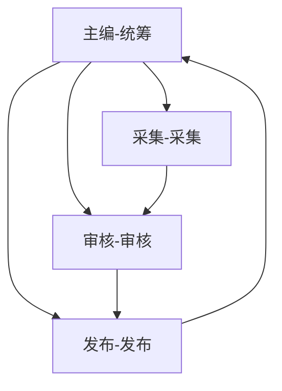

# OpenClaw Agent 团队构建方法论 - 优化版

> 本章基于实际经验，对"七步构建法"进行系统性优化与扩展

## 原始七步 vs 优化版

| # | 原始 | 优化版 | 新增内容 |
|---|------|--------|----------|
| 1 | 需求设计 | **需求设计 + 现状分析** | 痛点调研、KPIs、资源评估 |
| 2 | Agent架构设计 | **Agent架构 + 能力矩阵** | Skill矩阵、通信协议、版本管理 |
| 3 | 任务体系设计 | **任务体系 + 编排逻辑** | 依赖图、优先级、补偿机制 |
| 4 | 外部数据源 | **数据源 + 治理体系** | 健康检查、缓存、限流 |
| 5 | Cron任务创建 | **任务创建 + 生命周期** | 编排、冲突检测、状态管理 |
| 6 | 测试运行 | **测试 + 灰度发布** | 单元测试、集成测试、监控告警 |
| 7 | 正式运行 | **运维 + 迭代优化** | 巡检、应急、复盘、知识沉淀 |

---

## 优化后的完整流程

```
┌─────────────────────────────────────────────────────────────────┐
│                    阶段0：启动准备                               │
│  ├── 0.1 明确目标与边界                                          │
│  ├── 0.2 资源评估                                                │
│  └── 0.3 团队分工                                                │
└─────────────────────────────────────────────────────────────────┘
                              ↓
┌─────────────────────────────────────────────────────────────────┐
│                    阶段1：需求与现状分析                          │
│  ├── 1.1 现状调研                                               │
│  ├── 1.2 痛点分析                                               │
│  ├── 1.3 KPI 定义                                               │
│  └── 1.4 需求文档化                                             │
└─────────────────────────────────────────────────────────────────┘
                              ↓
┌─────────────────────────────────────────────────────────────────┐
│                    阶段2：Agent 架构设计                          │
│  ├── 2.1 角色定义                                               │
│  ├── 2.2 能力矩阵                                               │
│  ├── 2.3 通信协议                                               │
│  └── 2.4 注册与配置                                             │
└─────────────────────────────────────────────────────────────────┘
                              ↓
┌─────────────────────────────────────────────────────────────────┐
│                    阶段3：任务体系设计                            │
│  ├── 3.1 任务分类                                               │
│  ├── 3.2 依赖关系                                               │
│  ├── 3.3 优先级与策略                                           │
│  └── 3.4 补偿机制                                               │
└─────────────────────────────────────────────────────────────────┘
                              ↓
┌─────────────────────────────────────────────────────────────────┐
│                    阶段4：数据源治理                              │
│  ├── 4.1 数据源清单                                            │
│  ├── 4.2 认证配置                                              │
│  ├── 4.3 健康检查                                              │
│  └── 4.4 缓存与限流                                            │
└─────────────────────────────────────────────────────────────────┘
                              ↓
┌─────────────────────────────────────────────────────────────────┐
│                    阶段5：任务编排与调度                          │
│  ├── 5.1 Cron 任务创建                                          │
│  ├── 5.2 任务编排                                              │
│  ├── 5.3 冲突检测                                              │
│  └── 5.4 生命周期管理                                           │
└─────────────────────────────────────────────────────────────────┘
                              ↓
┌─────────────────────────────────────────────────────────────────┐
│                    阶段6：测试与验证                              │
│  ├── 6.1 单元测试                                              │
│  ├── 6.2 集成测试                                              │
│  ├── 6.3 灰度发布                                              │
│  └── 6.4 监控告警                                              │
└─────────────────────────────────────────────────────────────────┘
                              ↓
┌─────────────────────────────────────────────────────────────────┐
│                    阶段7：运维与迭代                              │
│  ├── 7.1 巡检机制                                              │
│  ├── 7.2 应急响应                                              │
│  ├── 7.3 复盘优化                                              │
│  └── 7.4 知识沉淀                                              │
└─────────────────────────────────────────────────────────────────┘
```

---

## 阶段详解与优化点

### 阶段0：启动准备（新增）

```
目的：确保团队构建有清晰的目标和资源保障
```

#### 0.1 明确目标与边界

```markdown
## 项目名称：[领域]-Agent团队

## 核心目标（SMART原则）
- Specific（具体）：
- Measurable（可衡量）：
- Achievable（可达成）：
- Relevant（相关）：
- Time-bound（时限）：

## 边界定义
- ✅ 在范围内：
- ❌ 不在范围内：
```

#### 0.2 资源评估

| 资源类型 | 评估项 | 状态 |
|----------|--------|------|
| **人力** | 负责人、运维人员 |  |
| **API** | 需要哪些外部 API |  |
| **数据** | 数据源是否可获取 |  |
| **成本** | 预估 Token 消耗 |  |

#### 0.3 团队分工

| 角色 | 职责 | 负责人 |
|------|------|--------|
| **Owner** | 整体协调、决策 |  |
| **Architect** | Agent 设计、架构 |  |
| **Ops** | 部署、运维、监控 |  |
| **Tester** | 测试、验证 |  |

---

### 阶段1：需求与现状分析（强化）

#### 1.1 现状调研

```markdown
## 现状调研清单

### 人工流程调研
- [ ] 当前流程是什么
- [ ] 涉及哪些角色
- [ ] 痛点在哪
- [ ] 耗时多久

### 数据调研
- [ ] 现有数据有哪些
- [ ] 数据来源是否稳定
- [ ] 数据质量如何

### 工具调研
- [ ] 现有工具栈
- [ ] 集成难度
- [ ] 成本考量
```

#### 1.2 痛点分析

| 痛点 | 频率 | 影响 | 优先级 |
|------|------|------|--------|
| 痛点A | 高/中/低 | 大/中/小 | P0/P1/P2 |
| 痛点B | ... | ... | ... |

#### 1.3 KPI 定义

```markdown
## 成功指标

### 效率指标
- 任务完成时间：X 分钟 → Y 分钟（提升 Z%）
- 人工介入次数：N 次/天 → M 次/天

### 质量指标
- 准确率：X%
- 覆盖率：Y%

### 成本指标
- Token 消耗：X/月
- 成本降低：Y%
```

#### 1.4 需求文档化

**使用模板：**

```markdown
## [需求名称]

### 基本信息
- ID：
- 优先级：
- 负责人：

### 需求描述
[清晰描述要解决什么问题]

### 验收标准
- [ ] 标准1
- [ ] 标准2

### 依赖项
- 依赖需求：
- 依赖数据：
- 依赖外部服务：
```

---

### 阶段2：Agent 架构设计（扩展）

#### 2.1 角色定义

```markdown
## Agent 角色矩阵

| Agent ID | 角色名 | 核心职责 | 协作对象 |
|----------|--------|----------|----------|
| mo-xxx | 主编 | 统筹协调 | 所有Agent |
| mo-xxx | 采集 | 内容采集 | 主编 |
| mo-xxx | 审核 | 质量把控 | 主编 |
```

#### 2.2 能力矩阵（新增）

```markdown
## Skill 能力矩阵

| Agent | 采集 | 审核 | 写作 | 发布 | 监控 |
|-------|------|------|------|------|------|
| 主编 | ⭐ | ⭐⭐ | ⭐⭐ | ⭐ | ⭐⭐⭐ |
| 采集 | ⭐⭐⭐ | ⭐ | ⭐ | ⭐ | ⭐ |
| 审核 | ⭐ | ⭐⭐⭐ | ⭐ | ⭐ | ⭐⭐ |

注：⭐ 表示能力等级
```

#### 2.3 通信协议（新增）

```markdown
## Agent 间通信协议

### 消息类型
| 消息类型 | 用途 | 示例 |
|----------|------|------|
| `request` | 请求任务 | 主编→采集 |
| `response` | 任务结果 | 采集→主编 |
| `alert` | 告警通知 | 审核→主编 |
| `report` | 定时汇报 | 所有→主编 |

### 通信模板
```javascript
{
  type: "request",
  from: "mo-editor",
  to: "mo-collector",
  task: "采集今日AI新闻",
  priority: "normal",
  deadline: "2024-01-01T10:00:00Z",
  context: { /* 额外上下文 */ }
}
```
```

#### 2.4 注册与配置（强化）

```bash
# Agent 注册检查清单
openclaw agents list

# 确认每个 Agent 已正确注册
# 确认 SOUL.md、AGENTS.md 配置
# 确认权限配置
```

---

### 阶段3：任务体系设计（扩展）

#### 3.1 任务分类

```markdown
## 任务分类体系

### 按触发方式
| 类型 | 说明 | 示例 |
|------|------|------|
| `cron` | 定时任务 | 每日早报 |
| `event` | 事件触发 | 新文章发布 |
| `manual` | 手动触发 | 临时需求 |

### 按紧急程度
| 级别 | 响应时间 | 处理方式 |
|------|----------|----------|
| P0 | 立即 | 人工介入 |
| P1 | 1小时内 | 优先处理 |
| P2 | 24小时内 | 正常队列 |
| P3 | 72小时内 | 低优先级 |

### 按业务类型
- 采集任务
- 处理任务
- 审核任务
- 发布任务
- 汇报任务
```

#### 3.2 依赖关系图（新增）

```markdown
## 任务依赖图


```

#### 3.3 优先级与策略（新增）

```markdown
## 任务调度策略

### 优先级队列
1. P0 > P1 > P2 > P3
2. 同优先级按 FIFO
3. 紧急任务可插队

### 降级策略
- 当外部 API 不可用时：
  - 使用缓存数据
  - 标记数据过期
  - 触发告警

### 补偿机制（新增）
- 失败重试：最多 3 次，指数退避
- 熔断器：连续失败 5 次，暂停 30 分钟
- 人工补偿：无法自动恢复时通知人工
```

---

### 阶段4：数据源治理（扩展）

#### 4.1 数据源清单

```markdown
## 数据源清单

| 数据源 | 类型 | 用途 | 负责人 | 状态 |
|--------|------|------|--------|------|
| 微信公众号 | API | 内容获取 |  |  |
| 微博 | 爬虫 | 热点追踪 |  |  |
| 行业报告 | 文件 | 数据输入 |  |  |
```

#### 4.2 认证配置（强化）

```bash
# 认证检查清单
[ ] API Key 已配置
[ ] Token 已刷新
[ ] 权限范围正确
[ ] 密钥已加密存储
```

#### 4.3 健康检查（新增）

```markdown
## 数据源健康检查

### 检查项
- [ ] API 响应时间 < 3s
- [ ] 数据完整率 > 95%
- [ ] 错误率 < 5%

### 监控指标
- 请求成功率
- 平均响应时间
- 数据延迟

### 故障处理
1. 触发告警
2. 切换备份数据源
3. 记录故障日志
4. 人工通知
```

#### 4.4 缓存与限流（新增）

```markdown
## 缓存策略

| 数据类型 | 缓存时间 | 存储位置 |
|----------|----------|----------|
| 热点数据 | 1小时 | Redis/本地 |
| 历史数据 | 24小时 | 文件 |
| 实时数据 | 5分钟 | 内存 |

## 限流策略
- 每分钟请求数：不超过 60
- 超出限流：加入队列，延迟处理
```

---

### 阶段5：任务编排与调度（扩展）

#### 5.1 Cron 任务创建

```bash
# 创建任务脚本
#!/bin/bash
# 文件：scripts/create-all-crons.sh

# 任务清单
TASKS=(
  "AI法律新闻日报|0 7 * * *"
  "墨答-早间选题|0 8 * * *"
  "墨记-晚间数据|30 22 * * *"
)

# 批量创建
for task in "${TASKS[@]}"; do
  IFS='|' read -r name schedule <<< "$task"
  echo "Creating: $name ($schedule)"
  # 调用 cron API 创建
done
```

#### 5.2 任务编排（新增）

```markdown
## 任务编排模板

### 编排类型
1. **串行编排**：A → B → C
2. **并行编排**：A ∥ B ∥ C
3. **条件编排**：IF X THEN A ELSE B
4. **循环编排**：REPEAT A N times

### 示例：每日新闻工作流
```
[07:00] 主编 → 采集所有来源
[07:30] 主编 → 汇总整理
[08:00] 主编 → 审核分发
[08:30] 主编 → 生成报告
[09:00] 主编 → 发布
```
```

#### 5.3 冲突检测（新增）

```markdown
## 任务冲突检测

### 冲突类型
1. **时间冲突**：同一时间多个任务
2. **资源冲突**：竞争同一外部 API
3. **数据冲突**：输出覆盖

### 解决方案
- 时间冲突：错峰执行
- 资源冲突：添加锁
- 数据冲突：版本控制
```

#### 5.4 生命周期管理（新增）

```markdown
## 任务生命周期

```
创建 → 待执行 → 执行中 → 完成/失败 → 归档
                      ↓
                   重试中
```

### 状态管理
- `created`：已创建，等待调度
- `pending`：在队列中
- `running`：执行中
- `success`：成功完成
- `failed`：执行失败
- `retrying`：重试中
- `cancelled`：已取消
```

---

### 阶段6：测试与验证（扩展）

#### 6.1 单元测试

```markdown
## 单元测试清单

### Agent 能力测试
- [ ] Agent 能否正常启动
- [ ] Agent 能否正确响应
- [ ] Agent 错误处理是否正确

### 工具测试
- [ ] 工具调用是否正常
- [ ] 返回数据格式是否正确
- [ ] 异常处理是否到位
```

#### 6.2 集成测试（新增）

```markdown
## 集成测试场景

### 场景1：正常流程
1. 触发采集任务
2. 验证数据采集
3. 验证审核流程
4. 验证发布成功

### 场景2：异常处理
1. 模拟 API 失败
2. 验证降级逻辑
3. 验证告警触发
4. 验证日志记录

### 场景3：并发测试
1. 同时触发多个任务
2. 验证无冲突
3. 验证资源正确
```

#### 6.3 灰度发布（新增）

```markdown
## 灰度发布策略

### 阶段1：小流量（5%）
- 观察 24 小时
- 收集基础指标

### 阶段2：扩量（20%）
- 扩大用户范围
- 监控核心指标

### 阶段3：全量（100%）
- 全面切换
- 进入正式运维
```

#### 6.4 监控告警（新增）

```markdown
## 监控指标

### 核心指标
- 任务成功率
- 平均执行时间
- Token 消耗
- 错误率

### 告警规则
| 告警项 | 阈值 | 动作 |
|--------|------|------|
| 任务失败率 | > 10% | Telegram通知 |
| 执行超时 | > 5分钟 | 人工介入 |
| Token超消耗 | > 100K/天 | 告警 |
```

---

### 阶段7：运维与迭代（扩展）

#### 7.1 巡检机制（新增）

```markdown
## 每日巡检

### 自动化巡检
- [ ] Cron 任务执行情况
- [ ] Agent 健康状态
- [ ] 数据源可用性
- [ ] Token 消耗统计

### 人工巡检
- [ ] 重要任务结果抽检
- [ ] 用户反馈处理
- [ ] 问题排查与解决
```

#### 7.2 应急响应（新增）

```markdown
## 应急响应流程

### P0 故障（服务不可用）
1. 立即通知负责人（5分钟内）
2. 切换备份方案
3. 持续通报进展
4. 48小时内复盘

### P1 故障（部分功能异常）
1. 记录问题
2. 排查原因
3. 制定修复方案
4. 24小时内修复
```

#### 7.3 复盘优化（新增）

```markdown
## 周/月复盘

### 指标回顾
- 任务完成率
- 成功率趋势
- 成本变化
- 用户满意度

### 问题回顾
- 本周问题列表
- 根因分析
- 改进措施

### 优化计划
- 下周优化项
- 资源需求
- 预期效果
```

#### 7.4 知识沉淀（新增）

```markdown
## 知识库结构

openclaw-team-docs/
├── README.md           # 团队概述
├── architecture/      # 架构文档
│   ├── agent-roles.md
│   ├── task-flow.md
│   └── data-sources.md
├── operations/        # 运维文档
│   ├── runbooks/     # 运维手册
│   ├── incidents/    # 故障记录
│   └── changes/      # 变更记录
├── learnings/        # 学习积累
│   ├── best-practices.md
│   └── lessons-learned.md
└── onboarding/       # 新人指南
```

---

## 完整检查清单

### 启动前检查

```markdown
## 启动检查清单

### 阶段0：准备
- [ ] 项目目标已定义
- [ ] 资源已评估
- [ ] 团队分工已明确

### 阶段1：需求
- [ ] 现状调研完成
- [ ] 痛点分析完成
- [ ] KPI 已定义
- [ ] 需求文档已评审

### 阶段2：架构
- [ ] Agent 角色已定义
- [ ] 能力矩阵已建立
- [ ] 通信协议已明确
- [ ] Agent 已注册

### 阶段3：任务
- [ ] 任务分类完成
- [ ] 依赖关系已梳理
- [ ] 优先级已设定
- [ ] 补偿机制已设计

### 阶段4：数据
- [ ] 数据源清单完成
- [ ] 认证已配置
- [ ] 健康检查已设置
- [ ] 缓存策略已制定

### 阶段5：调度
- [ ] Cron 任务已创建
- [ ] 编排逻辑已验证
- [ ] 冲突检测已测试

### 阶段6：测试
- [ ] 单元测试通过
- [ ] 集成测试通过
- [ ] 灰度发布完成
- [ ] 监控告警已配置

### 阶段7：运维
- [ ] 巡检机制已建立
- [ ] 应急响应已培训
- [ ] 知识库已初始化
```

---

## 总结：优化要点

| 维度 | 原始版 | 优化版 | 价值 |
|------|--------|--------|------|
| **系统性** | 线性流程 | 完整生命周期 | 避免遗漏 |
| **可控性** | 事后验证 | 阶段检查 | 及时发现问题 |
| **可维护性** | 无规范 | 知识沉淀 | 传承与迭代 |
| **可靠性** | 简单测试 | 灰度发布 | 降低风险 |
| **可观测性** | 无监控 | 全方位监控 | 快速定位问题 |

---

**相关内容：**

- [Dashboard 调研报告](./26-dashboard-research-comparison.md)
- [Agent 架构详解](./16-openclaw-agent-architecture.md)
- [多 Agent 协作](./04-multi-agent.md)
