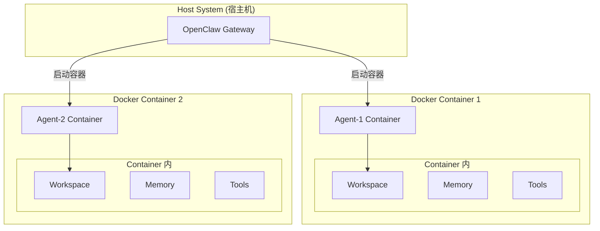
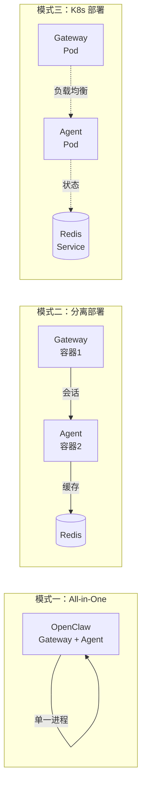

# 3.12 Agent 运行时与沙盒完全指南

## 本节目标
- 理解 Agent 运行时架构
- 掌握沙盒机制的工作原理
- 学会配置安全隔离
- 理解资源限制和管理

---

## 12.1 Agent 运行时概述

### 什么是 Agent 运行时

Agent 运行时是 OpenClaw 执行 Agent 代码的环境，提供了代码执行的隔离空间和资源管理能力。

```
┌─────────────────────────────────────────────────────────────────────────────────┐
│                           Agent 运行时架构                                       │
├─────────────────────────────────────────────────────────────────────────────────┤
│                                                                                 │
│  ┌─────────────┐    ┌─────────────┐    ┌─────────────┐                       │
│  │   用户请求   │───▶│   消息路由   │───▶│  Agent 运行时 │                     │
│  └─────────────┘    └─────────────┘    └─────────────┘                       │
│                                                  │                              │
│                    ┌────────────────────────────┼────────────────────────┐   │
│                    │                            │                        │   │
│                    ▼                            ▼                        ▼   │
│           ┌─────────────┐              ┌─────────────┐              ┌────────┐│
│           │   沙盒环境   │              │  工具执行器  │              │  上下文 ││
│           │  (Sandbox)  │              │  (Executor) │              │  管理   ││
│           └─────────────┘              └─────────────┘              └────────┘│
│                                                                                 │
└─────────────────────────────────────────────────────────────────────────────────┘
```

![运行时沙箱]/assets/diagrams/28_runtime_sandbox.png)


### 运行时的核心职责

| 职责 | 说明 |
|------|------|
| 代码执行 | 在隔离环境中执行 Agent 代码 |
| 工具调用 | 管理工具的调用和结果返回 |
| 资源限制 | 控制内存、CPU、执行时间 |
| 安全保障 | 防止恶意操作和资源滥用 |
| 状态管理 | 维护执行状态和会话上下文 |

---

## 12.2 沙盒机制详解

### 沙盒是什么

沙盒（Sandbox）是 Agent 运行时的核心隔离机制，确保 Agent 的操作不会影响宿主系统和其他 Agent。

### 沙盒的核心特性

```
┌─────────────────────────────────────────────────────────────────────────────────┐
│                           沙盒核心特性                                          │
├─────────────────────────────────────────────────────────────────────────────────┤
│                                                                                 │
│  ┌─────────────┐  ┌─────────────┐  ┌─────────────┐  ┌─────────────┐           │
│  │   文件隔离   │  │   网络隔离   │  │  进程隔离   │  │  权限控制   │           │
│  │             │  │             │  │             │  │             │           │
│  │  独立工作区  │  │  受限域名    │  │  子进程限制  │  │  最小权限   │           │
│  └─────────────┘  └─────────────┘  └─────────────┘  └─────────────┘           │
│                                                                                 │
└─────────────────────────────────────────────────────────────────────────────────┘
```

![运行时沙箱]/assets/diagrams/28_runtime_sandbox.png)


### 文件系统隔离

```
Agent 工作区结构:

~/.openclaw/
├── workspace/              # 全局工作区（共享）
│   └── shared/
├── agents/                 # Agent 隔离区
│   ├── agent_001/
│   │   ├── sessions/       # Session 隔离
│   │   ├── workspace/      # Agent 私有工作区
│   │   └── memory/        # Agent 私有记忆
│   └── agent_002/
│       ├── sessions/
│       ├── workspace/
│       └── memory/
```

![运行时沙箱]/assets/diagrams/28_runtime_sandbox.png)


### 隔离级别

| 级别 | 说明 | 适用场景 |
|------|------|---------|
| agent | Agent 之间完全隔离 | 生产环境 |
| session | Session 之间隔离 | 多会话场景 |
| workspace | 工作区隔离 | 多租户场景 |
| shared | 共享环境 | 开发测试 |

---

## 12.3 运行时配置

### 基础配置

```json5
{
  runtime: {
    // 沙盒类型
    sandbox: {
      type: "isolated",    // isolated, shared, none
      // 文件系统配置
      filesystem: {
        // 可访问的目录
        allowedPaths: [
          "${workspace}/**",
          "${agentDir}/**"
        ],
        // 禁止访问的目录
        deniedPaths: [
          "/etc/**",
          "~/.ssh/**",
          "/System/**"
        ]
      },
      // 网络配置
      network: {
        // 允许的域名
        allowedDomains: ["api.example.com", "*.github.com"],
        // 禁止的域名
        blockedDomains: ["*.internal.com", "localhost"]
      }
    }
  }
}
```

### 资源限制配置

```json5
{
  runtime: {
    // 执行时间限制
    execution: {
      // 单次执行超时（毫秒）
      timeout: 60000,
      // 最大循环次数
      maxIterations: 100,
      // 最大递归深度
      maxRecursionDepth: 10
    },
    // 内存限制
    memory: {
      // 最大内存（MB）
      maxMemoryMB: 512,
      // 内存警告阈值
      warningThresholdMB: 384
    },
    // 工具调用限制
    tools: {
      // 单次请求最大工具调用数
      maxCallsPerRequest: 50,
      // 每分钟最大工具调用数
      maxCallsPerMinute: 500
    }
  }
}
```

### Agent 级别配置

```json5
{
  agents: {
    list: [
      {
        id: "trusted-agent",
        runtime: {
          sandbox: "shared",
          timeout: 300000,
          maxMemoryMB: 1024
        }
      },
      {
        id: "restricted-agent",
        runtime: {
          sandbox: "isolated",
          timeout: 30000,
          maxMemoryMB: 256,
          filesystem: {
            deniedPaths: ["**/*"]
          }
        }
      }
    ]
  }
}
```

---

## 12.4 工具执行器

### 执行流程

```
用户请求
    │
    ▼
┌─────────────────────────────────────────────────────────────────┐
│                      工具调用生命周期                            │
├─────────────────────────────────────────────────────────────────┤
│                                                                 │
│  1. 权限检查                                                   │
│     └── Agent 是否有权限调用此工具？                           │
│                                                                 │
│  2. 参数验证                                                   │
│     └── 验证参数类型、范围、格式                              │
│                                                                 │
│  3. 沙盒检查                                                   │
│     └── 检查文件/网络访问权限                                 │
│                                                                 │
│  4. 执行工具                                                   │
│     └── 在沙盒中执行操作                                      │
│                                                                 │
│  5. 结果处理                                                   │
│     └── 格式化返回结果，处理错误                              │
│                                                                 │
└─────────────────────────────────────────────────────────────────┘
```

### 工具权限模型

```json5
{
  tools: {
    // 全局允许的工具
    allow: [
      "read",
      "write",
      "exec",
      "fetch"
    ],
    // 全局禁止的工具
    deny: [
      "shell",
      "eval"
    ],
    // 工具组
    groups: {
      fs: ["read", "write", "edit", "glob"],
      runtime: ["exec", "bash"],
      web: ["fetch", "webhook"],
      memory: ["memory_search", "memory_write"]
    }
  }
}
```

### 权限检查示例

```bash
# Agent 尝试调用工具时的检查流程

1. 检查工具是否在 allow 列表中
   └─❌ 如果在 deny 列表中 → 拒绝访问

2. 检查 Agent 是否有权限
   └─❌ 如果权限不足 → 拒绝访问

3. 检查参数是否有效
   └─❌ 如果参数无效 → 返回错误

4. 检查沙盒限制
   └─❌ 如果违反限制 → 拒绝访问

5. 执行工具
   └─✅ 通过所有检查 → 执行
```

---

## 12.5 运行时状态管理

### 状态类型

| 状态 | 说明 |
|------|------|
| idle | 空闲，等待请求 |
| running | 正在执行 |
| waiting | 等待工具返回 |
| error | 执行错误 |
| terminated | 已终止 |

### 状态转换

```
     ┌────────┐
     │  idle  │
     └────┬───┘
          │ 接收请求
          ▼
     ┌────────┐    执行完成    ┌────────┐
     │running │──────────────▶│  idle  │
     └────┬───┘               └────────┘
          │
          │ 调用工具
          ▼
     ┌──────────┐   工具返回    ┌────────┐
     │ waiting  │─────────────▶│running │
     └──────────┘              └────┬───┘
          │                           │
          │ 错误                       │ 终止
          ▼                           ▼
     ┌──────────┐               ┌────────────┐
     │  error   │               │ terminated │
     └──────────┘               └────────────┘
```

### 状态监控

```bash
# 查看 Agent 运行状态
/status

# 查看详细状态
/context status

# 查看资源使用
/context resources
```

---

## 12.6 安全最佳实践

### 配置清单

```
┌─────────────────────────────────────────────────────────────────────────────────┐
│                       运行时安全检查清单                                        │
├─────────────────────────────────────────────────────────────────────────────────┤
│                                                                                 │
│  ✅ 必做项：                                                                    │
│  [ ] 使用 isolated 沙盒模式                                                   │
│  [ ] 配置文件访问限制                                                          │
│  [ ] 限制网络访问域名                                                          │
│  [ ] 设置执行超时                                                              │
│  [ ] 限制内存使用                                                              │
│  [ ] 禁止危险工具（shell, eval）                                               │
│  [ ] 最小权限原则                                                               │
│                                                                                 │
│  ❌ 禁止项：                                                                    │
│  [ ] 禁用沙盒（sandbox: none）                                                 │
│  [ ] 允许所有文件访问                                                          │
│  [ ] 允许所有域名访问                                                          │
│  [ ] 无执行超时限制                                                            │
│                                                                                 │
└─────────────────────────────────────────────────────────────────────────────────┘
```

### 生产环境配置

```json5
{
  runtime: {
    sandbox: {
      type: "isolated",
      filesystem: {
        allowedPaths: [
          "${workspace}/**"
        ],
        deniedPaths: [
          "~/.ssh/**",
          "~/.aws/**",
          "/etc/**"
        ]
      },
      network: {
        allowedDomains: [
          "api.openai.com",
          "api.anthropic.com"
        ],
        blockedDomains: [
          "*.internal.*",
          "localhost",
          "127.0.0.1"
        ]
      }
    },
    execution: {
      timeout: 60000,
      maxIterations: 100
    },
    memory: {
      maxMemoryMB: 512
    }
  },
  tools: {
    deny: [
      "shell",
      "eval",
      "exec:rm",
      "exec:dd"
    ]
  }
}
```

### 开发环境配置

```json5
{
  runtime: {
    sandbox: {
      type: "shared",
      filesystem: {
        allowedPaths: ["**/*"]
      },
      network: {
        allowedDomains: ["*"]
      }
    },
    execution: {
      timeout: 300000,
      maxIterations: 1000
    },
    memory: {
      maxMemoryMB: 2048
    }
  }
}
```

---

## 12.7 故障排查

### 常见问题

| 问题 | 原因 | 解决方案 |
|------|------|---------|
| 工具调用超时 | 执行时间过长 | 增加 timeout 配置 |
| 权限被拒绝 | 工具不在 allow 列表 | 添加到 allow 列表 |
| 文件访问被拒 | 路径不在 allowedPaths | 配置允许的路径 |
| 内存不足 | 超出限制 | 优化代码或增加限制 |
| 沙盒错误 | 违反沙盒规则 | 检查配置 |

### 调试命令

```bash
# 查看运行时配置
/config show runtime

# 查看工具权限
/tools permissions

# 测试工具调用
/test tool exec --command "ls"

# 查看资源使用
/context resources
```

---

## 本节小结

1. **Agent 运行时** - 负责执行 Agent 代码的隔离环境
2. **沙盒机制** - 提供文件系统、网络、进程隔离
3. **隔离级别** - agent、session、workspace、shared
4. **资源限制** - timeout、memory、工具调用次数
5. **工具权限** - allow/deny 列表和工具组
6. **状态管理** - idle、running、waiting、error、terminated

---

---

## 12.8 Docker 容器级隔离

### VM2 沙箱 vs Docker 容器

OpenClaw 的沙盒机制分为两层：

| 层级 | 实现方式 | 隔离级别 | 适用场景 |
|------|---------|---------|---------|
| **逻辑沙箱** | VM2 / 子进程 | 中等 | 日常工具执行 |
| **容器沙箱** | Docker / Podman | 高级 | 高安全需求 |

```
┌─────────────────────────────────────────────────────────────────────────────────┐
│                          OpenClaw 运行时分层                                     │
├─────────────────────────────────────────────────────────────────────────────────┤
│                                                                                 │
│  ┌─────────────────────────────────────────────────────────────────────────┐   │
│  │  Docker 容器层 (可选，高安全)                                          │   │
│  │  └── Agent 代码在独立容器中执行                                        │   │
│  │  └── 完全隔离的文件系统、网络、进程                                     │   │
│  └─────────────────────────────────────────────────────────────────────────┘   │
│                                    ▲                                           │
│                                    │                                           │
│  ┌─────────────────────────────────────────────────────────────────────────┐   │
│  │  VM2 沙箱层 (默认)                                                     │   │
│  │  └── 工具执行在受控的 JavaScript 上下文                                │   │
│  │  └── 受限的 fs/fetch/console                                          │   │
│  └─────────────────────────────────────────────────────────────────────────┘   │
│                                    ▲                                           │
│                                    │                                           │
│  ┌─────────────────────────────────────────────────────────────────────────┐   │
│  │  Gateway 主进程                                                        │   │
│  │  └── 消息路由、会话管理、Agent Loop                                      │   │
│  └─────────────────────────────────────────────────────────────────────────┘   │
│                                                                                 │
└─────────────────────────────────────────────────────────────────────────────────┘
```

### Docker 沙箱架构



### Docker 沙箱配置

```yaml
# openclaw.yaml
runtime:
  sandbox:
    # 沙箱类型：vm2 | docker | podman
    type: docker

  docker:
    # 容器镜像
    image: openclaw/agent-sandbox:latest

    # 容器资源限制
    resources:
      cpu: "1"
      memory: "512MB"
      pids: 100

    # 网络隔离
    network: isolated  # isolated | bridge | none

    # 文件系统隔离
    filesystem:
      # 只读挂载的基础目录
      readonly:
        - /usr/local/lib/node_modules
        - /opt/tools
      # 可写的工作目录
      writable:
        - /workspace
        - /tmp

    # 环境变量
    env:
      NODE_ENV: production
      SANDBOX_MODE: "true"

    # 执行命令
    command: ["node", "/app/agent.js"]
```

### 容器级隔离特性

| 特性 | 说明 | 优势 |
|------|------|------|
| **文件系统隔离** | 独立的文件系统视图 | 无法访问宿主机敏感文件 |
| **网络隔离** | 独立网络栈或受控网络 | 防止数据泄露 |
| **进程隔离** | 独立的进程空间 | 进程间无法相互影响 |
| **资源限制** | CPU/内存/PIDs 限制 | 防止资源耗尽 |
| **镜像不可变** | 基础镜像只读 | 防止容器内篡改 |

### Docker 沙箱执行流程

```
用户请求执行代码
    │
    ▼
┌─────────────────────────────────────────────────────────────────┐
│ 1. Gateway 接收请求                                              │
└─────────────────────────────────────────────────────────────────┘
    │
    ▼
┌─────────────────────────────────────────────────────────────────┐
│ 2. 创建/复用 Agent 容器                                          │
│    docker create --rm                                            │
│      --cpu 1 --memory 512MB                                     │
│      --network isolated                                          │
│      -v /workspace:/workspace:ro                                  │
│      openclaw/agent-sandbox                                     │
└─────────────────────────────────────────────────────────────────┘
    │
    ▼
┌─────────────────────────────────────────────────────────────────┐
│ 3. 传输代码到容器                                                 │
│    docker cp agent.js <container>:/tmp/                          │
└─────────────────────────────────────────────────────────────────┘
    │
    ▼
┌─────────────────────────────────────────────────────────────────┐
│ 4. 在容器中执行代码                                               │
│    docker exec <container> node /tmp/agent.js                   │
│                                                                 │
│    # 容器内执行                                                │
│    # - 无法访问 /etc, /root, ~/.ssh                             │
│    # - 网络受限（白名单域名）                                    │
│    # - 只能写入 /workspace, /tmp                                │
└─────────────────────────────────────────────────────────────────┘
    │
    ▼
┌─────────────────────────────────────────────────────────────────┐
│ 5. 回收执行结果                                                  │
│    docker cp <container>:/tmp/output.json ./                   │
└─────────────────────────────────────────────────────────────────┘
    │
    ▼
┌─────────────────────────────────────────────────────────────────┐
│ 6. 销毁容器（可选，取决于是否复用）                               │
│    docker stop <container>                                      │
└─────────────────────────────────────────────────────────────────┘
```

### 安全对比

| 安全维度 | VM2 沙箱 | Docker 容器 |
|---------|----------|-------------|
| **隔离强度** | 中等（JavaScript 上下文） | 高级（内核级隔离） |
| **文件访问** | 受控的 virtual fs | 完全独立的文件系统 |
| **网络访问** | 受控的 guarded fetch | 独立网络栈 |
| **进程访问** | 受控的 VM | 独立进程空间 |
| **资源消耗** | 低（进程级） | 较高（容器启动） |
| **启动速度** | 快（~10ms） | 慢（~500ms） |
| **适用场景** | 日常工具执行 | 高安全需求 |

### 何时使用 Docker 沙箱

```
┌─────────────────────────────────────────────────────────────────┐
│                    Docker 沙箱适用场景                            │
├─────────────────────────────────────────────────────────────────┤
│                                                                 │
│  ✅ 使用 Docker 沙箱：                                           │
│  [ ] 执行用户提交的不可信代码                                     │
│  [ ] 需要完全隔离的 Agent 执行环境                               │
│  [ ] 多人共享同一个 OpenClaw 实例                               │
│  [ ] 对安全要求极高的企业环境                                     │
│  [ ] 需要运行系统级命令（docker, kubectl）                       │
│                                                                 │
│  ❌ 使用 VM2 沙箱（足够）：                                     │
│  [ ] 执行内置工具（read, write, exec）                          │
│  [ ] 调用受信任的 API                                            │
│  [ ] 个人使用，安全风险可控                                       │
│  [ ] 对延迟敏感的场景                                            │
│                                                                 │
└─────────────────────────────────────────────────────────────────┘
```

### OpenClaw Docker 部署模式



### Docker Compose 部署示例

```yaml
# docker-compose.yaml
version: '3.8'

services:
  openclaw:
    image: openclaw/openclaw:latest
    container_name: openclaw-gateway
    ports:
      - "18789:18789"    # Gateway 端口
      - "18790:18790"    # Web UI 端口
    volumes:
      - ./workspace:/app/workspace
      - ./config:/app/config
      - /var/run/docker.sock:/var/run/docker.sock  # Docker socket
    environment:
      - OPENCLAW_MODE=docker
      - REDIS_URL=redis://redis:6379
    depends_on:
      - redis

  redis:
    image: redis:alpine
    container_name: openclaw-redis
    volumes:
      - redis-data:/data

  # 可选：Agent 沙箱容器（按需启动）
  agent-sandbox:
    image: openclaw/agent-sandbox:latest
    container_name: openclaw-sandbox
    deploy:
      resources:
        limits:
          cpus: '1'
          memory: 512M
    volumes:
      - ./workspace:/workspace
    networks:
      - openclaw-net
    restart: "no"  # 按需启动，不持续运行

networks:
  openclaw-net:
    driver: bridge

volumes:
  redis-data:
```

### 生产环境 K8s 配置

```yaml
# openclaw-agent-pod.yaml
apiVersion: v1
kind: Pod
metadata:
  name: openclaw-agent
  labels:
    app: openclaw-agent
spec:
  containers:
    - name: agent
      image: openclaw/agent-sandbox:latest
      resources:
        limits:
          cpu: "1"
          memory: "512Mi"
        requests:
          cpu: "0.5"
          memory: "256Mi"
      securityContext:
        readOnlyRootFilesystem: true
        runAsNonRoot: true
        runAsUser: 1000
      volumeMounts:
        - name: workspace
          mountPath: /workspace
        - name: tmp
          mountPath: /tmp
  volumes:
    - name: workspace
      emptyDir: {}
    - name: tmp
      emptyDir:
        medium: Memory
  securityContext:
    seccompProfile:
      type: RuntimeDefault
```

### 最佳实践

```
┌─────────────────────────────────────────────────────────────────────────────────┐
│                       Docker 沙箱安全最佳实践                                      │
├─────────────────────────────────────────────────────────────────────────────────┤
│                                                                                 │
│  ✅ 必做项：                                                                    │
│  [ ] 使用只读根文件系统                                                         │
│  [ ] 以非 root 用户运行容器                                                     │
│  [ ] 设置合理的资源限制（CPU/内存/PIDs）                                        │
│  [ ] 使用安全上下文（seccomp/AppArmor/SELinux）                                 │
│  [ ] 限制容器能力（--cap-drop=ALL）                                            │
│  [ ] 使用最小化基础镜像                                                         │
│  [ ] 定期更新基础镜像修补漏洞                                                   │
│  [ ] 禁止挂载 Docker socket（除非必要）                                        │
│                                                                                 │
│  ❌ 禁止项：                                                                    │
│  [ ] 容器内使用 --privileged 标志                                              │
│  [ ] 挂载宿主机的敏感目录                                                       │
│  [ ] 使用 root 用户运行容器                                                     │
│  [ ] 禁用安全上下文物（seccomp: unconfined）                                   │
│                                                                                 │
└─────────────────────────────────────────────────────────────────────────────────┘
```

---

## 参考资料

- [官方运行时文档](https://docs.openclaw.ai/concepts/runtime)
- [官方沙盒文档](https://docs.openclaw.ai/concepts/sandbox)
- [OpenClaw Docker 部署](https://docs.openclaw.ai/deployment/docker)
- [Docker 安全最佳实践](https://docs.docker.com/engine/security/)
