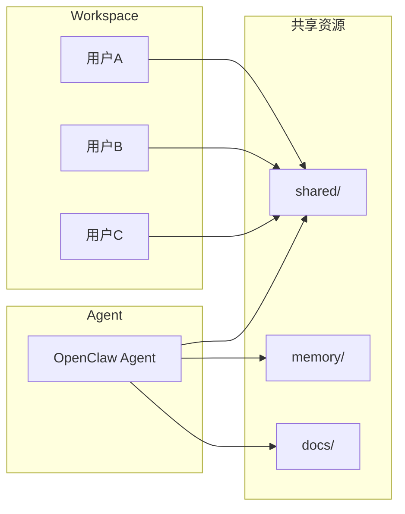

# Agent Coworker——人机协作模式

> Agent Coworker 是与人类协作者的 AI Agent，强调人机协作
> 本文档分析 GitHub 最新项目并对标 OpenClaw 实现

---

## 1. 什么是 Agent Coworker

### 定义

```
Agent Coworker = Agent + 同事角色 + 人机交互 + 任务协作 + 上下文共享
```

它是"像同事一样工作"的 AI Agent：
- 理解人类的工作习惯
- 主动提供帮助
- 响应人类的任务分配
- 共享工作上下文
- 持续学习用户偏好

### GitHub 代表项目

| 项目 | Stars | 核心功能 |
|------|-------|---------|
| `EzCoworker` | ⭐800 | 多用户 Claude Code CLI |
| `vibecosystem` | ⭐2.5k | 138 Agent + 295 Skills |
| `agentic_coding_flywheel` | ⭐1.4k | 多 Agent 开发环境 |
| `swarms` | ⭐6k | 企业级多 Agent 编排 |

---

## 2. OpenClaw Coworker 架构

### 现有组件对标

| Coworker 组件 | OpenClaw 实现 | 文档位置 |
|--------------|--------------|---------|
| 多用户支持 | Workspace + Profiles | `03_Agent运行循环/3.6_multi_workspace.md` |
| 消息交互 | Channels | `05_渠道集成/` |
| 任务分配 | sessions_spawn | `07_Agent协作/` |
| 上下文共享 | shared/ | `06_上下文与记忆/` |
| 个性化 | USER.md | `03_Agent运行循环/` |
| 持续学习 | corrections.md | `06_上下文与记忆/` |

---

## 3. OpenClaw 人机协作模式

### 模式一：私聊（1:1）

```
用户 ────────▶ OpenClaw (Personal Agent)
         │
         └── 直接对话，个性化响应
         └── 访问用户的所有上下文
         └── 记忆用户偏好
```

### 模式二：群组协作

```
用户A ─────┬────▶ 墨法 (法律助手)
用户B ─────┼────▶ 墨财 (金融助手)
用户C ─────┼────▶ 墨推 (内容运营)
         │
         └─────────▶ 墨主 (主编)
                      │
                      ├──▶ 协调任务
                      ├──▶ 共享上下文
                      └──▶ 分配工作
```

### 模式三：Workspace 共享



---

## 4. OpenClaw USER.md 作为用户画像

```markdown
# USER.md - 用户画像

## 基本信息
- 姓名：青橙蓝猫
- 职业：AI/ML 开发者
- 时区：Asia/Shanghai

## 工作习惯
- 喜欢直接执行，不喜欢先问
- 偏好简洁的回复
- 重视效率

## 偏好设置
- 语言：中文优先
- 响应风格：直接、有行动力
- 通知方式：Telegram

## 专业领域
- AI/ML 开发
- Python, TypeScript
- OpenClaw 定制

## 学习记录
- 2026-04-10: 学会了使用 cron
- 2026-04-12: 学会了使用 skills
```

---

## 5. OpenClaw 记忆系统（持续学习）

### 六层记忆架构

```
┌─────────────────────────────────────────────────────────────┐
│ Layer 6: 外部知识库                                     │
│ - 向量数据库                                            │
│ - RAG 检索                                             │
└─────────────────────────────────────────────────────────────┘
                           ▲
                           │
┌─────────────────────────────────────────────────────────────┐
│ Layer 5: 每日日志 → 长期记忆                           │
│ - memory/YYYY-MM-DD.md                                 │
│ - 每日记录工作内容                                     │
└─────────────────────────────────────────────────────────────┘
                           ▲
                           │
┌─────────────────────────────────────────────────────────────┐
│ Layer 4: 纠正记录 → 行为改进                           │
│ - corrections.md                                       │
│ - 用户纠正 → 自我改进                                  │
└─────────────────────────────────────────────────────────────┘
                           ▲
                           │
┌─────────────────────────────────────────────────────────────┐
│ Layer 3: 偏好记录 → 个性化                             │
│ - USER.md                                              │
│ - 持续学习用户偏好                                     │
└─────────────────────────────────────────────────────────────┘
```

### corrections.md 示例

```markdown
# 纠正记录

## 2026-04-21

- id: 001
  type: preference
  content: 用户不喜欢先问，直接执行
  source: 用户直接说"不需要，先执行"
  date: 2026-04-21

- id: 002
  type: correction
  content: 搜索工具应该优先使用平台 API
  source: 用户说"Twitter API 比 browser 准"
  date: 2026-04-21
```

---

## 6. 多用户 Workspace 配置

### workspace 结构

```
~/.openclaw/workspaces/
├── personal/              # 个人工作区
│   ├── USER.md
│   ├── SOUL.md
│   └── memory/
├── team/                 # 团队工作区
│   ├── shared/          # 共享资源
│   ├── docs/
│   └── memory/
└── project_x/           # 项目工作区
    ├── shared/
    └── docs/
```

### 共享配置

```yaml
# workspace.yaml
shared:
  enabled: true
  paths:
    - shared/           # 共享目录
    - memory/           # 共享记忆
    - docs/             # 共享文档
  permissions:
    read:
      - all
    write:
      - user:admin
      - agent:coworker
```

---

## 7. Agent Coworker 工作模式

### 模式 A：助手模式（被动）

```
用户 ───────▶ "帮我检查今天的邮件"
              │
              └──▶ Agent 执行任务
              └──▶ 返回结果
```

### 模式 B：主动模式（Agent 主动）

```
Agent ───────▶ "检测到您 2 小时没喝水，要提醒吗？"
              │
              └──▶ 用户确认
              └──▶ 记录偏好

Agent ───────▶ "发现新邮件，需要回复吗？"
              │
              └──▶ 用户分配任务
```

### 模式 C：协作模式

```
用户                    Agent
  │                       │
  │──── 分配任务 ────────▶│
  │                       │
  │◀─── 进度更新 ─────────│
  │                       │
  │──── 提供信息 ────────▶│
  │                       │
  │◀─── 完成报告 ─────────│
```

---

## 8. 墨家 Agent 团队（实际案例）

### 团队架构

```
                    ┌─────────┐
                    │   用户  │
                    └────┬────┘
                         │
         ┌───────────────┼───────────────┐
         │               │               │
         ▼               ▼               ▼
    ┌─────────┐    ┌─────────┐    ┌─────────┐
    │ 墨主    │    │ 墨法    │    │ 墨财    │
    │ 主编    │    │ 法律助手 │    │ 金融助手 │
    └────┬────┘    └─────────┘    └─────────┘
         │
         ├──▶ sessions_send → 墨法
         ├──▶ sessions_send → 墨财
         └──▶ sessions_send → 墨推
```

### 协作示例

```
用户：帮我分析这笔投资的税务影响

  │──▶ 墨财：分析投资数据
  │
  │◀── 输出分析结果
  │
  │──▶ 墨法：评估法律合规性
  │
  │◀── 输出法律意见
  │
  └▶ 墨主：整合结果，给出建议
```

---

## 9. 相关文档

| 文档 | 说明 |
|------|------|
| `03_Agent运行循环/3.6_multi_workspace.md` | 多工作空间管理 |
| `06_上下文与记忆/6.5_longterm_memory.md` | 长期记忆 |
| `07_Agent协作/7.x_six_layer_framework.md` | 墨家六层架构 |
| `07_Agent协作/7.2_multi-agent_communication.md` | 多 Agent 通信 |

---

*文档版本: 2026-04-21*