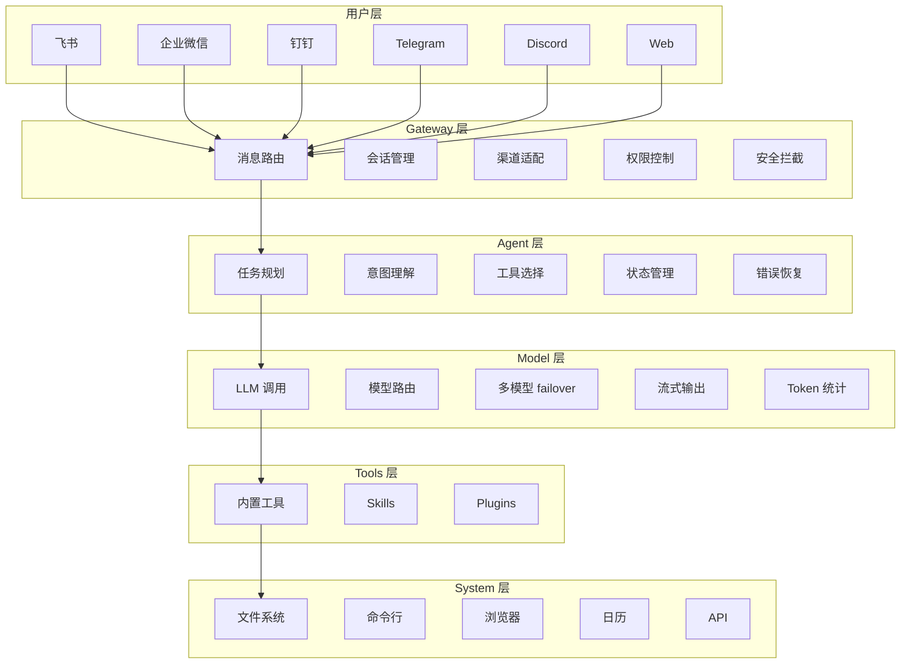
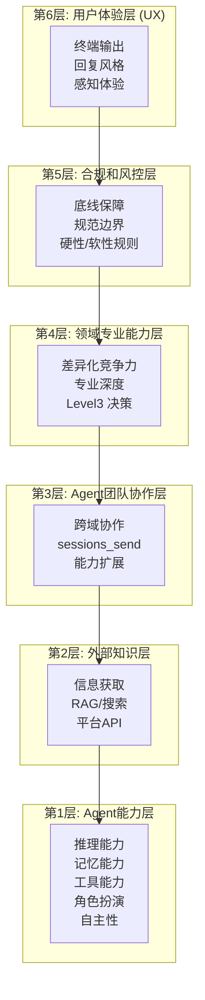
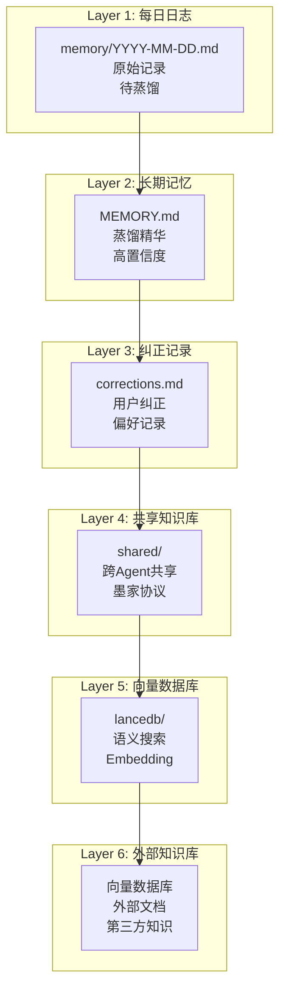
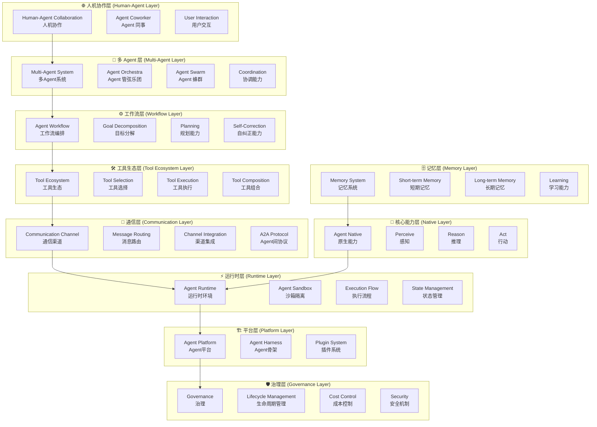
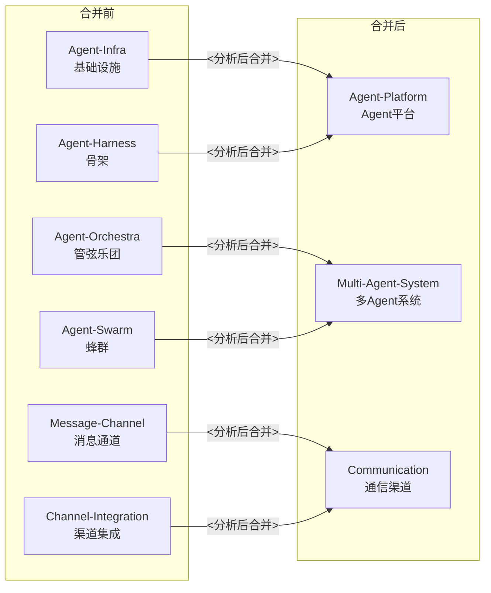
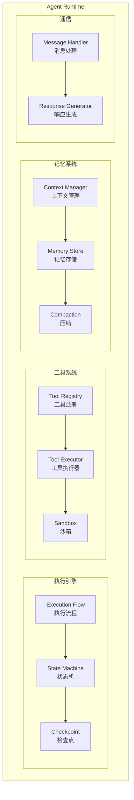
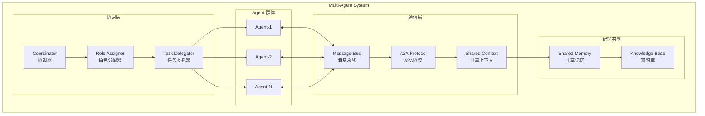
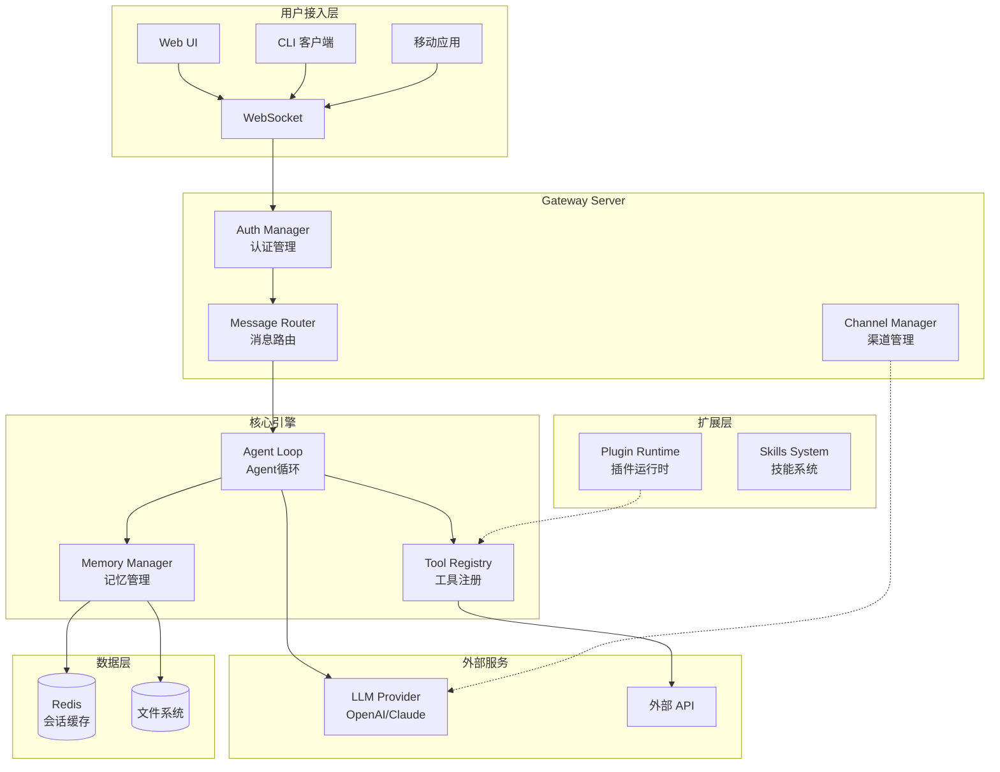
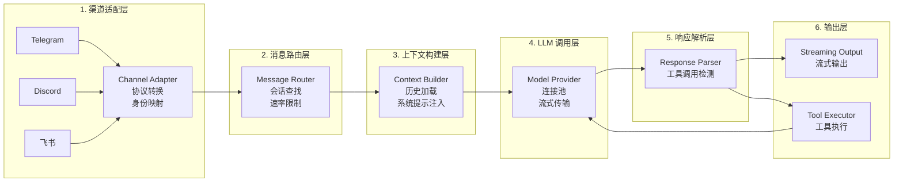
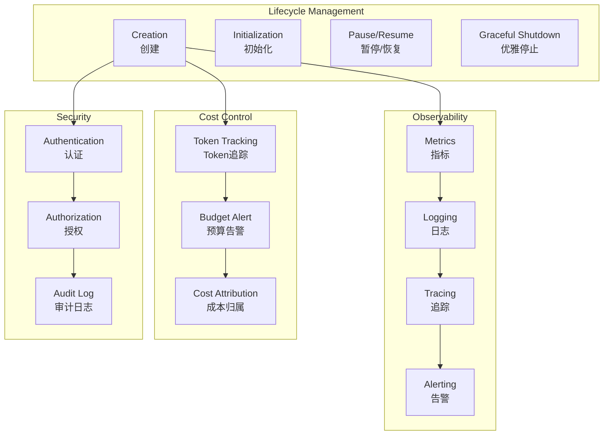

# Agent 系统维度架构图

> 基于 GitHub 行业研究与 OpenClaw 源码分析
> 更新时间: 2026-04-21

---

## 1. OpenClaw 基础六层架构

来自 `1.2_architecture.md`

---

## 2. 墨家六层架构

来自 `7.x_six_layer_framework.md`

---

## 3. 六层记忆架构

来自 `梦境系统详解.md`

---

## 4. Agent 系统完整分层架构

---

## 5. 维度重叠与合并关系

---

## 6. Agent-Runtime 内部架构

---

## 7. Multi-Agent 系统架构

---

## 8. OpenClaw 源码组件分层

---

## 9. 消息处理分层

---

## 10. 治理与管理层

---

## 图例

| 符号 | 含义 |
|------|------|
| 🧠 | 核心能力 |
| 🛠️ | 工具 |
| 🗄️ | 记忆 |
| ⚙️ | 工作流 |
| 🔄 | 多Agent |
| 📡 | 通信 |
| ⚡ | 运行时 |
| 🏗️ | 平台 |
| 🛡️ | 治理 |
| 🌐 | 扩展 |
| 👤 | 人机协作 |

---

*架构图版本: 2026-04-21*