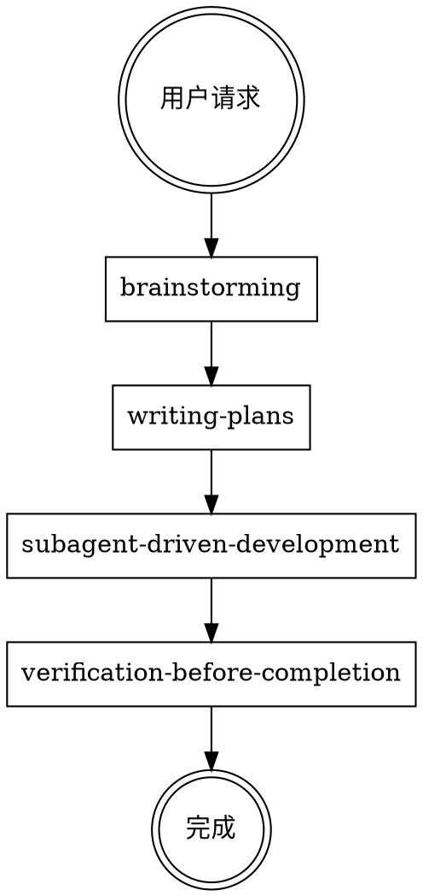

# 19-X.6 Superpowers 详解：Agent 工作流方法论

> 📅 创建日期：2026-04-23
> 🎯 适合读者：想为 AI 编程工具建立标准化开发流程的开发者
> ⏱️ 阅读时间：约 25 分钟
> 📋 案例项目：[obra/superpowers](https://github.com/obra/superpowers)（165K ⭐）

---

## 🚀 章节目标

- ✅ 理解 Superpowers 的核心理念：Agent 工作流方法论
- ✅ 掌握 14 个 Skills 的分类和用途
- ✅ 学会使用 brainstorm→plan→execute→verify 流程
- ✅ 理解两阶段审查（spec + quality）的价值
- ✅ 了解如何用 Superpowers 控制 Agent 行为模式

---

## 一、什么是 Superpowers

### 1.1 基本信息

| 指标 | 数据 |
|------|------|
| **Stars** | 165,290（GitHub Top 50）|
| **类型** | Agent Skills 框架 + 软件开发方法论 |
| **语言** | Shell |
| **支持工具** | 17 款（Claude Code / Copilot CLI / Cursor / Gemini CLI / OpenClaw 等）|
| **Skills 数量** | 14 个核心技能 |
| **设计哲学** | "An agentic skills framework that works" |

### 1.2 核心理念

> **"Today's Software Serves Humans👨💻. Tomorrow's Users will be Agents🤖"**
> 
> Superpowers 的理念：让 Agent 按照标准化的开发方法论工作。

```
没有 superpowers：
  用户：给用户模块加个批量导出功能
  AI：好的，我来写...
      export async function exportUsers() { ... }
  用户：等等，格式不对，没分页，大数据量会 OOM...

有 superpowers：
  用户：给用户模块加个批量导出功能
  AI：在开始实现之前，我需要了解几个关键问题：
      1. 导出格式是 CSV 还是 Excel？
      2. 预计数据量多大？需要异步处理吗？
      3. 有权限要求吗？
      → 给出 2-3 个方案，确认后再动手
```

### 1.3 与其他 Harness 的本质区别

| 类型 | 控制什么 | Superpowers 控制什么 |
|------|---------|---------------------|
| **ACP Agent Harness** | 连接外部 Agent | — |
| **Skill Harness** | 测试优化 Skill | — |
| **CLI Harness** | 封装软件为 CLI | — |
| **Superpowers** | — | **Agent 的工作方法论** |

---

## 二、核心工作流程

### 2.1 四阶段流程

```
┌─────────────────────────────────────────────────────────────────┐
│                                                                 │
│  1. brainstorming（头脑风暴）                                    │
│     └─ 探索意图 → 设计规格 → 不写代码先想清楚                      │
│                                                                 │
│  2. writing-plans（编写计划）                                      │
│     └─ 把规格拆成可执行的实施步骤                                  │
│                                                                 │
│  3. executing-plans / subagent-driven-development               │
│     └─ 按计划逐步实施，每步验证                                   │
│                                                                 │
│  4. verification-before-completion（完成前验证）                   │
│     └─ 证据先行，声称完成前必须跑验证                             │
│                                                                 │
└─────────────────────────────────────────────────────────────────┘
```

### 2.2 流程图



---

## 三、14 个 Skills 详解

### 3.1 流程控制类（6个）

| Skill | 用途 | 何时使用 |
|-------|------|---------|
| `using-superpowers` | 元技能：如何调用 skills | 每次对话开始 |
| `brainstorming` | 需求分析 → 设计规格 | 任何创造性工作之前 |
| `writing-plans` | 规格 → 可执行计划 | 有规格后、实施前 |
| `executing-plans` | 按计划逐步实施 | 执行计划时 |
| `subagent-driven-development` | Subagent 执行 + 两阶段审查 | 计划任务相互独立 |
| `dispatching-parallel-agents` | 并行 Agent 调度 | 3+ 个独立任务 |

#### brainstorming - 门槛（必须先过）

```markdown
<HARD-GATE>
Do NOT invoke any implementation skill, write any code, 
scaffold any project, or take any implementation action 
until you have presented a design and the user has approved it.
</HARD-GATE>
```

**检查清单**：
1. 探索项目上下文
2. 提供视觉辅助（如果需要）
3. 逐一问清问题
4. 提出 2-3 个方案
5. 展示设计，获得用户批准
6. 写设计文档
7. 自检规格
8. 用户审阅规格
9. 调用 writing-plans skill

#### writing-plans - 输出格式

```markdown
# [Feature Name] Implementation Plan

**Goal:** [一句话描述]

**Architecture:** [2-3 句话]

**Tech Stack:** [关键技术]

---
## Task 1: [任务名]
- [ ] 步骤 1
- [ ] 步骤 2
- [ ] 步骤 3
```

#### subagent-driven-development - 两阶段审查

```
Per Task:
  1. dispatch implementer subagent
  2. implementer 提问？
     → 回答问题，继续
  3. implementer 实现、测试、commit、自查
  4. dispatch spec reviewer subagent
  5. spec reviewer 确认代码匹配规格？
     → 不匹配 → implementer 修复
  6. dispatch code quality reviewer subagent
  7. code quality reviewer 批准？
     → 不批准 → implementer 修复
  8. 标记任务完成
```

### 3.2 质量保证类（4个）

| Skill | 用途 | 何时使用 |
|-------|------|---------|
| `test-driven-development` | 严格 TDD | 所有开发任务 |
| `verification-before-completion` | 完成前验证 | 声称完成前 |
| `requesting-code-review` | 派遣审查 Agent | 代码审查前 |
| `receiving-code-review` | 处理审查反馈 | 收到审查时 |
| `systematic-debugging` | 四阶段调试法 | 调试时 |

#### verification-before-completion - 证据门禁

```markdown
在声称完成前，你必须提供：
1. 测试通过的证据
2. 代码质量检查结果
3. 功能符合规格的证明
```

#### systematic-debugging - 四阶段

```
1. 定位（Locate）
   └─ 找到问题所在

2. 分析（Analyze）
   └─ 理解问题根因

3. 假设（Hypothesize）
   └─ 提出可能的解决方案

4. 修复（Fix）
   └─ 实施并验证
```

### 3.3 工具使用类（4个）

| Skill | 用途 |
|-------|------|
| `using-git-worktrees` | 隔离式特性开发 |
| `finishing-a-development-branch` | 合并/PR/保留/丢弃四选一 |
| `writing-skills` | 创建新 skill |

---

## 四、Process Harness 的核心思想

### 4.1 什么是 Process Harness

**Process Harness = 控制 Agent 的工作模式，让它按标准流程执行**

```
传统 Agent：
  用户说什么 → 立即执行 → 做完了事

Harness 驱动的 Agent：
  用户说什么 → 检查是否有适用的 Skill
                         ↓
                   有 → 按 Skill 流程执行
                   无 → 直接执行
```

### 4.2 核心规则

```markdown
IF A SKILL APPLIES TO YOUR TASK, YOU DO NOT HAVE A CHOICE.
YOU MUST USE IT.

This is not negotiable. This is not optional.
You cannot rationalize your way out of this.
```

### 4.3 红灯思维（Rationalization Stop）

| 想法 | 实际意味着 |
|------|-----------|
| "这只是简单问题" | 问题也是任务，检查 Skill |
| "我需要更多信息" | 先检查 Skill，再问问题 |
| "让我先探索代码库" | Skill 告诉你如何探索 |
| "这个不需要正式 Skill" | 如果 Skill 存在，使用它 |
| "我会先做这一件事" | 先检查再行动 |

---

## 五、多工具适配

### 5.1 支持的工具（17款）

| 工具 | 安装位置 |
|------|---------|
| Claude Code | `.claude/skills/` |
| Copilot CLI | `.claude/skills/` |
| Hermes Agent | `.hermes/skills/` |
| Cursor | `.cursor/rules/` |
| Windsurf | `.windsurf/skills/` |
| Kiro | `.kiro/steering/` |
| Gemini CLI | `.gemini/skills/` |
| Codex CLI | `.codex/skills/` |
| Aider | `.aider/skills/` |
| Trae | `.trae/rules/` |
| VS Code (Copilot) | `.github/superpowers/` |
| DeerFlow 2.0 | `skills/custom/` |
| OpenCode | `.opencode/skills/` |
| **OpenClaw** | `skills/` |
| Qwen Code | `.qwen/skills/` |
| Antigravity | `.antigravity/skills/` |
| Claw Code | `.claw/skills/` |

### 5.2 OpenClaw 安装

```bash
# 自动检测安装
npx superpowers-zh

# 手动安装到 OpenClaw
cp -r superpowers-zh/skills /your/project/skills
```

---

## 六、与 OpenClaw 的集成

### 6.1 OpenClaw 作为 Harness 平台

```
OpenClaw
  │
  ├── 内置 Skill 系统
  │     └─ 可以安装 superpowers 作为 Skills
  │
  ├── acp-router
  │     └─ 路由到外部 Agent（Claude Code 等）
  │     └─ 这些外部 Agent 也可以用 superpowers
  │
  └── superpowers 的优势
        └─ 标准化的开发流程
        └─ 多工具适配
        └─ 165K ⭐ 验证的方法论
```

### 6.2 组合使用

```
OpenClaw（协调）
  │
  ├── superpowers（工作流控制）
  │     └─ brainstorming → plan → execute → verify
  │
  └── acp-router（外部 Agent）
        └─ Claude Code（执行具体编码）
        └─ 这些外部 Agent 也可以用 superpowers
```

---

## 七、快速开始

### 7.1 安装

```bash
# 推荐方式
npx superpowers-zh

# 手动方式
git clone https://github.com/obra/superpowers.git
cp -r superpowers/skills /your/project/.claude/skills
```

### 7.2 使用流程

```bash
# 1. 用户提出需求
"我要加一个用户批量导出功能"

# 2. AI 自动调用 brainstorming
"I'm using the brainstorming skill to explore this request"

# 3. 问清问题，给出方案
"导出格式？数据量？权限要求？"

# 4. 写规格文档
docs/superpowers/specs/2026-04-23-user-export-design.md

# 5. 调用 writing-plans
"I'm using the writing-plans skill"

# 6. 执行计划
"I'm using the subagent-driven-development skill"

# 7. 验证完成
"I'm using the verification-before-completion skill"
```

---

## 八、superpowers-zh（中文增强版）

| 版本 | Skills 数量 | 支持工具 | 特色 |
|------|------------|---------|------|
| **上游（英文）** | 14 | 6 款 | 方法论内核 |
| **superpowers-zh** | 20（14+6）| 17 款 | 中文 + 中国特色 Skills |

### 中国特色 Skills（6个）

| Skill | 用途 |
|-------|------|
| `chinese-code-review` | 符合国内团队文化的代码审查 |
| `chinese-git-workflow` | 适配 Gitee/Coding/极狐 GitLab |
| `chinese-documentation` | 中文排版规范 |
| `chinese-commit-conventions` | 适配国内团队的 commit 规范 |
| `mcp-builder` | 构建生产级 MCP 服务器 |
| `workflow-runner` | 多角色 YAML 工作流执行器 |

---

## 九、与其他 Harness 的对比总结

| 维度 | ACP Agent Harness | Skill Harness | CLI Harness | Superpowers |
|------|-------------------|--------------|------------|-------------|
| **Stars** | — | 238 | 32K | **165K** |
| **目的** | 连接外部 Agent | 测试优化 Skill | 封装软件为 CLI | **控制工作流** |
| **控制对象** | 外部编码 Agent | 自身 Skill | 任意软件 | **自身行为模式** |
| **验证方式** | Agent 自我验证 | 渲染测试 | 单元 + E2E | **质量门禁** |
| **迭代方式** | Agent 修复 | eval→optimize | 测试驱动 | **Plan→Do→Verify** |
| **核心创新** | 协议连接 | 自动化优化 | 软件 Agent 化 | **流程标准化** |

---

## 十、一句话总结

| Harness 类型 | 一句话 | 核心价值 |
|-------------|--------|---------|
| **ACP Agent Harness** | 让外部编码 Agent 打工 | 扩展能力边界 |
| **Skill Harness** | 让 Skill 自己测试进化 | 质量自动化 |
| **CLI Harness** | 把软件变成 Agent 工具 | 软件 Agent 化 |
| **Superpowers** | 控制 Agent 的工作方法论 | **流程标准化 + 质量门禁** |

---

## ➡️ 下一步

- [19-X.1 三种 Harness 类型概述](./19-X.1_harness三种类型.md)
- [19-X.5 垂直领域开发 Harness 指南](./19-X.5_垂直领域开发指南.md)