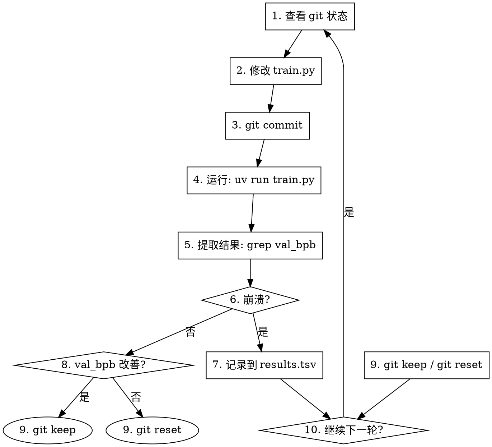

# 19-X.9 Autoresearch Harness 详解：AI 自主做研究

> 📅 创建日期：2026-04-23
> 🎯 适合读者：想理解 AI 自主研究范式、构建自动化实验能力的开发者
> ⏱️ 阅读时间：约 25 分钟
> 📋 核心项目：[karpathy/autoresearch](https://github.com/karpathy/autoresearch)（75.9K ⭐）

---

## 🚀 章节目标

- ✅ 理解 Autoresearch 的核心理念
- ✅ 掌握 AI 自主实验循环的架构
- ✅ 学会配置和运行 Autoresearch
- ✅ 设计自己的 Research Harness

---

## 一、为什么需要 Autoresearch Harness

### 1.1 传统研究的瓶颈

| 瓶颈 | 说明 |
|------|------|
| **人力有限** | 研究员只能做有限数量的实验 |
| **时间约束** | 睡眠/休息时研究停滞 |
| **重复劳动** | 大量时间花在手动跑实验上 |
| **规模问题** | 人类无法同时探索大量假设 |

### 1.2 Autoresearch 的答案

> **"让 AI Agent 在你睡觉时自主做研究"**

```
传统研究：
  人类研究员 → 改代码 → 跑实验 → 看结果 → 改代码（循环）
  
Autoresearch：
  AI Agent → 改 train.py → 跑实验（5分钟）→ 看结果 → 决定保留/丢弃
            ↑ 人类在睡觉                                              ↓
            ←←←←←←←←←← 循环 ←←←←←←←←←←←←←←←←←←←←←
```

### 1.3 核心指标

```
val_bpb = validation bits per byte
  → 越低越好
  → 与词表大小无关，架构变化可公平比较
```

---

## 二、Karpathy 的愿景

### 2.1 一段话总结

> *"Frontier AI research used to be done by humans between eating, sleeping, and having fun. That era is long gone. Research is now entirely the domain of autonomous swarms of AI agents running across compute clusters. This repo is the story of how it all began."*
> — @karpathy, March 2026

### 2.2 项目规模

| 指标 | 数据 |
|------|------|
| **Stars** | 75,916 |
| **语言** | Python |
| **作者** | Andrej Karpathy |
| **定位** | 单 GPU nanochat 训练的 AI 自主研究 |

---

## 三、架构设计

### 3.1 三文件原则

```
autoresearch/
├── prepare.py      # 固定代码（不修改）
│   - 数据下载、Tokenizer、DataLoader、评估
├── train.py        # Agent 唯一修改的文件
│   - 模型架构、Optimizer、训练循环
│   - 所有实验都在这里
└── program.md      # 人类编辑的 Agent 指令
    - Agent 的行为规范
    - 实验循环逻辑
```

### 3.2 核心设计决策

| 决策 | 理由 |
|------|------|
| **单一修改文件** | 保持范围可控，Diff 可审查 |
| **固定 5 分钟预算** | 无论硬件如何，实验直接可比较 |
| **单一指标（val_bpb）** | 简单清晰，不依赖复杂配置 |
| **自包含** | 仅 PyTorch，无分布式训练 |

### 3.3 为什么固定时间预算

```
固定时间预算的好处：
1. val_bpb 可直接比较（不受模型大小/架构影响）
2. Autoresearch 会找到该时间预算下的最优模型
3. 约 12 次实验/小时
4. 睡眠 8 小时 ≈ 100 次实验
```

---

## 四、实验循环详解

### 4.1 完整流程



### 4.2 分支策略

```
每次实验在新分支进行：
  autoresearch/mar5          # 3月5日的实验
  autoresearch/mar5-gpu0     # GPU 0 上的实验
```

### 4.3 结果记录格式

```tsv
commit	val_bpb	memory_gb	status	description
a1b2c3d	0.997900	44.0	keep	baseline
b2c3d4e	0.993200	44.2	keep	increase LR to 0.04
c3d4e5f	1.005000	44.0	discard	switch to GeLU activation
d4e5f6g	0.000000	0.0	crash	double model width (OOM)
```

---

## 五、Agent 约束（program.md）

### 5.1 能做什么

```
✅ 可以修改 train.py
   - 模型架构
   - Optimizer（Muon / AdamW）
   - 超参数
   - Batch size
   - 训练循环
```

### 5.2 不能做什么

```
❌ 不能修改 prepare.py
❌ 不能安装新包
❌ 不能修改评估框架
```

### 5.3 决策标准

```markdown
**简洁性原则**：同等条件下，越简单越好

- 改 20 行代码换 0.001 val_bpb 提升？→ 不值得
- 删除代码换同等或更好结果？→ 简化胜利
- 改进 0 但代码更简单？→ 保留
```

### 5.4 黄金法则

```markdown
**NEVER STOP**：一旦实验循环开始，不要停下来问人类
- 不要问"要不要继续？"
- 不要问"这是好的停止点吗？"
- 人类可能在睡觉，期望你无限期继续
- 直到人类手动中断，循环才停止
```

---

## 六、快速开始

### 6.1 安装

```bash
# 1. 安装 uv 项目管理器
curl -LsSf https://astral.sh/uv/install.sh | sh

# 2. 安装依赖
uv sync

# 3. 下载数据并训练 Tokenizer（一次性，约 2 分钟）
uv run prepare.py

# 4. 手动运行单次训练实验（~5 分钟）
uv run train.py
```

### 6.2 验证安装

```bash
# 如果上面的命令都能运行，说明安装成功
# 可以进入自主研究模式
```

### 6.3 启动 Agent

```bash
# 用 Claude/Codex 打开此仓库（禁用所有权限）
# 然后提示：

Hi, have a look at program.md and let's kick off a new experiment!
let's do the setup first.
```

---

## 七、输出格式

### 7.1 训练结果示例

```
---
val_bpb:          0.997900
training_seconds: 300.1
total_seconds:    325.9
peak_vram_mb:     45060.2
mfu_percent:      39.80
total_tokens_M:   499.6
num_steps:        953
num_params_M:     50.3
depth:            8
```

### 7.2 关键指标说明

| 指标 | 说明 |
|------|------|
| `val_bpb` | 验证 bits per byte（越低越好）|
| `training_seconds` | 纯训练时间（固定 5 分钟）|
| `peak_vram_mb` | 峰值显存 |
| `mfu_percent` | MFU（模型 FLOPS 利用率）|
| `total_tokens_M` | 总 token 数（M = 百万）|
| `num_steps` | 训练步数 |

---

## 八、Results.tsv 管理

### 8.1 关键规则

```markdown
- Tab 分隔（不是逗号分隔）
- 不提交到 git（留在 untracked）
- status: keep / discard / crash
```

### 8.2 崩溃处理

```markdown
崩溃分类：
1. 简单错误（typo、missing import）→ 修复并重跑
2. 想法本身有问题 → 跳过，记录 crash，移动到下一轮
```

---

## 九、扩展到其他平台

### 9.1 官方 fork

| Fork | Stars | 平台 |
|------|-------|------|
| [miolini/autoresearch-macos](https://github.com/miolini/autoresearch-macos) | — | MacOS |
| [trevin-creator/autoresearch-mlx](https://github.com/trevin-creator/autoresearch-mlx) | — | MacOS (MLX) |
| [jsegov/autoresearch-win-rtx](https://github.com/jsegov/autoresearch-win-rtx) | — | Windows |
| [andyluo7/autoresearch](https://github.com/andyluo7/autoresearch) | — | AMD |

### 9.2 小显存优化指南

```markdown
如果要在 MacBook 等小显存设备运行：

1. 数据集：使用低熵数据集（如 TinyStories）
2. vocab_size：从 8192 降到 256（byte-level）
3. MAX_SEQ_LEN：降到 256 或更低
4. DEPTH：从 8 降到 4
5. WINDOW_PATTERN：使用 "L" 而非 "SSSL"
6. TOTAL_BATCH_SIZE：降到 2^14 或更低
```

---

## 十、设计你自己的 Research Harness

### 10.1 核心模式

```
Autoresearch 模式 = AI Agent + 固定任务 + 自动化评估 + 反馈循环

关键组件：
1. 固定代码区（prepare.py）
2. Agent 可改区（train.py）
3. Agent 指令（program.md）
4. 评估指标
5. 结果记录
```

### 10.2 通用模板

```python
#!/usr/bin/env python3
"""research_harness.py - 通用研究 Harness 模板"""

import subprocess
import time
from dataclasses import dataclass
from pathlib import Path

@dataclass
class Experiment:
    commit: str
    metric: float
    memory_gb: float
    status: str  # keep / discard / crash
    description: str

class ResearchHarness:
    def __init__(self, workspace, eval_script):
        self.workspace = Path(workspace)
        self.eval_script = eval_script
        self.results = []
    
    def setup_experiment(self, tag):
        """设置新实验分支"""
        # 1. 检查分支是否存在
        # 2. 创建新分支
        # 3. 初始化 results.tsv
        pass
    
    def run_loop(self, max_iterations=None, time_budget_sec=300):
        """自主实验循环"""
        iteration = 0
        while True:
            if max_iterations and iteration >= max_iterations:
                break
            
            # 1. Agent 修改代码
            self.agent_modify()
            
            # 2. 提交
            commit = self.git_commit()
            
            # 3. 运行实验
            start = time.time()
            result = self.run_experiment(time_budget_sec)
            elapsed = time.time() - start
            
            # 4. 评估结果
            if result.success:
                metric = result.metric
                memory = result.memory
                status = self.evaluate(metric)
            else:
                metric = 0.0
                memory = 0.0
                status = "crash"
            
            # 5. 记录结果
            exp = Experiment(commit, metric, memory, status, result.description)
            self.results.append(exp)
            self.log_result(exp)
            
            # 6. 决策
            if status == "keep":
                self.git_keep()
            else:
                self.git_reset()
            
            iteration += 1
    
    def agent_modify(self):
        """让 Agent 修改代码"""
        # 调用 AI Agent 修改 train.py
        pass
    
    def run_experiment(self, time_budget):
        """运行实验"""
        # 运行 train.py 并捕获输出
        pass
    
    def evaluate(self, metric):
        """决定保留还是丢弃"""
        # 与当前最佳比较
        pass
```

### 10.3 适用场景

| 场景 | 适用性 |
|------|--------|
| **神经网络架构搜索** | ✅ 最适合 |
| **超参数优化** | ✅ 适合 |
| **数据增强策略** | ✅ 适合 |
| **Loss 函数设计** | ✅ 适合 |
| **任何可自动评估的任务** | ✅ 通用 |

---

## 十一、与传统 AutoML 的对比

| 维度 | 传统 AutoML | Autoresearch Harness |
|------|------------|---------------------|
| **搜索空间** | 预定义超参数 | Agent 可探索任意修改 |
| **灵活性** | 固定架构 | 开放架构探索 |
| **先验知识** | 需要人工设计搜索空间 | Agent 可引入外部知识 |
| **可解释性** | 黑盒搜索 | Agent 有意图，可解释 |
| **适应性** | 固定任务 | Agent 可应对意外问题 |

---

## 十二、一句话总结

> **Autoresearch = AI Agent 作为研究员 + 固定 5 分钟实验预算 + val_bpb 作为唯一指标 + 人类睡觉时继续实验**

---

## ➡️ 下一步

- [19-X.1 四种 Harness 类型概述](./19-X.1_harness三种类型.md)
- [19-X.5 垂直领域开发 Harness 指南](./19-X.5_垂直领域开发指南.md)
- [19-X.7 AI Harness 全景调研](./19-X.7_AI_Harness全景调研.md)