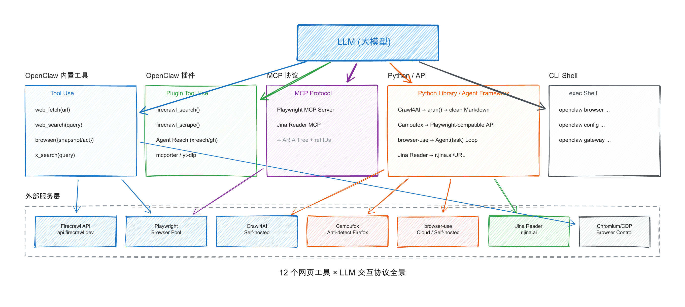

# 12 个网页内容获取工具：如何给 LLM 提供服务与交互

> 📅 调研日期：2026-04-30
> 🎯 适合读者：想理解各工具如何与 LLM 协作的开发者
> ⏱️ 阅读时间：约 40 分钟
> 📖 信息来源：OpenClaw 内置文档、Firecrawl/Crawl4AI/Playwright/Camoufox/browser-use/Jina Reader 官方文档 + GitHub README

---

## 一、工具分类总览

| 类别 | 工具 | 与 LLM 交互协议 |
|------|------|----------------|
| **OpenClaw 内置** | Web Fetch、Web Search、OpenClaw CDP (browser 工具) | OpenClaw Tool Use |
| **OpenClaw 插件** | Firecrawl（搜索+抓取）、Agent Reach（多平台） | OpenClaw Plugin Tool Use |
| **浏览器框架** | Playwright、Crawl4AI、Camoufox、browser-use | MCP 协议 / Python API / Agent 抽象 |
| **独立读取服务** | Jina Reader | HTTP URL Prefix / MCP |
| **CLI 管理工具** | OpenCLI (openclaw 命令) | exec shell 调用 |

---

## 二、OpenClaw 内置工具

### 2.1 Web Fetch

**定位**：轻量级 HTTP 抓取 → 可读文本提取

**LLM 交互方式**：

```
LLM 调用 web_fetch(url)
  → OpenClaw Gateway 执行 HTTP GET
  → Readability 算法提取主内容
  → 可选 Firecrawl fallback（JS 渲染 / 反爬场景）
  → 返回 Markdown / Text 给 LLM
```

**关键配置**（`tools.web.fetch`）：

```json5
{
  tools: {
    web: {
      fetch: {
        enabled: true,           // 默认开启
        provider: "firecrawl",    // 可选，开启后使用 API
        maxChars: 50000,          // 最大输出字符
        maxCharsCap: 50000,        // maxChars 参数上限
        maxResponseBytes: 2000000, // 下载大小上限
        timeoutSeconds: 30,
        cacheTtlMinutes: 15,      // 缓存 15 分钟
        maxRedirects: 3,
        readability: true,        // 使用 Readability 提取（默认）
        userAgent: "Mozilla/5.0 ...",
      },
    },
  },
}
```

**Firecrawl Fallback**：

```json5
{
  plugins: {
    entries: {
      firecrawl: {
        enabled: true,
        config: {
          webFetch: {
            apiKey: "fc-...",
            baseUrl: "https://api.firecrawl.dev",
            onlyMainContent: true,
            maxAgeMs: 86400000,
            timeoutSeconds: 60,
          },
        },
      },
    },
  },
}
```

**提取流程**：

```
Step 1: Fetch
  → HTTP GET with Chrome-like User-Agent
  → Accept-Language header
  → Blocks private/internal hostnames

Step 2: Extract
  → Readability (local main-content extraction)

Step 3: Fallback (optional)
  → If Readability fails + Firecrawl configured
  → Retry through Firecrawl API with bot-circumvention

Step 4: Cache
  → 15 minutes by default
```

> 📖 OpenClaw 内置文档：`/opt/homebrew/lib/node_modules/openclaw/docs/tools/web-fetch.md`

---

### 2.2 Web Search

**定位**：搜索引擎结果获取

**LLM 交互方式**：

```
LLM 调用 web_search({ query: "..." })
  → OpenClaw Gateway 根据 provider 优先级调度
  → 返回结构化搜索结果（标题 + 摘要 + URL）
```

**Provider 优先级**（auto-detect 顺序）：

| 优先级 | Provider | API Key | 说明 |
|--------|----------|---------|------|
| 1 | Brave | `BRAVE_API_KEY` | order 10 |
| 2 | MiniMax Search | `MINIMAX_CODE_PLAN_KEY` | order 15 |
| 3 | Gemini | `GEMINI_API_KEY` | order 20 |
| 4 | Grok | `XAI_API_KEY` | order 30 |
| 5 | Kimi | `KIMI_API_KEY` | order 40 |
| 6 | Perplexity | `PERPLEXITY_API_KEY` | order 50 |
| 7 | Firecrawl | `FIRECRAWL_API_KEY` | order 60 |
| 8 | Exa | `EXA_API_KEY` | order 65 |
| 9 | Tavily | `TAVILY_API_KEY` | order 70 |
| 10 | DuckDuckGo | **无需 key** | order 100 ← 兜底 |
| 11 | Ollama Web Search | 无需 key（本地） | order 110 |
| 12 | SearXNG | 无需 key（自托管） | order 200 |

**Provider 能力对比**：

| Provider | 结果风格 | 特色功能 |
|----------|---------|---------|
| Brave | 结构化 snippets | `llm-context` 模式、country/language 过滤 |
| Exa | 结构化 + 提取内容 | neural/keyword 混合搜索、高亮句 / 全文 / AI摘要 |
| Firecrawl | 结构化 snippets | search + scrape 一体化 |
| Gemini/Grok/Kimi | AI 合成 + 引用 | AI 直接生成答案 |
| Perplexity | 结构化 snippets | domain 过滤、内容上限控制 |
| Tavily | 结构化 snippets | search depth、topic 过滤、`tavily_extract` |
| DuckDuckGo | 结构化 snippets | **无需 key**，实验性质，bot-challenge 风险 |
| SearXNG | 结构化 snippets | 自托管，聚合 Google/Bing/DuckDuckGo |

**OpenClaw 特有功能：x_search**（X/Twitter 搜索）：

```javascript
// X posts 搜索，通过 xAI
await x_search({
  query: "OpenAI news",
  allowed_x_handles: ["someuser"],
  from_date: "2026-03-01",
  enable_image_understanding: true,
});
```

> 📖 OpenClaw 内置文档：`/opt/homebrew/lib/node_modules/openclaw/docs/tools/web.md`

---

### 2.3 OpenClaw CDP（browser 工具）

**定位**：OpenClaw 内置的 Chrome DevTools Protocol 客户端

**LLM 交互方式**：

```
LLM 调用 browser({ action: "snapshot" | "act" | "screenshot" | ... })
  → Gateway 通过 CDP 协议控制 Chromium 浏览器
  → Playwright 在 CDP 之上提供高级 actions
  → 返回 DOM 快照 / 截图 / 执行结果给 LLM
```

**Agent 获得的工具**：

| Action | 说明 |
|--------|------|
| `browser doctor` | 检查 Gateway、plugin、profile、browser、tab 就绪状态 |
| `browser status` | 查看浏览器进程状态 |
| `browser start/stop` | 启动 / 停止浏览器 |
| `browser tabs` | 列出所有标签页 |
| `browser open` | 打开 URL |
| `browser focus/close` | 聚焦 / 关闭标签页 |
| `browser snapshot` | 获取 UI 快照（AI 格式或 ARIA 格式） |
| `browser act` | click/type/drag/select 基于 ref ID |
| `browser screenshot` | 像素截图 |
| `browser navigate` | 导航（需要 Playwright） |
| `browser pdf` | 导出 PDF（需要 Playwright） |

**快照格式**：

```
AI 快照（默认）：
  - 输出带数字 ref（如 aria-ref="12"）
  - LLM 用 ref ID 执行操作：browser click 12, browser type 23 "hello"

ARIA 快照（--format aria）：
  - 输出 [axN] refs（如 [ref=ax12]）
  - 可通过 Playwright + Chrome 后端 DOM id 绑定

Role 快照（--interactive / --compact）：
  - 输出 [ref=e12] 格式
  - 通过 getByRole() + nth() 解析
  - 适合复杂页面分析
```

**Profile 隔离架构**：

```json5
{
  browser: {
    defaultProfile: "openclaw",  // 隔离的独立浏览器
    profiles: {
      openclaw: { cdpPort: 18800, color: "#FF4500" },
      user: {              // Chrome MCP 附挂到用户真实浏览器
        driver: "existing-session",
        attachOnly: true,
        color: "#00AA00",
      },
      brave: {             // Brave 浏览器
        driver: "existing-session",
        attachOnly: true,
        userDataDir: "~/Library/Application Support/BraveSoftware/Brave-Browser",
      },
      browserless: {      // Browserless 云服务
        cdpUrl: "wss://production-sfo.browserless.io?token=<KEY>",
      },
      browserbase: {       // Browserbase 云服务
        cdpUrl: "wss://connect.browserbase.com?apiKey=<KEY>",
      },
    },
  },
}
```

**关键架构特性**：

- **Tab 管理**：通过 `tabId` 或 `label` 稳定引用 Tab
- **SSRF 保护**：浏览器导航受 URL 策略限制
- **Remote CDP**：支持 Browserless、Browserbase、自托管 Chrome
- **Node Browser Proxy**：零配置节点浏览器代理
- **循环清理**：`tabCleanup` 自动清理空闲标签页

**OpenClaw browser 与 Playwright MCP 的区别**：

| 对比 | OpenClaw browser | Playwright MCP |
|------|-----------------|---------------|
| 协议 | CDP + OpenClaw Tool | MCP (Model Context Protocol) |
| LLM 输出 | DOM 快照 + action 结果 | 纯 ARIA 树（无 action 结果） |
| 生态位置 | OpenClaw 内置 | 独立 MCP Server |
| 适用场景 | OpenClaw Agent 的浏览器控制 | Claude Code/Cursor 等 MCP Client |

> 📖 OpenClaw 内置文档：
> - `/opt/homebrew/lib/node_modules/openclaw/docs/tools/browser.md`
> - `/opt/homebrew/lib/node_modules/openclaw/docs/tools/browser-control.md`

---

## 三、OpenClaw 插件工具

### 3.1 Firecrawl

**定位**：反爬 + JS 渲染的网页内容提取 API 服务

**LLM 交互方式**：

```
两种模式：

1. OpenClaw Plugin Tool：
   LLM 调用 firecrawl_search(query) / firecrawl_scrape(url)
     → OpenClaw 插件调用 Firecrawl API
     → 返回结构化 Markdown / JSON

2. OpenClaw web_fetch fallback：
   LLM 调用 web_fetch(url)
     → Readability 失败时自动 fallback 到 Firecrawl
     → 享受 bot-circumvention 代理模式
```

**OpenClaw 配置**：

```json5
// Firecrawl 作为 web_search provider
{
  plugins: {
    entries: {
      firecrawl: {
        enabled: true,
        config: {
          webSearch: {
            apiKey: "FIRECRAWL_API_KEY",
            baseUrl: "https://api.firecrawl.dev",
          },
        },
      },
    },
  },
  tools: {
    web: { search: { provider: "firecrawl" } },
  },
}
```

```json5
// Firecrawl 作为 web_fetch fallback
{
  plugins: {
    entries: {
      firecrawl: {
        enabled: true,
        config: {
          webFetch: {
            apiKey: "FIRECRAWL_API_KEY",
            baseUrl: "https://api.firecrawl.dev",
            onlyMainContent: true,
            maxAgeMs: 172800000,  // 2 天缓存
            timeoutSeconds: 60,
          },
        },
      },
    },
  },
}
```

**Firecrawl 工具参数**：

| 工具 | 核心参数 |
|------|---------|
| `firecrawl_search` | `query`, `count`, `sources`, `categories`, `scrapeResults`, `timeoutSeconds` |
| `firecrawl_scrape` | `url`, `extractMode`, `maxChars`, `onlyMainContent`, `maxAgeMs`, `proxy`, `storeInCache`, `timeoutSeconds` |

**反爬机制**：

```javascript
// OpenClaw 始终使用 proxy: "auto" + storeInCache: true
// auto 模式：basic → stealth proxies → 失败则重试
// 可能消耗更多 credits
```

> 📖 OpenClaw 内置文档：`/opt/homebrew/lib/node_modules/openclaw/docs/tools/firecrawl.md`

---

### 3.2 Agent Reach（多平台统一接口）

**定位**：13+ 平台的统一 API 包装器

**LLM 交互方式**：

```
LLM 通过 Agent Reach Skill 中定义的命令调用
  → 平台分为两类：
     ├─ 原生 API 平台：Twitter(X)、GitHub、LinkedIn → 直接调 API
     └─ 爬虫平台：小红书、抖音、微信公众号 → Camoufox + Jina Reader
```

**支持平台一览**：

| 平台 | 工具 | 说明 |
|------|------|------|
| Twitter/X | xreach | 搜索 + 读取 + 发推 |
| GitHub | gh CLI | 代码 + issue 搜索 |
| YouTube/B 站 | yt-dlp | 字幕 + 元数据 |
| 小红书 | mcporter | 搜索 + 详情 |
| 抖音 | mcporter | 视频信息 + 下载链接 |
| 微信公众号 | Camoufox + 专用脚本 | 反爬读取 |
| LinkedIn | mcporter / Jina Reader | 资料 + 搜索 |
| V2EX | 公开 API | 热门 + 节点 + 主题 |
| RSS | feedparser | 订阅源 |
| 小宇宙播客 | Groq Whisper | 转录 |
| Reddit | curl + Exa fallback | 搜索 |
| Web 通用 | Jina Reader `r.jina.ai` | 干净文本 |

**搜索工具优先级**（TOOLS.md 规范）：

| 优先级 | 工具 | 场景 |
|--------|------|------|
| 1️⃣ | **平台原生 API** | Twitter/GitHub/知乎/微博等官方 API |
| 2️⃣ | **browser.open()** | 页面抓取、登录态、交互 |
| 3️⃣ | **web_search (Tavily)** | 无特定 API 时的兜底 |

> 📖 Agent Reach Skill：`~/.agents/skills/agent-reach/SKILL.md`

---

## 四、浏览器框架（与 LLM 通过 MCP / API 交互）

### 4.1 Playwright（MCP + CLI + Library）

**定位**：Microsoft 出品的 Web 自动化框架 + AI Agent 接口

**LLM 交互方式**：4 种入口

```
┌─────────────────────────────────────────────────────────────────┐
│ 1. Playwright MCP（AI Agent 推荐）                                │
│    LLM 通过 MCP 协议 → Playwright MCP Server                     │
│    → 结构化 ARIA 快照 → ref ID 操作 click/type                     │
│                                                                   │
│    配置（MCP Client）：                                            │
│    { "mcpServers": { "playwright": {                             │
│        "command": "npx",                                          │
│        "args": ["@playwright/mcp@latest"]                        │
│    }}}                                                            │
│                                                                   │
│    LLM 看到："checkbox [ref=e10]" 而非截图 / Vision               │
├─────────────────────────────────────────────────────────────────┤
│ 2. Playwright CLI（coding agents）                                │
│    LLM 通过 CLI 命令 → browser automation                         │
│    比 MCP 更 token-efficient，无大型 tool schema                  │
│                                                                   │
│    $ playwright-cli open https://...                               │
│    $ playwright-cli type "hello"                                  │
│    $ playwright-cli screenshot                                    │
├─────────────────────────────────────────────────────────────────┤
│ 3. Playwright Library（浏览器自动化脚本）                            │
│    Python/JS 库直接调用，LLM 通过 Function Calling                 │
│    page.goto() → page.click() → content()                        │
├─────────────────────────────────────────────────────────────────┤
│ 4. Playwright Test（测试框架）                                     │
│    主要用于端到端测试，非 LLM 主要交互方式                           │
└─────────────────────────────────────────────────────────────────┘
```

**Playwright MCP 交互示例**：

```
LLM: "Navigate to https://demo.playwright.dev/todomvc and add todo items"

MCP Server 返回 ARIA 树：
  - heading "todos" [level=1]
  - textbox "What needs to be done?" [ref=e5]
  - listitem:
      - checkbox "Toggle Todo" [ref=e10]
      - text: "Buy groceries"

LLM 用 ref 操作：
  click(e5) → type(e5, "Buy groceries") → click(e10)
```

**Playwright CLI 安装**：

```bash
npm install -g @playwright/cli@latest
playwright-cli install --skills  # 可选：安装 richer agent 集成
```

**Playwright MCP vs OpenClaw browser 对比**：

| 对比维度 | Playwright MCP | OpenClaw browser |
|---------|---------------|-----------------|
| 协议 | MCP | OpenClaw Tool + CDP |
| 输出 | 纯 ARIA 树 | DOM 快照（AI/ARIA/Role 三种） |
| Action 反馈 | 无（LLM 自行推断） | `browser act` 返回执行结果 |
| OpenClaw 集成 | 无（独立使用） | 原生内置 |
| Token 效率 | 较低（大型 ARIA 树） | 较高（可压缩 / efficient 模式） |

> 📖 Playwright 官方文档：https://playwright.dev/docs/mcp

---

### 4.2 Crawl4AI（unclecode/crawl4ai）

**定位**：开源 LLM 友好网页爬虫 + 清洗

**LLM 交互方式**：

```
两种模式：

1. Python API（直接给 LLM pipeline）：
   result = await crawler.arun(url="https://...")
   → 返回 clean Markdown + citations + metadata
   → 直接输入 LLM context

2. CLI（给 coding agent）：
   $ crwl https://... -o markdown
   $ crwl https://... -q "Extract all product prices"  ← LLM extraction
```

**核心特性**：

| 特性 | 说明 |
|------|------|
| **Markdown Generation** | 干净结构化输出，去广告 / 噪音，带 citations |
| **LLM-Driven Extraction** | 用 LLM 做 schema-based 结构化数据提取 |
| **Cosine Similarity** | 语义相关性 chunk 提取 |
| **Anti-Bot Detection** | 3-tier 自动代理升级（basic → stealth → proxy rotation） |
| **Deep Crawl** | BFS 策略多页面爬取，支持 crash recovery |
| **Shadow DOM Support** | v0.8.5+ 支持 Shadow DOM 扁平化 |
| **Session Management** | 浏览器状态复用 |
| **BM25 Filtering** | 基于算法的内容过滤 |

**Python API 使用**：

```python
import asyncio
from crawl4ai import *

async def main():
    async with AsyncWebCrawler() as crawler:
        result = await crawler.arun(
            url="https://www.nbcnews.com/business",
        )
        print(result.markdown)
        # result.extracted_content → structured JSON

asyncio.run(main())
```

**CLI 使用**：

```bash
# 基本抓取
crwl https://www.nbcnews.com/business -o markdown

# Deep crawl，BFS 策略，最多 10 页
crwl https://docs.crawl4ai.com --deep-crawl bfs --max-pages 10

# 使用 LLM 提取，附带具体问题
crwl https://www.example.com/products -q "Extract all product prices"
```

**安装**：

```bash
pip install -U crawl4ai
crawl4ai-setup
crawl4ai-doctor
```

> 📖 GitHub：`https://github.com/unclecode/crawl4ai`（51k+ stars）
> 📖 官方文档：https://docs.crawl4ai.com/

---

### 4.3 Camoufox（daijro/camoufox）

**定位**：反检测 Firefox 内核，专为 AI agents 优化

**LLM 交互方式**：

```
Python API（Playwright 兼容）：
with Camoufox() as browser:
    page = browser.new_page()
    page.goto("https://...")
  ↓ 与 Playwright 相同的接口
  ↓ 但底层是反检测 Firefox
```

**核心特性**：

| 特性 | 说明 |
|------|------|
| **C++ 级指纹注入** | 在 C++ 层拦截，非 JS injection，无法被 JS 检测 |
| **navigator 属性伪造** | device, OS, hardware, browser 全支持 |
| **WebRTC IP spoofing** | 协议级，不走 JS |
| **WebGL 指纹保护** | 参数 + 扩展 + shader 精度全部伪造 |
| **字体伪造** | font spoofing & anti-fingerprinting |
| **Geolocation/Timezone/Locale** | Intl 伪造 |
| **人鼠移动模拟** | human-like mouse movement |
| **内存优化** | debloated Firefox，轻量启动 |
| **Playwright 兼容 API** | 无需改现有 Playwright 代码 |

**指纹防护对比**：

```
JS Injection 方式（普通 stealth）：
  → JS 可以检测到 navigator.webdriver=true
  → 容易被发现

Camoufox C++ 拦截：
  → JS 层面完全正常
  → 底层属性已修改
  → 无法被 JS 检测
```

**Python 使用**：

```python
# Sync API
from camoufox.sync_api import Camoufox

with Camoufox() as browser:
    page = browser.new_page()
    page.goto("https://example.com")

# Async API
from camoufox.async_api import AsyncCamoufox

async with AsyncCamoufox() as browser:
    page = await browser.new_page()
    await page.goto("https://example.com")
```

**指纹配置**：

```python
with Camoufox(config={"property": "value"}) as browser:
    ...
# 未设置的属性自动使用 BrowserForge 指纹
```

> 📖 GitHub：`https://github.com/daijro/camoufox`
> 📖 官方文档：https://camoufox.com

---

### 4.4 browser-use（开源 AI Browser Agent）

**定位**：基于 Playwright 的 AI Browser Agent 框架

**LLM 交互方式**：

```
三层架构：

1. Agent 抽象层（最常用）：
   agent = Agent(task="Find the price of iPhone", llm=ChatBrowserUse())
   await agent.run()
   → LLM 发送自然语言任务 → Agent 自主循环直到完成

2. Python API 层（自定义）：
   from browser_use import Agent, Browser, Tools
   agent = Agent(task="...", llm=llm, browser=browser, tools=custom_tools)

3. CLI 层（快速迭代）：
   $ browser-use open https://...
   $ browser-use state    # 查看可点击元素
   $ browser-use click 5  # 按索引点击
```

**Agent Loop 机制**：

```
Observe(观察) → Plan(计划) → Act(执行) → Evaluate(评估)
     ↑_______________________________________________↓
              循环直到任务完成
```

**支持模型**：

| 模型 | 使用方式 | 备注 |
|------|---------|------|
| **ChatBrowserUse()** | `from browser_use import Agent, ChatBrowserUse` | 自优化模型，推荐，3-5x faster |
| **ChatGoogle()** | `from browser_use import ChatGoogle` | Gemini 系列 |
| **ChatAnthropic()** | `from browser_use import ChatAnthropic` | Claude 系列 |
| **本地 Ollama** | `llm=Ollama(...)` | 私有部署 |

**安装**：

```bash
uv init && uv add browser-use && uv sync
# uvx browser-use install  # 如无 Chromium
```

**Open Source vs Cloud**：

```
Open Source（免费）：
  → 自己托管 Playwright 浏览器
  → 建议搭配 Browser Use Cloud Stealth Browsers
  → 自定义 tools 灵活

Cloud（付费）：
  → 全托管 AI Agent，97% benchmark 准确率
  → Stealth 浏览器 + 代理轮换 + CAPTCHA 解决
  → 1000+ 集成（Gmail, Slack, Notion 等）
```

**自定义 Tools 示例**：

```python
from browser_use import Tools

tools = Tools()

@tools.action(description='Description of what this tool does.')
def custom_tool(param: str) -> str:
    return f"Result: {param}"

agent = Agent(
    task="Your task",
    llm=llm,
    browser=browser,
    tools=tools,
)
```

> 📖 GitHub：`https://github.com/browser-use/browser-use`（91k+ stars）
> 📖 官方文档：https://docs.browser-use.com

---

## 五、独立读取服务

### 5.1 Jina Reader

**定位**：URL → LLM-friendly Markdown（零配置）

**LLM 交互方式**：

```
最简方式：URL 前面加 r.jina.ai 前缀
$ curl https://r.jina.ai/https://target-url.com
  → 返回干净 Markdown

MCP 方式：
mcp.jina.ai 作为 MCP server 接入 LLM
```

**核心特性**：

| 特性 | 说明 |
|------|------|
| **零配置** | 无需 API key，直接使用 |
| **内容清洗** | 去除广告、导航、Cookie 弹窗 |
| **支持 JS 渲染** | 实际上可以渲染 JS（基于服务端浏览器） |
| **支持 SERP 搜索** | `s.jina.ai` 用于搜索 |
| **MCP Server** | `mcp.jina.ai` 可接入各种 LLM |
| **免费额度** | 有免费 tier |

**输出示例**：

```
Title: Example Domain
URL Source: https://example.com/
Published Time: Sat, 25 Apr 2026 11:01:06 GMT
Markdown Content:
This domain is for use in documentation examples...

[Learn more](https://iana.org/domains/example)
```

**与 Jina AI 产品线整合**：

```
r.jina.ai      → Reader（URL → Markdown）
s.jina.ai      → Search（搜索 → SERP）
jina.ai/embeddings → Embeddings（向量嵌入）
jina.ai/reranker  → Reranker（重排序）
```

> 📖 官方页面：https://jina.ai/reader

---

## 六、CLI 管理工具

### 6.1 OpenCLI（openclaw 命令）

**定位**：OpenClaw 的命令行管理界面

**LLM 交互方式**：

```
LLM 通过 exec shell 调用 openclaw 命令
  → 不是内容获取工具
  → 是 OpenClaw 本身的管理控制面
```

**命令分类**：

| 类别 | 命令示例 |
|------|---------|
| 浏览器控制 | `openclaw browser start/status/tabs/snapshot` |
| 配置管理 | `openclaw config get/set` |
| Gateway 控制 | `openclaw gateway restart/status` |
| 插件管理 | `openclaw plugins list/enable/disable` |
| Agent 管理 | `openclaw agents list/send` |
| Cron 任务 | `openclaw cron list/run` |
| 状态诊断 | `openclaw doctor/dashboard` |

**Browser CLI 参考**：

```bash
# 基础命令
openclaw browser start              # 启动浏览器
openclaw browser open https://...   # 打开页面
openclaw browser snapshot          # AI 快照（默认）
openclaw browser snapshot --format aria  # ARIA 快照
openclaw browser snapshot --interactive   # Role 快照
openclaw browser screenshot        # 截图
openclaw browser click 12         # 按 ref 点击
openclaw browser type 23 "hello"  # 输入文本

# 诊断
openclaw browser doctor            # 检查浏览器健康状态
openclaw browser doctor --deep     # 深度诊断
```

> 📖 OpenClaw 内置文档：
> - `/opt/homebrew/lib/node_modules/openclaw/docs/cli/index.md`
> - `/opt/homebrew/lib/node_modules/openclaw/docs/cli/browser.md`

---

## 七、交互架构全景图



> 📊 图：12 个网页工具与 LLM 的交互协议全景

---

## 八、核心洞察

### 洞察 1：三层分工明确

```
内容层：Firecrawl / Crawl4AI / Jina Reader / Web Fetch
         ↓ 干净 Markdown/JSON，直接进 context

控制层：browser-use / Playwright MCP / OpenClaw CDP / Camoufox
         ↓ 截图 / DOM 快照，LLM 做视觉 / 结构分析

平台层：Agent Reach / xreach / gh CLI
         ↓ 平台原生 API，多平台统一封装
```

### 洞察 2：反检测是隐性刚需

- 几乎所有工具都面临 Cloudflare / AntiBot 问题
- **Camoufox**（C++ 层指纹伪造）和 **Firecrawl**（proxy 轮换）提供不同层次的解决方案
- **browser-use Cloud** 也提供托管 stealth 浏览器

### 洞察 3：MCP 协议成为 AI 浏览器控制标准

| MCP 实现 | 输出 | 特色 |
|---------|------|------|
| Playwright MCP | 纯 ARIA 树 | Token-efficient，无 Vision Model 依赖 |
| browser-use | 自然语言 + Agent Loop | 完全自主决策 |
| OpenClaw browser | DOM 快照（AI/ARIA/Role） | 内置，Action 结果反馈 |
| jina.ai MCP | Markdown | 零配置 URL 读取 |

### 洞察 4：LLM-Ready 输出是核心竞争力

| 工具 | 输出优化 |
|------|---------|
| Crawl4AI | BM25 过滤 + LLM extraction + cosine similarity + citations |
| Firecrawl | `onlyMainContent` + markdown 格式 + citation hints |
| Jina Reader | `r.jina.ai` URL prefix，零配置转换 |
| Exa | highlights + summary + full text 多层次 |

相比原始 HTML，这些输出对 LLM context efficiency 有显著提升。

### 洞察 5：OpenClaw 是整合层

- **Web Fetch/Search** 作为轻量入口
- **Firecrawl/Agent Reach** 作为增强
- **OpenClaw CDP** 作为浏览器控制核心
- 其他框架（Crawl4AI/browser-use）独立使用，OpenClaw 不强制集成

---

## 九、选型决策树

```
需要什么？
│
├─ 简单 URL → Markdown 转换
│    → Jina Reader（零配置，免费）：curl r.jina.ai/https://...
│
├─ 搜索引擎结果
│    → OpenClaw web_search（多 provider 自动调度）
│    → DuckDuckGo（无需 key 的兜底方案）
│
├─ 复杂页面 + JS 渲染 + 反爬
│    ├─ 快速集成 → Firecrawl API（OpenClaw 插件）
│    └─ 自托管 + 隐私 → Crawl4AI（pip install）
│
├─ AI Agent 自主浏览器控制
│    ├─ OpenClaw 内置 → OpenClaw browser 工具
│    ├─ 通用 MCP Client → Playwright MCP
│    └─ 自主决策循环 → browser-use Agent
│
├─ 绕过反检测
│    ├─ 最高隐蔽性 → Camoufox（C++ Firefox 内核）
│    └─ Playwright 兼容 → stealth 插件
│
└─ 多平台统一接口
     → Agent Reach（13+ 平台 CLI 封装）
```
