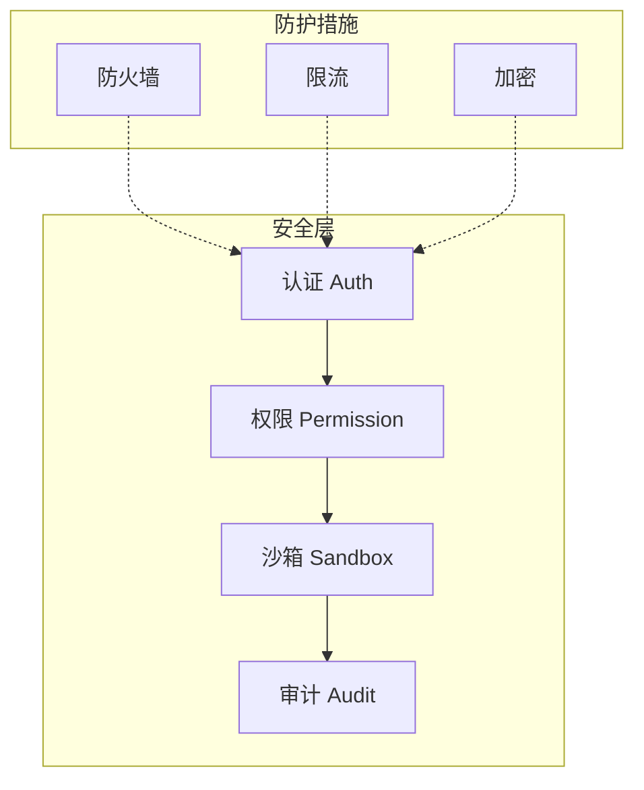
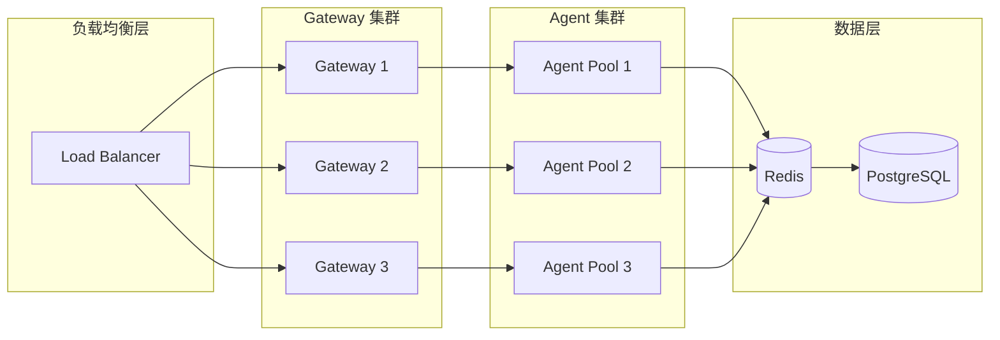

# OpenClaw Agent 治理框架

> 完整的 Agent 生命周期治理方案
> 包含：生命周期、安全合规、成本控制、监控审计

---

## 1. 治理框架概述

### 治理目标

```
┌─────────────────────────────────────────────────────────────────┐
│                        Agent 治理目标                              │
├─────────────────────────────────────────────────────────────────┤
│                                                                  │
│  ✅ 安全性    → 防止恶意操作，保护数据                          │
│  ✅ 合规性    → 满足监管要求，审计追踪                          │
│  ✅ 可控性    → 成本透明，性能可调                            │
│  ✅ 可观测性  → 全面监控，快速定位问题                          │
│  ✅ 可持续性  → 自动扩缩容，灾备恢复                          │
│                                                                  │
└─────────────────────────────────────────────────────────────────┘
```

### 治理维度

| 维度 | 目标 | 关键指标 |
|------|------|---------|
| 生命周期 | 自动化管理 | 创建时间、存活率 |
| 安全合规 | 零风险运行 | 攻击拦截率、合规率 |
| 成本控制 | 成本透明 | Token 消耗、API 费用 |
| 监控审计 | 全链路可观测 | 延迟、错误率 |
| 扩展可用 | 高可用保障 | SLA、故障恢复时间 |

---

## 2. 生命周期管理

### 2.1 Agent 生命周期状态机

```
                    ┌──────────┐
                    │  创建   │
                    └────┬────┘
                         │ 初始化
                         ▼
┌─────────────────────────────────────────────────────────┐
│                    状态机                                  │
├─────────────────────────────────────────────────────────┤
│                                                          │
│    ┌────────┐     ┌────────┐     ┌────────┐           │
│    │  idle  │────▶│ running │────▶│ waiting │           │
│    └────────┘     └────────┘     └────────┘           │
│         ▲              │              │                  │
│         │              │  完成        │                  │
│         │              ▼              ▼                  │
│    ┌────────┐     ┌────────┐     ┌────────┐           │
│    │ 终止   │◀────│  error │     │ paused │           │
│    └────────┘     └────────┘     └────────┘           │
│                                                          │
└─────────────────────────────────────────────────────────┘
```

### 2.2 生命周期配置

```yaml
lifecycle:
  # 创建策略
  create:
    # Agent 创建模板
    templates:
      - id: general
        name: 通用助手
        memory: 256MB
        timeout: 60000
      - id: heavy
        name: 重度任务
        memory: 1024MB
        timeout: 300000

  # 自动清理
  cleanup:
    enabled: true
    # 空闲超时（毫秒）
    idle_timeout: 3600000  # 1小时
    # 最大存活时间
    max_lifetime: 86400000  # 24小时
    # 异常后自动终止
    error_threshold: 3

  # 资源池
  pool:
    # 预创建数量
    prewarm: 2
    # 最大数量
    max_agents: 10
    # 回收策略
   回收: idle_first
```

---

## 3. 安全合规

### 3.1 安全架构



### 3.2 权限模型

```yaml
security:
  # 认证
  authentication:
    # 渠道认证
    channels:
      telegram:
        bot_token: true
        allowed_users:
          - 123456789
      feishu:
        app_id: xxx
        app_secret: xxx

  # 授权
  authorization:
    # RBAC 模型
    roles:
      admin:
        permissions:
          - "*"
      user:
        permissions:
          - "read"
          - "write:own"
          - "exec:approved"
      guest:
        permissions:
          - "read"

    # 工具权限
    tools:
      allow:
        - read
        - write
        - exec
      deny:
        - exec:rm -rf
        - exec:sudo

  # 沙箱
  sandbox:
    enabled: true
    type: isolated
    filesystem:
      allowedPaths:
        - "${workspace}/**"
      deniedPaths:
        - "~/.ssh/**"
        - "/etc/**"
    network:
      allowedDomains:
        - "api.openai.com"
        - "api.anthropic.com"
```

### 3.3 合规检查清单

```
┌─────────────────────────────────────────────────────────────────┐
│                       合规检查清单                                  │
├─────────────────────────────────────────────────────────────────┤
│                                                                  │
│  ✅ 身份认证                                                    │
│     [ ] 所有渠道已完成认证配置                                    │
│     [ ] 用户身份可追溯                                           │
│                                                                  │
│  ✅ 权限控制                                                    │
│     [ ] 工具权限已配置                                          │
│     [ ] 高危操作已禁止                                          │
│     [ ] 审批流程已设置                                          │
│                                                                  │
│  ✅ 数据保护                                                    │
│     [ ] 敏感数据已加密                                          │
│     [ ] 导出功能已审计                                          │
│     [ ] 数据保留策略已配置                                      │
│                                                                  │
│  ✅ 操作审计                                                    │
│     [ ] 所有操作已记录日志                                      │
│     [ ] 日志保留 90 天                                          │
│     [ ] 审计报告可生成                                          │
│                                                                  │
└─────────────────────────────────────────────────────────────────┘
```

---

## 4. 成本控制

### 4.1 成本追踪

```yaml
cost:
  # Token 追踪
  token_tracking:
    enabled: true
    # 按用户/Agent/功能追踪
    dimensions:
      - user
      - agent
      - function
      - channel

  # 预算控制
  budget:
    # 日预算
    daily:
      default: 100  # 美元
      # 按用户配置
      users:
        user_1: 50
        user_2: 200

    # 警告阈值
    alert_threshold: 0.8  # 80%

  # 成本归因
  attribution:
    # 按项目/部门归因
    enabled: true
    fields:
      - project
      - department
      - environment
```

### 4.2 成本仪表盘

```markdown
## 成本仪表盘

### 今日成本
| 指标 | 值 | 环比 |
|------|---|-----|
| Token 消耗 | 1.2M | +5% |
| API 费用 | $23.5 | -2% |
| 平均响应成本 | $0.002 | +1% |

### Top 5 消耗
| 用户 | Agent | 消耗 | 占比 |
|------|-------|------|-----|
| user_1 | mo-finance | $8.5 | 36% |
| user_2 | mo-law | $5.2 | 22% |
```

---

## 5. 监控可观测性

### 5.1 监控指标

```yaml
observability:
  # 指标收集
  metrics:
    enabled: true
    interval: 10s

    # Agent 指标
    agent:
      - active_agents
      - agent_uptime
      - agent_errors
      - tool_calls_total
      - tool_call_duration

    # 系统指标
    system:
      - cpu_usage
      - memory_usage
      - response_latency
      - request_queue_depth

  # 日志
  logging:
    level: info
    format: json
    outputs:
      - type: file
        path: /var/log/openclaw/app.log
        rotate: daily
      - type: stdout
      - type: remote
        endpoint: https://logs.example.com

  # 链路追踪
  tracing:
    enabled: true
    sampler: 0.1  # 采样率
    spans:
      - agent_loop
      - tool_execution
      - llm_call
```

### 5.2 健康检查

```yaml
health:
  # 健康检查端点
  endpoints:
    - /health
    - /health/ready
    - /health/live

  # 检查项
  checks:
    - name: gateway
      type: http
      url: http://localhost:18789/health
      interval: 30s

    - name: redis
      type: tcp
      host: localhost
      port: 6379
      interval: 30s

    - name: llm_provider
      type: http
      url: https://api.openai.com/v1/models
      interval: 60s
```

### 5.3 告警规则

```yaml
alerts:
  # 告警渠道
  channels:
    - type: telegram
      chat_id: -100123456
    - type: email
      to: admin@example.com

  # 告警规则
  rules:
    - name: high_error_rate
      condition: error_rate > 0.05
      severity: warning
      channels:
        - telegram

    - name: agent_oom
      condition: memory_usage > 0.9
      severity: critical
      channels:
        - telegram
        - email

    - name: budget_exceeded
      condition: daily_cost > budget * 0.9
      severity: warning
      channels:
        - telegram
```

---

## 6. 高可用与扩展

### 6.1 高可用架构



### 6.2 扩展配置

```yaml
scalability:
  # 自动扩缩容
  autoscaling:
    enabled: true

    # 基于 CPU
    cpu:
      target_utilization: 0.7
      min_replicas: 1
      max_replicas: 10

    # 基于请求队列
    queue:
      target_depth: 100
      min_replicas: 1
      max_replicas: 5

  # 限流
  rate_limiting:
    # 全局限流
    global:
      requests_per_second: 100
      burst: 200

    # 用户限流
    per_user:
      requests_per_minute: 60
      concurrent_requests: 5

  # 熔断
  circuit_breaker:
    enabled: true
    # 错误率阈值
    error_threshold: 0.5
    # 熔断时间
    reset_timeout: 30000
```

---

## 7. 审计报告

### 7.1 操作日志

```json
{
  "timestamp": "2026-04-21T10:30:00Z",
  "event": "tool_execution",
  "user_id": "user_123",
  "agent_id": "mo-finance",
  "tool": "exec",
  "params": {
    "command": "python3 analyze.py"
  },
  "result": {
    "status": "success",
    "duration_ms": 1500,
    "output_size": 1024
  },
  "security": {
    "approved": true,
    "approver": "system"
  },
  "cost": {
    "tokens": 150,
    "usd": 0.003
  }
}
```

### 7.2 合规报告模板

```markdown
# 合规报告 - 2026年4月

## 1. 安全指标

| 指标 | 值 | 目标 |
|------|---|-----|
| 攻击拦截率 | 100% | ≥99% |
| 未授权访问 | 0 | 0 |
| 高危操作审批率 | 100% | 100% |

## 2. 成本指标

| 指标 | 值 | 环比 |
|------|---|-----|
| 总成本 | $2,350 | +8% |
| Token 消耗 | 15M | +10% |
| 平均单次成本 | $0.15 | -2% |

## 3. 可用性

| 指标 | 值 | SLA |
|------|---|-----|
| uptime | 99.95% | 99.9% |
| 平均延迟 | 1.2s | <2s |
| 错误率 | 0.3% | <1% |

## 4. 审计发现

| 发现 | 严重性 | 状态 |
|------|--------|------|
| 无 | - | - |
```

---

## 8. 相关文档

| 文档 | 说明 |
|------|------|
| `13_安全配置/` | 安全配置详解 |
| `14_监控维护/` | 监控维护指南 |
| `21.x4_CLI未来赛道与治理框架.md` | CLI 治理思维 |

---

*文档版本: 2026-04-21*